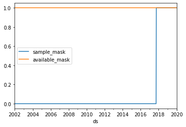

# <center>Nixtla &nbsp; [](https://twitter.com/intent/tweet?text=SOTA%20Neural%20Forecasting%20Algorithms%20by%20Nixtla%204&url=https://github.com/Nixtla/neuralforecast&via=Nixtla&hashtags=DeepLearning,TimeSeries,Forecasting) &nbsp;[](https://join.slack.com/t/nixtlaworkspace/shared_invite/zt-135dssye9-fWTzMpv2WBthq8NK0Yvu6A)</center>


<p align="center" width="100%">

<h1 align="center">Neural 🧠 Forecast</h1>
<h3 align="center">Deep Learninng for time series</h3>
</p>


[](https://github.com/Nixtla/nixtlats/actions/workflows/ci-linux.yml)
[](https://github.com/Nixtla/nixtlats/actions/workflows/ci-mac.yml)
[](https://codecov.io/gh/Nixtla/neuralforecast)
[](https://pypi.org/project/neuralforecast/)
[](https://pypi.org/project/neuralforecast/)
[](https://anaconda.org/nixtla/neuralforecast)
[](https://github.com/Nixtla/neuralforecast/blob/main/LICENSE)
[](https://nixtla.github.io/neuralforecast/)

State-of-the-art time series forecasting for PyTorch.

`NeuralForecast` is a python library for time series forecasting with deep learning. 
It provides dataset loading utilities, evaluation functions and pytorch implementations of state of the art deep learning forecasting models.

## 📖 Documentation
Here is a link to the [documentation](https://nixtla.github.io/neuralforecast/).

## 🧬 Getting Started (WIP)


## 💻  Installation

### Stable version

This code is a work in progress, any contributions or issues are welcome on
GitHub at: https://github.com/Nixtla/neuralforecast.

#### PyPI

You can install the *released version* of `NeuralForecast` from the [Python package index](https://pypi.org) with:

```python
pip install neuralforecast
```

(Installing inside a python virtualenvironment or a conda environment is recommended.)

#### Conda

Also you can install the *released version* of `NeuralForecast` from [conda](https://anaconda.org) with:

```python
conda install -c nixtla neuralforecast
```

(Installing inside a python virtualenvironment or a conda environment is recommended.)

### Development version in development mode

If you want to make some modifications to the code and see the effects in real time (without reinstalling), follow the steps below:

```bash
git clone https://github.com/Nixtla/neuralforecast.git
cd neuralforecast
pip install -e .
```


## Getting started

### Import libraries

```
import pandas as pd
import pytorch_lightning as pl
from neuralforecast.data.datasets.long_horizon import LongHorizon
from neuralforecast.data.tsdataset import WindowsDataset
from neuralforecast.data.tsloader import TimeSeriesLoader
from neuralforecast.experiments.utils import get_mask_dfs
from neuralforecast.models.nhits.nhits import NHITS
```

### Dataset

```
Y_df, _, _ = LongHorizon.load('data', 'ILI')
Y_df['ds'] = pd.to_datetime(Y_df['ds'])
Y_df.head()
```


<div>
<style scoped>
    .dataframe tbody tr th:only-of-type {
        vertical-align: middle;
    }

    .dataframe tbody tr th {
        vertical-align: top;
    }

    .dataframe thead th {
        text-align: right;
    }
</style>
<table border="1" class="dataframe">
  <thead>
    <tr style="text-align: right;">
      <th></th>
      <th>unique_id</th>
      <th>ds</th>
      <th>y</th>
    </tr>
  </thead>
  <tbody>
    <tr>
      <th>0</th>
      <td>% WEIGHTED ILI</td>
      <td>2002-01-01</td>
      <td>-0.421499</td>
    </tr>
    <tr>
      <th>1</th>
      <td>% WEIGHTED ILI</td>
      <td>2002-01-08</td>
      <td>-0.331239</td>
    </tr>
    <tr>
      <th>2</th>
      <td>% WEIGHTED ILI</td>
      <td>2002-01-15</td>
      <td>-0.342763</td>
    </tr>
    <tr>
      <th>3</th>
      <td>% WEIGHTED ILI</td>
      <td>2002-01-22</td>
      <td>-0.199782</td>
    </tr>
    <tr>
      <th>4</th>
      <td>% WEIGHTED ILI</td>
      <td>2002-01-29</td>
      <td>-0.218426</td>
    </tr>
  </tbody>
</table>
</div>


### Split train/test sets

```
output_size = 24
Y_df_test = Y_df.groupby('unique_id').tail(output_size)
Y_df_train = Y_df.drop(Y_df_test.index)
```

### Define TimeSeriesDataset and TimeSeriesLoader

```
input_size = 5 * output_size
```

```
train_mask_df, val_mask_df, _ = get_mask_dfs(Y_df=Y_df_train, 
                                             ds_in_val=5 * output_size,
                                             ds_in_test=0)
```

```
train_mask_df.query('unique_id == "OT"').set_index('ds').plot()
```


    <AxesSubplot:xlabel='ds'>


```
val_mask_df.query('unique_id == "OT"').set_index('ds').plot()
```


    <AxesSubplot:xlabel='ds'>





```
train_dataset = WindowsDataset(Y_df_train, 
                               input_size=input_size,
                               output_size=output_size,
                               mask_df=train_mask_df)
```

    /Users/fedex/projects/neuralforecast/neuralforecast/data/tsdataset.py:208: FutureWarning: In a future version of pandas all arguments of DataFrame.drop except for the argument 'labels' will be keyword-only
      X.drop(['unique_id', 'ds'], 1, inplace=True)


```
val_dataset = WindowsDataset(Y_df_train, 
                             input_size=input_size,
                             output_size=output_size,
                             mask_df=val_mask_df)
```

```
train_loader = TimeSeriesLoader(train_dataset, batch_size=1, 
                                n_windows=256,
                                shuffle=True)
```

```
val_loader = TimeSeriesLoader(val_dataset, batch_size=1)
```

### Define model

```
model = NHITS(n_time_in=input_size, n_time_out=output_size,
              n_x=0, n_s=0, n_s_hidden=[0], n_x_hidden=[0],
              shared_weights=False, initialization='lecun_normal',
              activation='ReLU', stack_types=3 * ['identity'],
              n_blocks= 3 * [1], n_layers= 9 * [2], n_theta_hidden=3 * [[512, 512]],
              n_pool_kernel_size=3 * [8], n_freq_downsample=[168, 24, 1],
              pooling_mode='max', interpolation_mode='linear',
              batch_normalization=False, dropout_prob_theta=0,
              learning_rate=1e-3, lr_decay=0.5, lr_decay_step_size=5, weight_decay=0,
              loss_train='MAE', loss_hypar=0, loss_valid='MAE',
              frequency='W-TUE', seasonality=52, random_seed=0)
```

### Train model with early stopping

```
early_stopping = pl.callbacks.EarlyStopping(monitor="val_loss", 
                                            min_delta=1e-4, 
                                            patience=3, verbose=False,mode="min")

trainer = pl.Trainer(max_epochs=10, 
                     max_steps=100,
                     check_val_every_n_epoch=1,
                     callbacks=[early_stopping])

trainer.fit(model, train_loader, val_loader)
```

    GPU available: False, used: False
    TPU available: False, using: 0 TPU cores
    IPU available: False, using: 0 IPUs
    
      | Name  | Type   | Params
    ---------------------------------
    0 | model | _NHITS | 1.0 M 
    ---------------------------------
    1.0 M     Trainable params
    0         Non-trainable params
    1.0 M     Total params
    4.042     Total estimated model params size (MB)
    /Users/fedex/opt/miniconda3/envs/nixtla/lib/python3.7/site-packages/pytorch_lightning/trainer/data_loading.py:117: UserWarning: The dataloader, val_dataloader 0, does not have many workers which may be a bottleneck. Consider increasing the value of the `num_workers` argument` (try 8 which is the number of cpus on this machine) in the `DataLoader` init to improve performance.
      f"The dataloader, {name}, does not have many workers which may be a bottleneck."
    /Users/fedex/opt/miniconda3/envs/nixtla/lib/python3.7/site-packages/torch/nn/functional.py:3635: UserWarning: Default upsampling behavior when mode=linear is changed to align_corners=False since 0.4.0. Please specify align_corners=True if the old behavior is desired. See the documentation of nn.Upsample for details.
      "See the documentation of nn.Upsample for details.".format(mode)
    /Users/fedex/opt/miniconda3/envs/nixtla/lib/python3.7/site-packages/pytorch_lightning/trainer/data_loading.py:117: UserWarning: The dataloader, train_dataloader, does not have many workers which may be a bottleneck. Consider increasing the value of the `num_workers` argument` (try 8 which is the number of cpus on this machine) in the `DataLoader` init to improve performance.
      f"The dataloader, {name}, does not have many workers which may be a bottleneck."
    /Users/fedex/opt/miniconda3/envs/nixtla/lib/python3.7/site-packages/pytorch_lightning/trainer/data_loading.py:413: UserWarning: The number of training samples (7) is smaller than the logging interval Trainer(log_every_n_steps=50). Set a lower value for log_every_n_steps if you want to see logs for the training epoch.
      f"The number of training samples ({self.num_training_batches}) is smaller than the logging interval"


```
Y_df_forecast = model.forecast(Y_df_train)
Y_df_forecast.rename(columns={'y': 'y_hat'}, inplace=True)
Y_df_forecast.head()
```

    INFO:root:Train Validation splits
    
    INFO:root:                                      ds           
                                         min        max
    unique_id         sample_mask                      
    % WEIGHTED ILI    0           2002-01-01 2020-01-14
                      1           2020-01-21 2020-06-30
    %UNWEIGHTED ILI   0           2002-01-01 2020-01-14
                      1           2020-01-21 2020-06-30
    AGE 0-4           0           2002-01-01 2020-01-14
                      1           2020-01-21 2020-06-30
    AGE 5-24          0           2002-01-01 2020-01-14
                      1           2020-01-21 2020-06-30
    ILITOTAL          0           2002-01-01 2020-01-14
                      1           2020-01-21 2020-06-30
    NUM. OF PROVIDERS 0           2002-01-01 2020-01-14
                      1           2020-01-21 2020-06-30
    OT                0           2002-01-01 2020-01-14
                      1           2020-01-21 2020-06-30
    INFO:root:
    Total data 			6762 time stamps 
    Available percentage=100.0, 	6762 time stamps 
    Insample  percentage=2.48, 	168 time stamps 
    Outsample percentage=97.52, 	6594 time stamps 
    
    /Users/fedex/projects/neuralforecast/neuralforecast/data/tsdataset.py:208: FutureWarning: In a future version of pandas all arguments of DataFrame.drop except for the argument 'labels' will be keyword-only
      X.drop(['unique_id', 'ds'], 1, inplace=True)
    GPU available: False, used: False
    TPU available: False, using: 0 TPU cores
    IPU available: False, using: 0 IPUs
    /Users/fedex/projects/neuralforecast/neuralforecast/data/tsloader.py:47: UserWarning: This class wraps the pytorch `DataLoader` with a special collate function. If you want to use yours simply use `DataLoader`. Removing collate_fn
      'This class wraps the pytorch `DataLoader` with a '
    /Users/fedex/opt/miniconda3/envs/nixtla/lib/python3.7/site-packages/pytorch_lightning/trainer/data_loading.py:117: UserWarning: The dataloader, predict_dataloader 0, does not have many workers which may be a bottleneck. Consider increasing the value of the `num_workers` argument` (try 8 which is the number of cpus on this machine) in the `DataLoader` init to improve performance.
      f"The dataloader, {name}, does not have many workers which may be a bottleneck."
    /Users/fedex/opt/miniconda3/envs/nixtla/lib/python3.7/site-packages/torch/nn/functional.py:3635: UserWarning: Default upsampling behavior when mode=linear is changed to align_corners=False since 0.4.0. Please specify align_corners=True if the old behavior is desired. See the documentation of nn.Upsample for details.
      "See the documentation of nn.Upsample for details.".format(mode)


<div>
<style scoped>
    .dataframe tbody tr th:only-of-type {
        vertical-align: middle;
    }

    .dataframe tbody tr th {
        vertical-align: top;
    }

    .dataframe thead th {
        text-align: right;
    }
</style>
<table border="1" class="dataframe">
  <thead>
    <tr style="text-align: right;">
      <th></th>
      <th>unique_id</th>
      <th>ds</th>
      <th>y_hat</th>
    </tr>
  </thead>
  <tbody>
    <tr>
      <th>0</th>
      <td>% WEIGHTED ILI</td>
      <td>2020-01-21</td>
      <td>-0.456533</td>
    </tr>
    <tr>
      <th>1</th>
      <td>% WEIGHTED ILI</td>
      <td>2020-01-28</td>
      <td>-0.310985</td>
    </tr>
    <tr>
      <th>2</th>
      <td>% WEIGHTED ILI</td>
      <td>2020-02-04</td>
      <td>-0.114892</td>
    </tr>
    <tr>
      <th>3</th>
      <td>% WEIGHTED ILI</td>
      <td>2020-02-11</td>
      <td>-0.071604</td>
    </tr>
    <tr>
      <th>4</th>
      <td>% WEIGHTED ILI</td>
      <td>2020-02-18</td>
      <td>0.285519</td>
    </tr>
  </tbody>
</table>
</div>


```
Y_df_plot = Y_df_test.merge(Y_df_forecast, how='left', on=['unique_id', 'ds'])
Y_df_plot.query('unique_id == "OT"').set_index('ds').plot()
```


    <AxesSubplot:xlabel='ds'>


##  Available forecasting models

* [Neural Hierarchical Interpolation for Time Series Forecasting (N-HiTS](https://arxiv.org/abs/2201.12886): A new model for long-horizon forecasting which incorporates novel hierarchical interpolation and multi-rate data sampling techniques to specialize blocks of its architecture to different frequency band of the time-series signal. It achieves SoTA performance on several benchmark datasets, outperforming current Transformer-based models by more than 25%. 


* [Exponential Smoothing Recurrent Neural Network (ES-RNN)](https://www.sciencedirect.com/science/article/pii/S0169207019301153): A hybrid model that combines the expressivity of non linear models to capture the trends while it normalizes using a Holt-Winters inspired model for the levels and seasonals.  This model is the winner of the M4 forecasting competition.


* [Neural Basis Expansion Analysis (N-BEATS)](https://arxiv.org/abs/1905.10437): A model from Element-AI (Yoshua Bengio’s lab) that has proven to achieve state of the art performance on benchmark large scale forecasting datasets like Tourism, M3, and M4. The model is fast to train an has an interpretable configuration.


* [Neural Basis Expansion Analysis with Exogenous Variables (N-BEATSx)](https://arxiv.org/abs/2104.05522): The neural basis expansion with exogenous variables is an extension to the original N-BEATS that allows it to include time dependent covariates.


## 📃 License
This project is licensed under the GPLv3 License - see the [LICENSE](https://github.com/Nixtla/neuralforecast/blob/main/LICENSE) file for details.

## 🔨 How to contribute

See [CONTRIBUTING.md](https://github.com/Nixtla/neuralforecast/blob/main/CONTRIBUTING.md).

## How to cite

If you use `NeuralForecast` in a scientific publication, we encourage you to add
the following references to the related papers:


```bibtex
@article{neuralforecast_arxiv,
  author  = {XXXX},
  title   = {{NeuralForecast: Deep Learning for Time Series Forecasting}},
  journal = {arXiv preprint arXiv:XXX.XXX},
  year    = {2022}
}
```
## Contributors ✨

Thanks goes to these wonderful people ([emoji key](https://allcontributors.org/docs/en/emoji-key)):

<!-- ALL-CONTRIBUTORS-LIST:START - Do not remove or modify this section -->
<!-- prettier-ignore-start -->
<!-- markdownlint-disable -->
<table>
  <tr>
    <td align="center"><a href="https://github.com/FedericoGarza"><br /><sub><b>fede</b></sub></a><br /><a href="https://github.com/Nixtla/neuralforecast/commits?author=FedericoGarza" title="Code">💻</a> <a href="https://github.com/Nixtla/neuralforecast/issues?q=author%3AFedericoGarza" title="Bug reports">🐛</a> <a href="https://github.com/Nixtla/neuralforecast/commits?author=FedericoGarza" title="Documentation">📖</a></td>
    <td align="center"><a href="https://github.com/gdevos010"><br /><sub><b>Greg DeVos</b></sub></a><br /><a href="#ideas-gdevos010" title="Ideas, Planning, & Feedback">🤔</a></td>
    <td align="center"><a href="https://github.com/cchallu"><br /><sub><b>Cristian Challu</b></sub></a><br /><a href="https://github.com/Nixtla/neuralforecast/commits?author=cchallu" title="Code">💻</a> <a href="#data-cchallu" title="Data">🔣</a></td>
    <td align="center"><a href="https://github.com/mergenthaler"><br /><sub><b>mergenthaler</b></sub></a><br /><a href="https://github.com/Nixtla/neuralforecast/commits?author=mergenthaler" title="Documentation">📖</a></td>
    <td align="center"><a href="https://github.com/kdgutier"><br /><sub><b>Kin</b></sub></a><br /><a href="https://github.com/Nixtla/neuralforecast/commits?author=kdgutier" title="Code">💻</a> <a href="https://github.com/Nixtla/neuralforecast/issues?q=author%3Akdgutier" title="Bug reports">🐛</a> <a href="#data-kdgutier" title="Data">🔣</a></td>
    <td align="center"><a href="https://github.com/jmoralez"><br /><sub><b>José Morales</b></sub></a><br /><a href="https://github.com/Nixtla/neuralforecast/commits?author=jmoralez" title="Code">💻</a></td>
    <td align="center"><a href="https://github.com/alejandroxag"><br /><sub><b>Alejandro</b></sub></a><br /><a href="https://github.com/Nixtla/neuralforecast/commits?author=alejandroxag" title="Code">💻</a></td>  
    <td align="center"><a href="http://lavattiata.com"><br /><sub><b>stefanialvs</b></sub></a><br /><a href="#design-stefanialvs" title="Design">🎨</a></td>
  </tr>
</table>

<!-- markdownlint-restore -->
<!-- prettier-ignore-end -->

<!-- ALL-CONTRIBUTORS-LIST:END -->

This project follows the [all-contributors](https://github.com/all-contributors/all-contributors) specification. Contributions of any kind welcome!
