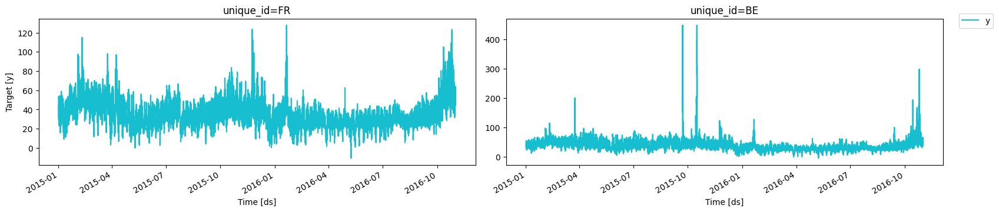
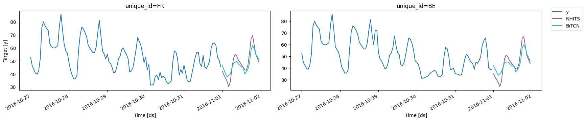

Exogenous variables can provide additional information to greatly
improve forecasting accuracy. Some examples include price or future
promotions variables for demand forecasting, and weather data for
electricity load forecast. In this notebook we show an example on how to
add different types of exogenous variables to NeuralForecast models for
making day-ahead hourly electricity price forecasts (EPF) for France and
Belgium markets.

All NeuralForecast models are capable of incorporating exogenous
variables to model the following conditional predictive distribution:
$$\mathbb{P}(\mathbf{y}_{t+1:t+H} \;|\; \mathbf{y}_{[:t]},\; \mathbf{x}^{(h)}_{[:t]},\; \mathbf{x}^{(f)}_{[:t+H]},\; \mathbf{x}^{(s)} )$$

where the regressors are static exogenous $\mathbf{x}^{(s)}$, historic
exogenous $\mathbf{x}^{(h)}_{[:t]}$, exogenous available at the time of
the prediction $\mathbf{x}^{(f)}_{[:t+H]}$ and autorregresive features
$\mathbf{y}_{[:t]}$. Depending on the [train
loss](../../losses.pytorch), the model outputs can be point forecasts
(location estimators) or uncertainty intervals (quantiles).

We will show you how to include exogenous variables in the data, specify
variables to a model, and produce forecasts using future exogenous
variables.

> **Important**
>
> This Guide assumes basic knowledge on the NeuralForecast library. For
> a minimal example visit the [Getting
> Started](../getting-started/02_quickstart.ipynb) guide.

You can run these experiments using GPU with Google Colab.

<a href="https://colab.research.google.com/github/Nixtla/neuralforecast/blob/main/nbs/examples/Exogenous_Variables.ipynb" target="_parent"></a>

## 1. Libraries

```python
%%capture
!pip install neuralforecast
```

## 2. Load data

The `df` dataframe contains the target and exogenous variables past
information to train the model. The `unique_id` column identifies the
markets, `ds` contains the datestamps, and `y` the electricity price.

Include both historic and future temporal variables as columns. In this
example, we are adding the system load (`system_load`) as historic data.
For future variables, we include a forecast of how much electricity will
be produced (`gen_forecast`) and day of week (`week_day`). Both the
electricity system demand and offer impact the price significantly,
including these variables to the model greatly improve performance, as
we demonstrate in Olivares et al. (2022).

The distinction between historic and future variables will be made later
as parameters of the model.

```python
import pandas as pd
from utilsforecast.plotting import plot_series
```


```python
df = pd.read_csv(
    'https://datasets-nixtla.s3.amazonaws.com/EPF_FR_BE.csv',
    parse_dates=['ds'],
)
df.head()
```

|     | unique_id | ds                  | y     | gen_forecast | system_load | week_day |
|-----|-----------|---------------------|-------|--------------|-------------|----------|
| 0   | FR        | 2015-01-01 00:00:00 | 53.48 | 76905.0      | 74812.0     | 3        |
| 1   | FR        | 2015-01-01 01:00:00 | 51.93 | 75492.0      | 71469.0     | 3        |
| 2   | FR        | 2015-01-01 02:00:00 | 48.76 | 74394.0      | 69642.0     | 3        |
| 3   | FR        | 2015-01-01 03:00:00 | 42.27 | 72639.0      | 66704.0     | 3        |
| 4   | FR        | 2015-01-01 04:00:00 | 38.41 | 69347.0      | 65051.0     | 3        |

> **Tip**
>
> Calendar variables such as day of week, month, and year are very
> useful to capture long seasonalities.

```python
plot_series(df)
```



Add the static variables in a separate `static_df` dataframe. In this
example, we are using one-hot encoding of the electricity market. The
`static_df` must include one observation (row) for each `unique_id` of
the `df` dataframe, with the different statics variables as columns.

```python
static_df = pd.read_csv('https://datasets-nixtla.s3.amazonaws.com/EPF_FR_BE_static.csv')
static_df.head()
```

|     | unique_id | market_0 | market_1 |
|-----|-----------|----------|----------|
| 0   | FR        | 1        | 0        |
| 1   | BR        | 0        | 1        |

## 3. Training with exogenous variables

We distinguish the exogenous variables by whether they reflect static or
time-dependent aspects of the modeled data.

-   **Static exogenous variables**: The static exogenous variables carry
    time-invariant information for each time series. When the model is
    built with global parameters to forecast multiple time series, these
    variables allow sharing information within groups of time series
    with similar static variable levels. Examples of static variables
    include designators such as identifiers of regions, groups of
    products, etc.

-   **Historic exogenous variables**: This time-dependent exogenous
    variable is restricted to past observed values. Its predictive power
    depends on Granger-causality, as its past values can provide
    significant information about future values of the target variable
    $\mathbf{y}$.

-   **Future exogenous variables**: In contrast with historic exogenous
    variables, future values are available at the time of the
    prediction. Examples include calendar variables, weather forecasts,
    and known events that can cause large spikes and dips such as
    scheduled promotions.

To add exogenous variables to the model, first specify the name of each
variable from the previous dataframes to the corresponding model
hyperparameter during initialization: `futr_exog_list`,
`hist_exog_list`, and `stat_exog_list`. We also set `horizon` as 24 to
produce the next day hourly forecasts, and set `input_size` to use the
last 5 days of data as input.

```python
import logging

from neuralforecast.auto import NHITS, BiTCN
from neuralforecast.core import NeuralForecast
```


```python
logging.getLogger("pytorch_lightning").setLevel(logging.WARNING)
```


```python
horizon = 24 # day-ahead daily forecast
models = [NHITS(h = horizon,
                max_steps=100,
                input_size = 5*horizon,
                futr_exog_list = ['gen_forecast', 'week_day'], # <- Future exogenous variables
                hist_exog_list = ['system_load'], # <- Historical exogenous variables
                stat_exog_list = ['market_0', 'market_1'], # <- Static exogenous variables
                scaler_type = 'robust'),
          BiTCN(h = horizon,
                input_size = 5*horizon,
                max_steps=100,
                futr_exog_list = ['gen_forecast', 'week_day'], # <- Future exogenous variables
                hist_exog_list = ['system_load'], # <- Historical exogenous variables
                stat_exog_list = ['market_0', 'market_1'], # <- Static exogenous variables
                scaler_type = 'robust',
                ),                
                ]
```

``` text
Seed set to 1
Seed set to 1
```

> **Tip**
>
> When including exogenous variables always use a scaler by setting the
> `scaler_type` hyperparameter. The scaler will scale all the temporal
> features: the target variable `y`, historic and future variables.

> **Important**
>
> Make sure future and historic variables are correctly placed. Defining
> historic variables as future variables will lead to data leakage.

Next, pass the datasets to the `df` and `static_df` inputs of the `fit`
method.

```python
nf = NeuralForecast(models=models, freq='h')
nf.fit(df=df, static_df=static_df)
```

## 4. Forecasting with exogenous variables

Before predicting the prices, we need to gather the future exogenous
variables for the day we want to forecast. Define a new dataframe
(`futr_df`) with the `unique_id`, `ds`, and future exogenous variables.
There is no need to add the target variable `y` and historic variables
as they won’t be used by the model.

```python
futr_df = pd.read_csv(
    'https://datasets-nixtla.s3.amazonaws.com/EPF_FR_BE_futr.csv',
    parse_dates=['ds'],
)
futr_df.head()
```

|     | unique_id | ds                  | gen_forecast | week_day |
|-----|-----------|---------------------|--------------|----------|
| 0   | FR        | 2016-11-01 00:00:00 | 49118.0      | 1        |
| 1   | FR        | 2016-11-01 01:00:00 | 47890.0      | 1        |
| 2   | FR        | 2016-11-01 02:00:00 | 47158.0      | 1        |
| 3   | FR        | 2016-11-01 03:00:00 | 45991.0      | 1        |
| 4   | FR        | 2016-11-01 04:00:00 | 45378.0      | 1        |

> **Important**
>
> Make sure `futr_df` has informations for the entire forecast horizon.
> In this example, we are forecasting 24 hours ahead, so `futr_df` must
> have 24 rows for each time series.

Finally, use the `predict` method to forecast the day-ahead prices.

```python
Y_hat_df = nf.predict(futr_df=futr_df)
Y_hat_df.head()
```

``` text
Predicting: |          | 0/? [00:00<?, ?it/s]
```

``` text
Predicting: |          | 0/? [00:00<?, ?it/s]
```

|     | unique_id | ds                  | NHITS     | BiTCN     |
|-----|-----------|---------------------|-----------|-----------|
| 0   | BE        | 2016-11-01 00:00:00 | 35.297050 | 41.957176 |
| 1   | BE        | 2016-11-01 01:00:00 | 32.350044 | 39.419579 |
| 2   | BE        | 2016-11-01 02:00:00 | 30.091702 | 36.313972 |
| 3   | BE        | 2016-11-01 03:00:00 | 27.317764 | 34.002922 |
| 4   | BE        | 2016-11-01 04:00:00 | 24.316488 | 35.002541 |

```python
plot_series(df, Y_hat_df, max_insample_length=24*5)
```



In summary, to add exogenous variables to a model make sure to follow
the next steps:

1.  Add temporal exogenous variables as columns to the main dataframe
    (`df`).
2.  Add static exogenous variables with the `static_df` dataframe.
3.  Specify the name for each variable in the corresponding model
    hyperparameter.
4.  If the model uses future exogenous variables, pass the future
    dataframe (`futr_df`) to the `predict` method.

## References

-   [Kin G. Olivares, Cristian Challu, Grzegorz Marcjasz, Rafał Weron,
    Artur Dubrawski, Neural basis expansion analysis with exogenous
    variables: Forecasting electricity prices with NBEATSx,
    International Journal of
    Forecasting](https://www.sciencedirect.com/science/article/pii/S0169207022000413)

-   [Cristian Challu, Kin G. Olivares, Boris N. Oreshkin, Federico
    Garza, Max Mergenthaler-Canseco, Artur Dubrawski (2021). NHITS:
    Neural Hierarchical Interpolation for Time Series Forecasting.
    Accepted at AAAI 2023.](https://arxiv.org/abs/2201.12886)

