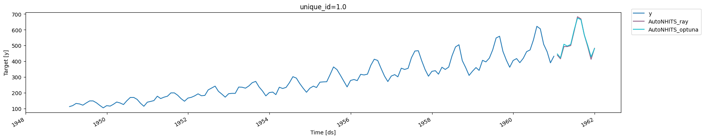

Deep-learning models are the state-of-the-art in time series
forecasting. They have outperformed statistical and tree-based
approaches in recent large-scale competitions, such as the M series, and
are being increasingly adopted in industry. However, their performance
is greatly affected by the choice of hyperparameters. Selecting the
optimal configuration, a process called hyperparameter tuning, is
essential to achieve the best performance.

The main steps of hyperparameter tuning are:

1.  Define training and validation sets.
2.  Define search space.
3.  Sample configurations with a search algorithm, train models, and
    evaluate them on the validation set.
4.  Select and store the best model.

With `Neuralforecast`, we automatize and simplify the hyperparameter
tuning process with the `Auto` models. Every model in the library has an
`Auto` version (for example, `AutoNHITS`, `AutoTFT`) which can perform
automatic hyperparameter selection on default or user-defined search
space.

The `Auto` models can be used with two backends: Ray’s `Tune` library
and `Optuna`, with a user-friendly and simplified API, with most of
their capabilities.

In this tutorial, we show in detail how to instantiate and train an
`AutoNHITS` model with a custom search space with both `Tune` and
`Optuna` backends, install and use `HYPEROPT` search algorithm, and use
the model with optimal hyperparameters to forecast.

You can run these experiments using GPU with Google Colab.

<a href="https://colab.research.google.com/github/Nixtla/neuralforecast/blob/main/nbs/examples/Automatic_Hyperparameter_Tuning.ipynb" target="_parent"></a>

## 1. Install `Neuralforecast`

```python
%%capture
!pip install neuralforecast hyperopt
```

## 2. Load Data

In this example we will use the `AirPasengers`, a popular dataset with
monthly airline passengers in the US from 1949 to 1960. Load the data,
available at our `utils` methods in the required format. See
https://nixtla.github.io/neuralforecast/examples/data_format.html for
more details on the data input format.

```python
import logging

from neuralforecast.utils import AirPassengersDF
```


```python
logging.getLogger('pytorch_lightning').setLevel(logging.ERROR)
```


```python
Y_df = AirPassengersDF
Y_df.head()
```

|     | unique_id | ds         | y     |
|-----|-----------|------------|-------|
| 0   | 1.0       | 1949-01-31 | 112.0 |
| 1   | 1.0       | 1949-02-28 | 118.0 |
| 2   | 1.0       | 1949-03-31 | 132.0 |
| 3   | 1.0       | 1949-04-30 | 129.0 |
| 4   | 1.0       | 1949-05-31 | 121.0 |

## 3. Ray’s `Tune` backend

First, we show how to use the `Tune` backend. This backend is based on
Ray’s `Tune` library, which is a scalable framework for hyperparameter
tuning. It is a popular library in the machine learning community, and
it is used by many companies and research labs. If you plan to use the
`Optuna` backend, you can skip this section.

### 3.a Define hyperparameter grid

Each `Auto` model contains a default search space that was extensively
tested on multiple large-scale datasets. Search spaces are specified
with dictionaries, where keys corresponds to the model’s hyperparameter
and the value is a `Tune` function to specify how the hyperparameter
will be sampled. For example, use `randint` to sample integers
uniformly, and `choice` to sample values of a list.

### 3.a.1 Default hyperparameter grid

The default search space dictionary can be accessed through the
`get_default_config` function of the `Auto` model. This is useful if you
wish to use the default parameter configuration but want to change one
or more hyperparameter spaces without changing the other default values.

To extract the default config, you need to define: \* `h`: forecasting
horizon. \* `backend`: backend to use. \* `n_series`: Optional, the
number of unique time series, required only for Multivariate models.

In this example, we will use `h=12` and we use `ray` as backend. We will
use the default hyperparameter space but only change `random_seed` range
and `n_pool_kernel_size`.

```python
from ray import tune
from neuralforecast.auto import AutoNHITS
```


```python
nhits_config = AutoNHITS.get_default_config(h = 12, backend="ray")                      # Extract the default hyperparameter settings
nhits_config["random_seed"] = tune.randint(1, 10)                                       # Random seed
nhits_config["n_pool_kernel_size"] = tune.choice([[2, 2, 2], [16, 8, 1]])               # MaxPool's Kernelsize
```

### 3.a.2 Custom hyperparameter grid

More generally, users can define fully customized search spaces tailored
for particular datasets and tasks, by fully specifying a hyperparameter
search space dictionary.

In the following example we are optimizing the `learning_rate` and two
`NHITS` specific hyperparameters: `n_pool_kernel_size` and
`n_freq_downsample`. Additionaly, we use the search space to modify
default hyperparameters, such as `max_steps` and `val_check_steps`.

```python
nhits_config = {
   "max_steps": 100,                                                         # Number of SGD steps
   "input_size": 24,                                                         # Size of input window
   "learning_rate": tune.loguniform(1e-5, 1e-1),                             # Initial Learning rate
   "n_pool_kernel_size": tune.choice([[2, 2, 2], [16, 8, 1]]),               # MaxPool's Kernelsize
   "n_freq_downsample": tune.choice([[168, 24, 1], [24, 12, 1], [1, 1, 1]]), # Interpolation expressivity ratios
   "val_check_steps": 50,                                                    # Compute validation every 50 steps
   "random_seed": tune.randint(1, 10),                                       # Random seed
}
```

> **Important**
>
> Configuration dictionaries are not interchangeable between models
> since they have different hyperparameters. Refer to
> https://nixtla.github.io/neuralforecast/models.html for a complete
> list of each model’s hyperparameters.

### 3.b Instantiate `Auto` model

To instantiate an `Auto` model you need to define:

-   `h`: forecasting horizon.
-   `loss`: training and validation loss from
    `neuralforecast.losses.pytorch`.
-   `config`: hyperparameter search space. If `None`, the `Auto` class
    will use a pre-defined suggested hyperparameter space.
-   `search_alg`: search algorithm (from `tune.search`), default is
    random search. Refer to
    https://docs.ray.io/en/latest/tune/api_docs/suggestion.html for more
    information on the different search algorithm options.
-   `backend`: backend to use, default is `ray`. If `optuna`, the `Auto`
    class will use the `Optuna` backend.
-   `num_samples`: number of configurations explored.

In this example we set horizon `h` as 12, use the `MAE` loss for
training and validation, and use the `HYPEROPT` search algorithm.

```python
from ray.tune.search.hyperopt import HyperOptSearch
from neuralforecast.losses.pytorch import MAE
from neuralforecast.auto import AutoNHITS
```


```python
model = AutoNHITS(
    h=12,
    loss=MAE(),
    config=nhits_config,
    search_alg=HyperOptSearch(),
    backend='ray',
    num_samples=10,
)
```

> **Tip**
>
> The number of samples, `num_samples`, is a crucial parameter! Larger
> values will usually produce better results as we explore more
> configurations in the search space, but it will increase training
> times. Larger search spaces will usually require more samples. As a
> general rule, we recommend setting `num_samples` higher than 20. We
> set 10 in this example for demonstration purposes.

### 3.c Train model and predict with `Core` class

Next, we use the `Neuralforecast` class to train the `Auto` model. In
this step, `Auto` models will automatically perform hyperparamter tuning
training multiple models with different hyperparameters, producing the
forecasts on the validation set, and evaluating them. The best
configuration is selected based on the error on a validation set. Only
the best model is stored and used during inference.

```python
from neuralforecast import NeuralForecast
```

Use the `val_size` parameter of the `fit` method to control the length
of the validation set. In this case we set the validation set as twice
the forecasting horizon.

```python
%%capture
nf = NeuralForecast(models=[model], freq='ME')
nf.fit(df=Y_df, val_size=24)
```

The results of the hyperparameter tuning are available in the `results`
attribute of the `Auto` model. Use the `get_dataframe` method to get the
results in a pandas dataframe.

```python
results = nf.models[0].results.get_dataframe()
results.head()
```

|     | loss      | train_loss | timestamp  | checkpoint_dir_name | done  | training_iteration | trial_id | date                | time_this_iter_s | time_total_s | ... | config/input_size | config/learning_rate | config/n_pool_kernel_size | config/n_freq_downsample | config/val_check_steps | config/random_seed | config/h | config/loss | config/valid_loss | logdir   |
|-----|-----------|------------|------------|---------------------|-------|--------------------|----------|---------------------|------------------|--------------|-----|-------------------|----------------------|---------------------------|--------------------------|------------------------|--------------------|----------|-------------|-------------------|----------|
| 0   | 21.948565 | 11.748630  | 1732660404 | None                | False | 2                  | e684ab59 | 2024-11-26_22-33-24 | 0.473169         | 1.742914     | ... | 24                | 0.000583             | (16, 8, 1)                | (1, 1, 1)                | 50                     | 9                  | 12       | MAE()       | MAE()             | e684ab59 |
| 1   | 23.497557 | 13.491600  | 1732660411 | None                | False | 2                  | 28016d96 | 2024-11-26_22-33-31 | 0.467711         | 1.767644     | ... | 24                | 0.000222             | (16, 8, 1)                | (168, 24, 1)             | 50                     | 5                  | 12       | MAE()       | MAE()             | 28016d96 |
| 2   | 29.214516 | 16.968582  | 1732660419 | None                | False | 2                  | ded66a42 | 2024-11-26_22-33-39 | 0.969751         | 2.623766     | ... | 24                | 0.009816             | (16, 8, 1)                | (24, 12, 1)              | 50                     | 5                  | 12       | MAE()       | MAE()             | ded66a42 |
| 3   | 45.178616 | 28.338690  | 1732660427 | None                | False | 2                  | 2964d41f | 2024-11-26_22-33-47 | 0.985556         | 2.656381     | ... | 24                | 0.012083             | (16, 8, 1)                | (24, 12, 1)              | 50                     | 7                  | 12       | MAE()       | MAE()             | 2964d41f |
| 4   | 32.580570 | 21.667740  | 1732660434 | None                | False | 2                  | 766cc549 | 2024-11-26_22-33-54 | 0.418154         | 1.465539     | ... | 24                | 0.000040             | (2, 2, 2)                 | (1, 1, 1)                | 50                     | 4                  | 12       | MAE()       | MAE()             | 766cc549 |

Next, we use the `predict` method to forecast the next 12 months using
the optimal hyperparameters.

```python
Y_hat_df = nf.predict()
Y_hat_df.head()
```

``` text
Predicting: |                                                                                                 …
```

|     | unique_id | ds         | AutoNHITS  |
|-----|-----------|------------|------------|
| 0   | 1.0       | 1961-01-31 | 438.724091 |
| 1   | 1.0       | 1961-02-28 | 415.593628 |
| 2   | 1.0       | 1961-03-31 | 493.484894 |
| 3   | 1.0       | 1961-04-30 | 493.120728 |
| 4   | 1.0       | 1961-05-31 | 499.806702 |

## 4. `Optuna` backend

In this section we show how to use the `Optuna` backend. `Optuna` is a
lightweight and versatile platform for hyperparameter optimization. If
you plan to use the `Tune` backend, you can skip this section.

### 4.a Define hyperparameter grid

Each `Auto` model contains a default search space that was extensively
tested on multiple large-scale datasets. Search spaces are specified
with a function that returns a dictionary, where keys corresponds to the
model’s hyperparameter and the value is a `suggest` function to specify
how the hyperparameter will be sampled. For example, use `suggest_int`
to sample integers uniformly, and `suggest_categorical` to sample values
of a list. See
https://optuna.readthedocs.io/en/stable/reference/generated/optuna.trial.Trial.html
for more details.

### 4.a.1 Default hyperparameter grid

The default search space dictionary can be accessed through the
`get_default_config` function of the `Auto` model. This is useful if you
wish to use the default parameter configuration but want to change one
or more hyperparameter spaces without changing the other default values.

To extract the default config, you need to define: \* `h`: forecasting
horizon. \* `backend`: backend to use. \* `n_series`: Optional, the
number of unique time series, required only for Multivariate models.

In this example, we will use `h=12` and we use `optuna` as backend. We
will use the default hyperparameter space but only change `random_seed`
range and `n_pool_kernel_size`.

```python
import optuna
```


```python
optuna.logging.set_verbosity(optuna.logging.WARNING) # Use this to disable training prints from optuna
nhits_default_config = AutoNHITS.get_default_config(h = 12, backend="optuna")                   # Extract the default hyperparameter settings

def config_nhits(trial):
    config = {**nhits_default_config(trial)}
    config.update({
        "random_seed": trial.suggest_int("random_seed", 1, 10), 
        "n_pool_kernel_size": trial.suggest_categorical("n_pool_kernel_size", [[2, 2, 2], [16, 8, 1]])
    })
    return config    
```

### 3.a.2 Custom hyperparameter grid

More generally, users can define fully customized search spaces tailored
for particular datasets and tasks, by fully specifying a hyperparameter
search space function.

In the following example we are optimizing the `learning_rate` and two
`NHITS` specific hyperparameters: `n_pool_kernel_size` and
`n_freq_downsample`. Additionaly, we use the search space to modify
default hyperparameters, such as `max_steps` and `val_check_steps`.

```python
def config_nhits(trial):
    return {
        "max_steps": 100,                                                                                               # Number of SGD steps
        "input_size": 24,                                                                                               # Size of input window
        "learning_rate": trial.suggest_loguniform("learning_rate", 1e-5, 1e-1),                                         # Initial Learning rate
        "n_pool_kernel_size": trial.suggest_categorical("n_pool_kernel_size", [[2, 2, 2], [16, 8, 1]]),                 # MaxPool's Kernelsize
        "n_freq_downsample": trial.suggest_categorical("n_freq_downsample", [[168, 24, 1], [24, 12, 1], [1, 1, 1]]),    # Interpolation expressivity ratios
        "val_check_steps": 50,                                                                                          # Compute validation every 50 steps
        "random_seed": trial.suggest_int("random_seed", 1, 10),                                                         # Random seed
    }
```

### 4.b Instantiate `Auto` model

To instantiate an `Auto` model you need to define:

-   `h`: forecasting horizon.
-   `loss`: training and validation loss from
    `neuralforecast.losses.pytorch`.
-   `config`: hyperparameter search space. If `None`, the `Auto` class
    will use a pre-defined suggested hyperparameter space.
-   `search_alg`: search algorithm (from `optuna.samplers`), default is
    TPESampler (Tree-structured Parzen Estimator). Refer to
    https://optuna.readthedocs.io/en/stable/reference/samplers/index.html
    for more information on the different search algorithm options.
-   `backend`: backend to use, default is `ray`. If `optuna`, the `Auto`
    class will use the `Optuna` backend.
-   `num_samples`: number of configurations explored.

```python
model = AutoNHITS(
    h=12,
    loss=MAE(),
    config=config_nhits,
    search_alg=optuna.samplers.TPESampler(seed=0),
    backend='optuna',
    num_samples=10,
)
```

> **Important**
>
> Configuration dictionaries and search algorithms for `Tune` and
> `Optuna` are not interchangeable! Use the appropriate type of search
> algorithm and custom configuration dictionary for each backend.

### 4.c Train model and predict with `Core` class

Use the `val_size` parameter of the `fit` method to control the length
of the validation set. In this case we set the validation set as twice
the forecasting horizon.

```python
%%capture
nf = NeuralForecast(models=[model], freq='ME')
nf.fit(df=Y_df, val_size=24)
```

The results of the hyperparameter tuning are available in the `results`
attribute of the `Auto` model. Use the `trials_dataframe` method to get
the results in a pandas dataframe.

```python
results = nf.models[0].results.trials_dataframe()
results.drop(columns='user_attrs_ALL_PARAMS')
```

|     | number | value        | datetime_start             | datetime_complete          | duration               | params_learning_rate | params_n_freq_downsample | params_n_pool_kernel_size | params_random_seed | user_attrs_METRICS                                | state    |
|-----|--------|--------------|----------------------------|----------------------------|------------------------|----------------------|--------------------------|---------------------------|--------------------|---------------------------------------------------|----------|
| 0   | 0      | 1.827570e+01 | 2024-11-26 22:34:29.382448 | 2024-11-26 22:34:30.773811 | 0 days 00:00:01.391363 | 0.001568             | \[1, 1, 1\]              | \[2, 2, 2\]               | 5                  | \{'loss': tensor(18.2757), 'train_loss': tensor... | COMPLETE |
| 1   | 1      | 9.055198e+06 | 2024-11-26 22:34:30.774153 | 2024-11-26 22:34:32.090132 | 0 days 00:00:01.315979 | 0.036906             | \[168, 24, 1\]           | \[2, 2, 2\]               | 10                 | \{'loss': tensor(9055198.), 'train_loss': tenso... | COMPLETE |
| 2   | 2      | 5.554298e+01 | 2024-11-26 22:34:32.090466 | 2024-11-26 22:34:33.425103 | 0 days 00:00:01.334637 | 0.000019             | \[1, 1, 1\]              | \[2, 2, 2\]               | 10                 | \{'loss': tensor(55.5430), 'train_loss': tensor... | COMPLETE |
| 3   | 3      | 9.857751e+01 | 2024-11-26 22:34:33.425460 | 2024-11-26 22:34:34.962057 | 0 days 00:00:01.536597 | 0.015727             | \[24, 12, 1\]            | \[16, 8, 1\]              | 10                 | \{'loss': tensor(98.5775), 'train_loss': tensor... | COMPLETE |
| 4   | 4      | 1.966841e+01 | 2024-11-26 22:34:34.962357 | 2024-11-26 22:34:36.951450 | 0 days 00:00:01.989093 | 0.001223             | \[168, 24, 1\]           | \[2, 2, 2\]               | 1                  | \{'loss': tensor(19.6684), 'train_loss': tensor... | COMPLETE |
| 5   | 5      | 1.524971e+01 | 2024-11-26 22:34:36.951775 | 2024-11-26 22:34:38.280982 | 0 days 00:00:01.329207 | 0.002955             | \[168, 24, 1\]           | \[16, 8, 1\]              | 5                  | \{'loss': tensor(15.2497), 'train_loss': tensor... | COMPLETE |
| 6   | 6      | 1.678810e+01 | 2024-11-26 22:34:38.281381 | 2024-11-26 22:34:39.648595 | 0 days 00:00:01.367214 | 0.006173             | \[168, 24, 1\]           | \[16, 8, 1\]              | 4                  | \{'loss': tensor(16.7881), 'train_loss': tensor... | COMPLETE |
| 7   | 7      | 2.014485e+01 | 2024-11-26 22:34:39.649025 | 2024-11-26 22:34:41.075568 | 0 days 00:00:01.426543 | 0.000285             | \[168, 24, 1\]           | \[2, 2, 2\]               | 2                  | \{'loss': tensor(20.1448), 'train_loss': tensor... | COMPLETE |
| 8   | 8      | 2.109382e+01 | 2024-11-26 22:34:41.075891 | 2024-11-26 22:34:42.449451 | 0 days 00:00:01.373560 | 0.004097             | \[168, 24, 1\]           | \[16, 8, 1\]              | 7                  | \{'loss': tensor(21.0938), 'train_loss': tensor... | COMPLETE |
| 9   | 9      | 5.091650e+01 | 2024-11-26 22:34:42.449762 | 2024-11-26 22:34:43.804981 | 0 days 00:00:01.355219 | 0.000036             | \[1, 1, 1\]              | \[16, 8, 1\]              | 1                  | \{'loss': tensor(50.9165), 'train_loss': tensor... | COMPLETE |

Next, we use the `predict` method to forecast the next 12 months using
the optimal hyperparameters.

```python
Y_hat_df_optuna = nf.predict()
Y_hat_df_optuna.head()
```

``` text
Predicting: |                                                                                                 …
```

|     | unique_id | ds         | AutoNHITS  |
|-----|-----------|------------|------------|
| 0   | 1.0       | 1961-01-31 | 446.410736 |
| 1   | 1.0       | 1961-02-28 | 422.048523 |
| 2   | 1.0       | 1961-03-31 | 508.271515 |
| 3   | 1.0       | 1961-04-30 | 496.549133 |
| 4   | 1.0       | 1961-05-31 | 506.865723 |

## 5. Plots

Finally, we compare the forecasts produced by the `AutoNHITS` model with
both backends.

```python
from utilsforecast.plotting import plot_series
```


```python
plot_series(
    Y_df,
    Y_hat_df.merge(
        Y_hat_df_optuna,
        on=['unique_id', 'ds'],
        suffixes=['_ray', '_optuna'],
    ),
)
```



### References

-   [Cristian Challu, Kin G. Olivares, Boris N. Oreshkin, Federico
    Garza, Max Mergenthaler-Canseco, Artur Dubrawski (2021). NHITS:
    Neural Hierarchical Interpolation for Time Series Forecasting.
    Accepted at AAAI 2023.](https://arxiv.org/abs/2201.12886)
-   [James Bergstra, Remi Bardenet, Yoshua Bengio, and Balazs Kegl
    (2011). “Algorithms for Hyper-Parameter Optimization”. In: Advances
    in Neural Information Processing Systems. url:
    https://proceedings.neurips.cc/paper/2011/file/86e8f7ab32cfd12577bc2619bc635690-Paper.pdf](https://proceedings.neurips.cc/paper/2011/file/86e8f7ab32cfd12577bc2619bc635690-Paper.pdf)
-   [Kirthevasan Kandasamy, Karun Raju Vysyaraju, Willie Neiswanger,
    Biswajit Paria, Christopher R. Collins, Jeff Schneider, Barnabas
    Poczos, Eric P. Xing (2019). “Tuning Hyperparameters without Grad
    Students: Scalable and Robust Bayesian Optimisation with Dragonfly”.
    Journal of Machine Learning Research. url:
    https://arxiv.org/abs/1903.06694](https://arxiv.org/abs/1903.06694)
-   [Lisha Li, Kevin Jamieson, Giulia DeSalvo, Afshin Rostamizadeh,
    Ameet Talwalkar (2016). “Hyperband: A Novel Bandit-Based Approach to
    Hyperparameter Optimization”. Journal of Machine Learning Research.
    url:
    https://arxiv.org/abs/1603.06560](https://arxiv.org/abs/1603.06560)

