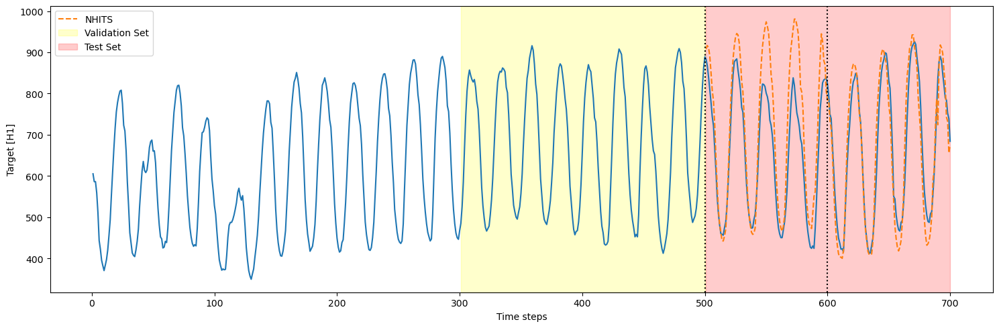
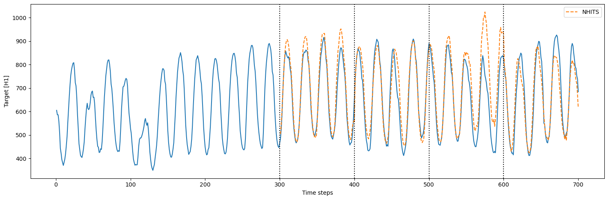

> **Prerequesites**
>
> This Guide assumes basic familiarity with NeuralForecast. For a
> minimal example visit the [Quick
> Start](../getting-started/02_quickstart.ipynb)

To measure the performance of a forecasting model, we can assess its
performance on historical data using *cross-validation*.

Cross-validation is done by defining a sliding window of input data to
predict the following period. We do this operation many times such that
the model predicts new periods, resulting in a more robust assessment of
its performance.

Below, you can see an illustration of cross-validation. In this
illustration, the cross-validation process generates six different
forecasting periods where we can compare the model’s predictions against
the actual values of the past.


This mimicks the process of making predictions in the future and
collecting actual data to then evaluate the prediction’s accuracy.

In this tutorial, we explore in detail the cross-validation function in
`neuralforecast`.

## 1. Libraries

Make sure to install `neuralforecast` to follow along.

```python
%%capture
!pip install neuralforecast
```


```python
import logging
import matplotlib.pyplot as plt
import pandas as pd
from utilsforecast.plotting import plot_series

from neuralforecast import NeuralForecast
from neuralforecast.models import NHITS
```


```python
logging.getLogger("pytorch_lightning").setLevel(logging.ERROR)
```

## 2. Read the data

For this tutorial, we use part of the hourly M4 dataset. It is stored in
a parquet file for efficiency. You can use ordinary pandas operations to
read your data in other formats likes `.csv`.

The input to `NeuralForecast` is always a data frame in [long
format](https://www.theanalysisfactor.com/wide-and-long-data/) with
three columns: `unique_id`, `ds` and `y`:

-   The `unique_id` (string, int or category) represents an identifier
    for the series.

-   The `ds` (datestamp or int) column should be either an integer
    indexing time or a datestampe ideally like YYYY-MM-DD for a date or
    YYYY-MM-DD HH:MM:SS for a timestamp.

-   The `y` (numeric) represents the measurement we wish to forecast.

Depending on your internet connection, this step should take around 10
seconds.

```python
Y_df = pd.read_parquet('https://datasets-nixtla.s3.amazonaws.com/m4-hourly.parquet')
Y_df.head()
```

|     | unique_id | ds  | y     |
|-----|-----------|-----|-------|
| 0   | H1        | 1   | 605.0 |
| 1   | H1        | 2   | 586.0 |
| 2   | H1        | 3   | 586.0 |
| 3   | H1        | 4   | 559.0 |
| 4   | H1        | 5   | 511.0 |

For simplicity, we use only a single series to explore in detail the
cross-validation functionality. Also, let’s use the first 700 time
steps, such that we work with round numbers, making it easier to
visualize and understand cross-validation.

```python
Y_df = Y_df.query("unique_id == 'H1'")[:700]
Y_df.head()
```

|     | unique_id | ds  | y     |
|-----|-----------|-----|-------|
| 0   | H1        | 1   | 605.0 |
| 1   | H1        | 2   | 586.0 |
| 2   | H1        | 3   | 586.0 |
| 3   | H1        | 4   | 559.0 |
| 4   | H1        | 5   | 511.0 |

```python
plot_series(Y_df)
```


## 3. Using cross-validation

### 3.1 Using `n_windows`

To use the `cross_validation` method, we can either: - Set the sizes of
a validation and test set - Set a number of cross-validation windows

Let’s see how it works in a minimal example. Here, we use the NHITS
model and set the horizon to 100, and give an input size of 200.

First, let’s use `n_windows = 4`.

We also set `step_size` equal to the horizon. This parameter controls
the distance between each cross-validation window. By setting it equal
to the horizon, we perform *chained cross-validation* where the windows
do not overlap.

```python
h = 100
nf = NeuralForecast(models=[NHITS(h=h, input_size=2*h, max_steps=500, enable_progress_bar=False, logger=False)], freq=1);
cv_df = nf.cross_validation(Y_df, n_windows=4, step_size=h, verbose=0)
cv_df.head()
```

``` text
Seed set to 1
```

|     | unique_id | ds  | cutoff | NHITS      | y     |
|-----|-----------|-----|--------|------------|-------|
| 0   | H1        | 301 | 300    | 490.048950 | 485.0 |
| 1   | H1        | 302 | 300    | 537.713867 | 525.0 |
| 2   | H1        | 303 | 300    | 612.900635 | 585.0 |
| 3   | H1        | 304 | 300    | 689.346313 | 670.0 |
| 4   | H1        | 305 | 300    | 760.153992 | 747.0 |

```python
cutoffs = cv_df['cutoff'].unique()

plt.figure(figsize=(15,5))
plt.plot(Y_df['ds'], Y_df['y'])
plt.plot(cv_df['ds'], cv_df['NHITS'], label='NHITS', ls='--')

for cutoff in cutoffs:
    plt.axvline(x=cutoff, color='black', ls=':')

plt.xlabel('Time steps')
plt.ylabel('Target [H1]')
plt.legend()
plt.tight_layout()
```


In the figure above, we see that we have 4 cutoff points, which
correspond to our four cross-validation windows. Of course, notice that
the windows are set from the end of the dataset. That way, the model
trains on past data to predict future data.

> **Important note**
>
> We start counting at 0, so counting from 0 to 99 results in a sequence
> of 100 data points.

Thus, the model is initially trained using time steps 0 to 299. Then, to
make predictions, it takes time steps 100 to 299 (input size of 200) and
it makes predictions for time steps 300 to 399 (horizon of 100).

Then, the actual values from 200 to 399 (because our model has an
`input_size` of 200) are used to generate predictions over the next
window, from 400 to 499.

This process is repeated until we run out of windows.

### 3.2 Using a validation and test set

Instead of setting a number of windows, we can define a validation and
test set. In that case, we must set `n_windows=None`

```python
cv_df_val_test = nf.cross_validation(Y_df, val_size=200, test_size=200, step_size=h, n_windows=None)
```


```python
cutoffs = cv_df_val_test['cutoff'].unique()
plt.figure(figsize=(15,5))

# Plot the original data and NHITS predictions
plt.plot(Y_df['ds'], Y_df['y'])
plt.plot(cv_df_val_test['ds'], cv_df_val_test['NHITS'], label='NHITS', ls='--')

# Add highlighted areas for validation and test sets
plt.axvspan(Y_df['ds'].iloc[300], Y_df['ds'].iloc[499], alpha=0.2, color='yellow', label='Validation Set')
plt.axvspan(Y_df['ds'].iloc[500], Y_df['ds'].iloc[699], alpha=0.2, color='red', label='Test Set')

# Add vertical lines for cutoffs
for cutoff in cutoffs:
    plt.axvline(x=cutoff, color='black', ls=':')

# Set labels and legend
plt.xlabel('Time steps')
plt.ylabel('Target [H1]')
plt.legend()

plt.tight_layout()
plt.show()
```



Here, we predict only the test set, which corresponds to the last 200
time steps. Since the model has a forecast horizon of 100, and
`step_size` is also set to 100, there are only two cross-validation
windows in the test set (200/100 = 2). Thus, we only see two cutoff
points.

### 3.3 Cross-validation with refit

In the previous sections, we trained the model only once and predicted
over many cross-validation windows. However, in real life, we often
retrain our model with new observed data before making the next set of
predictions.

We can simulate that process using `refit=True`. That way, the model is
retrained at every step in the cross-validation process. In other words,
the training set is gradually expanded with new observed values and the
model is retrained before making the next set of predictions.

```python
cv_df_refit = nf.cross_validation(Y_df, n_windows=4, step_size=h, refit=True)
```


```python
cutoffs = cv_df_refit['cutoff'].unique()

plt.figure(figsize=(15,5))
plt.plot(Y_df['ds'], Y_df['y'])
plt.plot(cv_df_refit['ds'], cv_df_refit['NHITS'], label='NHITS', ls='--')

for cutoff in cutoffs:
    plt.axvline(x=cutoff, color='black', ls=':')

plt.xlabel('Time steps')
plt.ylabel('Target [H1]')
plt.legend()
plt.tight_layout()
```



Notice that when we run cross-validation with `refit=True`, there were 4
training loops that were completed. This is expected because the model
is now retrained with new data for each fold in the cross-validation: -
fold 1: train on the first 300 steps, predict the next 100 - fold 2:
train on the first 400 steps, predict the next 100 - fold 3: train on
the first 500 steps, predict the next 100 - fold 4: train on the first
600 steps, predict the next 100

### 3.4 Overlapping windows in cross-validation

In the case where `step_size` is smaller than the horizon, we get
overlapping windows. This means that we make predictions more than once
for some time steps.

This is useful to test the model over more forecast windows, and it
provides a more robust evaluation, as the model is tested across
different segments of the series.

However, it comes with a higher computation cost, as we are making
predictions more than once for some of the time steps.

```python
cv_df_refit_overlap = nf.cross_validation(Y_df, n_windows=2, step_size=50, refit=True)
```


```python
cutoffs = cv_df_refit_overlap['cutoff'].unique()

fold1 = cv_df_refit_overlap.query("cutoff==550")
fold2 = cv_df_refit_overlap.query("cutoff==600")

plt.figure(figsize=(15,5))
plt.plot(Y_df['ds'], Y_df['y'])
plt.plot(fold1['ds'], fold1['NHITS'], label='NHITS (fold 1)', ls='--', color='blue')
plt.plot(fold2['ds'], fold2['NHITS'], label='NHITS (fold 2)', ls='-.', color='red')

for cutoff in cutoffs:
    plt.axvline(x=cutoff, color='black', ls=':')

plt.xlabel('Time steps')
plt.ylabel('Target [H1]')
plt.xlim(500, 700)
plt.legend()
plt.tight_layout()
```


In the figure above, we see that our two folds overlap between time
steps 601 and 650, since the step size is 50. This happens because: -
fold 1: model is trained using time steps 0 to 550 and predicts 551 to
650 (h=100) - fold 2: model is trained using time steps 0 to 600
(`step_size=50`) and predicts 601 to 700

Be aware that when evaluating a model trained with overlapping
cross-validation windows, some time steps have more than one prediction.
This may bias your evaluation metric, as the repeated time steps are
taken into account in the metric multiple times.

