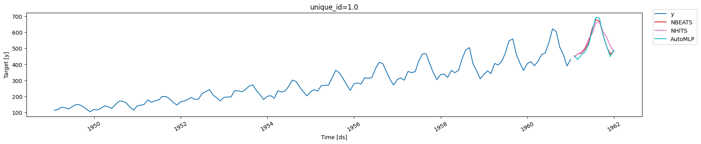

Saving and loading trained Deep Learning models has multiple valuable
uses. These models are often costly to train; storing a pre-trained
model can help reduce costs as it can be loaded and reused to forecast
multiple times. Moreover, it enables Transfer learning capabilities,
consisting of pre-training a flexible model on a large dataset and using
it later on other data with little to no training. It is one of the most
outstanding 🚀 achievements in Machine Learning 🧠 and has many
practical applications.

In this notebook we show an example on how to save and load
`NeuralForecast` models.

The two methods to consider are:<br/> 1. `NeuralForecast.save`: Saves
models into disk, allows save dataset and config.<br/> 2.
`NeuralForecast.load`: Loads models from a given path.<br/>

> **Important**
>
> This Guide assumes basic knowledge on the NeuralForecast library. For
> a minimal example visit the [Getting
> Started](../getting-started/02_quickstart.ipynb) guide.

You can run these experiments using GPU with Google Colab.

<a href="https://colab.research.google.com/github/Nixtla/neuralforecast/blob/main/nbs/examples/Save_Load_models.ipynb" target="_parent"></a>

## 1. Installing NeuralForecast

```python
%%capture
!pip install neuralforecast
```

## 2. Loading AirPassengers Data

For this example we will use the classical [AirPassenger Data
set](https://www.kaggle.com/datasets/rakannimer/air-passengers). Import
the pre-processed AirPassenger from `utils`.

```python
from neuralforecast.utils import AirPassengersDF
```


```python
Y_df = AirPassengersDF
Y_df.head()
```

|     | unique_id | ds         | y     |
|-----|-----------|------------|-------|
| 0   | 1.0       | 1949-01-31 | 112.0 |
| 1   | 1.0       | 1949-02-28 | 118.0 |
| 2   | 1.0       | 1949-03-31 | 132.0 |
| 3   | 1.0       | 1949-04-30 | 129.0 |
| 4   | 1.0       | 1949-05-31 | 121.0 |

## 3. Model Training

Next, we instantiate and train three models: `NBEATS`, `NHITS`, and
`AutoMLP`. The models with their hyperparameters are defined in the
`models` list.

```python
import logging

from ray import tune

from neuralforecast.core import NeuralForecast
from neuralforecast.auto import AutoMLP
from neuralforecast.models import NBEATS, NHITS
```


```python
logging.getLogger('pytorch_lightning').setLevel(logging.ERROR)
```


```python
horizon = 12
models = [NBEATS(input_size=2 * horizon, h=horizon, max_steps=50),
          NHITS(input_size=2 * horizon, h=horizon, max_steps=50),
          AutoMLP(# Ray tune explore config
                  config=dict(max_steps=100, # Operates with steps not epochs
                              input_size=tune.choice([3*horizon]),
                              learning_rate=tune.choice([1e-3])),
                  h=horizon,
                  num_samples=1, cpus=1)]
```

``` text
Seed set to 1
Seed set to 1
```

```python
%%capture
nf = NeuralForecast(models=models, freq='ME')
nf.fit(df=Y_df)
```

Produce the forecasts with the `predict` method.

```python
Y_hat_df = nf.predict()
Y_hat_df.head()
```

``` text
Predicting: |                                                                                                 …
```

``` text
Predicting: |                                                                                                 …
```

``` text
Predicting: |                                                                                                 …
```

|     | unique_id | ds         | NBEATS     | NHITS      | AutoMLP    |
|-----|-----------|------------|------------|------------|------------|
| 0   | 1.0       | 1961-01-31 | 446.882172 | 447.219238 | 454.914154 |
| 1   | 1.0       | 1961-02-28 | 465.145813 | 464.558014 | 430.188446 |
| 2   | 1.0       | 1961-03-31 | 469.978424 | 474.637238 | 458.478577 |
| 3   | 1.0       | 1961-04-30 | 493.650665 | 502.670349 | 477.244507 |
| 4   | 1.0       | 1961-05-31 | 537.569275 | 559.405212 | 522.252991 |

We plot the forecasts for each model.

```python
from utilsforecast.plotting import plot_series
```


```python
plot_series(Y_df, Y_hat_df)
```



## 4. Save models

To save all the trained models use the `save` method. This method will
save both the hyperparameters and the learnable weights (parameters).

The `save` method has the following inputs:

-   `path`: directory where models will be saved.
-   `model_index`: optional list to specify which models to save. For
    example, to only save the `NHITS` model use `model_index=[2]`.
-   `overwrite`: boolean to overwrite existing files in `path`. When
    True, the method will only overwrite models with conflicting names.
-   `save_dataset`: boolean to save `Dataset` object with the dataset.

```python
nf.save(path='./checkpoints/test_run/',
        model_index=None, 
        overwrite=True,
        save_dataset=True)
```

For each model, two files are created and stored:

-   `[model_name]_[suffix].ckpt`: Pytorch Lightning checkpoint file with
    the model parameters and hyperparameters.
-   `[model_name]_[suffix].pkl`: Dictionary with configuration
    attributes.

Where `model_name` corresponds to the name of the model in lowercase
(eg. `nhits`). We use a numerical suffix to distinguish multiple models
of each class. In this example the names will be `automlp_0`,
`nbeats_0`, and `nhits_0`.

> **Important**
>
> The `Auto` models will be stored as their base model. For example, the
> `AutoMLP` trained above is stored as an `MLP` model, with the best
> hyparparameters found during tuning.

## 5. Load models

Load the saved models with the `load` method, specifying the `path`, and
use the new `nf2` object to produce forecasts.

```python
nf2 = NeuralForecast.load(path='./checkpoints/test_run/')
Y_hat_df2 = nf2.predict()
Y_hat_df2.head()
```

``` text
Seed set to 1
Seed set to 1
Seed set to 1
```

``` text
Predicting: |                                                                                                 …
```

``` text
Predicting: |                                                                                                 …
```

``` text
Predicting: |                                                                                                 …
```

|     | unique_id | ds         | NHITS      | NBEATS     | AutoMLP    |
|-----|-----------|------------|------------|------------|------------|
| 0   | 1.0       | 1961-01-31 | 447.219238 | 446.882172 | 454.914154 |
| 1   | 1.0       | 1961-02-28 | 464.558014 | 465.145813 | 430.188446 |
| 2   | 1.0       | 1961-03-31 | 474.637238 | 469.978424 | 458.478577 |
| 3   | 1.0       | 1961-04-30 | 502.670349 | 493.650665 | 477.244507 |
| 4   | 1.0       | 1961-05-31 | 559.405212 | 537.569275 | 522.252991 |

Finally, plot the forecasts to confirm they are identical to the
original forecasts.

```python
plot_series(Y_df, Y_hat_df2)
```


## References

https://pytorch-lightning.readthedocs.io/en/stable/common/checkpointing_basic.html

[Oreshkin, B. N., Carpov, D., Chapados, N., & Bengio, Y. (2019).
N-BEATS: Neural basis expansion analysis for interpretable time series
forecasting. ICLR 2020](https://arxiv.org/abs/1905.10437)

[Cristian Challu, Kin G. Olivares, Boris N. Oreshkin, Federico Garza,
Max Mergenthaler-Canseco, Artur Dubrawski (2021). N-HiTS: Neural
Hierarchical Interpolation for Time Series Forecasting. Accepted at AAAI
2023.](https://arxiv.org/abs/2201.12886)

