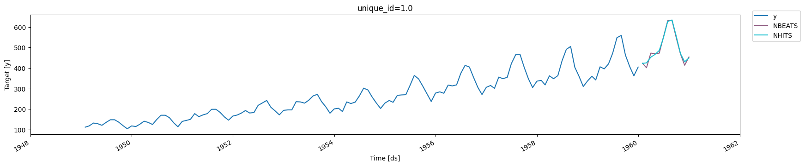

```python
%load_ext autoreload
%autoreload 2
```


> **NeuralForecast** offers a large collection of neural forecasting
> models focused on their usability, and robustness. The models range
> from classic networks like `MLP`, `RNN`s to novel proven contributions
> like `NBEATS`, `NHITS`, `TFT` and other architectures.

## 🎊 Features

-   **Exogenous Variables**: Static, historic and future exogenous
    support.
-   **Forecast Interpretability**: Plot trend, seasonality and exogenous
    `NBEATS`, `NHITS`, `TFT`, `ESRNN` prediction components.
-   **Probabilistic Forecasting**: Simple model adapters for quantile
    losses and parametric distributions.
-   **Train and Evaluation Losses** Scale-dependent, percentage and
    scale independent errors, and parametric likelihoods.
-   **Automatic Model Selection** Parallelized automatic hyperparameter
    tuning, that efficiently searches best validation configuration.
-   **Simple Interface** Unified SKLearn Interface for `StatsForecast`
    and `MLForecast` compatibility.
-   **Model Collection**: Out of the box implementation of `MLP`,
    `LSTM`, `RNN`, `TCN`, `DilatedRNN`, `NBEATS`, `NHITS`, `ESRNN`,
    `Informer`, `TFT`, `PatchTST`, `VanillaTransformer`, `StemGNN` and
    `HINT`. See the entire [collection
    here](../capabilities/01_overview).

## Why?

There is a shared belief in Neural forecasting methods’ capacity to
improve our pipeline’s accuracy and efficiency.

Unfortunately, available implementations and published research are yet
to realize neural networks’ potential. They are hard to use and
continuously fail to improve over statistical methods while being
computationally prohibitive. For this reason, we created
`NeuralForecast`, a library favoring proven accurate and efficient
models focusing on their usability.

## 💻 Installation

### PyPI

You can install `NeuralForecast`’s *released version* from the Python
package index [pip](https://pypi.org/project/neuralforecast/) with:

```python
pip install neuralforecast
```

(Installing inside a python virtualenvironment or a conda environment is
recommended.)

### Conda

Also you can install `NeuralForecast`’s *released version* from
[conda](https://anaconda.org/conda-forge/neuralforecast) with:

```python
conda install -c conda-forge neuralforecast
```

(Installing inside a python virtualenvironment or a conda environment is
recommended.)

### Dev Mode

If you want to make some modifications to the code and see the effects
in real time (without reinstalling), follow the steps below:

```bash
git clone https://github.com/Nixtla/neuralforecast.git
cd neuralforecast
pip install -e .
```

## How to Use

```python
import logging

import pandas as pd
from utilsforecast.plotting import plot_series

from neuralforecast import NeuralForecast
from neuralforecast.models import NBEATS, NHITS
from neuralforecast.utils import AirPassengersDF
```


```python
logging.getLogger('pytorch_lightning').setLevel(logging.ERROR)
```


```python
# Split data and declare panel dataset
Y_df = AirPassengersDF
Y_train_df = Y_df[Y_df.ds<='1959-12-31'] # 132 train
Y_test_df = Y_df[Y_df.ds>'1959-12-31'] # 12 test

# Fit and predict with NBEATS and NHITS models
horizon = len(Y_test_df)
models = [NBEATS(input_size=2 * horizon, h=horizon, max_steps=100, enable_progress_bar=False),
          NHITS(input_size=2 * horizon, h=horizon, max_steps=100, enable_progress_bar=False)]
nf = NeuralForecast(models=models, freq='ME')
nf.fit(df=Y_train_df)
Y_hat_df = nf.predict()

# Plot predictions
plot_series(Y_train_df, Y_hat_df)
```

``` text
Seed set to 1
Seed set to 1
```



## 🙏 How to Cite

If you enjoy or benefit from using these Python implementations, a
citation to the repository will be greatly appreciated.

``` text
@misc{olivares2022library_neuralforecast,
    author={Kin G. Olivares and
            Cristian Challú and
            Federico Garza and
            Max Mergenthaler Canseco and
            Artur Dubrawski},
    title = {{NeuralForecast}: User friendly state-of-the-art neural forecasting models.},
    year={2022},
    howpublished={{PyCon} Salt Lake City, Utah, US 2022},
    url={https://github.com/Nixtla/neuralforecast}
}
```

