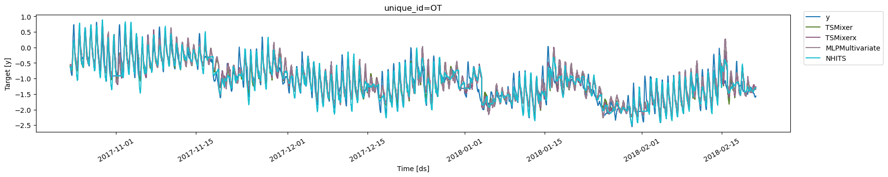

> Tutorial on how to do multivariate forecasting using TSMixer models.

In *multivariate* forecasting, we use the information from every time
series to produce all forecasts for all time series jointly. In
contrast, in *univariate* forecasting we only consider the information
from every individual time series and produce forecasts for every time
series separately. Multivariate forecasting methods thus use more
information to produce every forecast, and thus should be able to
provide better forecasting results. However, multivariate forecasting
methods also scale with the number of time series, which means these
methods are commonly less well suited for large-scale problems
(i.e. forecasting many, many time series).

In this notebook, we will demonstrate the performance of a
state-of-the-art multivariate forecasting architecture `TSMixer` /
`TSMixerx` when compared to a univariate forecasting method (`NHITS`)
and a simple MLP-based multivariate method (`MLPMultivariate`).

We will show how to: \* Load the
[ETTm2](https://github.com/zhouhaoyi/ETDataset) benchmark dataset, used
in the academic literature. \* Train a `TSMixer`, `TSMixerx` and
`MLPMultivariate` model \* Forecast the test set \* Optimize the
hyperparameters

You can run these experiments using GPU with Google Colab.

<a href="https://colab.research.google.com/github/Nixtla/neuralforecast/blob/main/nbs/examples/LongHorizon_with_Transformers.ipynb" target="_parent"></a>

## 1. Installing libraries

```python
%%capture
!pip install neuralforecast datasetsforecast
```

## 2. Load ETTm2 Data

The `LongHorizon` class will automatically download the complete ETTm2
dataset and process it.

It return three Dataframes: `Y_df` contains the values for the target
variables, `X_df` contains exogenous calendar features and `S_df`
contains static features for each time-series (none for ETTm2). For this
example we will use `Y_df` and `X_df`.

In `TSMixerx`, we can make use of the additional exogenous features
contained in `X_df`. In `TSMixer`, there is *no* support for exogenous
features. Hence, if you want to use exogenous features, you should use
`TSMixerx`.

If you want to use your own data just replace `Y_df` and `X_df`. Be sure
to use a long format and make sure to have a similar structure as our
data set.

```python
import pandas as pd

from datasetsforecast.long_horizon import LongHorizon
```


```python
# Change this to your own data to try the model
Y_df, X_df, _ = LongHorizon.load(directory='./', group='ETTm2')
Y_df['ds'] = pd.to_datetime(Y_df['ds'])

# X_df contains the exogenous features, which we add to Y_df
X_df['ds'] = pd.to_datetime(X_df['ds'])
Y_df = Y_df.merge(X_df, on=['unique_id', 'ds'], how='left')

# We make validation and test splits
n_time = len(Y_df.ds.unique())
val_size = int(.2 * n_time)
test_size = int(.2 * n_time)
```


```python
Y_df
```

|        | unique_id | ds                  | y         | ex_1      | ex_2      | ex_3      | ex_4      |
|--------|-----------|---------------------|-----------|-----------|-----------|-----------|-----------|
| 0      | HUFL      | 2016-07-01 00:00:00 | -0.041413 | -0.500000 | 0.166667  | -0.500000 | -0.001370 |
| 1      | HUFL      | 2016-07-01 00:15:00 | -0.185467 | -0.500000 | 0.166667  | -0.500000 | -0.001370 |
| 2      | HUFL      | 2016-07-01 00:30:00 | -0.257495 | -0.500000 | 0.166667  | -0.500000 | -0.001370 |
| 3      | HUFL      | 2016-07-01 00:45:00 | -0.577510 | -0.500000 | 0.166667  | -0.500000 | -0.001370 |
| 4      | HUFL      | 2016-07-01 01:00:00 | -0.385501 | -0.456522 | 0.166667  | -0.500000 | -0.001370 |
| ...    | ...       | ...                 | ...       | ...       | ...       | ...       | ...       |
| 403195 | OT        | 2018-02-20 22:45:00 | -1.581325 | 0.456522  | -0.333333 | 0.133333  | -0.363014 |
| 403196 | OT        | 2018-02-20 23:00:00 | -1.581325 | 0.500000  | -0.333333 | 0.133333  | -0.363014 |
| 403197 | OT        | 2018-02-20 23:15:00 | -1.581325 | 0.500000  | -0.333333 | 0.133333  | -0.363014 |
| 403198 | OT        | 2018-02-20 23:30:00 | -1.562328 | 0.500000  | -0.333333 | 0.133333  | -0.363014 |
| 403199 | OT        | 2018-02-20 23:45:00 | -1.562328 | 0.500000  | -0.333333 | 0.133333  | -0.363014 |

## 3. Train models

We will train models using the `cross_validation` method, which allows
users to automatically simulate multiple historic forecasts (in the test
set).

The `cross_validation` method will use the validation set for
hyperparameter selection and early stopping, and will then produce the
forecasts for the test set.

First, instantiate each model in the `models` list, specifying the
`horizon`, `input_size`, and training iterations. In this notebook, we
compare against the univariate `NHITS` and multivariate
`MLPMultivariate` models.

```python
import logging

import torch
from neuralforecast.core import NeuralForecast
from neuralforecast.models import TSMixer, TSMixerx, NHITS, MLPMultivariate
from neuralforecast.losses.pytorch import MAE
```


```python
logging.getLogger('pytorch_lightning').setLevel(logging.ERROR)
torch.set_float32_matmul_precision('high')
```


```python
horizon = 96
input_size = 512
models = [
          TSMixer(h=horizon,
                input_size=input_size,
                n_series=7,
                max_steps=1000,
                val_check_steps=100,
                early_stop_patience_steps=5,
                scaler_type='identity',
                valid_loss=MAE(),
                random_seed=12345678,
                ),  
          TSMixerx(h=horizon,
                input_size=input_size,
                n_series=7,
                max_steps=1000,
                val_check_steps=100,
                early_stop_patience_steps=5,
                scaler_type='identity',
                dropout=0.7,
                valid_loss=MAE(),
                random_seed=12345678,
                futr_exog_list=['ex_1', 'ex_2', 'ex_3', 'ex_4'],
                ),
          MLPMultivariate(h=horizon,
                input_size=input_size,
                n_series=7,
                max_steps=1000,
                val_check_steps=100,
                early_stop_patience_steps=5,
                scaler_type='standard',
                hidden_size=256,
                valid_loss=MAE(),
                random_seed=12345678,
                ),                                             
           NHITS(h=horizon,
                input_size=horizon,
                max_steps=1000,
                val_check_steps=100,
                early_stop_patience_steps=5,
                scaler_type='robust',
                valid_loss=MAE(),
                random_seed=12345678,
                ),                                                                       
         ]
```

> **Tip**
>
> Check our `auto` models for automatic hyperparameter optimization, and
> see the end of this tutorial for an example of hyperparameter tuning.

Instantiate a `NeuralForecast` object with the following required
parameters:

-   `models`: a list of models.

-   `freq`: a string indicating the frequency of the data. (See [panda’s
    available
    frequencies](https://pandas.pydata.org/pandas-docs/stable/user_guide/timeseries.html#offset-aliases).)

Second, use the `cross_validation` method, specifying the dataset
(`Y_df`), validation size and test size.

```python
%%capture
nf = NeuralForecast(
    models=models,
    freq='15min',
)

Y_hat_df = nf.cross_validation(
    df=Y_df,
    val_size=val_size,
    test_size=test_size,
    n_windows=None,
)
```

The `cross_validation` method will return the forecasts for each model
on the test set.

## 4. Evaluate Results

Next, we plot the forecasts on the test set for the `OT` variable for
all models.

```python
from utilsforecast.plotting import plot_series
```


```python
cutoffs = Y_hat_df['cutoff'].unique()[::horizon]
Y_plot = Y_hat_df[Y_hat_df['cutoff'].isin(cutoffs)].drop(columns='cutoff')
plot_series(forecasts_df=Y_plot, ids=['OT'])
```



Finally, we compute the test errors using the Mean Absolute Error (MAE)
and Mean Squared Error (MSE):

$\qquad MAE = \frac{1}{Windows * Horizon} \sum_{\tau} |y_{\tau} - \hat{y}_{\tau}| \qquad$
and
$\qquad MSE = \frac{1}{Windows * Horizon} \sum_{\tau} (y_{\tau} - \hat{y}_{\tau})^{2} \qquad$

```python
from utilsforecast.evaluation import evaluate
from utilsforecast.losses import mae, mse
```


```python
evaluate(Y_hat_df.drop(columns='cutoff'), metrics=[mae, mse], agg_fn='mean')
```

|     | metric | TSMixer  | TSMixerx | MLPMultivariate | NHITS    |
|-----|--------|----------|----------|-----------------|----------|
| 0   | mae    | 0.245435 | 0.249727 | 0.263579        | 0.251008 |
| 1   | mse    | 0.162566 | 0.163098 | 0.176594        | 0.178864 |

For reference, we can check the performance when compared to
self-reported performance in the paper. We find that `TSMixer` provides
better results than the *univariate* method `NHITS`. Also, our
implementation of `TSMixer` very closely tracks the results of the
original paper. Finally, it seems that there is little benefit of using
the additional exogenous variables contained in the dataframe `X_df` as
`TSMixerx` performs worse than `TSMixer`, especially on longer horizons.
Note also that `MLPMultivariate` clearly underperforms as compared to
the other methods, which can be somewhat expected given its relative
simplicity.

Mean Absolute Error (MAE)

| Horizon | TSMixer<br/> (this notebook) | TSMixer <br/>(paper) | TSMixerx<br/> (this notebook) | NHITS <br/>(this notebook) | NHITS <br/>(paper) | MLPMultivariate <br/>(this notebook) |
|-----------|-----------|-----------|-----------|-----------|-----------|-----------|
| 96      | **0.245**                   | 0.252               | 0.250                        | 0.251                     | 0.251             | 0.263                               |
| 192     | **0.288**                   | 0.290               | 0.300                        | 0.291                     | 0.305             | 0.361                               |
| 336     | **0.323**                   | 0.324               | 0.380                        | 0.344                     | 0.346             | 0.390                               |
| 720     | **0.377**                   | 0.422               | 0.464                        | 0.417                     | 0.413             | 0.608                               |

Mean Squared Error (MSE)

| Horizon | TSMixer<br/> (this notebook) | TSMixer <br/>(paper) | TSMixerx<br/> (this notebook) | NHITS <br/>(this notebook) | NHITS <br/>(paper) | MLPMultivariate <br/>(this notebook) |
|-----------|-----------|-----------|-----------|-----------|-----------|-----------|
| 96      | **0.163**                   | **0.163**           | 0.163                        | 0.179                     | 0.179             | 0.177                               |
| 192     | 0.220                       | **0.216**           | 0.231                        | 0.239                     | 0.245             | 0.330                               |
| 336     | 0.272                       | **0.268**           | 0.361                        | 0.311                     | 0.295             | 0.376                               |
| 720     | **0.356**                   | 0.420               | 0.493                        | 0.451                     | 0.401             | 3.421                               |

Note that for the table above, we use the same hyperparameters for all
methods for all horizons, whereas the original papers tune the
hyperparameters for each horizon.

## 5. Tuning the hyperparameters

The `AutoTSMixer` / `AutoTSMixerx` class will automatically perform
hyperparamter tunning using the [Tune
library](https://docs.ray.io/en/latest/tune/index.html), exploring a
user-defined or default search space. Models are selected based on the
error on a validation set and the best model is then stored and used
during inference.

The `AutoTSMixer.default_config` / `AutoTSMixerx.default_config`
attribute contains a suggested hyperparameter space. Here, we specify a
different search space following the paper’s hyperparameters. Feel free
to play around with this space.

For this example, we will optimize the hyperparameters for
`horizon = 96`.

```python
from ray import tune
from ray.tune.search.hyperopt import HyperOptSearch
from neuralforecast.auto import AutoTSMixer, AutoTSMixerx
```


```python
horizon = 96 # 24hrs = 4 * 15 min.

tsmixer_config = {
       "input_size": input_size,                                                 # Size of input window
       "max_steps": tune.choice([500, 1000, 2000]),                              # Number of training iterations
       "val_check_steps": 100,                                                   # Compute validation every x steps
       "early_stop_patience_steps": 5,                                           # Early stopping steps
       "learning_rate": tune.loguniform(1e-4, 1e-2),                             # Initial Learning rate
       "n_block": tune.choice([1, 2, 4, 6, 8]),                                  # Number of mixing layers
       "dropout": tune.uniform(0.0, 0.99),                                       # Dropout
       "ff_dim": tune.choice([32, 64, 128]),                                     # Dimension of the feature linear layer
       "scaler_type": 'identity',       
    }

tsmixerx_config = tsmixer_config.copy()
tsmixerx_config['futr_exog_list'] = ['ex_1', 'ex_2', 'ex_3', 'ex_4']
```

To instantiate `AutoTSMixer` and `AutoTSMixerx` you need to define:

-   `h`: forecasting horizon
-   `n_series`: number of time series in the multivariate time series
    problem.

In addition, we define the following parameters (if these are not given,
the `AutoTSMixer`/`AutoTSMixerx` class will use a pre-defined value): \*
`loss`: training loss. Use the `DistributionLoss` to produce
probabilistic forecasts. \* `config`: hyperparameter search space. If
`None`, the `AutoTSMixer` class will use a pre-defined suggested
hyperparameter space. \* `num_samples`: number of configurations
explored. For this example, we only use a limited amount of `10`. \*
`search_alg`: type of search algorithm used for selecting parameter
values within the hyperparameter space. \* `backend`: the backend used
for the hyperparameter optimization search, either `ray` or `optuna`. \*
`valid_loss`: the loss used for the validation sets in the optimization
procedure.

```python
model = AutoTSMixer(h=horizon,
                    n_series=7,
                    loss=MAE(),
                    config=tsmixer_config,
                    num_samples=10,
                    search_alg=HyperOptSearch(),
                    backend='ray',
                    valid_loss=MAE())

modelx = AutoTSMixerx(h=horizon,
                    n_series=7,
                    loss=MAE(),
                    config=tsmixerx_config,
                    num_samples=10,
                    search_alg=HyperOptSearch(),
                    backend='ray',
                    valid_loss=MAE())
```

Now, we fit the model by instantiating a `NeuralForecast` object with
the following required parameters:

-   `models`: a list of models.

-   `freq`: a string indicating the frequency of the data. (See [panda’s
    available
    frequencies](https://pandas.pydata.org/pandas-docs/stable/user_guide/timeseries.html#offset-aliases).)

The `cross_validation` method allows you to simulate multiple historic
forecasts, greatly simplifying pipelines by replacing for loops with
`fit` and `predict` methods.

With time series data, cross validation is done by defining a sliding
window across the historical data and predicting the period following
it. This form of cross validation allows us to arrive at a better
estimation of our model’s predictive abilities across a wider range of
temporal instances while also keeping the data in the training set
contiguous as is required by our models.

The `cross_validation` method will use the validation set for
hyperparameter selection, and will then produce the forecasts for the
test set.

```python
%%capture
nf = NeuralForecast(models=[model, modelx], freq='15min')
Y_hat_df = nf.cross_validation(df=Y_df, val_size=val_size,
                               test_size=test_size, n_windows=None)
```

## 6. Evaluate Results

The `AutoTSMixer`/`AutoTSMixerx` class contains a `results` attribute
that stores information of each configuration explored. It contains the
validation loss and best validation hyperparameter. The result dataframe
`Y_hat_df` that we obtained in the previous step is based on the best
config of the hyperparameter search. For `AutoTSMixer`, the best config
is:

```python
nf.models[0].results.get_best_result().config
```

``` text
{'input_size': 512,
 'max_steps': 2000,
 'val_check_steps': 100,
 'early_stop_patience_steps': 5,
 'learning_rate': 0.00034884229033995355,
 'n_block': 4,
 'dropout': 0.7592667651473878,
 'ff_dim': 128,
 'scaler_type': 'identity',
 'n_series': 7,
 'h': 96,
 'loss': MAE(),
 'valid_loss': MAE()}
```

and for `AutoTSMixerx`:

```python
nf.models[1].results.get_best_result().config
```

``` text
{'input_size': 512,
 'max_steps': 2000,
 'val_check_steps': 100,
 'early_stop_patience_steps': 5,
 'learning_rate': 0.00019039338576148522,
 'n_block': 6,
 'dropout': 0.5902743834953548,
 'ff_dim': 128,
 'scaler_type': 'identity',
 'futr_exog_list': ('ex_1', 'ex_2', 'ex_3', 'ex_4'),
 'n_series': 7,
 'h': 96,
 'loss': MAE(),
 'valid_loss': MAE()}
```

We compute the test errors of the best config for the two metrics of
interest:

$\qquad MAE = \frac{1}{Windows * Horizon} \sum_{\tau} |y_{\tau} - \hat{y}_{\tau}| \qquad$
and
$\qquad MSE = \frac{1}{Windows * Horizon} \sum_{\tau} (y_{\tau} - \hat{y}_{\tau})^{2} \qquad$

```python
evaluate(Y_hat_df.drop(columns='cutoff'), metrics=[mae, mse], agg_fn='mean')
```

|     | metric | AutoTSMixer | AutoTSMixerx |
|-----|--------|-------------|--------------|
| 0   | mae    | 0.243749    | 0.251972     |
| 1   | mse    | 0.162212    | 0.164347     |

We can compare the error metrics for our optimized setting to the
earlier setting in which we used the default hyperparameters. In this
case, for a horizon of 96, we got slightly improved results for
`TSMixer` on `MAE`. Interestingly, we did not improve for `TSMixerx` as
compared to the default settings. For this dataset, it seems there is
limited value in using exogenous features with the `TSMixerx`
architecture for a horizon of 96.

| Metric | TSMixer<br/> (optimized) | TSMixer <br/>(default) | TSMixer <br/>(paper) | TSMixerx<br/> (optimized) | TSMixerx <br/>(default) |
|------------|------------|------------|------------|------------|------------|
| MAE    | **0.244**               | 0.245                 | 0.252               | 0.252                    | 0.250                  |
| MSE    | **0.162**               | 0.163                 | 0.163               | 0.164                    | 0.163                  |

Note that we only evaluated 10 hyperparameter configurations
(`num_samples=10`), which may suggest that it is possible to further
improve forecasting performance by exploring more hyperparameter
configurations.

## References

[Chen, Si-An, Chun-Liang Li, Nate Yoder, Sercan O. Arik, and Tomas
Pfister (2023). “TSMixer: An All-MLP Architecture for Time Series
Forecasting.”](http://arxiv.org/abs/2303.06053) <br/> [Cristian Challu,
Kin G. Olivares, Boris N. Oreshkin, Federico Garza, Max
Mergenthaler-Canseco, Artur Dubrawski (2021). NHITS: Neural Hierarchical
Interpolation for Time Series Forecasting. Accepted at AAAI
2023.](https://arxiv.org/abs/2201.12886)

