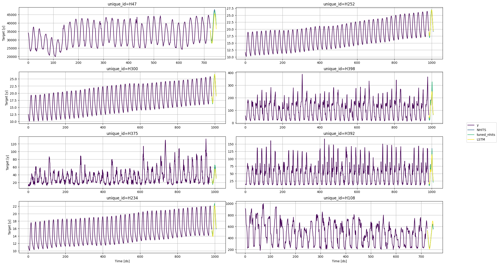

## Prerequisites

This notebook was ran in databricks using the following configuration:

-   Databricks Runtime Version: 14.3 LTS ML (Spark 3.5, GPU, Scala 2.12)
-   Worker and executors instance type: g4dn.xlarge
-   Cluster libraries:
    -   neuralforecast==1.7.0
    -   fugue
    -   protobuf\<=3.20.1
    -   s3fs

## Load libraries

```python
import logging

import numpy as np
import pandas as pd

from neuralforecast import NeuralForecast, DistributedConfig
from neuralforecast.auto import AutoNHITS
from neuralforecast.models import NHITS, LSTM
from utilsforecast.evaluation import evaluate
from utilsforecast.losses import mae, rmse, smape
from utilsforecast.plotting import plot_series
```

``` text
2024-06-12 21:29:32.857491: I tensorflow/core/util/port.cc:111] oneDNN custom operations are on. You may see slightly different numerical results due to floating-point round-off errors from different computation orders. To turn them off, set the environment variable `TF_ENABLE_ONEDNN_OPTS=0`.
2024-06-12 21:29:32.901906: E tensorflow/compiler/xla/stream_executor/cuda/cuda_dnn.cc:9342] Unable to register cuDNN factory: Attempting to register factory for plugin cuDNN when one has already been registered
2024-06-12 21:29:32.901946: E tensorflow/compiler/xla/stream_executor/cuda/cuda_fft.cc:609] Unable to register cuFFT factory: Attempting to register factory for plugin cuFFT when one has already been registered
2024-06-12 21:29:32.901973: E tensorflow/compiler/xla/stream_executor/cuda/cuda_blas.cc:1518] Unable to register cuBLAS factory: Attempting to register factory for plugin cuBLAS when one has already been registered
2024-06-12 21:29:32.909956: I tensorflow/core/platform/cpu_feature_guard.cc:182] This TensorFlow binary is optimized to use available CPU instructions in performance-critical operations.
To enable the following instructions: AVX2 AVX512F AVX512_VNNI FMA, in other operations, rebuild TensorFlow with the appropriate compiler flags.
```

```python
logging.getLogger('pytorch_lightning').setLevel(logging.ERROR)
```

## Data

```python
df = pd.read_parquet('https://datasets-nixtla.s3.amazonaws.com/m4-hourly.parquet')
df['exog_0'] = np.random.rand(df.shape[0])
static = df.groupby('unique_id').head(1).copy()
static['stat_0'] = static['unique_id'].astype('category').cat.codes
static = static[['unique_id', 'stat_0']]
valid = df.groupby('unique_id').tail(24)
train = df.drop(valid.index)
# save for loading in spark
s3_prefix = 's3://nixtla-tmp/distributed'
train.to_parquet(f'{s3_prefix}/train.parquet', index=False)
valid.to_parquet(f'{s3_prefix}/valid.parquet', index=False)
static.to_parquet(f'{s3_prefix}/static.parquet', index=False)
# load in spark
spark_train = spark.read.parquet(f'{s3_prefix}/train.parquet')
spark_valid = spark.read.parquet(f'{s3_prefix}/valid.parquet')
spark_static = spark.read.parquet(f'{s3_prefix}/static.parquet')
```

## Configuration

```python
# Configuration required for distributed training
dist_cfg = DistributedConfig(
    partitions_path=f'{s3_prefix}/partitions',  # path where the partitions will be saved
    num_nodes=2,  # number of nodes to use during training (machines)
    devices=1,   # number of GPUs in each machine
)

# pytorch lightning configuration
# the executors don't have permission to write on the filesystem, so we disable saving artifacts
distributed_kwargs = dict(
    accelerator='gpu',
    enable_progress_bar=False,
    logger=False,
    enable_checkpointing=False,
)

# exogenous features
exogs = {
    'futr_exog_list': ['exog_0'],
    'stat_exog_list': ['stat_0'],
}

# for the AutoNHITS
def config(trial):
    return dict(
        input_size=48,
        max_steps=2_000,
        learning_rate=trial.suggest_float('learning_rate', 1e-4, 1e-1, log=True),
        **exogs,
        **distributed_kwargs
    )
```

## Model training

```python
nf = NeuralForecast(
    models=[
        NHITS(h=24, input_size=48, max_steps=2_000, **exogs, **distributed_kwargs),
        AutoNHITS(h=24, config=config, backend='optuna', num_samples=2, alias='tuned_nhits'),
        LSTM(h=24, input_size=48, max_steps=2_000, **exogs, **distributed_kwargs),
    ],
    freq=1,
)
nf.fit(spark_train, static_df=spark_static, distributed_config=dist_cfg, val_size=24)
```

``` text
[rank: 0] Seed set to 1
/local_disk0/.ephemeral_nfs/cluster_libraries/python/lib/python3.10/site-packages/pytorch_lightning/utilities/parsing.py:199: Attribute 'loss' is an instance of `nn.Module` and is already saved during checkpointing. It is recommended to ignore them using `self.save_hyperparameters(ignore=['loss'])`.
[rank: 0] Seed set to 1
INFO:TorchDistributor:Started distributed training with 2 executor processes
[rank: 1] Seed set to 1
[rank: 0] Seed set to 1
[rank: 1] Seed set to 1
Initializing distributed: GLOBAL_RANK: 1, MEMBER: 2/2
GPU available: True (cuda), used: True
TPU available: False, using: 0 TPU cores
IPU available: False, using: 0 IPUs
HPU available: False, using: 0 HPUs
[rank: 0] Seed set to 1
Initializing distributed: GLOBAL_RANK: 0, MEMBER: 1/2
----------------------------------------------------------------------------------------------------
distributed_backend=nccl
All distributed processes registered. Starting with 2 processes
----------------------------------------------------------------------------------------------------

LOCAL_RANK: 0 - CUDA_VISIBLE_DEVICES: [0]

  | Name         | Type          | Params
-----------------------------------------------
0 | loss         | MAE           | 0
1 | padder_train | ConstantPad1d | 0
2 | scaler       | TemporalNorm  | 0
3 | blocks       | ModuleList    | 2.6 M
-----------------------------------------------
2.6 M     Trainable params
0         Non-trainable params
2.6 M     Total params
10.341    Total estimated model params size (MB)
LOCAL_RANK: 0 - CUDA_VISIBLE_DEVICES: [0]
`Trainer.fit` stopped: `max_steps=2000` reached.
INFO:TorchDistributor:Finished distributed training with 2 executor processes
[I 2024-06-12 21:31:09,627] A new study created in memory with name: no-name-849c3a84-28d7-417b-a48d-f0feac64cbc3
[rank: 0] Seed set to 1
INFO:TorchDistributor:Started distributed training with 2 executor processes
[rank: 1] Seed set to 1
[rank: 0] Seed set to 1
[rank: 1] Seed set to 1
Initializing distributed: GLOBAL_RANK: 1, MEMBER: 2/2
GPU available: True (cuda), used: True
TPU available: False, using: 0 TPU cores
IPU available: False, using: 0 IPUs
HPU available: False, using: 0 HPUs
[rank: 0] Seed set to 1
Initializing distributed: GLOBAL_RANK: 0, MEMBER: 1/2
----------------------------------------------------------------------------------------------------
distributed_backend=nccl
All distributed processes registered. Starting with 2 processes
----------------------------------------------------------------------------------------------------

LOCAL_RANK: 0 - CUDA_VISIBLE_DEVICES: [0]
LOCAL_RANK: 0 - CUDA_VISIBLE_DEVICES: [0]

  | Name         | Type          | Params
-----------------------------------------------
0 | loss         | MAE           | 0
1 | padder_train | ConstantPad1d | 0
2 | scaler       | TemporalNorm  | 0
3 | blocks       | ModuleList    | 2.6 M
-----------------------------------------------
2.6 M     Trainable params
0         Non-trainable params
2.6 M     Total params
10.341    Total estimated model params size (MB)
`Trainer.fit` stopped: `max_steps=2000` reached.
INFO:TorchDistributor:Finished distributed training with 2 executor processes
[I 2024-06-12 21:32:26,716] Trial 0 finished with value: 240.63693237304688 and parameters: {'learning_rate': 0.0008137359313625077}. Best is trial 0 with value: 240.63693237304688.
[rank: 0] Seed set to 1
INFO:TorchDistributor:Started distributed training with 2 executor processes
[rank: 1] Seed set to 1
[rank: 0] Seed set to 1
[rank: 1] Seed set to 1
Initializing distributed: GLOBAL_RANK: 1, MEMBER: 2/2
GPU available: True (cuda), used: True
TPU available: False, using: 0 TPU cores
IPU available: False, using: 0 IPUs
HPU available: False, using: 0 HPUs
[rank: 0] Seed set to 1
Initializing distributed: GLOBAL_RANK: 0, MEMBER: 1/2
----------------------------------------------------------------------------------------------------
distributed_backend=nccl
All distributed processes registered. Starting with 2 processes
----------------------------------------------------------------------------------------------------

LOCAL_RANK: 0 - CUDA_VISIBLE_DEVICES: [0]

  | Name         | Type          | Params
-----------------------------------------------
0 | loss         | MAE           | 0
1 | padder_train | ConstantPad1d | 0
2 | scaler       | TemporalNorm  | 0
3 | blocks       | ModuleList    | 2.6 M
-----------------------------------------------
2.6 M     Trainable params
0         Non-trainable params
2.6 M     Total params
10.341    Total estimated model params size (MB)
LOCAL_RANK: 0 - CUDA_VISIBLE_DEVICES: [0]
`Trainer.fit` stopped: `max_steps=2000` reached.
INFO:TorchDistributor:Finished distributed training with 2 executor processes
[I 2024-06-12 21:33:43,744] Trial 1 finished with value: 269.3470153808594 and parameters: {'learning_rate': 0.0007824692588634985}. Best is trial 0 with value: 240.63693237304688.
[rank: 0] Seed set to 1
INFO:TorchDistributor:Started distributed training with 2 executor processes
[rank: 1] Seed set to 1
[rank: 0] Seed set to 1
[rank: 1] Seed set to 1
Initializing distributed: GLOBAL_RANK: 1, MEMBER: 2/2
GPU available: True (cuda), used: True
TPU available: False, using: 0 TPU cores
IPU available: False, using: 0 IPUs
HPU available: False, using: 0 HPUs
[rank: 0] Seed set to 1
Initializing distributed: GLOBAL_RANK: 0, MEMBER: 1/2
----------------------------------------------------------------------------------------------------
distributed_backend=nccl
All distributed processes registered. Starting with 2 processes
----------------------------------------------------------------------------------------------------

LOCAL_RANK: 0 - CUDA_VISIBLE_DEVICES: [0]
LOCAL_RANK: 0 - CUDA_VISIBLE_DEVICES: [0]

  | Name         | Type          | Params
-----------------------------------------------
0 | loss         | MAE           | 0
1 | padder_train | ConstantPad1d | 0
2 | scaler       | TemporalNorm  | 0
3 | blocks       | ModuleList    | 2.6 M
-----------------------------------------------
2.6 M     Trainable params
0         Non-trainable params
2.6 M     Total params
10.341    Total estimated model params size (MB)
`Trainer.fit` stopped: `max_steps=2000` reached.
INFO:TorchDistributor:Finished distributed training with 2 executor processes
INFO:TorchDistributor:Started distributed training with 2 executor processes
[rank: 0] Seed set to 1
[rank: 1] Seed set to 1
GPU available: True (cuda), used: True
TPU available: False, using: 0 TPU cores
IPU available: False, using: 0 IPUs
HPU available: False, using: 0 HPUs
[rank: 0] Seed set to 1
Initializing distributed: GLOBAL_RANK: 0, MEMBER: 1/2
----------------------------------------------------------------------------------------------------
distributed_backend=nccl
All distributed processes registered. Starting with 2 processes
----------------------------------------------------------------------------------------------------

[rank: 1] Seed set to 1
Initializing distributed: GLOBAL_RANK: 1, MEMBER: 2/2
LOCAL_RANK: 0 - CUDA_VISIBLE_DEVICES: [0]
LOCAL_RANK: 0 - CUDA_VISIBLE_DEVICES: [0]

  | Name            | Type          | Params
--------------------------------------------------
0 | loss            | MAE           | 0
1 | padder          | ConstantPad1d | 0
2 | scaler          | TemporalNorm  | 0
3 | hist_encoder    | LSTM          | 484 K
4 | context_adapter | Linear        | 54.0 K
5 | mlp_decoder     | MLP           | 2.6 K
--------------------------------------------------
541 K     Trainable params
0         Non-trainable params
541 K     Total params
2.166     Total estimated model params size (MB)
`Trainer.fit` stopped: `max_steps=2000` reached.
INFO:TorchDistributor:Finished distributed training with 2 executor processes
```

## Forecasting

When we’re done training the model in a distributed way we can predict
using the stored dataset. If we have future exogenous features we can
provide a spark dataframe as `futr_df`. Note that if you want to load
the stored dataset you need to provide the spark session through the
`engine` argument.

```python
saved_ds_preds = nf.predict(futr_df=spark_valid.drop("y"), engine=spark).toPandas()
```

We can also provide a spark dataframe as `df` as well as `static_df` and
`futr_df` (if applicable) to compute predictions on different data or
after loading a saved model.

```python
new_df_preds = nf.predict(df=spark_train, static_df=spark_static, futr_df=spark_valid.drop("y")).toPandas()
```

Either of the above methods will yield the same results.

```python
pd.testing.assert_frame_equal(
    saved_ds_preds.sort_values(['unique_id', 'ds']).reset_index(drop=True),
    new_df_preds.sort_values(['unique_id', 'ds']).reset_index(drop=True),
    atol=1e-3,
)
```

## Saving for inference

We can now persist the trained models

```python
save_path = f'{s3_prefix}/model-artifacts'
nf.save(save_path, save_dataset=False, overwrite=True)
```

And load them back

```python
nf2 = NeuralForecast.load(save_path)
```

``` text
[rank: 0] Seed set to 1
[rank: 0] Seed set to 1
[rank: 0] Seed set to 1
```

We can now use this object to compute forecasts. We can provide either
local dataframes (pandas, polars) as well as spark dataframes

```python
preds = nf.predict(df=train, static_df=static, futr_df=valid.drop(columns='y'))
preds2 = nf2.predict(df=train, static_df=static, futr_df=valid.drop(columns='y'))[preds.columns]
pd.testing.assert_frame_equal(saved_ds_preds, preds)
pd.testing.assert_frame_equal(preds, preds2)
```

## Evaluation

```python
(
    evaluate(
        preds.merge(valid.drop(columns='exog_0'), on=['unique_id', 'ds']),
        metrics=[mae, rmse, smape],
    )
    .drop(columns='unique_id')
    .groupby('metric')
    .mean()
)
```

|        | NHITS      | tuned_nhits | LSTM       |
|--------|------------|-------------|------------|
| metric |            |             |            |
| mae    | 417.075336 | 322.751522  | 270.423775 |
| rmse   | 485.304941 | 410.998659  | 330.579283 |
| smape  | 0.063995   | 0.066046    | 0.063975   |

## Plotting a sample

```python
plot_series(train, preds)
```



