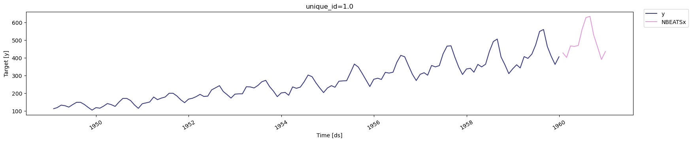

> Log your neuralforecast experiments to MLflow

## Installing dependencies

To install Neuralforecast refer to
[Installation](../getting-started/04_installation).

To install mlflow: `pip install mlflow`

## Imports

```python
import logging
import warnings

import matplotlib.pyplot as plt
import mlflow
import mlflow.data
import numpy as np
import pandas as pd
from mlflow.client import MlflowClient
from mlflow.data.pandas_dataset import PandasDataset
from utilsforecast.plotting import plot_series

from neuralforecast.core import NeuralForecast
from neuralforecast.models import NBEATSx
from neuralforecast.utils import AirPassengersDF
from neuralforecast.losses.pytorch import MAE
```


```python
logging.getLogger("mlflow").setLevel(logging.ERROR)
logging.getLogger("pytorch_lightning").setLevel(logging.ERROR)
warnings.filterwarnings("ignore")
```

## Splitting the data

```python
# Split data and declare panel dataset
Y_df = AirPassengersDF
Y_train_df = Y_df[Y_df.ds<='1959-12-31'] # 132 train
Y_test_df = Y_df[Y_df.ds>'1959-12-31'] # 12 test
Y_df.tail()
```

|     | unique_id | ds         | y     |
|-----|-----------|------------|-------|
| 139 | 1.0       | 1960-08-31 | 606.0 |
| 140 | 1.0       | 1960-09-30 | 508.0 |
| 141 | 1.0       | 1960-10-31 | 461.0 |
| 142 | 1.0       | 1960-11-30 | 390.0 |
| 143 | 1.0       | 1960-12-31 | 432.0 |

## MLflow UI

Run the following command from the terminal to start the UI:
`mlflow ui`. You can then go to the printed URL to visualize the
experiments.

## Model training

```python
mlflow.pytorch.autolog(checkpoint=False)

with mlflow.start_run() as run:
    # Log the dataset to the MLflow Run. Specify the "training" context to indicate that the
    # dataset is used for model training
    dataset: PandasDataset = mlflow.data.from_pandas(Y_df, source="AirPassengersDF")
    mlflow.log_input(dataset, context="training")

    # Define and log parameters
    horizon = len(Y_test_df)
    model_params = dict(
        input_size=1 * horizon,
        h=horizon,
        max_steps=300,  
        loss=MAE(),
        valid_loss=MAE(),  
        activation='ReLU',
        scaler_type='robust',
        random_seed=42,
        enable_progress_bar=False,
    )
    mlflow.log_params(model_params)

    # Fit NBEATSx model
    models = [NBEATSx(**model_params)]
    nf = NeuralForecast(models=models, freq='M')           
    train = nf.fit(df=Y_train_df, val_size=horizon)
    
    # Save conda environment used to run the model (if you used a conda environment)
    mlflow.pytorch.get_default_conda_env()
    
    # Save pip requirements
    mlflow.pytorch.get_default_pip_requirements()

mlflow.pytorch.autolog(disable=True)

# Save the neural forecast model
nf.save(path='./checkpoints/test_run_1/',
        model_index=None, 
        overwrite=True,
        save_dataset=True)
```

``` text
Seed set to 42
```

## Forecasting the future

```python
Y_hat_df = nf.predict(futr_df=Y_test_df)
plot_series(Y_train_df, Y_hat_df, palette='tab20b')
```



