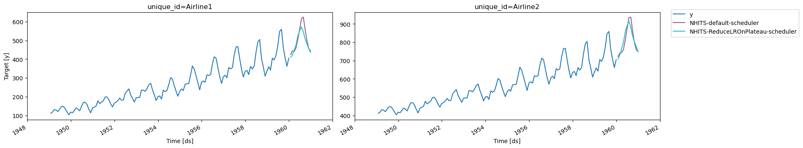

> Tutorial on how to achieve a full control of the
> `configure_optimizers()` behavior of NeuralForecast models

NeuralForecast models allow us to customize the default optimizer and
learning rate scheduler behaviors via `optimizer`, `optimizer_kwargs`,
`lr_scheduler`, `lr_scheduler_kwargs`. However this is not sufficient to
support the use of
[ReduceLROnPlateau](https://pytorch.org/docs/stable/generated/torch.optim.lr_scheduler.ReduceLROnPlateau.html),
for instance, as it requires the specification of `monitor` parameter.

This tutorial provides an example of how to support the use of
`ReduceLROnPlateau`.

## Load libraries

```python
import numpy as np
import pandas as pd
import torch
import matplotlib.pyplot as plt
from neuralforecast import NeuralForecast
from neuralforecast.models import NHITS
from neuralforecast.utils import AirPassengersPanel

from utilsforecast.plotting import plot_series
```

``` text
/root/miniconda3/envs/neuralforecast/lib/python3.10/site-packages/tqdm/auto.py:21: TqdmWarning: IProgress not found. Please update jupyter and ipywidgets. See https://ipywidgets.readthedocs.io/en/stable/user_install.html
  from .autonotebook import tqdm as notebook_tqdm
2025-02-25 15:57:21,708 INFO util.py:154 -- Missing packages: ['ipywidgets']. Run `pip install -U ipywidgets`, then restart the notebook server for rich notebook output.
2025-02-25 15:57:21,760 INFO util.py:154 -- Missing packages: ['ipywidgets']. Run `pip install -U ipywidgets`, then restart the notebook server for rich notebook output.
```

## Data

We use the AirPassengers dataset for the demonstration of conformal
prediction.

```python
AirPassengersPanel_train = AirPassengersPanel[AirPassengersPanel['ds'] < AirPassengersPanel['ds'].values[-12]].reset_index(drop=True)
AirPassengersPanel_test = AirPassengersPanel[AirPassengersPanel['ds'] >= AirPassengersPanel['ds'].values[-12]].reset_index(drop=True)
AirPassengersPanel_test['y'] = np.nan
AirPassengersPanel_test['y_[lag12]'] = np.nan
```

## Model training

We now train a NHITS model on the above dataset. We consider two
different predictions: 1. Training using the default
`configure_optimizers()`. 2. Training by overwriting the
`configure_optimizers()` of the subclass of NHITS model.

```python
horizon = 12
input_size = 24

class CustomNHITS(NHITS):
    def configure_optimizers(self):
        optimizer = torch.optim.Adadelta(params=self.parameters(), rho=0.75)
        scheduler=torch.optim.lr_scheduler.ReduceLROnPlateau(
            optimizer=optimizer, mode='min',factor=0.5, patience=2,
        )
        scheduler_config = {
            'scheduler': scheduler,
            'interval': 'step',
            'frequency': 1,
            'monitor': 'train_loss',
            'strict': True,
            'name': None,
        }
        return {'optimizer': optimizer, 'lr_scheduler': scheduler_config}

models = [
    NHITS(h=horizon, input_size=input_size, max_steps=100, alias='NHITS-default-scheduler'),
    CustomNHITS(h=horizon, input_size=input_size, max_steps=100, alias='NHITS-ReduceLROnPlateau-scheduler'),
]
nf = NeuralForecast(models=models, freq='ME')
nf.fit(AirPassengersPanel_train)
preds = nf.predict(futr_df=AirPassengersPanel_test)
```

``` text
Seed set to 1
Seed set to 1
GPU available: False, used: False
TPU available: False, using: 0 TPU cores
HPU available: False, using: 0 HPUs

  | Name         | Type          | Params | Mode 
-------------------------------------------------------
0 | loss         | MAE           | 0      | train
1 | padder_train | ConstantPad1d | 0      | train
2 | scaler       | TemporalNorm  | 0      | train
3 | blocks       | ModuleList    | 2.4 M  | train
-------------------------------------------------------
2.4 M     Trainable params
0         Non-trainable params
2.4 M     Total params
9.751     Total estimated model params size (MB)
34        Modules in train mode
0         Modules in eval mode
`Trainer.fit` stopped: `max_steps=100` reached.
GPU available: False, used: False
TPU available: False, using: 0 TPU cores
HPU available: False, using: 0 HPUs

  | Name         | Type          | Params | Mode 
-------------------------------------------------------
0 | loss         | MAE           | 0      | train
1 | padder_train | ConstantPad1d | 0      | train
2 | scaler       | TemporalNorm  | 0      | train
3 | blocks       | ModuleList    | 2.4 M  | train
-------------------------------------------------------
2.4 M     Trainable params
0         Non-trainable params
2.4 M     Total params
9.751     Total estimated model params size (MB)
34        Modules in train mode
0         Modules in eval mode
`Trainer.fit` stopped: `max_steps=100` reached.
GPU available: False, used: False
TPU available: False, using: 0 TPU cores
HPU available: False, using: 0 HPUs
GPU available: False, used: False
TPU available: False, using: 0 TPU cores
HPU available: False, using: 0 HPUs
```

``` text
Epoch 99: 100%|██████████| 1/1 [00:00<00:00,  2.50it/s, v_num=85, train_loss_step=14.20, train_loss_epoch=14.20]Epoch 99: 100%|██████████| 1/1 [00:00<00:00,  2.49it/s, v_num=85, train_loss_step=14.20, train_loss_epoch=14.20]
Epoch 99: 100%|██████████| 1/1 [00:00<00:00,  2.78it/s, v_num=86, train_loss_step=24.10, train_loss_epoch=24.10]Epoch 99: 100%|██████████| 1/1 [00:00<00:00,  2.77it/s, v_num=86, train_loss_step=24.10, train_loss_epoch=24.10]
Predicting DataLoader 0: 100%|██████████| 1/1 [00:00<00:00, 33.39it/s]
Predicting DataLoader 0: 100%|██████████| 1/1 [00:00<00:00, 246.29it/s]
```

```python
plot_series(AirPassengersPanel_train, preds)
```



We can clearly notice the prediction outputs are different due to the
change in `configure_optimizers()`.

