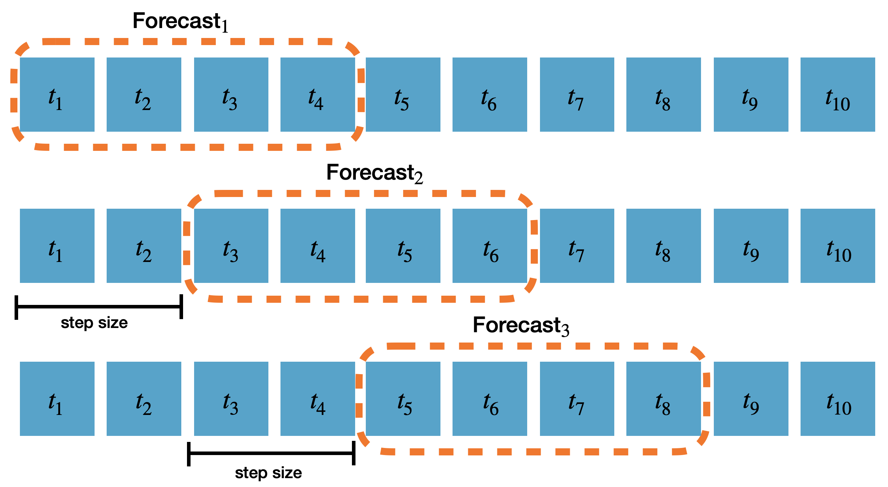
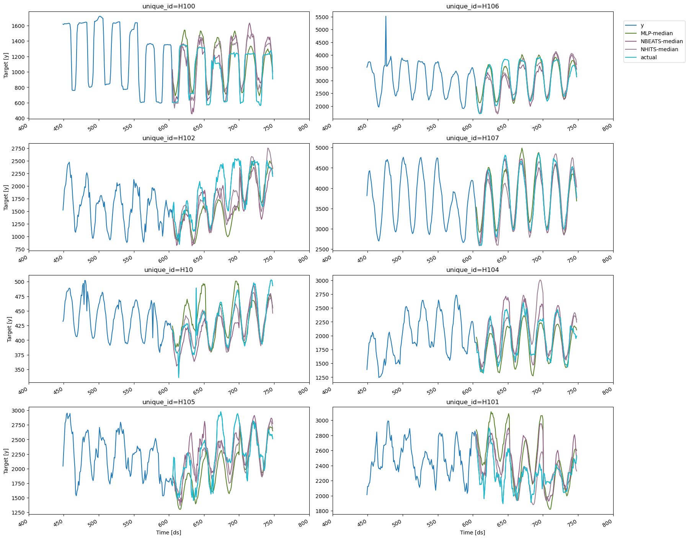

> Implement cross-validation to evaluate models on historical data

Time series cross-validation is a method for evaluating how a model
would have performed on historical data. It works by defining a sliding
window across past observations and predicting the period following it.
It differs from standard cross-validation by maintaining the
chronological order of the data instead of randomly splitting it.

This method allows for a better estimation of our model’s predictive
capabilities by considering multiple periods. When only one window is
used, it resembles a standard train-test split, where the test data is
the last set of observations, and the training set consists of the
earlier data.

The following graph showcases how time series cross-validation works.


In this tutorial we’ll explain how to perform cross-validation in
`NeuralForecast`.

**Outline:** 1. Install NeuralForecast

1.  Load and plot the data

2.  Train multiple models using cross-validation

3.  Evaluate models and select the best for each series

4.  Plot cross-validation results

> **Prerequesites**
>
> This guide assumes basic familiarity with `neuralforecast`. For a
> minimal example visit the [Quick
> Start](../getting-started/02_quickstart.ipynb)

## 1. Install NeuralForecast

```python
%%capture
!pip install neuralforecast
```

## 2. Load and plot the data

We’ll use pandas to load the hourly dataset from the [M4 Forecasting
Competition](https://www.sciencedirect.com/science/article/pii/S0169207019301128),
which has been stored in a parquet file for efficiency.

```python
import os
import logging

import pandas as pd
from IPython.display import display
```


```python
os.environ['PL_TRAINER_ENABLE_PROGRESS_BAR'] = '0'
logging.getLogger('pytorch_lightning').setLevel(logging.ERROR)
```


```python
Y_df = pd.read_parquet('https://datasets-nixtla.s3.amazonaws.com/m4-hourly.parquet')
Y_df.head()
```

|     | unique_id | ds  | y     |
|-----|-----------|-----|-------|
| 0   | H1        | 1   | 605.0 |
| 1   | H1        | 2   | 586.0 |
| 2   | H1        | 3   | 586.0 |
| 3   | H1        | 4   | 559.0 |
| 4   | H1        | 5   | 511.0 |

The input to `neuralforecast` should be a data frame in long format with
three columns: `unique_id`, `ds`, and `y`.

-   `unique_id` (string, int, or category): A unique identifier for each
    time series.

-   `ds` (int or timestamp): An integer indexing time or a timestamp in
    format YYYY-MM-DD or YYYY-MM-DD HH:MM:SS.

-   `y` (numeric): The target variable to forecast.

This dataset contains 414 unique time series. To reduce the total
execution time, we’ll use only the first 10.

```python
uids = Y_df['unique_id'].unique()[:10] # Select 10 ids to make the example run faster
Y_df = Y_df.query('unique_id in @uids').reset_index(drop=True)
```

To plot the series, we’ll use the `plot_series` method from
`utilsforecast.plotting`. `utilsforecast` is a dependency of
`neuralforecast` so it should be already installed.

```python
from utilsforecast.plotting import plot_series
```


```python
plot_series(Y_df)
```


## 3. Train multiple models using cross-validation

We’ll train different models from `neuralforecast` using the
`cross-validation` method to decide which one perfoms best on the
historical data. To do this, we need to import the `NeuralForecast`
class and the models that we want to compare.

```python
from neuralforecast import NeuralForecast 
from neuralforecast.auto import MLP, NBEATS, NHITS
from neuralforecast.losses.pytorch import MQLoss
```

In this tutorial, we will use `neuralforecast's`
[MPL](../../models.mlp#class-mlp),
[NBEATS](../../models.nbeats#class-nbeats), and
[NHITS](../../models.nhits#class-nhits) models.

First, we need to create a list of models and then instantiate the
`NeuralForecast` class. For each model, we’ll define the following
hyperparameters:

-   `h`: The forecast horizon. Here, we will use the same horizon as in
    the M4 competition, which was 48 steps ahead.

-   `input_size`: The number of historical observations (lags) that the
    model uses to make predictions. In this case, it will be twice the
    forecast horizon.

-   `loss`: The loss function to optimize. Here, we’ll use the Multi
    Quantile Loss (MQLoss) from `neuralforecast.losses.pytorch`.

> **Warning**
>
> The Multi Quantile Loss (MQLoss) is the sum of the quantile losses for
> each target quantile. The quantile loss for a single quantile measures
> how well a model has predicted a specific quantile of the actual
> distribution, penalizing overestimations and underestimations
> asymmetrically based on the quantile’s value. For more details see
> [here](../../losses.pytorch#class-mqloss).

While there are other hyperparameters that can be defined for each
model, we’ll use the default values for the purposes of this tutorial.
To learn more about the hyperparameters of each model, please check out
the corresponding documentation.

```python
horizon = 48 
models = [MLP(h=horizon, input_size=2*horizon, loss=MQLoss()), 
          NBEATS(h=horizon, input_size=2*horizon, loss=MQLoss()), 
          NHITS(h=horizon, input_size=2*horizon, loss=MQLoss()),]
nf = NeuralForecast(models=models, freq=1)
```

The `cross_validation` method takes the following arguments:

-   `df`: The data frame in the format described in section 2.

-   `n_windows` (int): The number of windows to evaluate. Default is 1
    and here we’ll use 3.

-   `step_size` (int): The number of steps between consecutive windows
    to produce the forecasts. In this example, we’ll set
    `step_size=horizon` to produce non-overlapping forecasts. The
    following diagram shows how the forecasts are produced based on the
    `step_size` parameter and forecast horizon `h` of a model. In this
    diagram `step_size=2` and `h=4`.



-   `refit` (bool or int): Whether to retrain models for each
    cross-validation window. If `False`, the models are trained at the
    beginning and then used to predict each window. If a positive
    integer, the models are retrained every `refit` windows. Default is
    `False`, but here we’ll use `refit=1` so that the models are
    retrained after each window using the data with timestamps up to and
    including the cutoff.

```python
cv_df = nf.cross_validation(Y_df, n_windows=3, step_size=horizon, refit=1)
```

It’s worth mentioning that the default version of the `cross_validation`
method in `neuralforecast` diverges from other libraries, where models
are typically retrained at the start of each window. By default, it
trains the models once and then uses them to generate predictions over
all the windows, thus reducing the total execution time. For scenarios
where the models need to be retrained, you can use the `refit` parameter
to specify the number of windows after which the models should be
retrained.

```python
cv_df.head()
```

|     | unique_id | ds  | cutoff | MLP-median | MLP-lo-90  | MLP-lo-80  | MLP-hi-80  | MLP-hi-90  | NBEATS-median | NBEATS-lo-90 | NBEATS-lo-80 | NBEATS-hi-80 | NBEATS-hi-90 | NHITS-median | NHITS-lo-90 | NHITS-lo-80 | NHITS-hi-80 | NHITS-hi-90 | y     |
|-----|-----------|-----|--------|------------|------------|------------|------------|------------|---------------|--------------|--------------|--------------|--------------|--------------|-------------|-------------|-------------|-------------|-------|
| 0   | H1        | 605 | 604    | 638.964111 | 528.127747 | 546.731812 | 714.415466 | 750.265259 | 623.230896    | 580.549744   | 587.317688   | 647.942505   | 654.148682   | 625.377930   | 556.786926  | 577.746765  | 657.901611  | 670.458069  | 622.0 |
| 1   | H1        | 606 | 604    | 588.216370 | 445.395081 | 483.736542 | 684.394592 | 670.042358 | 552.829407    | 501.618988   | 529.007507   | 593.528564   | 603.152527   | 555.956177   | 511.696350  | 526.399597  | 604.318970  | 622.839722  | 558.0 |
| 2   | H1        | 607 | 604    | 542.242737 | 419.206757 | 439.244476 | 617.775269 | 638.583923 | 495.155548    | 451.871613   | 467.183533   | 550.048950   | 574.697021   | 502.860077   | 462.284668  | 460.950287  | 555.336731  | 571.852722  | 513.0 |
| 3   | H1        | 608 | 604    | 494.055573 | 414.775085 | 427.531647 | 583.965759 | 602.303772 | 465.182556    | 403.593140   | 410.033203   | 500.744019   | 518.277954   | 460.588684   | 406.762390  | 418.040710  | 501.833740  | 515.022095  | 476.0 |
| 4   | H1        | 609 | 604    | 469.330688 | 361.437927 | 378.501373 | 557.875244 | 569.767273 | 441.072388    | 371.541504   | 401.923584   | 483.667877   | 485.047729   | 441.463043   | 393.917725  | 394.483337  | 475.985229  | 499.001373  | 449.0 |

The output of the `cross-validation` method is a data frame that
includes the following columns:

-   `unique_id`: The unique identifier for each time series.

-   `ds`: The timestamp or temporal index.

-   `cutoff`: The last timestamp or temporal index used in that
    cross-validation window.

-   `"model"`: Columns with the model’s point forecasts (median) and
    prediction intervals. By default, the 80 and 90% prediction
    intervals are included when using the MQLoss.

-   `y`: The actual value.

## 4. Evaluate models and select the best for each series

To evaluate the point forecasts of the models, we’ll use the Root Mean
Squared Error (RMSE), defined as the square root of the mean of the
squared differences between the actual and the predicted values.

For convenience, we’ll use the `evaluate` and the `rmse` functions from
`utilsforecast`.

```python
from utilsforecast.evaluation import evaluate
from utilsforecast.losses import rmse 
```

The `evaluate` function takes the following arguments:

-   `df`: The data frame with the forecasts to evaluate.

-   `metrics` (list): The metrics to compute.

-   `models` (list): Names of the models to evaluate. Default is `None`,
    which uses all columns after removing `id_col`, `time_col`, and
    `target_col`.

-   `id_col` (str): Column that identifies unique ids of the series.
    Default is `unique_id`.

-   `time_col` (str): Column with the timestamps or the temporal index.
    Default is `ds`.

-   `target_col` (str): Column with the target variable. Default is `y`.

Notice that if we use the default value of `models`, then we need to
exclude the `cutoff` column from the cross-validation data frame.

```python
evaluation_df = evaluate(cv_df.drop(columns='cutoff'), metrics=[rmse])
```

For each unique id, we’ll select the model with the lowest RMSE.

```python
evaluation_df['best_model'] = evaluation_df.drop(columns=['metric', 'unique_id']).idxmin(axis=1)
evaluation_df
```

|     | unique_id | metric | MLP-median  | NBEATS-median | NHITS-median | best_model    |
|-----|-----------|--------|-------------|---------------|--------------|---------------|
| 0   | H1        | rmse   | 46.654390   | 49.595304     | 47.651201    | MLP-median    |
| 1   | H10       | rmse   | 24.192081   | 21.580142     | 16.887989    | NHITS-median  |
| 2   | H100      | rmse   | 171.958998  | 178.820952    | 170.452623   | NHITS-median  |
| 3   | H101      | rmse   | 331.270162  | 260.021871    | 169.453119   | NHITS-median  |
| 4   | H102      | rmse   | 440.470939  | 362.602167    | 326.571391   | NHITS-median  |
| 5   | H103      | rmse   | 9069.937603 | 9267.925257   | 8578.535681  | NHITS-median  |
| 6   | H104      | rmse   | 189.534415  | 169.017976    | 226.442403   | NBEATS-median |
| 7   | H105      | rmse   | 341.029706  | 284.038751    | 262.140145   | NHITS-median  |
| 8   | H106      | rmse   | 203.723728  | 328.128422    | 298.377068   | MLP-median    |
| 9   | H107      | rmse   | 212.384943  | 161.445838    | 231.303421   | NBEATS-median |

We can summarize the results to see how many times each model won.

```python
summary_df = evaluation_df.groupby(['metric', 'best_model']).size().sort_values().to_frame()
summary_df = summary_df.reset_index()
summary_df.columns = ['metric', 'model', 'num. of unique_ids']
summary_df
```

|     | metric | model         | num. of unique_ids |
|-----|--------|---------------|--------------------|
| 0   | rmse   | MLP-median    | 2                  |
| 1   | rmse   | NBEATS-median | 2                  |
| 2   | rmse   | NHITS-median  | 6                  |

With this information, we now know which model performs best for each
series in the historical data.

## 5. Plot cross-validation results

To visualize the cross-validation results, we will use the `plot_series`
method again. We’ll need to rename the `y` column in the
cross-validation output to avoid duplicates with the original data
frame. We’ll also exclude the `cutoff` column and use the
`max_insample_length argument` to plot only the last 300 observations
for better visualization.

```python
cv_df.rename(columns = {'y': 'actual'}, inplace=True) # rename actual values 
plot_series(Y_df, cv_df.drop(columns='cutoff'), max_insample_length=300)
```



To clarify the concept of cross-validation further, we’ll plot the
forecasts generated at each cutoff for the series with `unique_id='H1'`.
There are three cutoffs because we set `n_windows=3`. In this example,
we used `refit=1`, so each model is retrained for each window using data
with timestamps up to and including the respective cutoff. Additionally,
since `step_size` is equal to the forecast horizon, the resulting
forecasts are non-overlapping

```python
cutoff1, cutoff2, cutoff3 = cv_df['cutoff'].unique()
for cutoff in cv_df['cutoff'].unique():
    display(
        plot_series(
            Y_df,
            cv_df[cv_df['cutoff'] == cutoff].drop(columns='cutoff'),
            ids=['H1'], # use ids parameter to select specific series
        )
    )
```


