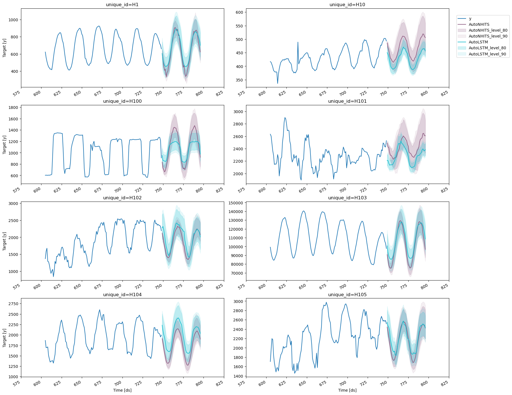
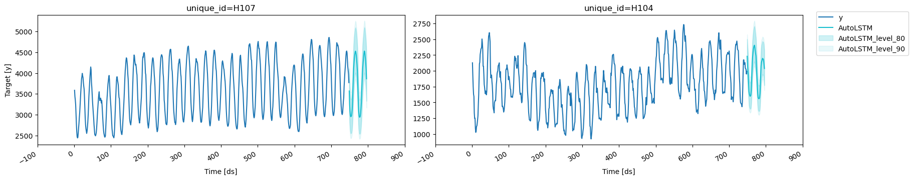
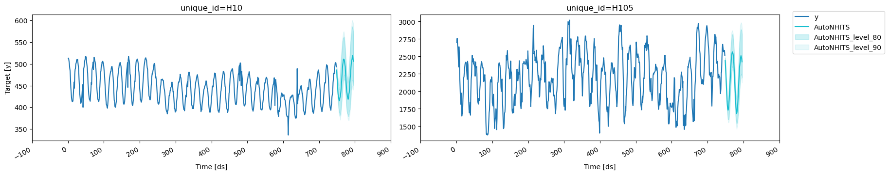
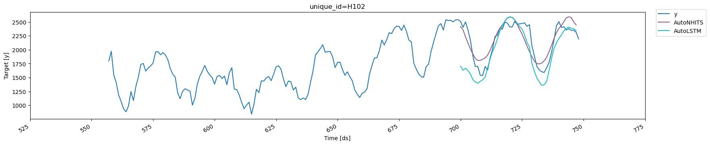
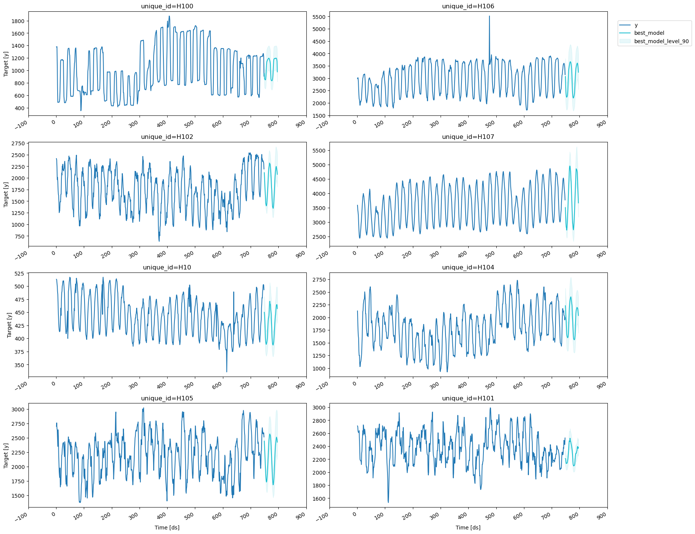

> Model training, evaluation and selection for multiple time series

> **Prerequesites**
>
> This Guide assumes basic familiarity with NeuralForecast. For a
> minimal example visit the [Quick
> Start](../getting-started/02_quickstart.ipynb)

Follow this article for a step to step guide on building a
production-ready forecasting pipeline for multiple time series.

During this guide you will gain familiarity with the core
`NeuralForecast`class and some relevant methods like
`NeuralForecast.fit`, `NeuralForecast.predict`, and
`StatsForecast.cross_validation.`

We will use a classical benchmarking dataset from the M4 competition.
The dataset includes time series from different domains like finance,
economy and sales. In this example, we will use a subset of the Hourly
dataset.

We will model each time series globally Therefore, you will train a set
of models for the whole dataset, and then select the best model for each
individual time series. NeuralForecast focuses on speed, simplicity, and
scalability, which makes it ideal for this task.

**Outline:**

1.  Install packages.
2.  Read the data.
3.  Explore the data.
4.  Train many models globally for the entire dataset.
5.  Evaluate the model’s performance using cross-validation.
6.  Select the best model for every unique time series.

> **Not Covered in this guide**
>
> -   Using external regressors or exogenous variables
>     -   Follow this tutorial to [include exogenous
>         variables](../capabilities/03_exogenous_variables.ipynb) like
>         weather or holidays or static variables like category or
>         family.
> -   Probabilistic forecasting
>     -   Follow this tutorial to [generate probabilistic
>         forecasts](../tutorials/03_uncertainty_quantification.ipynb)
> -   Transfer Learning
>     -   Train a model and use it to forecast on different data using
>         [this tutorial](../tutorials/17_transfer_learning.ipynb)

> **Tip**
>
> You can use Colab to run this Notebook interactively
> <a href="https://colab.research.google.com/github/Nixtla/neuralforecast/blob/main/nbs/examples/Getting_Started_complete.ipynb" target="_parent"></a>

> **Warning**
>
> To reduce the computation time, it is recommended to use GPU. Using
> Colab, do not forget to activate it. Just go to
> `Runtime>Change runtime type` and select GPU as hardware accelerator.

## 1. Install libraries

We assume you have `NeuralForecast` already installed. Check this guide
for instructions on [how to install
NeuralForecast](../getting-started/04_installation.ipynb).

```python
%%capture
! pip install neuralforecast
```

## 2. Read the data

We will use pandas to read the M4 Hourly data set stored in a parquet
file for efficiency. You can use ordinary pandas operations to read your
data in other formats likes `.csv`.

The input to `NeuralForecast` is always a data frame in [long
format](https://www.theanalysisfactor.com/wide-and-long-data/) with
three columns: `unique_id`, `ds` and `y`:

-   The `unique_id` (string, int or category) represents an identifier
    for the series.

-   The `ds` (datestamp or int) column should be either an integer
    indexing time or a datestampe ideally like YYYY-MM-DD for a date or
    YYYY-MM-DD HH:MM:SS for a timestamp.

-   The `y` (numeric) represents the measurement we wish to forecast. We
    will rename the

This data set already satisfies the requirement.

Depending on your internet connection, this step should take around 10
seconds.

```python
import pandas as pd
```


```python
Y_df = pd.read_parquet('https://datasets-nixtla.s3.amazonaws.com/m4-hourly.parquet')
Y_df.head()
```

|     | unique_id | ds  | y     |
|-----|-----------|-----|-------|
| 0   | H1        | 1   | 605.0 |
| 1   | H1        | 2   | 586.0 |
| 2   | H1        | 3   | 586.0 |
| 3   | H1        | 4   | 559.0 |
| 4   | H1        | 5   | 511.0 |

This dataset contains 414 unique series with 900 observations on
average. For this example and reproducibility’s sake, we will select
only 10 unique IDs. Depending on your processing infrastructure feel
free to select more or less series.

> **Note**
>
> Processing time is dependent on the available computing resources.
> Running this example with the complete dataset takes around 10 minutes
> in a c5d.24xlarge (96 cores) instance from AWS.

```python
uids = Y_df['unique_id'].unique()[:10] # Select 10 ids to make the example faster
Y_df = Y_df.query('unique_id in @uids').reset_index(drop=True)
```

## 3. Explore Data with the plot_series function

Plot some series using the `plot_series` function from the
`utilsforecast` library. This method prints 8 random series from the
dataset and is useful for basic EDA.

> **Note**
>
> The `plot_series` function uses matplotlib as a default engine. You
> can change to plotly by setting `engine="plotly"`.

```python
from utilsforecast.plotting import plot_series
```


```python
plot_series(Y_df)
```


## 4. Train multiple models for many series

`NeuralForecast` can train many models on many time series globally and
efficiently.

```python
import logging

import optuna
import ray.tune as tune
import torch

from neuralforecast import NeuralForecast
from neuralforecast.auto import AutoNHITS, AutoLSTM
from neuralforecast.losses.pytorch import MQLoss
```


```python
optuna.logging.set_verbosity(optuna.logging.WARNING)
logging.getLogger('pytorch_lightning').setLevel(logging.ERROR)
torch.set_float32_matmul_precision('high')
```

Each `Auto` model contains a default search space that was extensively
tested on multiple large-scale datasets. Additionally, users can define
specific search spaces tailored for particular datasets and tasks.

First, we create a custom search space for the `AutoNHITS` and
`AutoLSTM` models. Search spaces are specified with dictionaries, where
keys corresponds to the model’s hyperparameter and the value is a `Tune`
function to specify how the hyperparameter will be sampled. For example,
use `randint` to sample integers uniformly, and `choice` to sample
values of a list.

```python
def config_nhits(trial):
    return {
        "input_size": trial.suggest_categorical(          # Length of input window
            "input_size", (48, 48*2, 48*3)                
        ),                                                
        "start_padding_enabled": True,                                          
        "n_blocks": 5 * [1],                              # Length of input window
        "mlp_units": 5 * [[64, 64]],                      # Length of input window
        "n_pool_kernel_size": trial.suggest_categorical(  # MaxPooling Kernel size
            "n_pool_kernel_size",
            (5*[1], 5*[2], 5*[4], [8, 4, 2, 1, 1])
        ),     
        "n_freq_downsample": trial.suggest_categorical(   # Interpolation expressivity ratios
            "n_freq_downsample",
            ([8, 4, 2, 1, 1],  [1, 1, 1, 1, 1])
        ),     
        "learning_rate": trial.suggest_float(             # Initial Learning rate
            "learning_rate",
            low=1e-4,
            high=1e-2,
            log=True,
        ),            
        "scaler_type": None,                              # Scaler type
        "max_steps": 1000,                                # Max number of training iterations
        "batch_size": trial.suggest_categorical(          # Number of series in batch
            "batch_size",
            (1, 4, 10),
        ),                   
        "windows_batch_size": trial.suggest_categorical(  # Number of windows in batch
            "windows_batch_size",
            (128, 256, 512),
        ),      
        "random_seed": trial.suggest_int(                 # Random seed   
            "random_seed",
            low=1,
            high=20,
        ),                      
    }

def config_lstm(trial):
    return {
        "input_size": trial.suggest_categorical(           # Length of input window
            "input_size",
            (48, 48*2, 48*3)
        ),   
        "encoder_hidden_size": trial.suggest_categorical(  # Hidden size of LSTM cells
            "encoder_hidden_size",
            (64, 128),
        ),  
        "encoder_n_layers": trial.suggest_categorical(     # Number of layers in LSTM
            "encoder_n_layers",
            (2,4),
        ),        
        "learning_rate": trial.suggest_float(              # Initial Learning rate
            "learning_rate",
            low=1e-4,
            high=1e-2,
            log=True,
        ),   
        "scaler_type": 'robust',                           # Scaler type
        "max_steps": trial.suggest_categorical(           # Max number of training iterations
            "max_steps",
            (500, 1000)
        ),          
        "batch_size": trial.suggest_categorical(           # Number of series in batch
            "batch_size",
            (1, 4)
        ),              
        "random_seed": trial.suggest_int(                  # Random seed
            "random_seed",
            low=1,
            high=20
        ),             
    }
```

To instantiate an `Auto` model you need to define:

-   `h`: forecasting horizon.
-   `loss`: training and validation loss from
    `neuralforecast.losses.pytorch`.
-   `config`: hyperparameter search space. If `None`, the `Auto` class
    will use a pre-defined suggested hyperparameter space.
-   `search_alg`: search algorithm
-   `num_samples`: number of configurations explored.

In this example we set horizon `h` as 48, use the `MQLoss` distribution
loss for training and validation, and use the default search algorithm.

```python
nf = NeuralForecast(
    models=[
        AutoNHITS(h=48, config=config_nhits, loss=MQLoss(), backend='optuna', num_samples=5),
        AutoLSTM(h=48, config=config_lstm, loss=MQLoss(), backend='optuna', num_samples=2),
    ],
    freq=1,
)
```

> **Tip**
>
> The number of samples, `num_samples`, is a crucial parameter! Larger
> values will usually produce better results as we explore more
> configurations in the search space, but it will increase training
> times. Larger search spaces will usually require more samples. As a
> general rule, we recommend setting `num_samples` higher than 20.

Next, we use the `Neuralforecast` class to train the `Auto` model. In
this step, `Auto` models will automatically perform hyperparameter
tuning training multiple models with different hyperparameters,
producing the forecasts on the validation set, and evaluating them. The
best configuration is selected based on the error on a validation set.
Only the best model is stored and used during inference.

```python
%%capture
nf.fit(df=Y_df)
```

Next, we use the `predict` method to forecast the next 48 days using the
optimal hyperparameters.

```python
fcst_df = nf.predict()
fcst_df.columns = fcst_df.columns.str.replace('-median', '')
fcst_df.head()
```


```python
plot_series(Y_df, fcst_df, plot_random=False, max_insample_length=48 * 3, level=[80, 90])
```



The `plot_series` function allows for further customization. For
example, plot the results of the different models and unique ids.

```python
# Plot to unique_ids and some selected models
plot_series(Y_df, fcst_df, models=["AutoLSTM"], ids=["H107", "H104"], level=[80, 90])
```



```python
# Explore other models 
plot_series(Y_df, fcst_df, models=["AutoNHITS"], ids=["H10", "H105"], level=[80, 90])
```



## 5. Evaluate the model’s performance

In previous steps, we’ve taken our historical data to predict the
future. However, to asses its accuracy we would also like to know how
the model would have performed in the past. To assess the accuracy and
robustness of your models on your data perform Cross-Validation.

With time series data, **Cross Validation** is done by defining a
sliding window across the historical data and predicting the period
following it. This form of cross-validation allows us to arrive at a
better estimation of our model’s predictive abilities across a wider
range of temporal instances while also keeping the data in the training
set contiguous as is required by our models.

The following graph depicts such a Cross Validation Strategy:


> **Tip**
>
> Setting `n_windows=1` mirrors a traditional train-test split with our
> historical data serving as the training set and the last 48 hours
> serving as the testing set.

The `cross_validation` method from the `NeuralForecast` class takes the
following arguments.

-   `df`: training data frame

-   `step_size` (int): step size between each window. In other words:
    how often do you want to run the forecasting processes.

-   `n_windows` (int): number of windows used for cross validation. In
    other words: what number of forecasting processes in the past do you
    want to evaluate.

```python
from neuralforecast.auto import AutoNHITS, AutoLSTM
```


```python
nf = NeuralForecast(
    models=[
        AutoNHITS(h=48, config=config_nhits, loss=MQLoss(), num_samples=5, backend="optuna"),
        AutoLSTM(h=48, config=config_lstm, loss=MQLoss(), num_samples=2, backend="optuna"), 
    ],
    freq=1,
)
```


```python
%%capture
cv_df = nf.cross_validation(Y_df, n_windows=2)
```

The `cv_df` object is a new data frame that includes the following
columns:

-   `unique_id`: identifies each time series
-   `ds`: datestamp or temporal index
-   `cutoff`: the last datestamp or temporal index for the n_windows. If
    n_windows=1, then one unique cuttoff value, if n_windows=2 then two
    unique cutoff values.
-   `y`: true value
-   `"model"`: columns with the model’s name and fitted value.

```python
cv_df.columns = cv_df.columns.str.replace('-median', '')
```


```python
cv_df.head()
```

|     | unique_id | ds  | cutoff | AutoNHITS  | AutoNHITS-lo-90 | AutoNHITS-lo-80 | AutoNHITS-hi-80 | AutoNHITS-hi-90 | AutoLSTM   | AutoLSTM-lo-90 | AutoLSTM-lo-80 | AutoLSTM-hi-80 | AutoLSTM-hi-90 | y     |
|-----|-----------|-----|--------|------------|-----------------|-----------------|-----------------|-----------------|------------|----------------|----------------|----------------|----------------|-------|
| 0   | H1        | 700 | 699    | 654.506348 | 615.993774      | 616.021851      | 693.879272      | 712.376587      | 777.396362 | 511.052124     | 585.006470     | 992.880249     | 1084.980957    | 684.0 |
| 1   | H1        | 701 | 699    | 619.320068 | 573.836060      | 577.762695      | 663.133301      | 683.214478      | 691.002991 | 417.614349     | 488.192810     | 905.101135     | 1002.091919    | 619.0 |
| 2   | H1        | 702 | 699    | 546.807922 | 486.383362      | 498.541748      | 599.284302      | 623.889038      | 569.914795 | 314.173462     | 389.398865     | 763.250244     | 852.974121     | 565.0 |
| 3   | H1        | 703 | 699    | 483.149811 | 420.416351      | 435.613708      | 536.380005      | 561.349487      | 548.401917 | 305.305054     | 379.597839     | 732.263123     | 817.543152     | 532.0 |
| 4   | H1        | 704 | 699    | 434.347931 | 381.605713      | 394.665619      | 481.329041      | 501.715546      | 511.798950 | 269.810272     | 346.146484     | 692.443542     | 776.531921     | 495.0 |

```python
from IPython.display import display
```


```python
for cutoff in cv_df['cutoff'].unique():
    display(
        plot_series(
            Y_df,
            cv_df.query('cutoff == @cutoff').drop(columns=['y', 'cutoff']),
            max_insample_length=48 * 4, 
            ids=['H102'],
        )
    )
```




Now, let’s evaluate the models’ performance.

```python
from utilsforecast.evaluation import evaluate
from utilsforecast.losses import mse, mae, rmse
```

> **Warning**
>
> You can also use Mean Average Percentage Error (MAPE), however for
> granular forecasts, MAPE values are extremely [hard to
> judge](%22https://blog.blueyonder.com/mean-absolute-percentage-error-mape-has-served-its-duty-and-should-now-retire/%22)
> and not useful to assess forecasting quality.

Create the data frame with the results of the evaluation of your
cross-validation data frame using a Mean Squared Error metric.

```python
evaluation_df = evaluate(cv_df.drop(columns='cutoff'), metrics=[mse, mae, rmse])
evaluation_df['best_model'] = evaluation_df.drop(columns=['metric', 'unique_id']).idxmin(axis=1)
evaluation_df.head()
```

|     | unique_id | metric | AutoNHITS    | AutoLSTM     | best_model |
|-----|-----------|--------|--------------|--------------|------------|
| 0   | H1        | mse    | 2295.630068  | 1889.340182  | AutoLSTM   |
| 1   | H10       | mse    | 724.468906   | 362.463659   | AutoLSTM   |
| 2   | H100      | mse    | 62943.031250 | 17063.347107 | AutoLSTM   |
| 3   | H101      | mse    | 48771.973540 | 12213.554997 | AutoLSTM   |
| 4   | H102      | mse    | 30671.342050 | 84569.434859 | AutoNHITS  |

Create a summary table with a model column and the number of series
where that model performs best.

```python
summary_df = evaluation_df.groupby(['metric', 'best_model']).size().sort_values().to_frame()
summary_df = summary_df.reset_index()
summary_df.columns = ['metric', 'model', 'nr. of unique_ids']
summary_df
```

|     | metric | model     | nr. of unique_ids |
|-----|--------|-----------|-------------------|
| 0   | mae    | AutoNHITS | 3                 |
| 1   | mse    | AutoNHITS | 4                 |
| 2   | rmse   | AutoNHITS | 4                 |
| 3   | mse    | AutoLSTM  | 6                 |
| 4   | rmse   | AutoLSTM  | 6                 |
| 5   | mae    | AutoLSTM  | 7                 |

```python
summary_df.query('metric == "mse"')
```

|     | metric | model     | nr. of unique_ids |
|-----|--------|-----------|-------------------|
| 1   | mse    | AutoNHITS | 4                 |
| 3   | mse    | AutoLSTM  | 6                 |

You can further explore your results by plotting the unique_ids where a
specific model wins.

```python
nhits_ids = evaluation_df.query('best_model == "AutoNHITS" and metric == "mse"')['unique_id'].unique()

plot_series(Y_df, fcst_df, ids=nhits_ids)
```


## 6. Select the best model for every unique series

Define a utility function that takes your forecast’s data frame with the
predictions and the evaluation data frame and returns a data frame with
the best possible forecast for every unique_id.

```python
def get_best_model_forecast(forecasts_df, evaluation_df, metric):
    metric_eval = evaluation_df.loc[evaluation_df['metric'] == metric, ['unique_id', 'best_model']]
    with_best = forecasts_df.merge(metric_eval)
    res = with_best[['unique_id', 'ds']].copy()
    for suffix in ('', '-lo-90', '-hi-90'):
        res[f'best_model{suffix}'] = with_best.apply(lambda row: row[row['best_model'] + suffix], axis=1)
    return res
```

Create your production-ready data frame with the best forecast for every
unique_id.

```python
prod_forecasts_df = get_best_model_forecast(fcst_df, evaluation_df, metric='mse')
prod_forecasts_df
```

|     | unique_id | ds  | best_model  | best_model-lo-90 | best_model-hi-90 |
|-----|-----------|-----|-------------|------------------|------------------|
| 0   | H1        | 749 | 603.923767  | 437.270447       | 786.502686       |
| 1   | H1        | 750 | 533.691284  | 383.289154       | 702.944397       |
| 2   | H1        | 751 | 490.400085  | 349.417816       | 648.831299       |
| 3   | H1        | 752 | 463.768066  | 327.452026       | 616.572144       |
| 4   | H1        | 753 | 454.710266  | 320.023468       | 605.468018       |
| ... | ...       | ... | ...         | ...              | ...              |
| 475 | H107      | 792 | 4720.256348 | 4142.459961      | 5235.727051      |
| 476 | H107      | 793 | 4394.605469 | 3952.059082      | 4992.124023      |
| 477 | H107      | 794 | 4161.221191 | 3664.091553      | 4632.160645      |
| 478 | H107      | 795 | 3945.432617 | 3453.011963      | 4437.968750      |
| 479 | H107      | 796 | 3666.446045 | 3177.937744      | 4059.684570      |

Plot the results.

```python
plot_series(Y_df, prod_forecasts_df, level=[90])
```



