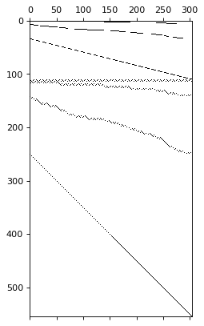
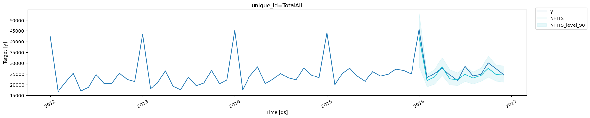

This notebook offers a step by step guide to create a hierarchical
forecasting pipeline.

In the pipeline we will use `NeuralForecast` and `HINT` class, to create
fit, predict and reconcile forecasts.

We will use the TourismL dataset that summarizes large Australian
national visitor survey.

Outline<br/> 1. Installing packages<br/> 2. Load hierarchical dataset<br/>
3. Fit and Predict HINT<br/> 4. Benchmark methods<br/> 5. Forecast
Evaluation

You can run these experiments using GPU with Google Colab.

<a href="https://colab.research.google.com/github/Nixtla/neuralforecast/blob/main/nbs/docs/tutorials/hierarchical_forecasting.ipynb" target="_parent"></a>

## 1. Installing packages

```python
%%capture
!pip install datasetsforecast hierarchicalforecast neuralforecast statsforecast
```

## 2. Load hierarchical dataset

This detailed Australian Tourism Dataset comes from the National Visitor
Survey, managed by the Tourism Research Australia, it is composed of 555
monthly series from 1998 to 2016, it is organized geographically, and
purpose of travel. The natural geographical hierarchy comprises seven
states, divided further in 27 zones and 76 regions. The purpose of
travel categories are holiday, visiting friends and relatives (VFR),
business and other. The MinT (Wickramasuriya et al., 2019), among other
hierarchical forecasting studies has used the dataset it in the past.
The dataset can be accessed in the [MinT reconciliation
webpage](https://robjhyndman.com/publications/mint/), although other
sources are available.

| Geographical Division | Number of series per division | Number of series per purpose | Total |
|------------------|------------------|------------------|------------------|
| Australia             | 1                             | 4                            | 5     |
| States                | 7                             | 28                           | 35    |
| Zones                 | 27                            | 108                          | 135   |
| Regions               | 76                            | 304                          | 380   |
| Total                 | 111                           | 444                          | 555   |

```python
import pandas as pd

from datasetsforecast.hierarchical import HierarchicalData
from hierarchicalforecast.utils import aggregate, HierarchicalPlot
from neuralforecast.utils import augment_calendar_df
from utilsforecast.plotting import plot_series
```


```python
# Load hierarchical dataset
Y_df, S_df, tags = HierarchicalData.load('./data', 'TourismLarge')
Y_df['ds'] = pd.to_datetime(Y_df['ds'])
Y_df, _ = augment_calendar_df(df=Y_df, freq='M')
S_df = S_df.reset_index(names="unique_id")
```

Mathematically a hierarchical multivariate time series can be denoted by
the vector $\mathbf{y}_{[a,b],t}$ defined by the following aggregation
constraint:

$$
\mathbf{y}_{[a,b],t}  = \mathbf{S}_{[a,b][b]} \mathbf{y}_{[b],t} \quad \Leftrightarrow \quad 
\begin{bmatrix}\mathbf{y}_{[a],t}
\\ %\hline
\mathbf{y}_{[b],t}\end{bmatrix} 
= \begin{bmatrix}
\mathbf{A}_{[a][b]}\\ %\hline
\mathbf{I}_{[b][b]}
\end{bmatrix}
\mathbf{y}_{[b],t}
$$

where $\mathbf{y}_{[a],t}$ are the aggregate series,
$\mathbf{y}_{[b],t}$ are the bottom level series and
$\mathbf{S}_{[a,b][b]}$ are the hierarchical aggregation constraints.

```python
# Here we plot the hierarchical constraints matrix
hplot = HierarchicalPlot(S=S_df, tags=tags)
hplot.plot_summing_matrix()
```



```python
plot_series(forecasts_df=Y_df[["unique_id", "ds", "y"]], ids=['TotalAll'])
```


## 3. Fit and Predict HINT

The Hierarchical Forecast Network (HINT) combines into an easy to use
model three components:<br/> 1. SoTA neural forecast model.<br/> 2. An
efficient and flexible multivariate probability distribution.<br/> 3.
Builtin reconciliation capabilities.<br/>

```python
import logging

import numpy as np

from neuralforecast import NeuralForecast
from neuralforecast.models import NHITS, HINT
from neuralforecast.losses.pytorch import GMM, sCRPS
```


```python
# Train test splits
horizon = 12
Y_test_df  = Y_df.groupby('unique_id', observed=True).tail(horizon)
Y_train_df = Y_df.drop(Y_test_df.index)
```


```python
# Horizon and quantiles
level = np.arange(0, 100, 2)
qs = [[50-lv/2, 50+lv/2] if lv!=0 else [50] for lv in level]
quantiles = np.sort(np.concatenate(qs)/100)

# HINT := BaseNetwork + Distribution + Reconciliation
nhits = NHITS(h=horizon,
              input_size=24,
              loss=GMM(n_components=10, quantiles=quantiles),
              hist_exog_list=['month'],
              max_steps=2000,
              early_stop_patience_steps=10,
              val_check_steps=50,
              scaler_type='robust',
              learning_rate=1e-3,
              valid_loss=sCRPS(quantiles=quantiles))

model = HINT(h=horizon, S=S_df.drop(columns='unique_id').values,
             model=nhits,  reconciliation='BottomUp')
```

``` text
INFO:lightning_fabric.utilities.seed:Seed set to 1
```

```python
logging.getLogger('pytorch_lightning').setLevel(logging.ERROR)
```


```python
%%capture
Y_df['y'] = Y_df['y'] * (Y_df['y'] > 0)
nf = NeuralForecast(models=[model], freq='MS')
nf.fit(df=Y_train_df, val_size=12)
Y_hat_df = nf.predict()

Y_hat_df = Y_hat_df.rename(columns=lambda x: x.replace('.0', ''))
```


```python
plot_series(
    Y_df,
    Y_hat_df.drop(columns='NHITS-median'),
    ids=['TotalAll'],
    level=[90],
    max_insample_length=12*5,
)
```



## 4. Benchmark methods

We compare against AutoARIMA, a well-established traditional forecasting
method from the [StatsForecast](../../../statsforecast/index) package,
for which we reconcile the forecasts using
[HierarchicalForecast](../../../hierarchicalforecast/index).

```python
from statsforecast import StatsForecast
from statsforecast.models import AutoARIMA
from hierarchicalforecast.methods import BottomUp, MinTrace
from hierarchicalforecast.core import HierarchicalReconciliation
```

We define the model, and create the forecasts.

```python
sf = StatsForecast(models=[AutoARIMA()], 
                     freq='MS', n_jobs=-1)
Y_hat_df_arima = sf.forecast(df=Y_train_df, 
                             h=12, 
                             fitted=True, 
                             X_df=Y_test_df.drop(columns="y"), 
                             level = np.arange(2, 100, 2))
Y_fitted_df_arima = sf.forecast_fitted_values()
```

Next, we reconcile the forecasts using `BottomUp` and `MinTrace`
reconciliation techniques:

```python
reconcilers = [
    BottomUp(),
    MinTrace(method='mint_shrink'),
]
hrec = HierarchicalReconciliation(reconcilers=reconcilers)
Y_rec_df = hrec.reconcile(Y_hat_df=Y_hat_df_arima, 
                          Y_df=Y_fitted_df_arima, 
                          S=S_df, 
                          tags=tags, 
                          level = np.arange(2, 100, 2), 
                          intervals_method="bootstrap")
```

## 5. Forecast Evaluation

To evaluate the coherent probabilistic predictions we use the scaled
Continuous Ranked Probability Score (sCRPS), defined as follows:

$$
\mathrm{CRPS}(\hat{F}_{[a,b],\tau},\mathbf{y}_{[a,b],\tau}) = 
    \frac{2}{N_{a}+N_{b}} \sum_{i} \int^{1}_{0} \mathrm{QL}(\hat{F}_{i,\tau}, y_{i,\tau})_{q} dq
$$

$$
\mathrm{sCRPS}(\hat{F}_{[a,b\,],\tau},\mathbf{y}_{[a,b\,],\tau}) = 
    \frac{\mathrm{CRPS}(\hat{F}_{[a,b\,],\tau},\mathbf{y}_{[a,b\,],\tau})}{\sum_{i} | y_{i,\tau} |}
$$

As you can see the HINT model (using NHITS as base model) efficiently
achieves state of the art accuracy under minimal tuning.

```python
from utilsforecast.losses import scaled_crps
from hierarchicalforecast.evaluation import evaluate
```


```python
df_metrics = Y_hat_df.merge(Y_test_df.drop(columns="month"), on=['unique_id', 'ds'])
df_metrics = df_metrics.merge(Y_rec_df, on=['unique_id', 'ds'])

metrics = evaluate(df = df_metrics,
                    tags = tags,
                    metrics = [scaled_crps],
                    models= ["NHITS", "AutoARIMA"],
                    level = np.arange(2, 100, 2),
                    train_df = Y_train_df.drop(columns="month"),
                    )

metrics
```

|     | level                             | metric      | NHITS    | AutoARIMA |
|-----|-----------------------------------|-------------|----------|-----------|
| 0   | Country                           | scaled_crps | 0.044431 | 0.131136  |
| 1   | Country/State                     | scaled_crps | 0.063411 | 0.147516  |
| 2   | Country/State/Zone                | scaled_crps | 0.106060 | 0.174071  |
| 3   | Country/State/Zone/Region         | scaled_crps | 0.151988 | 0.205654  |
| 4   | Country/Purpose                   | scaled_crps | 0.075821 | 0.133664  |
| 5   | Country/State/Purpose             | scaled_crps | 0.114674 | 0.181850  |
| 6   | Country/State/Zone/Purpose        | scaled_crps | 0.180491 | 0.244324  |
| 7   | Country/State/Zone/Region/Purpose | scaled_crps | 0.245466 | 0.310656  |
| 8   | Overall                           | scaled_crps | 0.122793 | 0.191109  |

## References

-   [Kin G. Olivares, David Luo, Cristian Challu, Stefania La Vattiata,
    Max Mergenthaler, Artur Dubrawski (2023). “HINT: Hierarchical
    Mixture Networks For Coherent Probabilistic Forecasting”.
    International Conference on Machine Learning (ICML). Workshop on
    Structured Probabilistic Inference & Generative Modeling. Available
    at
    https://arxiv.org/abs/2305.07089.](https://arxiv.org/abs/2305.07089)<br />
-   [Kin G. Olivares, O. Nganba Meetei, Ruijun Ma, Rohan Reddy, Mengfei
    Cao, Lee Dicker (2023).”Probabilistic Hierarchical Forecasting with
    Deep Poisson Mixtures”. International Journal Forecasting, accepted
    paper. URL
    https://arxiv.org/pdf/2110.13179.pdf.](https://arxiv.org/pdf/2110.13179.pdf)<br />
-   [Kin G. Olivares, Federico Garza, David Luo, Cristian Challu, Max
    Mergenthaler, Souhaib Ben Taieb, Shanika Wickramasuriya, and Artur
    Dubrawski (2023). “HierarchicalForecast: A reference framework for
    hierarchical forecasting”. Journal of Machine Learning Research,
    submitted. URL
    https://arxiv.org/abs/2207.03517](https://arxiv.org/abs/2207.03517)

