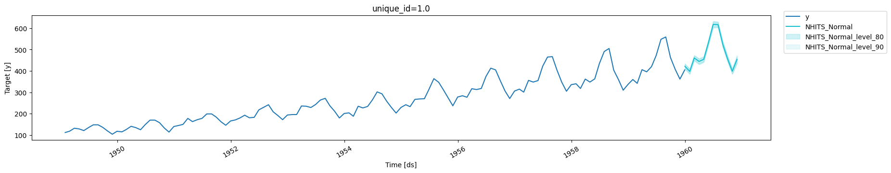
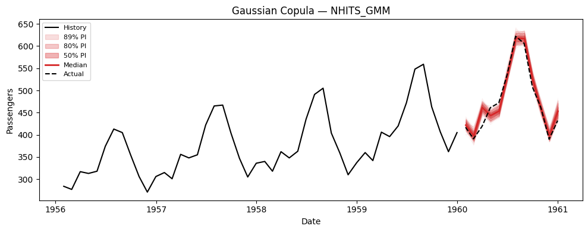
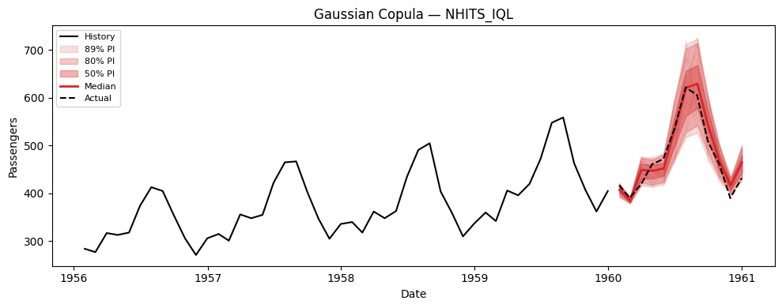
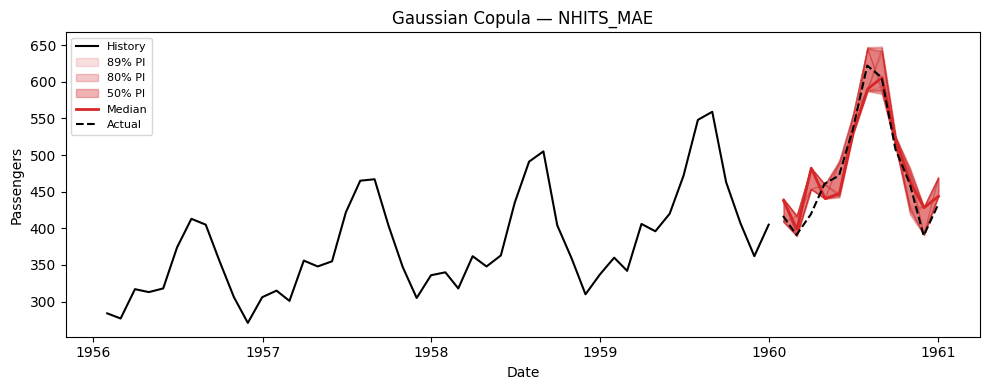
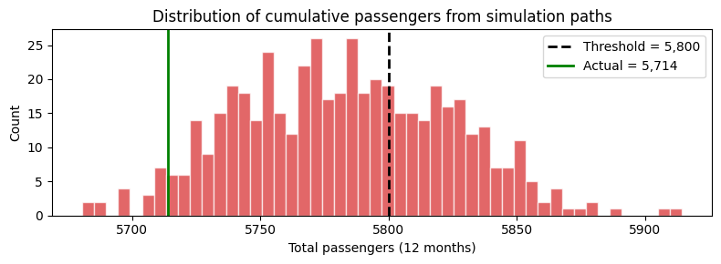
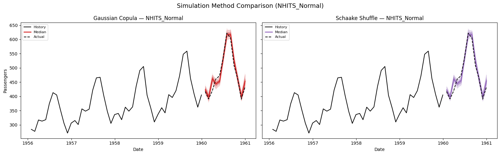

> Generate correlated sample paths for scenario analysis

## Simulation vs. Prediction Intervals: When to Use Which

NeuralForecast provides two complementary approaches for reasoning about
future uncertainty:

### Prediction Intervals (`predict(level=...)`)

Prediction intervals answer: **“What range of values is the target
likely to fall within at each future time step?”**

-   Output: Independent confidence bands per horizon step (e.g., 90%
    interval at step $h$).
-   Each step is treated marginally — no information about how steps
    relate to each other.
-   Best for: monitoring, alerting, dashboarding, reporting confidence
    bands.

### Simulation Paths (`simulate(...)`)

Simulation paths answer: **“What are realistic *joint* future
trajectories the time series could follow?”**

-   Output: $N$ complete trajectories of length $H$, each representing a
    plausible future.
-   Temporal correlations between steps are preserved — if step $h$ is
    high, step $h+1$ is likely high too.
-   Best for: scenario analysis, portfolio optimization, supply chain
    planning, energy dispatch, risk assessment (VaR/CVaR), stochastic
    programming.

### Key Difference: Marginal vs. Joint

Consider electricity price forecasting over 24 hours. A 90% prediction
interval tells you the price at hour 12 will likely be between \$40 and
\$80. But it says nothing about whether hours 11, 12, and 13 will *all*
be high simultaneously (a sustained price spike) or whether high and low
values alternate randomly.

Simulation paths capture this joint structure. From 500 simulated paths
you can compute: - **P(total cost \> budget)** — requires summing across
correlated hours - **P(at least 3 consecutive hours above \$70)** —
requires temporal ordering - **Expected shortfall (CVaR)** — requires
the joint tail distribution

These questions *cannot* be answered from marginal prediction intervals
alone.

## Available Simulation Methods

| Method                      | Temporal Correlation             | Description                                                                                                                                                  |
|--------------|------------------------------------|-----------------------|
| `gaussian_copula` (default) | AR(1) Gaussian copula            | Draws correlated uniform samples via Cholesky decomposition, maps through marginal CDFs. Parametric correlation structure.                                   |
| `schaake_shuffle`           | Empirical (historical templates) | Draws independent marginal samples, reorders them to match rank structure of historical trajectory templates. Nonparametric — captures arbitrary dependence. |

**Compatible losses**: - **`DistributionLoss`** (Normal, StudentT,
Poisson, etc.) and **mixture losses** (`GMM`, `PMM`, `NBMM`) — produce
arbitrary quantiles natively. - **`MQLoss`** / **`HuberMQLoss`** — uses
the model’s trained quantile grid. - **`IQLoss`** / **`HuberIQLoss`** —
evaluates multiple quantiles via repeated forward passes. - **Point
losses** (`MAE`, `MSE`, etc.) — requires `prediction_intervals`
(Conformal Prediction) set during `fit()` to build a quantile grid from
calibration scores.

## 1. Setup

```python
import logging
import warnings

import matplotlib.pyplot as plt
import numpy as np
import pandas as pd
import torch

warnings.filterwarnings("ignore")
logging.getLogger("pytorch_lightning").setLevel(logging.ERROR)
torch.set_float32_matmul_precision("high")
```

## 2. Load Data

We use the AirPassengers dataset — a classic monthly time series of
airline passenger counts.

```python
from neuralforecast.utils import AirPassengersDF

Y_df = AirPassengersDF.copy()
Y_train_df = Y_df[Y_df.ds <= "1959-12-31"]  # 132 months train
Y_test_df = Y_df[Y_df.ds > "1959-12-31"]    # 12 months test

print(f"Train: {len(Y_train_df)} rows, Test: {len(Y_test_df)} rows")
Y_train_df.tail()
```

``` text
2026-03-20 13:09:32,071 INFO util.py:154 -- Missing packages: ['ipywidgets']. Run `pip install -U ipywidgets`, then restart the notebook server for rich notebook output.
2026-03-20 13:09:32,151 INFO util.py:154 -- Missing packages: ['ipywidgets']. Run `pip install -U ipywidgets`, then restart the notebook server for rich notebook output.
```

``` text
Train: 132 rows, Test: 12 rows
```

|     | unique_id | ds         | y     |
|-----|-----------|------------|-------|
| 127 | 1.0       | 1959-08-31 | 559.0 |
| 128 | 1.0       | 1959-09-30 | 463.0 |
| 129 | 1.0       | 1959-10-31 | 407.0 |
| 130 | 1.0       | 1959-11-30 | 362.0 |
| 131 | 1.0       | 1959-12-31 | 405.0 |

## 3. Train Models

We train five models showcasing different loss types: - **NHITS + GMM**
— Gaussian Mixture Model, a mixture `DistributionLoss`. - **NHITS +
DistributionLoss(Normal)** — parametric distribution output. - **NHITS +
MQLoss** — Multi-Quantile Loss, directly optimizes quantile levels. -
**NHITS + IQLoss** — Implicit Quantile Loss, can evaluate any quantile
at inference. - **NHITS + MAE** with Conformal Prediction — point-loss
model with calibrated prediction intervals.

Since the MAE model needs conformal prediction intervals, we pass
`prediction_intervals` to `fit()`.

```python
from neuralforecast import NeuralForecast
from neuralforecast.losses.pytorch import GMM, MAE, MQLoss, DistributionLoss, IQLoss
from neuralforecast.models import NHITS
from neuralforecast.utils import PredictionIntervals

H = 12
MAX_STEPS = 100

models = [
    NHITS(h=H, input_size=36, max_steps=MAX_STEPS, loss=GMM(), alias="NHITS_GMM", scaler_type="robust"),
    NHITS(h=H, input_size=36, max_steps=MAX_STEPS, loss=DistributionLoss(distribution="Normal"), alias="NHITS_Normal", scaler_type="robust"),
    NHITS(h=H, input_size=36, max_steps=MAX_STEPS, loss=MQLoss(level=[80, 90]), alias="NHITS_MQ", scaler_type="robust"),
    NHITS(h=H, input_size=36, max_steps=MAX_STEPS, loss=IQLoss(), alias="NHITS_IQL", scaler_type="robust"),
    NHITS(h=H, input_size=36, max_steps=MAX_STEPS, loss=MAE(), alias="NHITS_MAE", scaler_type="robust"),
]

nf = NeuralForecast(models=models, freq="MS")
nf.fit(
    df=Y_train_df,
    prediction_intervals=PredictionIntervals(n_windows=2, method="conformal_error"),
)
```

## 4. Prediction Intervals (Baseline)

First, let’s see the standard prediction intervals — these are marginal
(per-step) uncertainty bands.

```python
from utilsforecast.plotting import plot_series

fcst_df = nf.predict(level=[80, 90])
```


```python
plot_series(Y_train_df, fcst_df, level=[80, 90], models=["NHITS_Normal"])
```



The shaded bands show the 80% and 90% prediction intervals. These are
useful for understanding per-step uncertainty, but they do not capture
the **temporal correlation** between forecast steps. Each band is
computed independently.

## 5. Simulation Paths

Now let’s generate correlated simulation paths using the `simulate()`
method. This returns a long-format DataFrame with columns
`[unique_id, ds, sample_id, model_1, model_2, ...]`.

### Plotting helper

```python
def extract_sims(sim_df, model_col, uid=None):
    """Extract simulation paths as a (n_paths, H) numpy array from simulate() output."""
    if uid is None:
        uid = sim_df["unique_id"].iloc[0]
    series = sim_df[sim_df["unique_id"] == uid]
    return series.pivot(index="sample_id", columns="ds", values=model_col).values


def plot_simulations(train_df, sims, model_name, title, color="steelblue", n_show=100):
    """Plot historical data with simulated future paths and derived prediction intervals."""
    fig, ax = plt.subplots(1, 1, figsize=(10, 4))
    
    # History (last 48 months)
    hist = train_df.sort_values("ds").tail(48)
    ax.plot(hist["ds"], hist["y"], color="black", linewidth=1.5, label="History")
    
    # Future dates
    last_date = hist["ds"].iloc[-1]
    future_dates = pd.date_range(start=last_date, periods=sims.shape[1] + 1, freq="MS")[1:]
    
    # Individual paths
    for i in range(min(n_show, sims.shape[0])):
        ax.plot(future_dates, sims[i], color=color, alpha=0.05, linewidth=0.5)
    
    # Derived prediction intervals from simulations
    for q_lo, q_hi, alpha in [(0.05, 0.95, 0.15), (0.10, 0.90, 0.25), (0.25, 0.75, 0.35)]:
        lo = np.quantile(sims, q_lo, axis=0)
        hi = np.quantile(sims, q_hi, axis=0)
        ax.fill_between(future_dates, lo, hi, color=color, alpha=alpha,
                        label=f"{int((q_hi - q_lo) * 100)}% PI")
    
    # Median
    median = np.median(sims, axis=0)
    ax.plot(future_dates, median, color=color, linewidth=2, label="Median")
    
    # Actual (if available)
    ax.plot(Y_test_df["ds"], Y_test_df["y"], color="black", linestyle="--", label="Actual")
    
    ax.set_title(f"{title} — {model_name}")
    ax.legend(loc="upper left", fontsize=8)
    ax.set_xlabel("Date")
    ax.set_ylabel("Passengers")
    plt.tight_layout()
    plt.show()
```

### Generate simulation paths

`simulate()` generates `n_paths` correlated sample paths for every model
× series combination.

```python
N_PATHS = 500
SEED = 42

sim_df = nf.simulate(n_paths=N_PATHS, seed=SEED)
```


```python
sim_df.head(10)
```

|     | unique_id | ds         | sample_id | NHITS_GMM  | NHITS_Normal | NHITS_MQ   | NHITS_IQL  | NHITS_MAE  |
|-----|-----------|------------|-----------|------------|--------------|------------|------------|------------|
| 0   | 1.0       | 1960-01-01 | 0         | 424.577554 | 424.765725   | 415.206802 | 409.314326 | 438.886536 |
| 1   | 1.0       | 1960-02-01 | 0         | 404.827416 | 404.260575   | 414.203812 | 388.755778 | 416.497602 |
| 2   | 1.0       | 1960-03-01 | 0         | 469.169496 | 469.978479   | 464.367880 | 466.584470 | 482.319912 |
| 3   | 1.0       | 1960-04-01 | 0         | 450.245044 | 451.145088   | 454.416200 | 462.261074 | 459.493987 |
| 4   | 1.0       | 1960-05-01 | 0         | 472.641135 | 471.130120   | 475.350769 | 486.486899 | 493.030374 |
| 5   | 1.0       | 1960-06-01 | 0         | 528.117486 | 527.280406   | 539.266724 | 497.874372 | 530.030655 |
| 6   | 1.0       | 1960-07-01 | 0         | 594.137207 | 592.315796   | 623.242188 | 507.372412 | 586.462607 |
| 7   | 1.0       | 1960-08-01 | 0         | 604.532895 | 604.907234   | 617.977478 | 531.723887 | 583.457802 |
| 8   | 1.0       | 1960-09-01 | 0         | 530.447128 | 529.882652   | 545.858492 | 566.198389 | 524.067964 |
| 9   | 1.0       | 1960-10-01 | 0         | 458.686895 | 458.105852   | 466.378017 | 466.831645 | 468.689723 |

### Visualize paths for each model

```python
# Extract (n_paths, H) arrays for plotting
model_cols = [c for c in sim_df.columns if c not in ("unique_id", "ds", "sample_id")]

for model_col in model_cols:
    sims = extract_sims(sim_df, model_col)
    print(f"{model_col}: simulation paths shape = {sims.shape}")
    plot_simulations(Y_train_df, sims, model_col, "Gaussian Copula", color="tab:red")
```

``` text
NHITS_GMM: simulation paths shape = (500, 12)
NHITS_Normal: simulation paths shape = (500, 12)
NHITS_MQ: simulation paths shape = (500, 12)
NHITS_IQL: simulation paths shape = (500, 12)
NHITS_MAE: simulation paths shape = (500, 12)
```








## 6. Using Simulation Paths for Decision-Making

The key advantage of simulation paths over prediction intervals is
answering **joint** probabilistic questions. Here are concrete examples.

### Example: Probability of exceeding a cumulative threshold

Suppose we have a capacity of 5,800 total passengers over the next 12
months. What is the probability of exceeding this capacity?

This question requires the **joint** distribution — it cannot be
answered from marginal intervals.

```python
THRESHOLD = 5800

# Use NHITS_GMM simulations
sims_gmm = extract_sims(sim_df, "NHITS_GMM")
cumulative_passengers = sims_gmm.sum(axis=1)  # Sum across H=12 months per path
prob_exceed = (cumulative_passengers > THRESHOLD).mean()

print(f"P(total passengers > {THRESHOLD:,}) = {prob_exceed:.1%}")
print(f"Expected total passengers = {cumulative_passengers.mean():,.0f}")
print(f"5th percentile = {np.quantile(cumulative_passengers, 0.05):,.0f}")
print(f"95th percentile = {np.quantile(cumulative_passengers, 0.95):,.0f}")

fig, ax = plt.subplots(figsize=(8, 3))
ax.hist(cumulative_passengers, bins=50, color="tab:red", alpha=0.7, edgecolor="white")
ax.axvline(THRESHOLD, color="black", linestyle="--", linewidth=2, label=f"Threshold = {THRESHOLD:,}")
ax.axvline(Y_test_df["y"].sum(), color="green", linestyle="-", linewidth=2, label=f"Actual = {Y_test_df['y'].sum():,.0f}")
ax.set_xlabel("Total passengers (12 months)")
ax.set_ylabel("Count")
ax.set_title("Distribution of cumulative passengers from simulation paths")
ax.legend()
plt.tight_layout()
plt.show()
```

``` text
P(total passengers > 5,800) = 35.4%
Expected total passengers = 5,783
5th percentile = 5,720
95th percentile = 5,851
```



## 7. Comparing Simulation Methods: Gaussian Copula vs. Schaake Shuffle

Both methods use the same marginal quantile forecasts but differ in how
they introduce temporal correlation across horizon steps. Let’s compare
them on the **NHITS_Normal** model.

```python
# Generate paths with both methods
sim_copula = nf.simulate(n_paths=N_PATHS, seed=SEED, method="gaussian_copula")
sim_schaake = nf.simulate(n_paths=N_PATHS, seed=SEED, method="schaake_shuffle")
```


```python

sims_copula = extract_sims(sim_copula, "NHITS_Normal")
sims_schaake = extract_sims(sim_schaake, "NHITS_Normal")

# Side-by-side path comparison
fig, axes = plt.subplots(1, 2, figsize=(16, 5), sharey=True)
hist = Y_train_df.sort_values("ds").tail(48)
last_date = hist["ds"].iloc[-1]
future_dates = pd.date_range(start=last_date, periods=H + 1, freq="MS")[1:]

for ax, sims, title, color in zip(
    axes,
    [sims_copula, sims_schaake],
    ["Gaussian Copula", "Schaake Shuffle"],
    ["tab:red", "tab:purple"],
):
    ax.plot(hist["ds"], hist["y"], color="black", linewidth=1.5, label="History")
    for i in range(min(100, sims.shape[0])):
        ax.plot(future_dates, sims[i], color=color, alpha=0.05, linewidth=0.5)
    for q_lo, q_hi, alpha in [(0.05, 0.95, 0.15), (0.25, 0.75, 0.30)]:
        lo = np.quantile(sims, q_lo, axis=0)
        hi = np.quantile(sims, q_hi, axis=0)
        ax.fill_between(future_dates, lo, hi, color=color, alpha=alpha)
    median = np.median(sims, axis=0)
    ax.plot(future_dates, median, color=color, linewidth=2, label="Median")
    ax.plot(Y_test_df["ds"], Y_test_df["y"], color="black", linestyle="--", label="Actual")
    ax.set_title(f"{title} — NHITS_Normal")
    ax.set_xlabel("Date")
    ax.legend(loc="upper left", fontsize=8)

axes[0].set_ylabel("Passengers")
plt.suptitle("Simulation Method Comparison (NHITS_Normal)", fontsize=14)
plt.tight_layout()
plt.show()
```



## 8. Evaluating Marginal vs. Joint Distributions

We can evaluate both the **marginal** distribution (from
`predict(quantiles=...)`) and the **joint** distribution (from
`simulate()`) using the same metrics. For each model we compare:

-   **Point metrics**: MAE, MSE on the median forecast.
-   **Probabilistic metric**: scaled CRPS on the quantile forecasts —
    either from `predict` (marginal) or derived from simulation paths
    (joint).

If the simulation paths are well-calibrated, their empirical quantiles
should score comparably to the model’s native marginal quantiles.

```python
from utilsforecast.evaluation import evaluate
from utilsforecast.losses import mae, mse, scaled_crps

# ── Quantile grid for evaluation ──
eval_quantiles = np.round(np.arange(0.1, 1.0, 0.1), 2).tolist()  # [0.1, 0.2, ..., 0.9]

# We'll evaluate NHITS_Normal only for clarity
MODEL = "NHITS_Normal"

# ── 1. Marginal quantiles from predict() ──
marginal_df = nf.predict(quantiles=eval_quantiles)
# Add actuals — align by position (predict uses freq="MS" dates, test data has month-end dates)
marginal_df = marginal_df.sort_values(["unique_id", "ds"]).reset_index(drop=True)
marginal_df["y"] = Y_test_df.sort_values(["unique_id", "ds"])["y"].values

# ── 2. Joint quantiles derived from simulation paths (gaussian_copula) ──
sims_gc = extract_sims(sim_copula, MODEL)  # (n_paths, H)

joint_gc_df = marginal_df[["unique_id", "ds", "y"]].copy()
for q in eval_quantiles:
    joint_gc_df[f"{MODEL}_ql{q}"] = np.quantile(sims_gc, q, axis=0)
joint_gc_df[MODEL] = np.median(sims_gc, axis=0)

# ── 3. Joint quantiles derived from simulation paths (schaake_shuffle) ──
sims_ss = extract_sims(sim_schaake, MODEL)  # (n_paths, H)

joint_ss_df = marginal_df[["unique_id", "ds", "y"]].copy()
for q in eval_quantiles:
    joint_ss_df[f"{MODEL}_ql{q}"] = np.quantile(sims_ss, q, axis=0)
joint_ss_df[MODEL] = np.median(sims_ss, axis=0)
```


```python
# ── Evaluate point metrics (via evaluate) ──
point_marginal = evaluate(marginal_df, metrics=[mae, mse], models=[MODEL], agg_fn="mean")
point_gc = evaluate(joint_gc_df, metrics=[mae, mse], models=[MODEL], agg_fn="mean")
point_ss = evaluate(joint_ss_df, metrics=[mae, mse], models=[MODEL], agg_fn="mean")

# ── Evaluate scaled CRPS (called directly — evaluate expects level-style columns) ──
quantile_cols = {MODEL: [f"{MODEL}_ql{q}" for q in eval_quantiles]}
quantiles_arr = np.array(eval_quantiles)

crps_marginal = scaled_crps(marginal_df, models=quantile_cols, quantiles=quantiles_arr)
crps_gc = scaled_crps(joint_gc_df, models=quantile_cols, quantiles=quantiles_arr)
crps_ss = scaled_crps(joint_ss_df, models=quantile_cols, quantiles=quantiles_arr)

# ── Combine results ──
results = pd.DataFrame({
    "Metric": ["MAE", "MSE", "Scaled CRPS"],
    "Marginal (predict)": [
        point_marginal[MODEL].values[0],
        point_marginal[MODEL].values[1],
        crps_marginal[MODEL].mean(),
    ],
    "Joint — Gaussian Copula": [
        point_gc[MODEL].values[0],
        point_gc[MODEL].values[1],
        crps_gc[MODEL].mean(),
    ],
    "Joint — Schaake Shuffle": [
        point_ss[MODEL].values[0],
        point_ss[MODEL].values[1],
        crps_ss[MODEL].mean(),
    ],
}).set_index("Metric")

print(f"Model: {MODEL}")
results
```

``` text
Model: NHITS_Normal
```

|             | Marginal (predict) | Joint — Gaussian Copula | Joint — Schaake Shuffle |
|-------------|--------------------|-------------------------|-------------------------|
| Metric      |                    |                         |                         |
| MAE         | 12.669571          | 12.942172               | 12.516764               |
| MSE         | 276.954919         | 288.357154              | 275.652889              |
| Scaled CRPS | 0.021440           | 0.022133                | 0.021545                |

**Interpreting the results:**

-   **MAE / MSE** (point metrics): Both simulation methods use the
    median of the sample paths as their point forecast. Since the
    marginal quantiles and simulation-derived quantiles share the same
    underlying model, the median forecasts are similar but not identical
    — simulation introduces sampling variability.
-   **Scaled CRPS** (probabilistic metric): Measures the quality of the
    full quantile distribution. The marginal quantiles come directly
    from the model’s predictive distribution, while the
    simulation-derived quantiles are empirical (computed from `n_paths`
    samples). With enough paths, the simulation CRPS should converge to
    the marginal CRPS.

## 9. Summary

| Question                                        | Use                                         |
|------------------------------------------------|-------------------------|
| “What range is step $h$ likely in?”             | `predict(level=...)` — prediction intervals |
| “What are realistic joint future trajectories?” | `simulate(n_paths=...)` — sample paths      |
| “What is P(total \> threshold)?”                | `simulate()` then sum paths                 |
| “What is P(3 consecutive spikes)?”              | `simulate()` then check path patterns       |
| “What is the CVaR of my portfolio?”             | `simulate()` then compute tail statistics   |

### Simulation Methods

| Method                      | Use when…                                                                                                        |
|----------------------------|--------------------------------------------|
| `gaussian_copula` (default) | You want smooth, parametric temporal correlation (AR(1) structure). Fast and robust.                             |
| `schaake_shuffle`           | You want nonparametric dependence from historical data. Captures asymmetric / non-Gaussian correlation patterns. |

### Compatible Losses

| Loss type                                | How quantiles are obtained                                                      |
|---------------------|---------------------------------------------------|
| `DistributionLoss`, `GMM`, `PMM`, `NBMM` | Arbitrary quantiles from parametric distribution                                |
| `MQLoss` / `HuberMQLoss`                 | Uses the model’s trained quantile grid                                          |
| `IQLoss` / `HuberIQLoss`                 | Multiple forward passes, one per quantile                                       |
| Point losses (`MAE`, `MSE`, etc.)        | Conformal Prediction intervals (requires `prediction_intervals` during `fit()`) |

### References

-   Baron, E. et al. (2025). [Efficiently generating correlated sample
    paths from multi-step time series foundation
    models](https://arxiv.org/abs/2510.02224). NeurIPS 2025 Workshop.
-   Clark, M. et al. (2004). The Schaake shuffle: A method for
    reconstructing space-time variability. *Journal of
    Hydrometeorology*, 5(1).

