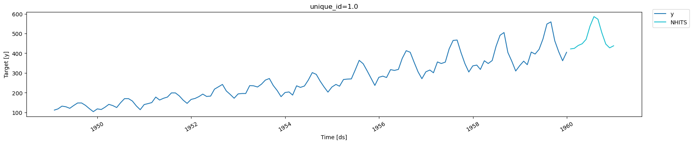

> Explore transfer learning for time series forecasting

Transfer learning refers to the process of pre-training a flexible model
on a large dataset and using it later on other data with little to no
training. It is one of the most outstanding 🚀 achievements in Machine
Learning 🧠 and has many practical applications.

For time series forecasting, the technique allows you to get
lightning-fast predictions ⚡ bypassing the tradeoff between accuracy
and speed (more than 30 times faster than our already fast
[autoARIMA](https://github.com/Nixtla/statsforecast) for a similar
accuracy).

This notebook shows how to generate a pre-trained model and store it in
a checkpoint to make it available to forecast new time series never seen
by the model.

Table of Contents<br/> 1. Installing NeuralForecast/DatasetsForecast<br/>
2. Load M4 Data<br/> 3. Instantiate NeuralForecast core, Fit, and
save<br/> 4. Load pre-trained model and predict on AirPassengers<br/> 5.
Evaluate Results<br/>

You can run these experiments using GPU with Google Colab.

<a href="https://colab.research.google.com/github/Nixtla/neuralforecast/blob/main/nbs/docs/tutorials/transfer_learning.ipynb" target="_parent"></a>

## 1. Installing Libraries

```python
%%capture
!pip install datasetsforecast neuralforecast
```


```python
import logging

import numpy as np
import pandas as pd
import torch
from datasetsforecast.m4 import M4
from neuralforecast.core import NeuralForecast
from neuralforecast.models import NHITS
from neuralforecast.utils import AirPassengersDF
from utilsforecast.losses import mae
from utilsforecast.plotting import plot_series
```


```python
logging.getLogger("pytorch_lightning").setLevel(logging.WARNING)
```

This example will automatically run on GPUs if available. **Make sure**
cuda is available. (If you need help to put this into production send us
an email or join our community, we also offer a fully hosted solution)

```python
torch.cuda.is_available()
```

``` text
True
```

## 2. Load M4 Data

The `M4` class will automatically download the complete M4 dataset and
process it.

It return three Dataframes: `Y_df` contains the values for the target
variables, `X_df` contains exogenous calendar features and `S_df`
contains static features for each time-series (none for M4). For this
example we will only use `Y_df`.

If you want to use your own data just replace `Y_df`. Be sure to use a
long format and have a similar structure to our data set.

```python
Y_df, _, _ = M4.load(directory='./', group='Monthly', cache=True)
Y_df['ds'] = pd.to_datetime(Y_df['ds'])
Y_df
```

|          | unique_id | ds                            | y      |
|----------|-----------|-------------------------------|--------|
| 0        | M1        | 1970-01-01 00:00:00.000000001 | 8000.0 |
| 1        | M1        | 1970-01-01 00:00:00.000000002 | 8350.0 |
| 2        | M1        | 1970-01-01 00:00:00.000000003 | 8570.0 |
| 3        | M1        | 1970-01-01 00:00:00.000000004 | 7700.0 |
| 4        | M1        | 1970-01-01 00:00:00.000000005 | 7080.0 |
| ...      | ...       | ...                           | ...    |
| 11246406 | M9999     | 1970-01-01 00:00:00.000000083 | 4200.0 |
| 11246407 | M9999     | 1970-01-01 00:00:00.000000084 | 4300.0 |
| 11246408 | M9999     | 1970-01-01 00:00:00.000000085 | 3800.0 |
| 11246409 | M9999     | 1970-01-01 00:00:00.000000086 | 4400.0 |
| 11246410 | M9999     | 1970-01-01 00:00:00.000000087 | 4300.0 |

## 3. Model Train and Save

Using the `NeuralForecast.fit` method you can train a set of models to
your dataset. You just have to define the `input_size` and `horizon` of
your model. The `input_size` is the number of historic observations
(lags) that the model will use to learn to predict `h` steps in the
future. Also, you can modify the hyperparameters of the model to get a
better accuracy.

```python
horizon = 12
stacks = 3
models = [NHITS(input_size=5 * horizon,
                h=horizon,
                max_steps=100,
                stack_types = stacks*['identity'],
                n_blocks = stacks*[1],
                mlp_units = [[256,256] for _ in range(stacks)],
                n_pool_kernel_size = stacks*[1],
                batch_size = 32,
                scaler_type='standard',
                n_freq_downsample=[12,4,1],
                enable_progress_bar=False,
                interpolation_mode="nearest",
               )]
nf = NeuralForecast(models=models, freq='ME')
nf.fit(df=Y_df)
```

``` text
INFO:lightning_fabric.utilities.seed:Seed set to 1
```

Save model with `core.NeuralForecast.save` method. This method uses
PytorchLightning `save_checkpoint` function. We set `save_dataset=False`
to only save the model.

```python
nf.save(path='./results/transfer/', model_index=None, overwrite=True, save_dataset=False)
```

## 4. Transfer M4 to AirPassengers

We load the stored model with the `core.NeuralForecast.load` method, and
forecast `AirPassenger` with the `core.NeuralForecast.predict` function.

```python
fcst2 = NeuralForecast.load(path='./results/transfer/')
```

``` text
c:\Nixtla\Repositories\neuralforecast\neuralforecast\common\_base_model.py:133: UserWarning: NHITS is a univariate model. Parameter n_series is ignored.
  warnings.warn(
INFO:lightning_fabric.utilities.seed:Seed set to 1
```

```python
# We define the train df. 
Y_df = AirPassengersDF.copy()
mean = Y_df[Y_df.ds<='1959-12-31']['y'].mean()
std = Y_df[Y_df.ds<='1959-12-31']['y'].std()

Y_train_df = Y_df[Y_df.ds<='1959-12-31'] # 132 train
Y_test_df = Y_df[Y_df.ds>'1959-12-31']   # 12 test
```


```python
Y_hat_df = fcst2.predict(df=Y_train_df)
Y_hat_df.head()
```

|     | unique_id | ds         | NHITS      |
|-----|-----------|------------|------------|
| 0   | 1.0       | 1960-01-31 | 422.038757 |
| 1   | 1.0       | 1960-02-29 | 424.678040 |
| 2   | 1.0       | 1960-03-31 | 439.538879 |
| 3   | 1.0       | 1960-04-30 | 447.967072 |
| 4   | 1.0       | 1960-05-31 | 470.603333 |

```python
plot_series(Y_train_df, Y_hat_df)
```



## 5. Evaluate Results

We evaluate the forecasts of the pre-trained model with the Mean
Absolute Error (`mae`).

$$
\qquad MAE = \frac{1}{Horizon} \sum_{\tau} |y_{\tau} - \hat{y}_{\tau}|\qquad
$$

```python
fcst_mae = mae(Y_test_df.merge(Y_hat_df), models=['NHITS'])['NHITS'].item()
print(f'NHITS     MAE: {fcst_mae:.3f}')
print('ETS       MAE: 16.222')
print('AutoARIMA MAE: 18.551')
```

``` text
NHITS     MAE: 17.245
ETS       MAE: 16.222
AutoARIMA MAE: 18.551
```

