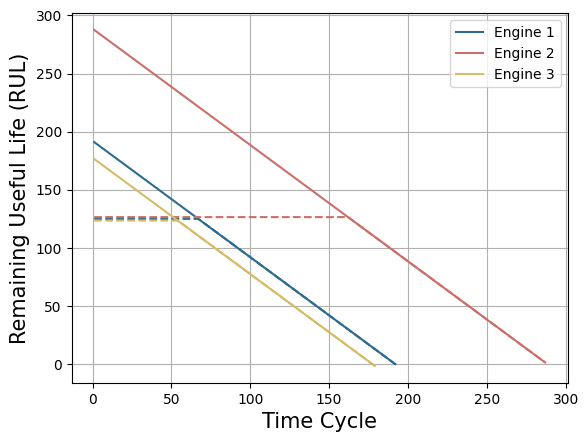
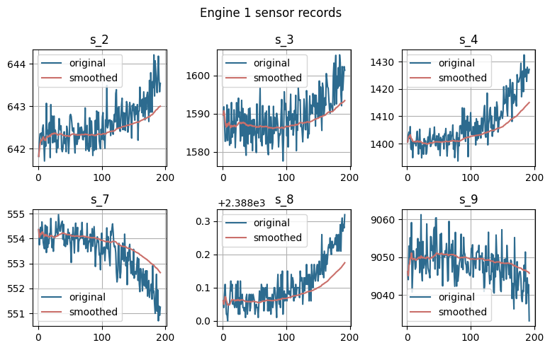
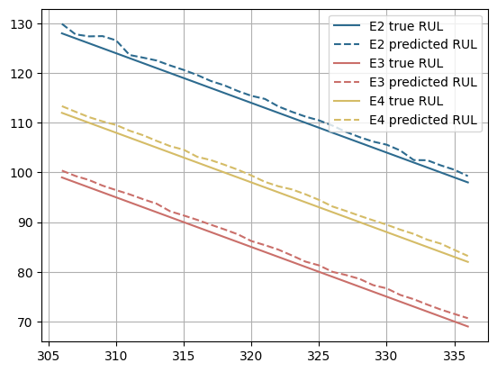

Predictive maintenance (PdM) is a data-driven preventive maintanance
program. It is a proactive maintenance strategy that uses sensors to
monitor the performance and equipment conditions during operation. The
PdM methods constantly analyze the data to predict when optimal
maintenance schedules. It can reduce maintenance costs and prevent
catastrophic equipment failure when used correctly.

In this notebook, we will apply NeuralForecast to perform a supervised
Remaining Useful Life (RUL) estimation on the classic PHM2008 aircraft
degradation dataset.

Outline<br/> 1. Installing Packages<br/> 2. Load PHM2008 aircraft
degradation dataset<br/> 3. Fit and Predict NeuralForecast<br/> 4.
Evaluate Predictions

You can run these experiments using GPU with Google Colab.

<a href="https://colab.research.google.com/github/Nixtla/neuralforecast/blob/main/nbs/docs/use-cases/predictive_maintenance.ipynb" target="_parent"></a>

## 1. Installing Packages

```python
%%capture
!pip install neuralforecast datasetsforecast
```


```python
import logging
import numpy as np
import pandas as pd

import matplotlib.pyplot as plt

from neuralforecast.models import NBEATSx
from neuralforecast import NeuralForecast
from neuralforecast.losses.pytorch import HuberLoss

from datasetsforecast.phm2008 import PHM2008
```

``` text
/Users/marcopeix/dev/neuralforecast/.venv/lib/python3.12/site-packages/tqdm/auto.py:21: TqdmWarning: IProgress not found. Please update jupyter and ipywidgets. See https://ipywidgets.readthedocs.io/en/stable/user_install.html
  from .autonotebook import tqdm as notebook_tqdm
2026-04-02 15:43:47,243 INFO util.py:154 -- Missing packages: ['ipywidgets']. Run `pip install -U ipywidgets`, then restart the notebook server for rich notebook output.
2026-04-02 15:43:47,362 INFO util.py:154 -- Missing packages: ['ipywidgets']. Run `pip install -U ipywidgets`, then restart the notebook server for rich notebook output.
```

```python
logging.getLogger("pytorch_lightning").setLevel(logging.ERROR)
```

## 2. Load PHM2008 aircraft degradation dataset

Here we will load the Prognosis and Health Management 2008 challenge
dataset. This dataset used the Commercial Modular Aero-Propulsion System
Simulation to recreate the degradation process of turbofan engines for
different aircraft with varying wear and manufacturing starting under
normal conditions. The training dataset consists of complete
run-to-failure simulations, while the test dataset comprises sequences
before failure.


```python
Y_train_df, Y_test_df = PHM2008.load(directory='./data', group='FD001', clip_rul=False)
Y_train_df.head()
```

|     | unique_id | ds  | s_2    | s_3     | s_4     | s_7    | s_8     | s_9     | s_11  | s_12   | s_13    | s_14    | s_15   | s_17 | s_20  | s_21    | y   |
|-----|-----------|-----|--------|---------|---------|--------|---------|---------|-------|--------|---------|---------|--------|------|-------|---------|-----|
| 0   | 1         | 1   | 641.82 | 1589.70 | 1400.60 | 554.36 | 2388.06 | 9046.19 | 47.47 | 521.66 | 2388.02 | 8138.62 | 8.4195 | 392  | 39.06 | 23.4190 | 191 |
| 1   | 1         | 2   | 642.15 | 1591.82 | 1403.14 | 553.75 | 2388.04 | 9044.07 | 47.49 | 522.28 | 2388.07 | 8131.49 | 8.4318 | 392  | 39.00 | 23.4236 | 190 |
| 2   | 1         | 3   | 642.35 | 1587.99 | 1404.20 | 554.26 | 2388.08 | 9052.94 | 47.27 | 522.42 | 2388.03 | 8133.23 | 8.4178 | 390  | 38.95 | 23.3442 | 189 |
| 3   | 1         | 4   | 642.35 | 1582.79 | 1401.87 | 554.45 | 2388.11 | 9049.48 | 47.13 | 522.86 | 2388.08 | 8133.83 | 8.3682 | 392  | 38.88 | 23.3739 | 188 |
| 4   | 1         | 5   | 642.37 | 1582.85 | 1406.22 | 554.00 | 2388.06 | 9055.15 | 47.28 | 522.19 | 2388.04 | 8133.80 | 8.4294 | 393  | 38.90 | 23.4044 | 187 |

```python
plot_df1 = Y_train_df[Y_train_df['unique_id']==1]
plot_df2 = Y_train_df[Y_train_df['unique_id']==2]
plot_df3 = Y_train_df[Y_train_df['unique_id']==3]

plt.plot(plot_df1.ds, np.minimum(plot_df1.y, 125), color='#2D6B8F', linestyle='--')
plt.plot(plot_df1.ds, plot_df1.y, color='#2D6B8F', label='Engine 1')

plt.plot(plot_df2.ds, np.minimum(plot_df2.y, 125)+1.5, color='#CA6F6A', linestyle='--')
plt.plot(plot_df2.ds, plot_df2.y+1.5, color='#CA6F6A', label='Engine 2')

plt.plot(plot_df3.ds, np.minimum(plot_df3.y, 125)-1.5, color='#D5BC67', linestyle='--')
plt.plot(plot_df3.ds, plot_df3.y-1.5, color='#D5BC67', label='Engine 3')

plt.ylabel('Remaining Useful Life (RUL)', fontsize=15)
plt.xlabel('Time Cycle', fontsize=15)
plt.legend()
plt.grid()
```



```python
def smooth(s, b = 0.98):
    v = np.zeros(len(s)+1) #v_0 is already 0.
    bc = np.zeros(len(s)+1)
    for i in range(1, len(v)): #v_t = 0.95
        v[i] = (b * v[i-1] + (1-b) * s[i-1]) 
        bc[i] = 1 - b**i
    sm = v[1:] / bc[1:]
    return sm

unique_id = 1
plot_df = Y_train_df[Y_train_df.unique_id == unique_id].copy()

fig, axes = plt.subplots(2,3, figsize = (8,5))
fig.tight_layout()

j = -1
#, 's_11', 's_12', 's_13', 's_14', 's_15', 's_17', 's_20', 's_21'
for feature in ['s_2', 's_3', 's_4', 's_7', 's_8', 's_9']:
    if ('s' in feature) and ('smoothed' not in feature):
        j += 1
        axes[j // 3, j % 3].plot(plot_df.ds, plot_df[feature], 
                                 c = '#2D6B8F', label = 'original')
        axes[j // 3, j % 3].plot(plot_df.ds, smooth(plot_df[feature].values), 
                                 c = '#CA6F6A', label = 'smoothed')
        #axes[j // 3, j % 3].plot([10,10],[0,1], c = 'black')
        axes[j // 3, j % 3].set_title(feature)
        axes[j // 3, j % 3].grid()
        axes[j // 3, j % 3].legend()
        
plt.suptitle(f'Engine {unique_id} sensor records')
plt.tight_layout()
```



## 3. Fit and Predict NeuralForecast

NeuralForecast methods are capable of addressing regression problems
involving various variables. The regression problem involves predicting
the target variable $y_{t+h}$ based on its lags $y_{:t}$, temporal
exogenous features $x^{(h)}_{:t}$, exogenous features available at the
time of prediction $x^{(f)}_{:t+h}$, and static features $x^{(s)}$.

The task of estimating the remaining useful life (RUL) simplifies the
problem to a single horizon prediction $h=1$, where the objective is to
predict $y_{t+1}$ based on the exogenous features $x^{(f)}_{:t+1}$ and
static features $x^{(s)}$. In the RUL estimation task, the exogenous
features typically correspond to sensor monitoring information, while
the target variable represents the RUL itself.

$$P(y_{t+1}\;|\;x^{(f)}_{:t+1},x^{(s)})$$

```python
max_ds = Y_train_df.groupby('unique_id')["ds"].max()
Y_test_df = Y_test_df.merge(max_ds, on='unique_id', how='left', suffixes=('', '_train_max_date'))
Y_test_df["ds"] = Y_test_df["ds"] + Y_test_df["ds_train_max_date"]
Y_test_df = Y_test_df.drop(columns=["ds_train_max_date"])
```


```python
Y_df = pd.concat([Y_train_df, Y_test_df], ignore_index=True)
```


```python
%%capture
futr_exog_list =['s_2', 's_3', 's_4', 's_7', 's_8', 's_9', 's_11',
                 's_12', 's_13', 's_14', 's_15', 's_17', 's_20', 's_21']

model = NBEATSx(h=1, input_size=24,
                loss=HuberLoss(),
                scaler_type='robust',
                stack_types=['identity', 'identity', 'identity'],
                dropout_prob_theta=0.5,
                futr_exog_list=futr_exog_list,
                exclude_insample_y=True,
                max_steps=1000)
nf = NeuralForecast(models=[model], freq=1)

Y_hat_cv_df = nf.cross_validation(df=Y_df, n_windows=31)
```

``` text
Seed set to 1
```

## 4. Evaluate Predictions

In the original PHM2008 dataset the true RUL values for the test set are
only provided for the last time cycle of each enginge. We will filter
the predictions to only evaluate the last time cycle.

$$RMSE(\mathbf{y}_{T},\hat{\mathbf{y}}_{T}) = \sqrt{\frac{1}{|\mathcal{D}_{test}|} \sum_{i} (y_{i,T}-\hat{y}_{i,T})^{2}}$$

```python
from utilsforecast.evaluation import evaluate
from utilsforecast.losses import rmse
```


```python
Y_hat_last = Y_hat_cv_df.loc[Y_hat_cv_df.groupby('unique_id')['ds'].idxmax()]

metrics = evaluate(
    Y_hat_last.drop(columns=["cutoff"]),
    metrics=[rmse],
    agg_fn='mean'
)
metrics
```

|     | metric | NBEATSx  |
|-----|--------|----------|
| 0   | rmse   | 0.363993 |

Alternatively, we can also evaluate over multiple windows to have a more
representative metric of the performance.

```python
metrics = evaluate(
    Y_hat_cv_df.drop(columns=["cutoff"]),
    metrics=[rmse],
    agg_fn='mean'
)
metrics
```

|     | metric | NBEATSx  |
|-----|--------|----------|
| 0   | rmse   | 1.323458 |

Finally, we can plot the true value and predicted value of the model
across many cross-validation windows.

```python
model_name = "NBEATSx"
plot_df1 = Y_hat_cv_df[Y_hat_cv_df['unique_id']==2]
plot_df2 = Y_hat_cv_df[Y_hat_cv_df['unique_id']==3]
plot_df3 = Y_hat_cv_df[Y_hat_cv_df['unique_id']==4]

plt.plot(plot_df1.ds, plot_df1['y'], c='#2D6B8F', label='E2 true RUL')
plt.plot(plot_df1.ds, plot_df1[model_name]+1, c='#2D6B8F', linestyle='--', label='E2 predicted RUL')

plt.plot(plot_df1.ds, plot_df2['y'], c='#CA6F6A', label='E3 true RUL')
plt.plot(plot_df1.ds, plot_df2[model_name]+1, c='#CA6F6A', linestyle='--', label='E3 predicted RUL')

plt.plot(plot_df1.ds, plot_df3['y'], c='#D5BC67', label='E4 true RUL')
plt.plot(plot_df1.ds, plot_df3[model_name]+1, c='#D5BC67', linestyle='--', label='E4 predicted RUL')

plt.legend()
plt.grid()
```



## References

-   [R. Keith Mobley (2002). “An Introduction to Predictive
    Maintenance”](https://www.irantpm.ir/wp-content/uploads/2008/02/an-introduction-to-predictive-maintenance.pdf)<br/>
-   [Saxena, A., Goebel, K., Simon, D.,&Eklund, N. (2008). “Damage
    propagation modeling for aircraft engine run-to-failure simulation”.
    International conference on prognostics and health
    management.](https://ntrs.nasa.gov/api/citations/20090029214/downloads/20090029214.pdf)

