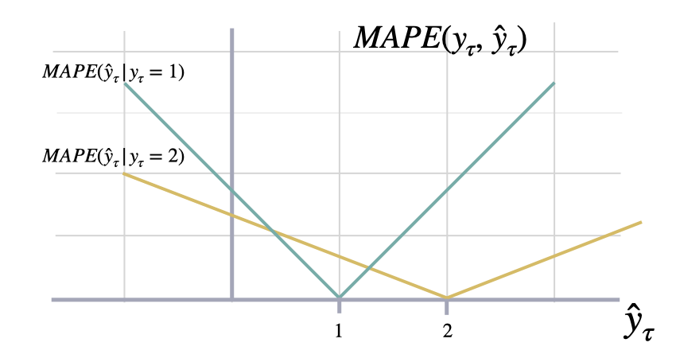
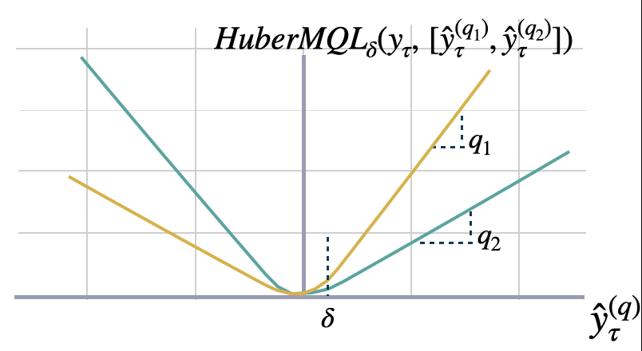

The most important train signal is the forecast error, which is the
difference between the observed value $y_{\tau}$ and the prediction
$\hat{y}_{\tau}$, at time $y_{\tau}$:

$$e_{\tau} = y_{\tau}-\hat{y}_{\tau} \qquad \qquad \tau \in \{t+1,\dots,t+H \}$$

The train loss summarizes the forecast errors in different train
optimization objectives.

All the losses are `torch.nn.modules` which helps to automatically moved
them across CPU/GPU/TPU devices with Pytorch Lightning.

### `BasePointLoss`

```python
BasePointLoss(
    horizon_weight=None, outputsize_multiplier=None, output_names=None
)
```

Bases: <code>[Module](#torch.nn.Module)</code>

Base class for point loss functions.

**Parameters:**

Name | Type | Description | Default
---- | ---- | ----------- | -------
`horizon_weight` | <code>[Optional](#typing.Optional)\[[Tensor](#torch.Tensor)\]</code> | Tensor of size h, weight for each timestamp of the forecasting window. Defaults to None. | <code>None</code>
`outputsize_multiplier` | <code>[Optional](#typing.Optional)\[[int](#int)\]</code> | Multiplier for the output size. Defaults to None. | <code>None</code>
`output_names` | <code>[Optional](#typing.Optional)\[[List](#typing.List)\[[str](#str)\]\]</code> | Names of the outputs. Defaults to None. | <code>None</code>

# 1. Scale-dependent Errors

These metrics are on the same scale as the data.

## Mean Absolute Error (MAE)

### `MAE`

```python
MAE(horizon_weight=None)
```

Bases: <code>[BasePointLoss](#neuralforecast.losses.pytorch.BasePointLoss)</code>

Mean Absolute Error.

Calculates Mean Absolute Error between `y` and `y_hat`. MAE measures the relative prediction
accuracy of a forecasting method by calculating the deviation of the prediction and the true
value at a given time and averages these devations over the length of the series.

```math
\mathrm{MAE}(\mathbf{y}_{\tau}, \mathbf{\hat{y}}_{\tau}) = \frac{1}{H} \sum^{t+H}_{\tau=t+1} |y_{\tau} - \hat{y}_{\tau}|
```

**Parameters:**

Name | Type | Description | Default
---- | ---- | ----------- | -------
`horizon_weight` | <code>[Optional](#typing.Optional)\[[Tensor](#torch.Tensor)\]</code> | Tensor of size h, weight for each timestamp of the forecasting window. Defaults to None. | <code>None</code>

#### `MAE.__call__`

```python
__call__(y, y_hat, mask=None, y_insample=None)
```

Calculate Mean Absolute Error between actual and predicted values.

**Parameters:**

Name | Type | Description | Default
---- | ---- | ----------- | -------
`y` | <code>[Tensor](#torch.Tensor)</code> | Actual values. | *required*
`y_hat` | <code>[Tensor](#torch.Tensor)</code> | Predicted values. | *required*
`mask` | <code>[Union](#typing.Union)\[[Tensor](#torch.Tensor), None\]</code> | Specifies datapoints to consider in loss. Defaults to None. | <code>None</code>
`y_insample` | <code>[Union](#typing.Union)\[[Tensor](#torch.Tensor), None\]</code> | Actual insample values. Defaults to None. | <code>None</code>

**Returns:**

Type | Description
---- | -----------
<code>[Tensor](#torch.Tensor)</code> | torch.Tensor: MAE (single value).


## Mean Squared Error (MSE)

### `MSE`

```python
MSE(horizon_weight=None)
```

Bases: <code>[BasePointLoss](#neuralforecast.losses.pytorch.BasePointLoss)</code>

Mean Squared Error.

Calculates Mean Squared Error between `y` and `y_hat`. MSE measures the relative prediction
accuracy of a forecasting method by calculating the squared deviation of the prediction and the true
value at a given time, and averages these devations over the length of the series.

```math
\mathrm{MSE}(\mathbf{y}_{\tau}, \mathbf{\hat{y}}_{\tau}) = \frac{1}{H} \sum^{t+H}_{\tau=t+1} (y_{\tau} - \hat{y}_{\tau})^{2} 
```

**Parameters:**

Name | Type | Description | Default
---- | ---- | ----------- | -------
`horizon_weight` | <code>[Optional](#typing.Optional)\[[Tensor](#torch.Tensor)\]</code> | Tensor of size h, weight for each timestamp of the forecasting window. Defaults to None. | <code>None</code>

#### `MSE.__call__`

```python
__call__(y, y_hat, y_insample=None, mask=None)
```

Calculate Mean Squared Error between actual and predicted values.

**Parameters:**

Name | Type | Description | Default
---- | ---- | ----------- | -------
`y` | <code>[Tensor](#torch.Tensor)</code> | Actual values. | *required*
`y_hat` | <code>[Tensor](#torch.Tensor)</code> | Predicted values. | *required*
`y_insample` | <code>[Union](#typing.Union)\[[Tensor](#torch.Tensor), None\]</code> | Actual insample values. Defaults to None. | <code>None</code>
`mask` | <code>[Union](#typing.Union)\[[Tensor](#torch.Tensor), None\]</code> | Specifies datapoints to consider in loss. Defaults to None. | <code>None</code>

**Returns:**

Type | Description
---- | -----------
<code>[Tensor](#torch.Tensor)</code> | torch.Tensor: MSE (single value).


## Root Mean Squared Error (RMSE)

### `RMSE`

```python
RMSE(horizon_weight=None)
```

Bases: <code>[BasePointLoss](#neuralforecast.losses.pytorch.BasePointLoss)</code>

Root Mean Squared Error.

Calculates Root Mean Squared Error between `y` and `y_hat`. RMSE measures the relative prediction
accuracy of a forecasting method by calculating the squared deviation of the prediction and the observed value at
a given time and averages these devations over the length of the series.
Finally the RMSE will be in the same scale as the original time series so its comparison with other
series is possible only if they share a common scale. RMSE has a direct connection to the L2 norm.

```math
\mathrm{RMSE}(\mathbf{y}_{\tau}, \mathbf{\hat{y}}_{\tau}) = \sqrt{\frac{1}{H} \sum^{t+H}_{\tau=t+1} (y_{\tau} - \hat{y}_{\tau})^{2}}
```

**Parameters:**

Name | Type | Description | Default
---- | ---- | ----------- | -------
`horizon_weight` | <code>[Optional](#typing.Optional)\[[Tensor](#torch.Tensor)\]</code> | Tensor of size h, weight for each timestamp of the forecasting window. Defaults to None. | <code>None</code>

#### `RMSE.__call__`

```python
__call__(y, y_hat, mask=None, y_insample=None)
```

**Parameters:**

Name | Type | Description | Default
---- | ---- | ----------- | -------
`y` | <code>[Tensor](#torch.Tensor)</code> | Tensor, Actual values. | *required*
`y_hat` | <code>[Tensor](#torch.Tensor)</code> | Tensor, Predicted values. | *required*
`mask` | <code>[Union](#typing.Union)\[[Tensor](#torch.Tensor), None\]</code> | Tensor, Specifies datapoints to consider in loss. | <code>None</code>

**Returns:**

Name | Type | Description
---- | ---- | -----------
`rmse` | <code>[Tensor](#torch.Tensor)</code> | Tensor (single value).


# 2. Percentage errors

These metrics are unit-free, suitable for comparisons across series.

## Mean Absolute Percentage Error (MAPE)

### `MAPE`

```python
MAPE(horizon_weight=None)
```

Bases: <code>[BasePointLoss](#neuralforecast.losses.pytorch.BasePointLoss)</code>

Mean Absolute Percentage Error

Calculates Mean Absolute Percentage Error between
`y` and `y_hat`. MAPE measures the relative prediction
accuracy of a forecasting method by calculating the percentual deviation
of the prediction and the observed value at a given time and
averages these devations over the length of the series.
The closer to zero an observed value is, the higher penalty MAPE loss
assigns to the corresponding error.

```math
\mathrm{MAPE}(\mathbf{y}_{\tau}, \mathbf{\hat{y}}_{\tau}) = \frac{1}{H} \sum^{t+H}_{\tau=t+1} \frac{|y_{\tau}-\hat{y}_{\tau}|}{|y_{\tau}|}
```

**Parameters:**

Name | Type | Description | Default
---- | ---- | ----------- | -------
`horizon_weight` | | Tensor of size h, weight for each timestamp of the forecasting window. | <code>None</code>

<details class="references" open markdown="1">
<summary>References</summary>

- [Makridakis S., "Accuracy measures: theoretical and practical concerns".](https://www.sciencedirect.com/science/article/pii/0169207093900793)

</details>

#### `MAPE.__call__`

```python
__call__(y, y_hat, y_insample=None, mask=None)
```

**Parameters:**

Name | Type | Description | Default
---- | ---- | ----------- | -------
`y` | <code>[Tensor](#torch.Tensor)</code> | Tensor, Actual values. | *required*
`y_hat` | <code>[Tensor](#torch.Tensor)</code> | Tensor, Predicted values. | *required*
`mask` | <code>[Union](#typing.Union)\[[Tensor](#torch.Tensor), None\]</code> | Tensor, Specifies date stamps per serie to consider in loss. | <code>None</code>

**Returns:**

Name | Type | Description
---- | ---- | -----------
`mape` | <code>[Tensor](#torch.Tensor)</code> | Tensor (single value).



## Symmetric MAPE (sMAPE)

### `SMAPE`

```python
SMAPE(horizon_weight=None)
```

Bases: <code>[BasePointLoss](#neuralforecast.losses.pytorch.BasePointLoss)</code>

Symmetric Mean Absolute Percentage Error

Calculates Symmetric Mean Absolute Percentage Error between
`y` and `y_hat`. SMAPE measures the relative prediction
accuracy of a forecasting method by calculating the relative deviation
of the prediction and the observed value scaled by the sum of the
absolute values for the prediction and observed value at a
given time, then averages these devations over the length
of the series. This allows the SMAPE to have bounds between
0% and 200% which is desireble compared to normal MAPE that
may be undetermined when the target is zero.

```math
\mathrm{sMAPE}_{2}(\mathbf{y}_{\tau}, \mathbf{\hat{y}}_{\tau}) = \frac{1}{H} \sum^{t+H}_{\tau=t+1} \frac{|y_{\tau}-\hat{y}_{\tau}|}{|y_{\tau}|+|\hat{y}_{\tau}|}
```

**Parameters:**

Name | Type | Description | Default
---- | ---- | ----------- | -------
`horizon_weight` | | Tensor of size h, weight for each timestamp of the forecasting window. | <code>None</code>

<details class="references" open markdown="1">
<summary>References</summary>

- [Makridakis S., "Accuracy measures: theoretical and practical concerns".](https://www.sciencedirect.com/science/article/pii/0169207093900793)

</details>

#### `SMAPE.__call__`

```python
__call__(y, y_hat, mask=None, y_insample=None)
```

**Parameters:**

Name | Type | Description | Default
---- | ---- | ----------- | -------
`y` | <code>[Tensor](#torch.Tensor)</code> | Tensor, Actual values. | *required*
`y_hat` | <code>[Tensor](#torch.Tensor)</code> | Tensor, Predicted values. | *required*
`mask` | <code>[Union](#typing.Union)\[[Tensor](#torch.Tensor), None\]</code> | Tensor, Specifies date stamps per serie to consider in loss. | <code>None</code>

**Returns:**

Name | Type | Description
---- | ---- | -----------
`smape` | <code>[Tensor](#torch.Tensor)</code> | Tensor (single value).

# 3. Scale-independent Errors

These metrics measure the relative improvements versus baselines.

## Mean Absolute Scaled Error (MASE)

### `MASE`

```python
MASE(seasonality, horizon_weight=None)
```

Bases: <code>[BasePointLoss](#neuralforecast.losses.pytorch.BasePointLoss)</code>

Mean Absolute Scaled Error
Calculates the Mean Absolute Scaled Error between
`y` and `y_hat`. MASE measures the relative prediction
accuracy of a forecasting method by comparinng the mean absolute errors
of the prediction and the observed value against the mean
absolute errors of the seasonal naive model.
The MASE partially composed the Overall Weighted Average (OWA),
used in the M4 Competition.

```math
\mathrm{MASE}(\mathbf{y}_{\tau}, \mathbf{\hat{y}}_{\tau}, \mathbf{\hat{y}}^{season}_{\tau}) = \frac{1}{H} \sum^{t+H}_{\tau=t+1} \frac{|y_{\tau}-\hat{y}_{\tau}|}{\mathrm{MAE}(\mathbf{y}_{\tau}, \mathbf{\hat{y}}^{season}_{\tau})}
```

**Parameters:**

Name | Type | Description | Default
---- | ---- | ----------- | -------
`seasonality` | <code>[int](#int)</code> | Int. Main frequency of the time series; Hourly 24, Daily 7, Weekly 52, Monthly 12, Quarterly 4, Yearly 1. | *required*
`horizon_weight` | | Tensor of size h, weight for each timestamp of the forecasting window. | <code>None</code>

<details class="references" open markdown="1">
<summary>References</summary>

[Rob J. Hyndman, & Koehler, A. B. "Another look at measures of forecast accuracy".](https://www.sciencedirect.com/science/article/pii/S0169207006000239)
[Spyros Makridakis, Evangelos Spiliotis, Vassilios Assimakopoulos, "The M4 Competition: 100,000 time series and 61 forecasting methods".](https://www.sciencedirect.com/science/article/pii/S0169207019301128)

</details>

#### `MASE.__call__`

```python
__call__(y, y_hat, y_insample, mask=None)
```

**Parameters:**

Name | Type | Description | Default
---- | ---- | ----------- | -------
`y` | <code>[Tensor](#torch.Tensor)</code> | Tensor (batch_size, output_size), Actual values. | *required*
`y_hat` | <code>[Tensor](#torch.Tensor)</code> | Tensor (batch_size, output_size)), Predicted values. | *required*
`y_insample` | <code>[Tensor](#torch.Tensor)</code> | Tensor (batch_size, input_size), Actual insample values. | *required*
`mask` | <code>[Union](#typing.Union)\[[Tensor](#torch.Tensor), None\]</code> | Tensor, Specifies date stamps per serie to consider in loss. | <code>None</code>

**Returns:**

Name | Type | Description
---- | ---- | -----------
`mase` | <code>[Tensor](#torch.Tensor)</code> | Tensor (single value).


## Relative Mean Squared Error (relMSE)

### `relMSE`

```python
relMSE(y_train=None, horizon_weight=None)
```

Bases: <code>[BasePointLoss](#neuralforecast.losses.pytorch.BasePointLoss)</code>

Relative Mean Squared Error
Computes Relative Mean Squared Error (relMSE), as proposed by Hyndman & Koehler (2006)
as an alternative to percentage errors, to avoid measure unstability.

```math
\mathrm{relMSE}(\mathbf{y}, \mathbf{\hat{y}}, \mathbf{\hat{y}}^{benchmark}) =
\frac{\mathrm{MSE}(\mathbf{y}, \mathbf{\hat{y}})}{\mathrm{MSE}(\mathbf{y}, \mathbf{\hat{y}}^{benchmark})}
```

**Parameters:**

Name | Type | Description | Default
---- | ---- | ----------- | -------
`y_train` | | Numpy array, deprecated. | <code>None</code>
`horizon_weight` | | Tensor of size h, weight for each timestamp of the forecasting window. | <code>None</code>

<details class="references" open markdown="1">
<summary>References</summary>

- [Hyndman, R. J and Koehler, A. B. (2006). "Another look at measures of forecast accuracy", International Journal of Forecasting, Volume 22, Issue 4.](https://www.sciencedirect.com/science/article/pii/S0169207006000239)
- [Kin G. Olivares, O. Nganba Meetei, Ruijun Ma, Rohan Reddy, Mengfei Cao, Lee Dicker. "Probabilistic Hierarchical Forecasting with Deep Poisson Mixtures. Submitted to the International Journal Forecasting, Working paper available at arxiv.](https://arxiv.org/pdf/2110.13179.pdf)

</details>

#### `relMSE.__call__`

```python
__call__(y, y_hat, y_benchmark, mask=None)
```

**Parameters:**

Name | Type | Description | Default
---- | ---- | ----------- | -------
`y` | <code>[Tensor](#torch.Tensor)</code> | Tensor (batch_size, output_size), Actual values. | *required*
`y_hat` | <code>[Tensor](#torch.Tensor)</code> | Tensor (batch_size, output_size)), Predicted values. | *required*
`y_benchmark` | <code>[Tensor](#torch.Tensor)</code> | Tensor (batch_size, output_size), Benchmark predicted values. | *required*
`mask` | <code>[Union](#typing.Union)\[[Tensor](#torch.Tensor), None\]</code> | Tensor, Specifies date stamps per serie to consider in loss. | <code>None</code>

**Returns:**

Name | Type | Description
---- | ---- | -----------
`relMSE` | <code>[Tensor](#torch.Tensor)</code> | Tensor (single value).

# 4. Probabilistic Errors

These methods use statistical approaches for estimating unknown
probability distributions using observed data.

Maximum likelihood estimation involves finding the parameter values that
maximize the likelihood function, which measures the probability of
obtaining the observed data given the parameter values. MLE has good
theoretical properties and efficiency under certain satisfied
assumptions.

On the non-parametric approach, quantile regression measures
non-symmetrically deviation, producing under/over estimation.

## Quantile Loss

### `QuantileLoss`

```python
QuantileLoss(q, horizon_weight=None)
```

Bases: <code>[BasePointLoss](#neuralforecast.losses.pytorch.BasePointLoss)</code>

Quantile Loss.

Computes the quantile loss between `y` and `y_hat`.
QL measures the deviation of a quantile forecast.
By weighting the absolute deviation in a non symmetric way, the
loss pays more attention to under or over estimation.
A common value for q is 0.5 for the deviation from the median (Pinball loss).

```math
\mathrm{QL}(\mathbf{y}_{\tau}, \mathbf{\hat{y}}^{(q)}_{\tau}) = \frac{1}{H} \sum^{t+H}_{\tau=t+1} \Big( (1-q)\,( \hat{y}^{(q)}_{\tau} - y_{\tau} )_{+} + q\,( y_{\tau} - \hat{y}^{(q)}_{\tau} )_{+} \Big)
```

**Parameters:**

Name | Type | Description | Default
---- | ---- | ----------- | -------
`q` | <code>[float](#float)</code> | Between 0 and 1. The slope of the quantile loss, in the context of quantile regression, the q determines the conditional quantile level. | *required*
`horizon_weight` | <code>[Optional](#typing.Optional)\[[Tensor](#torch.Tensor)\]</code> | Tensor of size h, weight for each timestamp of the forecasting window. Defaults to None. | <code>None</code>

<details class="references" open markdown="1">
<summary>References</summary>

[Roger Koenker and Gilbert Bassett, Jr., "Regression Quantiles".](https://www.jstor.org/stable/1913643)

</details>

#### `QuantileLoss.__call__`

```python
__call__(y, y_hat, y_insample=None, mask=None)
```

Calculate quantile loss between actual and predicted values.

**Parameters:**

Name | Type | Description | Default
---- | ---- | ----------- | -------
`y` | <code>[Tensor](#torch.Tensor)</code> | Actual values. | *required*
`y_hat` | <code>[Tensor](#torch.Tensor)</code> | Predicted values. | *required*
`y_insample` | <code>[Union](#typing.Union)\[[Tensor](#torch.Tensor), None\]</code> | Actual insample values. Defaults to None. | <code>None</code>
`mask` | <code>[Union](#typing.Union)\[[Tensor](#torch.Tensor), None\]</code> | Specifies datapoints to consider in loss. Defaults to None. | <code>None</code>

**Returns:**

Type | Description
---- | -----------
<code>[Tensor](#torch.Tensor)</code> | torch.Tensor: Quantile loss (single value).


## Multi Quantile Loss (MQLoss)

### `MQLoss`

```python
MQLoss(level=[80, 90], quantiles=None, horizon_weight=None)
```

Bases: <code>[BasePointLoss](#neuralforecast.losses.pytorch.BasePointLoss)</code>

Multi-Quantile loss

Calculates the Multi-Quantile loss (MQL) between `y` and `y_hat`.
MQL calculates the average multi-quantile Loss for
a given set of quantiles, based on the absolute
difference between predicted quantiles and observed values.

```math
\mathrm{MQL}(\mathbf{y}_{\tau},[\mathbf{\hat{y}}^{(q_{1})}_{\tau}, ... ,\hat{y}^{(q_{n})}_{\tau}]) = \frac{1}{n} \sum_{q_{i}} \mathrm{QL}(\mathbf{y}_{\tau}, \mathbf{\hat{y}}^{(q_{i})}_{\tau})
```

The limit behavior of MQL allows to measure the accuracy
of a full predictive distribution $\\mathbf{\\hat{F}}\_{\\tau}$ with
the continuous ranked probability score (CRPS). This can be achieved
through a numerical integration technique, that discretizes the quantiles
and treats the CRPS integral with a left Riemann approximation, averaging over
uniformly distanced quantiles.

```math
\mathrm{CRPS}(y_{\tau}, \mathbf{\hat{F}}_{\tau}) = \int^{1}_{0} \mathrm{QL}(y_{\tau}, \hat{y}^{(q)}_{\tau}) dq
```

**Parameters:**

Name | Type | Description | Default
---- | ---- | ----------- | -------
`level` | <code>[List](#typing.List)\[[int](#int)\]</code> | Probability levels for prediction intervals. Defaults to [80, 90]. | <code>[80, 90]</code>
`quantiles` | <code>[Optional](#typing.Optional)\[[List](#typing.List)\[[float](#float)\]\]</code> | Alternative to level, quantiles to estimate from y distribution. Defaults to None. | <code>None</code>
`horizon_weight` | <code>[Optional](#typing.Optional)\[[Tensor](#torch.Tensor)\]</code> | Tensor of size h, weight for each timestamp of the forecasting window. Defaults to None. | <code>None</code>

<details class="references" open markdown="1">
<summary>References</summary>

[Roger Koenker and Gilbert Bassett, Jr., "Regression Quantiles".](https://www.jstor.org/stable/1913643)
[James E. Matheson and Robert L. Winkler, "Scoring Rules for Continuous Probability Distributions".](https://www.jstor.org/stable/2629907)

</details>

#### `MQLoss.__call__`

```python
__call__(y, y_hat, y_insample=None, mask=None)
```

Computes the multi-quantile loss.

**Parameters:**

Name | Type | Description | Default
---- | ---- | ----------- | -------
`y` | <code>[Tensor](#torch.Tensor)</code> | Actual values. | *required*
`y_hat` | <code>[Tensor](#torch.Tensor)</code> | Predicted values. | *required*
`y_insample` | <code>[Union](#typing.Union)\[[Tensor](#torch.Tensor), None\]</code> | In-sample values. Defaults to None. | <code>None</code>
`mask` | <code>[Union](#typing.Union)\[[Tensor](#torch.Tensor), None\]</code> | Specifies date stamps per serie to consider in loss. Defaults to None. | <code>None</code>

**Returns:**

Type | Description
---- | -----------
<code>[Tensor](#torch.Tensor)</code> | torch.Tensor: Multi-quantile loss (single value).


## Implicit Quantile Loss (IQLoss)

### `QuantileLayer`

```python
QuantileLayer(num_output, cos_embedding_dim=128)
```

Bases: <code>[Module](#torch.nn.Module)</code>

Implicit Quantile Layer from the paper IQN for Distributional Reinforcement Learning.

Code from GluonTS: https://github.com/awslabs/gluonts/blob/61133ef6e2d88177b32ace4afc6843ab9a7bc8cd/src/gluonts/torch/distributions/implicit_quantile_network.py

<details class="references" open markdown="1">
<summary>References</summary>

Dabney et al. 2018. https://arxiv.org/abs/1806.06923

</details>

### `IQLoss`

```python
IQLoss(
    cos_embedding_dim=64,
    concentration0=1.0,
    concentration1=1.0,
    horizon_weight=None,
)
```

Bases: <code>[QuantileLoss](#neuralforecast.losses.pytorch.QuantileLoss)</code>

Implicit Quantile Loss.

Computes the quantile loss between `y` and `y_hat`, with the quantile `q` provided as an input to the network.
IQL measures the deviation of a quantile forecast.
By weighting the absolute deviation in a non symmetric way, the
loss pays more attention to under or over estimation.

```math
\mathrm{QL}(\mathbf{y}_{\tau}, \mathbf{\hat{y}}^{(q)}_{\tau}) = \frac{1}{H} \sum^{t+H}_{\tau=t+1} \Big( (1-q)\,( \hat{y}^{(q)}_{\tau} - y_{\tau} )_{+} + q\,( y_{\tau} - \hat{y}^{(q)}_{\tau} )_{+} \Big)
```

**Parameters:**

Name | Type | Description | Default
---- | ---- | ----------- | -------
`cos_embedding_dim` | <code>[int](#int)</code> | Cosine embedding dimension. Defaults to 64. | <code>64</code>
`concentration0` | <code>[float](#float)</code> | Beta distribution concentration parameter. Defaults to 1.0. | <code>1.0</code>
`concentration1` | <code>[float](#float)</code> | Beta distribution concentration parameter. Defaults to 1.0. | <code>1.0</code>
`horizon_weight` | <code>[Optional](#typing.Optional)\[[Tensor](#torch.Tensor)\]</code> | Tensor of size h, weight for each timestamp of the forecasting window. Defaults to None. | <code>None</code>

<details class="references" open markdown="1">
<summary>References</summary>

Gouttes, Adèle, Kashif Rasul, Mateusz Koren, Johannes Stephan, and Tofigh Naghibi, "Probabilistic Time Series Forecasting with Implicit Quantile Networks". http://arxiv.org/abs/2107.03743

</details>

#### `IQLoss.__call__`

```python
__call__(y, y_hat, y_insample=None, mask=None)
```

Calculate quantile loss between actual and predicted values.

**Parameters:**

Name | Type | Description | Default
---- | ---- | ----------- | -------
`y` | <code>[Tensor](#torch.Tensor)</code> | Actual values. | *required*
`y_hat` | <code>[Tensor](#torch.Tensor)</code> | Predicted values. | *required*
`y_insample` | <code>[Union](#typing.Union)\[[Tensor](#torch.Tensor), None\]</code> | Actual insample values. Defaults to None. | <code>None</code>
`mask` | <code>[Union](#typing.Union)\[[Tensor](#torch.Tensor), None\]</code> | Specifies datapoints to consider in loss. Defaults to None. | <code>None</code>

**Returns:**

Type | Description
---- | -----------
<code>[Tensor](#torch.Tensor)</code> | torch.Tensor: Quantile loss (single value).

## DistributionLoss

### `DistributionLoss`

```python
DistributionLoss(
    distribution,
    level=[80, 90],
    quantiles=None,
    num_samples=1000,
    return_params=False,
    horizon_weight=None,
    **distribution_kwargs
)
```

Bases: <code>[Module](#torch.nn.Module)</code>

DistributionLoss

This PyTorch module wraps the `torch.distribution` classes allowing it to
interact with NeuralForecast models modularly. It shares the negative
log-likelihood as the optimization objective and a sample method to
generate empirically the quantiles defined by the `level` list.

Additionally, it implements a distribution transformation that factorizes the
scale-dependent likelihood parameters into a base scale and a multiplier
efficiently learnable within the network's non-linearities operating ranges.

Available distributions:

- Poisson
- Normal
- StudentT
- NegativeBinomial
- Tweedie
- Bernoulli (Temporal Classifiers)
- ISQF (Incremental Spline Quantile Function)

**Parameters:**

Name | Type | Description | Default
---- | ---- | ----------- | -------
`distribution` | <code>[str](#str)</code> | Identifier of a torch.distributions.Distribution class. | *required*
`level` | <code>float list</code> | Confidence levels for prediction intervals. | <code>[80, 90]</code>
`quantiles` | <code>float list</code> | Alternative to level list, target quantiles. | <code>None</code>
`num_samples` | <code>[int](#int)</code> | Number of samples for the empirical quantiles. | <code>1000</code>
`return_params` | <code>[bool](#bool)</code> | Whether or not return the Distribution parameters. | <code>False</code>
`horizon_weight` | <code>[Tensor](#Tensor)</code> | Tensor of size h, weight for each timestamp of the forecasting window. | <code>None</code>

**Returns:**

Name | Type | Description
---- | ---- | -----------
`tuple` | | Tuple with tensors of ISQF distribution arguments.

<details class="references" open markdown="1">
<summary>References</summary>

- [PyTorch Probability Distributions Package: StudentT.](https://pytorch.org/docs/stable/distributions.html#studentt)
- [David Salinas, Valentin Flunkert, Jan Gasthaus, Tim Januschowski (2020). "DeepAR: Probabilistic forecasting with autoregressive recurrent networks". International Journal of Forecasting.](https://www.sciencedirect.com/science/article/pii/S0169207019301888)
- [Park, Youngsuk, Danielle Maddix, François-Xavier Aubet, Kelvin Kan, Jan Gasthaus, and Yuyang Wang (2022). "Learning Quantile Functions without Quantile Crossing for Distribution-free Time Series Forecasting".](https://proceedings.mlr.press/v151/park22a.html)

</details>

#### `DistributionLoss.__call__`

```python
__call__(y, distr_args, mask=None)
```

Computes the negative log-likelihood objective function.
To estimate the following predictive distribution:

```math
\mathrm{P}(\mathbf{y}_{\tau}\,|\,\theta) \quad \mathrm{and} \quad -\log(\mathrm{P}(\mathbf{y}_{\tau}\,|\,\theta))
```

where $\\theta$ represents the distributions parameters. It aditionally
summarizes the objective signal using a weighted average using the `mask` tensor.

**Parameters:**

Name | Type | Description | Default
---- | ---- | ----------- | -------
`y` | <code>[Tensor](#torch.Tensor)</code> | Actual values. | *required*
`distr_args` | <code>[Tensor](#torch.Tensor)</code> | Constructor arguments for the underlying Distribution type. | *required*
`loc` | <code>[Optional](#typing.Optional)\[[Tensor](#torch.Tensor)\]</code> | Optional tensor, of the same shape as the batch_shape + event_shape. Defaults to None. of the resulting distribution. | *required*
`scale` | <code>[Optional](#typing.Optional)\[[Tensor](#torch.Tensor)\]</code> | Optional tensor, of the same shape as the batch_shape+event_shape of the resulting distribution. Defaults to None. | *required*
`mask` | <code>[Union](#typing.Union)\[[Tensor](#torch.Tensor), None\]</code> | Specifies date stamps per serie to consider in loss. Defaults to None. | <code>None</code>

**Returns:**

Name | Type | Description
---- | ---- | -----------
`float` | | Weighted loss function against which backpropagation will be performed.

## Poisson Mixture Mesh (PMM)

### `PMM`

```python
PMM(
    n_components=10,
    level=[80, 90],
    quantiles=None,
    num_samples=1000,
    return_params=False,
    batch_correlation=False,
    horizon_correlation=False,
    weighted=False,
)
```

Bases: <code>[Module](#torch.nn.Module)</code>

Poisson Mixture Mesh

This Poisson Mixture statistical model assumes independence across groups of
data $\\mathcal{G}={[g\_{i}]}$, and estimates relationships within the group.

```math
\mathrm{P}\left(\mathbf{y}_{[b][t+1:t+H]}\right) =
\prod_{ [g_{i}] \in \mathcal{G}} \mathrm{P} \left(\mathbf{y}_{[g_{i}][\tau]} \right) =
\prod_{\beta\in[g_{i}]}
\left(\sum_{k=1}^{K} w_k \prod_{(\beta,\tau) \in [g_i][t+1:t+H]} \mathrm{Poisson}(y_{\beta,\tau}, \hat{\lambda}_{\beta,\tau,k}) \right)
```

**Parameters:**

Name | Type | Description | Default
---- | ---- | ----------- | -------
`n_components` | <code>[int](#int)</code> | The number of mixture components. Defaults to 10. | <code>10</code>
`level` | <code>float list</code> | Confidence levels for prediction intervals. Defaults to [80, 90]. | <code>[80, 90]</code>
`quantiles` | <code>float list</code> | Alternative to level list, target quantiles. Defaults to None. | <code>None</code>
`return_params` | <code>[bool](#bool)</code> | Whether or not return the Distribution parameters. Defaults to False. | <code>False</code>
`batch_correlation` | <code>[bool](#bool)</code> | Whether or not model batch correlations. Defaults to False. | <code>False</code>
`horizon_correlation` | <code>[bool](#bool)</code> | Whether or not model horizon correlations. Defaults to False. | <code>False</code>

<details class="references" open markdown="1">
<summary>References</summary>

- [Kin G. Olivares, O. Nganba Meetei, Ruijun Ma, Rohan Reddy, Mengfei Cao, Lee Dicker. Probabilistic Hierarchical Forecasting with Deep Poisson Mixtures. Submitted to the International Journal Forecasting, Working paper available at arxiv.](https://arxiv.org/pdf/2110.13179.pdf)

</details>

#### `PMM.__call__`

```python
__call__(y, distr_args, mask=None)
```

Computes the negative log-likelihood objective function.
To estimate the following predictive distribution:

```math
\mathrm{P}(\mathbf{y}_{\tau}\,|\,\theta) \quad \mathrm{and} \quad -\log(\mathrm{P}(\mathbf{y}_{\tau}\,|\,\theta))
```

where $\\theta$ represents the distributions parameters. It aditionally
summarizes the objective signal using a weighted average using the `mask` tensor.

**Parameters:**

Name | Type | Description | Default
---- | ---- | ----------- | -------
`y` | <code>[Tensor](#torch.Tensor)</code> | Actual values. | *required*
`distr_args` | <code>[Tensor](#torch.Tensor)</code> | Constructor arguments for the underlying Distribution type. | *required*
`mask` | <code>[Union](#typing.Union)\[[Tensor](#torch.Tensor), None\]</code> | Specifies date stamps per serie to consider in loss. Defaults to None. | <code>None</code>

**Returns:**

Name | Type | Description
---- | ---- | -----------
`float` | | Weighted loss function against which backpropagation will be performed.


## Gaussian Mixture Mesh (GMM)

### `GMM`

```python
GMM(
    n_components=1,
    level=[80, 90],
    quantiles=None,
    num_samples=1000,
    return_params=False,
    batch_correlation=False,
    horizon_correlation=False,
    weighted=False,
)
```

Bases: <code>[Module](#torch.nn.Module)</code>

Gaussian Mixture Mesh

This Gaussian Mixture statistical model assumes independence across groups of
data $\\mathcal{G}={[g\_{i}]}$, and estimates relationships within the group.

```math
\mathrm{P}\left(\mathbf{y}_{[b][t+1:t+H]}\right) =
\prod_{ [g_{i}] \in \mathcal{G}} \mathrm{P}\left(\mathbf{y}_{[g_{i}][\tau]}\right)=
\prod_{\beta\in[g_{i}]}
\left(\sum_{k=1}^{K} w_k \prod_{(\beta,\tau) \in [g_i][t+1:t+H]}
\mathrm{Gaussian}(y_{\beta,\tau}, \hat{\mu}_{\beta,\tau,k}, \sigma_{\beta,\tau,k})\right)
```

**Parameters:**

Name | Type | Description | Default
---- | ---- | ----------- | -------
`n_components` | <code>[int](#int)</code> | The number of mixture components. Defaults to 10. | <code>1</code>
`level` | <code>float list</code> | Confidence levels for prediction intervals. Defaults to [80, 90]. | <code>[80, 90]</code>
`quantiles` | <code>float list</code> | Alternative to level list, target quantiles. Defaults to None. | <code>None</code>
`return_params` | <code>[bool](#bool)</code> | Whether or not return the Distribution parameters. Defaults to False. | <code>False</code>
`batch_correlation` | <code>[bool](#bool)</code> | Whether or not model batch correlations. Defaults to False. | <code>False</code>
`horizon_correlation` | <code>[bool](#bool)</code> | Whether or not model horizon correlations. Defaults to False. | <code>False</code>
`weighted` | <code>[bool](#bool)</code> | Whether or not model weighted components. Defaults to False. | <code>False</code>
`num_samples` | <code>[int](#int)</code> | Number of samples for the empirical quantiles. Defaults to 1000. | <code>1000</code>

<details class="references" open markdown="1">
<summary>References</summary>

- [Kin G. Olivares, O. Nganba Meetei, Ruijun Ma, Rohan Reddy, Mengfei Cao, Lee Dicker.
  Probabilistic Hierarchical Forecasting with Deep Poisson Mixtures. Submitted to the International
  Journal Forecasting, Working paper available at arxiv.](https://arxiv.org/pdf/2110.13179.pdf)

</details>

#### `GMM.__call__`

```python
__call__(y, distr_args, mask=None)
```

Computes the negative log-likelihood objective function.
To estimate the following predictive distribution:

```math
\mathrm{P}(\mathbf{y}_{\tau}\,|\,\theta) \quad \mathrm{and} \quad -\log(\mathrm{P}(\mathbf{y}_{\tau}\,|\,\theta))
```

where $\\theta$ represents the distributions parameters. It aditionally
summarizes the objective signal using a weighted average using the `mask` tensor.

**Parameters:**

Name | Type | Description | Default
---- | ---- | ----------- | -------
`y` | <code>[Tensor](#torch.Tensor)</code> | Actual values. | *required*
`distr_args` | <code>[Tensor](#torch.Tensor)</code> | Constructor arguments for the underlying Distribution type. | *required*
`mask` | <code>[Union](#typing.Union)\[[Tensor](#torch.Tensor), None\]</code> | Specifies date stamps per serie to consider in loss. Defaults to None. | <code>None</code>

**Returns:**

Name | Type | Description
---- | ---- | -----------
`float` | | Weighted loss function against which backpropagation will be performed.


## Negative Binomial Mixture Mesh (NBMM)

### `NBMM`

```python
NBMM(
    n_components=1,
    level=[80, 90],
    quantiles=None,
    num_samples=1000,
    return_params=False,
    weighted=False,
)
```

Bases: <code>[Module](#torch.nn.Module)</code>

Negative Binomial Mixture Mesh

This N. Binomial Mixture statistical model assumes independence across groups of
data $\\mathcal{G}={[g\_{i}]}$, and estimates relationships within the group.

```math
\mathrm{P}\left(\mathbf{y}_{[b][t+1:t+H]}\right) =
\prod_{ [g_{i}] \in \mathcal{G}} \mathrm{P}\left(\mathbf{y}_{[g_{i}][\tau]}\right)=
\prod_{\beta\in[g_{i}]}
\left(\sum_{k=1}^{K} w_k \prod_{(\beta,\tau) \in [g_i][t+1:t+H]}
\mathrm{NBinomial}(y_{\beta,\tau}, \hat{r}_{\beta,\tau,k}, \hat{p}_{\beta,\tau,k})\right)
```

**Parameters:**

Name | Type | Description | Default
---- | ---- | ----------- | -------
`n_components` | <code>[int](#int)</code> | The number of mixture components. Defaults to 10. | <code>1</code>
`level` | <code>float list</code> | Confidence levels for prediction intervals. Defaults to [80, 90]. | <code>[80, 90]</code>
`quantiles` | <code>float list</code> | Alternative to level list, target quantiles. Defaults to None. | <code>None</code>
`return_params` | <code>[bool](#bool)</code> | Whether or not return the Distribution parameters. Defaults to False. | <code>False</code>
`weighted` | <code>[bool](#bool)</code> | Whether or not model weighted components. Defaults to False. | <code>False</code>
`num_samples` | <code>[int](#int)</code> | Number of samples for the empirical quantiles. Defaults to 1000. | <code>1000</code>

<details class="references" open markdown="1">
<summary>References</summary>

- [Kin G. Olivares, O. Nganba Meetei, Ruijun Ma, Rohan Reddy, Mengfei Cao, Lee Dicker.
  Probabilistic Hierarchical Forecasting with Deep Poisson Mixtures. Submitted to the International
  Journal Forecasting, Working paper available at arxiv.](https://arxiv.org/pdf/2110.13179.pdf)

</details>

#### `NBMM.__call__`

```python
__call__(y, distr_args, mask=None)
```

Computes the negative log-likelihood objective function.
To estimate the following predictive distribution:

```math
\mathrm{P}(\mathbf{y}_{\tau}\,|\,\theta) \quad \mathrm{and} \quad -\log(\mathrm{P}(\mathbf{y}_{\tau}\,|\,\theta))
```

where $\\theta$ represents the distributions parameters. It aditionally
summarizes the objective signal using a weighted average using the `mask` tensor.

**Parameters:**

Name | Type | Description | Default
---- | ---- | ----------- | -------
`y` | <code>[Tensor](#torch.Tensor)</code> | Actual values. | *required*
`distr_args` | <code>[Tensor](#torch.Tensor)</code> | Constructor arguments for the underlying Distribution type. | *required*
`mask` | <code>[Union](#typing.Union)\[[Tensor](#torch.Tensor), None\]</code> | Specifies date stamps per serie to consider in loss. Defaults to None. | <code>None</code>

**Returns:**

Name | Type | Description
---- | ---- | -----------
`float` | | Weighted loss function against which backpropagation will be performed.

# 5. Robustified Errors

## Huber Loss

### `HuberLoss`

```python
HuberLoss(delta=1.0, horizon_weight=None)
```

Bases: <code>[BasePointLoss](#neuralforecast.losses.pytorch.BasePointLoss)</code>

Huber Loss

The Huber loss, employed in robust regression, is a loss function that
exhibits reduced sensitivity to outliers in data when compared to the
squared error loss. This function is also refered as SmoothL1.

The Huber loss function is quadratic for small errors and linear for large
errors, with equal values and slopes of the different sections at the two
points where $(y\_{\\tau}-\\hat{y}_{\\tau})^{2}$=$|y_{\\tau}-\\hat{y}\_{\\tau}|$.

```math
L_{\delta}(y_{\tau},\; \hat{y}_{\tau})
=\begin{cases}{\frac{1}{2}}(y_{\tau}-\hat{y}_{\tau})^{2}\;{\text{for }}|y_{\tau}-\hat{y}_{\tau}|\leq \delta \\
\delta \ \cdot \left(|y_{\tau}-\hat{y}_{\tau}|-{\frac {1}{2}}\delta \right),\;{\text{otherwise.}}\end{cases}
```

where $\\delta$ is a threshold parameter that determines the point at which the loss transitions from quadratic to linear,
and can be tuned to control the trade-off between robustness and accuracy in the predictions.

**Parameters:**

Name | Type | Description | Default
---- | ---- | ----------- | -------
`delta` | <code>[float](#float)</code> | Specifies the threshold at which to change between delta-scaled L1 and L2 loss. Defaults to 1.0. | <code>1.0</code>
`horizon_weight` | <code>[Union](#typing.Union)\[[Tensor](#torch.Tensor), None\]</code> | Tensor of size h, weight for each timestamp of the forecasting window. Defaults to None. | <code>None</code>

<details class="references" open markdown="1">
<summary>References</summary>

- [Huber Peter, J (1964). "Robust Estimation of a Location Parameter". Annals of Statistics](https://projecteuclid.org/journals/annals-of-mathematical-statistics/volume-35/issue-1/Robust-Estimation-of-a-Location-Parameter/10.1214/aoms/1177703732.full)

</details>

#### `HuberLoss.__call__`

```python
__call__(y, y_hat, y_insample=None, mask=None)
```

**Parameters:**

Name | Type | Description | Default
---- | ---- | ----------- | -------
`y` | <code>[Tensor](#torch.Tensor)</code> | Actual values. | *required*
`y_hat` | <code>[Tensor](#torch.Tensor)</code> | Predicted values. | *required*
`mask` | <code>[Union](#typing.Union)\[[Tensor](#torch.Tensor), None\]</code> | Specifies date stamps per serie to consider in loss. Defaults to None. | <code>None</code>

**Returns:**

Name | Type | Description
---- | ---- | -----------
`float` | <code>[Tensor](#torch.Tensor)</code> | Huber loss.


## Tukey Loss

### `TukeyLoss`

```python
TukeyLoss(c=4.685, normalize=True)
```

Bases: <code>[BasePointLoss](#neuralforecast.losses.pytorch.BasePointLoss)</code>

Tukey Loss

The Tukey loss function, also known as Tukey's biweight function, is a
robust statistical loss function used in robust statistics. Tukey's loss exhibits
quadratic behavior near the origin, like the Huber loss; however, it is even more
robust to outliers as the loss for large residuals remains constant instead of
scaling linearly.

The parameter $c$ in Tukey's loss determines the ''saturation'' point
of the function: Higher values of $c$ enhance sensitivity, while lower values
increase resistance to outliers.

```math
L_{c}(y_{\tau},\; \hat{y}_{\tau})
=\begin{cases}{
\frac{c^{2}}{6}} \left[1-(\frac{y_{\tau}-\hat{y}_{\tau}}{c})^{2} \right]^{3}    \;\text{for } |y_{\tau}-\hat{y}_{\tau}|\leq c \\
\frac{c^{2}}{6} \qquad \text{otherwise.}  \end{cases}
```

Please note that the Tukey loss function assumes the data to be stationary or
normalized beforehand. If the error values are excessively large, the algorithm
may need help to converge during optimization. It is advisable to employ small learning rates.

**Parameters:**

Name | Type | Description | Default
---- | ---- | ----------- | -------
`c` | <code>[float](#float)</code> | Specifies the Tukey loss' threshold on which residuals are no longer considered. Defaults to 4.685. | <code>4.685</code>
`normalize` | <code>[bool](#bool)</code> | Wether normalization is performed within Tukey loss' computation. Defaults to True. | <code>True</code>

<details class="references" open markdown="1">
<summary>References</summary>

- [Beaton, A. E., and Tukey, J. W. (1974). "The Fitting of Power Series, Meaning Polynomials, Illustrated on Band-Spectroscopic Data."](https://www.jstor.org/stable/1267936)

</details>

#### `TukeyLoss.__call__`

```python
__call__(y, y_hat, y_insample=None, mask=None)
```

**Parameters:**

Name | Type | Description | Default
---- | ---- | ----------- | -------
`y` | <code>[Tensor](#torch.Tensor)</code> | Actual values. | *required*
`y_hat` | <code>[Tensor](#torch.Tensor)</code> | Predicted values. | *required*
`mask` | <code>[Union](#typing.Union)\[[Tensor](#torch.Tensor), None\]</code> | Specifies date stamps per serie to consider in loss. Defaults to None. | <code>None</code>

**Returns:**

Name | Type | Description
---- | ---- | -----------
`float` | <code>[Tensor](#torch.Tensor)</code> | Tukey loss.


## Huberized Quantile Loss

### `HuberQLoss`

```python
HuberQLoss(q, delta=1.0, horizon_weight=None)
```

Bases: <code>[BasePointLoss](#neuralforecast.losses.pytorch.BasePointLoss)</code>

Huberized Quantile Loss

The Huberized quantile loss is a modified version of the quantile loss function that
combines the advantages of the quantile loss and the Huber loss. It is commonly used
in regression tasks, especially when dealing with data that contains outliers or heavy tails.

The Huberized quantile loss between `y` and `y_hat` measure the Huber Loss in a non-symmetric way.
The loss pays more attention to under/over-estimation depending on the quantile parameter $q$;
and controls the trade-off between robustness and accuracy in the predictions with the parameter $delta$.

```math
\mathrm{HuberQL}(\mathbf{y}_{\tau}, \mathbf{\hat{y}}^{(q)}_{\tau}) =
(1-q)\, L_{\delta}(y_{\tau},\; \hat{y}^{(q)}_{\tau}) \mathbb{1}\{ \hat{y}^{(q)}_{\tau} \geq y_{\tau} \} +
q\, L_{\delta}(y_{\tau},\; \hat{y}^{(q)}_{\tau}) \mathbb{1}\{ \hat{y}^{(q)}_{\tau} < y_{\tau} \}
```

**Parameters:**

Name | Type | Description | Default
---- | ---- | ----------- | -------
`delta` | <code>[float](#float)</code> | Specifies the threshold at which to change between delta-scaled L1 and L2 loss. Defaults to 1.0. | <code>1.0</code>
`q` | <code>[float](#float)</code> | The slope of the quantile loss, in the context of quantile regression, the q determines the conditional quantile level. Defaults to 0.5. | *required*
`horizon_weight` | <code>[Union](#typing.Union)\[[Tensor](#torch.Tensor), None\]</code> | Tensor of size h, weight for each timestamp of the forecasting window. Defaults to None. | <code>None</code>

<details class="references" open markdown="1">
<summary>References</summary>

- [Huber Peter, J (1964). "Robust Estimation of a Location Parameter". Annals of Statistics](https://projecteuclid.org/journals/annals-of-mathematical-statistics/volume-35/issue-1/Robust-Estimation-of-a-Location-Parameter/10.1214/aoms/1177703732.full)
- [Roger Koenker and Gilbert Bassett, Jr., "Regression Quantiles".](https://www.jstor.org/stable/1913643)

</details>

#### `HuberQLoss.__call__`

```python
__call__(y, y_hat, y_insample=None, mask=None)
```

**Parameters:**

Name | Type | Description | Default
---- | ---- | ----------- | -------
`y` | <code>[Tensor](#torch.Tensor)</code> | Actual values. | *required*
`y_hat` | <code>[Tensor](#torch.Tensor)</code> | Predicted values. | *required*
`mask` | <code>[Union](#typing.Union)\[[Tensor](#torch.Tensor), None\]</code> | Specifies date stamps per serie to consider in loss. Defaults to None. | <code>None</code>

**Returns:**

Name | Type | Description
---- | ---- | -----------
`float` | <code>[Tensor](#torch.Tensor)</code> | HuberQLoss.


## Huberized MQLoss

### `HuberMQLoss`

```python
HuberMQLoss(level=[80, 90], quantiles=None, delta=1.0, horizon_weight=None)
```

Bases: <code>[BasePointLoss](#neuralforecast.losses.pytorch.BasePointLoss)</code>

Huberized Multi-Quantile loss

The Huberized Multi-Quantile loss (HuberMQL) is a modified version of the multi-quantile loss function
that combines the advantages of the quantile loss and the Huber loss. HuberMQL is commonly used in regression
tasks, especially when dealing with data that contains outliers or heavy tails. The loss function pays
more attention to under/over-estimation depending on the quantile list $[q\_{1},q\_{2},\\dots]$ parameter.
It controls the trade-off between robustness and prediction accuracy with the parameter $\\delta$.

```math
\mathrm{HuberMQL}_{\delta}(\mathbf{y}_{\tau},[\mathbf{\hat{y}}^{(q_{1})}_{\tau}, ... ,\hat{y}^{(q_{n})}_{\tau}]) =
\frac{1}{n} \sum_{q_{i}} \mathrm{HuberQL}_{\delta}(\mathbf{y}_{\tau}, \mathbf{\hat{y}}^{(q_{i})}_{\tau})
```

**Parameters:**

Name | Type | Description | Default
---- | ---- | ----------- | -------
`level` | <code>int list</code> | Probability levels for prediction intervals (Defaults median). Defaults to [80, 90]. | <code>[80, 90]</code>
`quantiles` | <code>float list</code> | Alternative to level, quantiles to estimate from y distribution. Defaults to None. | <code>None</code>
`delta` | <code>[float](#float)</code> | Specifies the threshold at which to change between delta-scaled L1 and L2 loss. Defaults to 1.0. | <code>1.0</code>
`horizon_weight` | <code>[Union](#typing.Union)\[[Tensor](#torch.Tensor), None\]</code> | Tensor of size h, weight for each timestamp of the forecasting window. Defaults to None. | <code>None</code>

<details class="references" open markdown="1">
<summary>References</summary>

- [Huber Peter, J (1964). "Robust Estimation of a Location Parameter". Annals of Statistics](https://projecteuclid.org/journals/annals-of-mathematical-statistics/volume-35/issue-1/Robust-Estimation-of-a-Location-Parameter/10.1214/aoms/1177703732.full)
- [Roger Koenker and Gilbert Bassett, Jr., "Regression Quantiles".](https://www.jstor.org/stable/1913643)

</details>

#### `HuberMQLoss.__call__`

```python
__call__(y, y_hat, y_insample=None, mask=None)
```

**Parameters:**

Name | Type | Description | Default
---- | ---- | ----------- | -------
`y` | <code>[Tensor](#torch.Tensor)</code> | Actual values. | *required*
`y_hat` | <code>[Tensor](#torch.Tensor)</code> | Predicted values. | *required*
`mask` | <code>[Union](#typing.Union)\[[Tensor](#torch.Tensor), None\]</code> | Specifies date stamps per serie to consider in loss. Defaults to None. | <code>None</code>

**Returns:**

Name | Type | Description
---- | ---- | -----------
`float` | <code>[Tensor](#torch.Tensor)</code> | HuberMQLoss.



## Huberized IQLoss

### `HuberIQLoss`

```python
HuberIQLoss(
    cos_embedding_dim=64,
    concentration0=1.0,
    concentration1=1.0,
    delta=1.0,
    horizon_weight=None,
)
```

Bases: <code>[HuberQLoss](#neuralforecast.losses.pytorch.HuberQLoss)</code>

Implicit Huber Quantile Loss

Computes the huberized quantile loss between `y` and `y_hat`, with the quantile `q` provided as an input to the network.
HuberIQLoss measures the deviation of a huberized quantile forecast.
By weighting the absolute deviation in a non symmetric way, the
loss pays more attention to under or over estimation.

```math
\mathrm{HuberIQL}(\mathbf{y}_{\tau}, \mathbf{\hat{y}}^{(q)}_{\tau}) =
(1-q)\, L_{\delta}(y_{\tau},\; \hat{y}^{(q)}_{\tau}) \mathbb{1}\{ \hat{y}^{(q)}_{\tau} \geq y_{\tau} \} +
q\, L_{\delta}(y_{\tau},\; \hat{y}^{(q)}_{\tau}) \mathbb{1}\{ \hat{y}^{(q)}_{\tau} < y_{\tau} \}
```

**Parameters:**

Name | Type | Description | Default
---- | ---- | ----------- | -------
`quantile_sampling` | <code>[str](#str)</code> | Sampling distribution used to sample the quantiles during training. Choose from ['uniform', 'beta']. Defaults to 'uniform'. | *required*
`horizon_weight` | <code>[Union](#typing.Union)\[[Tensor](#torch.Tensor), None\]</code> | Tensor of size h, weight for each timestamp of the forecasting window. Defaults to None. | <code>None</code>
`delta` | <code>[float](#float)</code> | Specifies the threshold at which to change between delta-scaled L1 and L2 loss. Defaults to 1.0. | <code>1.0</code>

<details class="references" open markdown="1">
<summary>References</summary>

- [Gouttes, Adèle, Kashif Rasul, Mateusz Koren, Johannes Stephan, and Tofigh Naghibi, "Probabilistic Time Series Forecasting with Implicit Quantile Networks".](http://arxiv.org/abs/2107.03743)
- [Huber Peter, J (1964). "Robust Estimation of a Location Parameter". Annals of Statistics](https://projecteuclid.org/journals/annals-of-mathematical-statistics/volume-35/issue-1/Robust-Estimation-of-a-Location-Parameter/10.1214/aoms/1177703732.full)
- [Roger Koenker and Gilbert Bassett, Jr., "Regression Quantiles".](https://www.jstor.org/stable/1913643)

</details>

#### `HuberIQLoss.__call__`

```python
__call__(y, y_hat, y_insample=None, mask=None)
```

**Parameters:**

Name | Type | Description | Default
---- | ---- | ----------- | -------
`y` | <code>[Tensor](#torch.Tensor)</code> | Actual values. | *required*
`y_hat` | <code>[Tensor](#torch.Tensor)</code> | Predicted values. | *required*
`mask` | <code>[Union](#typing.Union)\[[Tensor](#torch.Tensor), None\]</code> | Specifies date stamps per serie to consider in loss. Defaults to None. | <code>None</code>

**Returns:**

Name | Type | Description
---- | ---- | -----------
`float` | <code>[Tensor](#torch.Tensor)</code> | HuberQLoss.

# 6. Others

## Accuracy

### `Accuracy`

```python
Accuracy()
```

Bases: <code>[BasePointLoss](#neuralforecast.losses.pytorch.BasePointLoss)</code>

Accuracy

Computes the accuracy between categorical `y` and `y_hat`.
This evaluation metric is only meant for evalution, as it
is not differentiable.

```math
\mathrm{Accuracy}(\mathbf{y}_{\tau}, \mathbf{\hat{y}}_{\tau}) = \frac{1}{H} \sum^{t+H}_{\tau=t+1} \mathrm{1}\{\mathbf{y}_{\tau}==\mathbf{\hat{y}}_{\tau}\}
```

#### `Accuracy.__call__`

```python
__call__(y, y_hat, y_insample, mask=None)
```

**Parameters:**

Name | Type | Description | Default
---- | ---- | ----------- | -------
`y` | <code>[Tensor](#torch.Tensor)</code> | Actual values. | *required*
`y_hat` | <code>[Tensor](#torch.Tensor)</code> | Predicted values. | *required*
`mask` | <code>[Union](#typing.Union)\[[Tensor](#torch.Tensor), None\]</code> | Specifies date stamps per serie to consider in loss. Defaults to None. | <code>None</code>

**Returns:**

Name | Type | Description
---- | ---- | -----------
`float` | <code>[Tensor](#torch.Tensor)</code> | Accuracy.

## Scaled Continuous Ranked Probability Score (sCRPS)

### `sCRPS`

```python
sCRPS(level=[80, 90], quantiles=None)
```

Bases: <code>[BasePointLoss](#neuralforecast.losses.pytorch.BasePointLoss)</code>

Scaled Continues Ranked Probability Score

Calculates a scaled variation of the CRPS, as proposed by Rangapuram (2021),
to measure the accuracy of predicted quantiles `y_hat` compared to the observation `y`.

This metric averages percentual weighted absolute deviations as
defined by the quantile losses.

```math
\mathrm{sCRPS}(\mathbf{\hat{y}}^{(q)}_{\tau}, \mathbf{y}_{\tau}) = \frac{2}{N} \sum_{i}
\int^{1}_{0}
\frac{\mathrm{QL}(\mathbf{\hat{y}}^{(q}_{\tau} y_{i,\tau})_{q}}{\sum_{i} | y_{i,\tau} |} dq
```

where $\\mathbf{\\hat{y}}^{(q}_{\\tau}$ is the estimated quantile, and $y_{i,\\tau}$
are the target variable realizations.

**Parameters:**

Name | Type | Description | Default
---- | ---- | ----------- | -------
`level` | <code>int list</code> | Probability levels for prediction intervals (Defaults median). Defaults to [80, 90]. | <code>[80, 90]</code>
`quantiles` | <code>float list</code> | Alternative to level, quantiles to estimate from y distribution. Defaults to None. | <code>None</code>

<details class="references" open markdown="1">
<summary>References</summary>

- [Gneiting, Tilmann. (2011). "Quantiles as optimal point forecasts". International Journal of Forecasting.](https://www.sciencedirect.com/science/article/pii/S0169207010000063)
- [Spyros Makridakis, Evangelos Spiliotis, Vassilios Assimakopoulos, Zhi Chen, Anil Gaba, Ilia Tsetlin, Robert L. Winkler. (2022). "The M5 uncertainty competition: Results, findings and conclusions". International Journal of Forecasting.](https://www.sciencedirect.com/science/article/pii/S0169207021001722)
- [Syama Sundar Rangapuram, Lucien D Werner, Konstantinos Benidis, Pedro Mercado, Jan Gasthaus, Tim Januschowski. (2021). "End-to-End Learning of Coherent Probabilistic Forecasts for Hierarchical Time Series". Proceedings of the 38th International Conference on Machine Learning (ICML).](https://proceedings.mlr.press/v139/rangapuram21a.html)

</details>

#### `sCRPS.__call__`

```python
__call__(y, y_hat, y_insample, mask=None)
```

**Parameters:**

Name | Type | Description | Default
---- | ---- | ----------- | -------
`y` | <code>[Tensor](#torch.Tensor)</code> | Actual values. | *required*
`y_hat` | <code>[Tensor](#torch.Tensor)</code> | Predicted values. | *required*
`mask` | <code>[Union](#typing.Union)\[[Tensor](#torch.Tensor), None\]</code> | Specifies date stamps per series to consider in loss. Defaults to None. | <code>None</code>

**Returns:**

Name | Type | Description
---- | ---- | -----------
`float` | <code>[Tensor](#torch.Tensor)</code> | sCRPS.
