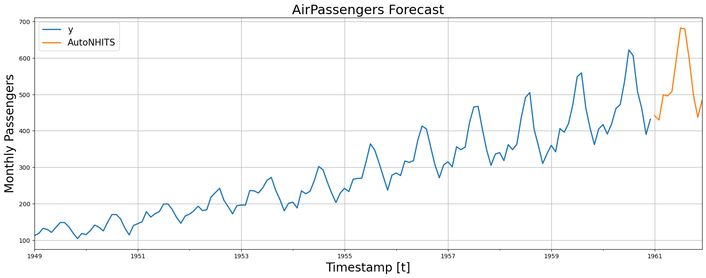

export const quartoRawHtml =
[`<div>
<style scoped>
    .dataframe tbody tr th:only-of-type {
        vertical-align: middle;
    }
    .dataframe tbody tr th {
        vertical-align: top;
    }
    .dataframe thead th {
        text-align: right;
    }
</style>
`,`
</div>`,`<div>
<style scoped>
    .dataframe tbody tr th:only-of-type {
        vertical-align: middle;
    }
    .dataframe tbody tr th {
        vertical-align: top;
    }
    .dataframe thead th {
        text-align: right;
    }
</style>
`,`
<p>5 rows × 28 columns</p>
</div>`,`<div>
<style scoped>
    .dataframe tbody tr th:only-of-type {
        vertical-align: middle;
    }
    .dataframe tbody tr th {
        vertical-align: top;
    }
    .dataframe thead th {
        text-align: right;
    }
</style>
`,`
</div>`];

Deep-learning models are the state-of-the-art in time series
forecasting. They have outperformed statistical and tree-based
approaches in recent large-scale competitions, such as the M series, and
are being increasingly adopted in industry. However, their performance
is greatly affected by the choice of hyperparameters. Selecting the
optimal configuration, a process called hyperparameter tuning, is
essential to achieve the best performance.

The main steps of hyperparameter tuning are:

1.  Define training and validation sets.
2.  Define search space.
3.  Sample configurations with a search algorithm, train models, and
    evaluate them on the validation set.
4.  Select and store the best model.

With `Neuralforecast`, we automatize and simplify the hyperparameter
tuning process with the `Auto` models. Every model in the library has an
`Auto` version (for example, `AutoNHITS`, `AutoTFT`) which can perform
automatic hyperparameter selection on default or user-defined search
space. The `Auto` models wrap Ray’s `Tune` library with a user-friendly
and simplified API, with most of its capabilities.

In this tutorial, we show in detail how to instantiate and train an
`AutoNHITS` model with a custom search space, install and use `HYPEROPT`
search algorithm, and use the model with optimal hyperparameters to
forecast.

You can run these experiments using GPU with Google Colab.

<a href="https://colab.research.google.com/github/Nixtla/neuralforecast/blob/main/nbs/examples/Automatic_Hyperparameter_Tuning.ipynb" target="_parent"></a>

## 1. Install `Neuralforecast` {#install-neuralforecast}

<details>
<summary>Code</summary>

``` python
#%%capture
#!pip install neuralforecast
#!pip install hyperopt
```

</details>

## 2. Load Data {#load-data}

In this example we will use the `AirPasengers`, a popular dataset with
monthly airline passengers in the US from 1949 to 1960. Load the data,
available at our `utils` methods in the required format. See
https://nixtla.github.io/neuralforecast/examples/data_format.html for
more details on the data input format.

<details>
<summary>Code</summary>

``` python
from neuralforecast.utils import AirPassengersDF

Y_df = AirPassengersDF
Y_df.head()
```

</details>

``` text
/Users/cchallu/opt/anaconda3/envs/neuralforecast/lib/python3.10/site-packages/tqdm/auto.py:22: TqdmWarning: IProgress not found. Please update jupyter and ipywidgets. See https://ipywidgets.readthedocs.io/en/stable/user_install.html
  from .autonotebook import tqdm as notebook_tqdm
```

<div dangerouslySetInnerHTML={{ __html: quartoRawHtml[0] }} />

|     | unique_id | ds         | y     |
|-----|-----------|------------|-------|
| 0   | 1.0       | 1949-01-31 | 112.0 |
| 1   | 1.0       | 1949-02-28 | 118.0 |
| 2   | 1.0       | 1949-03-31 | 132.0 |
| 3   | 1.0       | 1949-04-30 | 129.0 |
| 4   | 1.0       | 1949-05-31 | 121.0 |

<div dangerouslySetInnerHTML={{ __html: quartoRawHtml[1] }} />

## 3. Define hyperparameter grid {#define-hyperparameter-grid}

Each `Auto` model contains a default search space that was extensively
tested on multiple large-scale datasets. Additionally, users can define
specific search spaces tailored for particular datasets and tasks.

First, we create a custom search space for the `AutoNHITS` model. Search
spaces are specified with dictionaries, where keys corresponds to the
model’s hyperparameter and the value is a `Tune` function to specify how
the hyperparameter will be sampled. For example, use `randint` to sample
integers uniformly, and `choice` to sample values of a list.

In the following example we are optimizing the `learning_rate` and two
`NHITS` specific hyperparameters: `n_pool_kernel_size` and
`n_freq_downsample`. Additionaly, we use the search space to modify
default hyperparameters, such as `max_steps` and `val_check_steps`.

<details>
<summary>Code</summary>

``` python
from ray import tune
```

</details>
<details>
<summary>Code</summary>

``` python
nhits_config = {
       "max_steps": 100,                                                         # Number of SGD steps
       "input_size": 24,                                                         # Size of input window
       "learning_rate": tune.loguniform(1e-5, 1e-1),                             # Initial Learning rate
       "n_pool_kernel_size": tune.choice([[2, 2, 2], [16, 8, 1]]),               # MaxPool's Kernelsize
       "n_freq_downsample": tune.choice([[168, 24, 1], [24, 12, 1], [1, 1, 1]]), # Interpolation expressivity ratios
       "val_check_steps": 50,                                                    # Compute validation every 50 steps
       "random_seed": tune.randint(1, 10),                                       # Random seed
    }
```

</details>

:::important

Configuration dictionaries are not interchangeable between models since
they have different hyperparameters. Refer to
https://nixtla.github.io/neuralforecast/models.html for a complete list
of each model’s hyperparameters.

:::

## 4. Instantiate `Auto` model {#instantiate-auto-model}

To instantiate an `Auto` model you need to define:

-   `h`: forecasting horizon.
-   `loss`: training and validation loss from
    `neuralforecast.losses.pytorch`.
-   `config`: hyperparameter search space. If `None`, the `Auto` class
    will use a pre-defined suggested hyperparameter space.
-   `search_alg`: search algorithm (from `tune.search`), default is
    random search. Refer to
    https://docs.ray.io/en/latest/tune/api_docs/suggestion.html for more
    information on the different search algorithm options.
-   `num_samples`: number of configurations explored.

In this example we set horizon `h` as 12, use the `MAE` loss for
training and validation, and use the `HYPEROPT` search algorithm.

<details>
<summary>Code</summary>

``` python
from ray.tune.search.hyperopt import HyperOptSearch
from neuralforecast.losses.pytorch import MAE
from neuralforecast.auto import AutoNHITS
```

</details>
<details>
<summary>Code</summary>

``` python
model = AutoNHITS(h=12,
                  loss=MAE(),
                  config=nhits_config,
                  search_alg=HyperOptSearch(),
                  num_samples=20)
```

</details>

:::tip

The number of samples, `num_samples`, is a crucial parameter! Larger
values will usually produce better results as we explore more
configurations in the search space, but it will increase training times.
Larger search spaces will usually require more samples. As a general
rule, we recommend setting `num_samples` higher than 20.

:::

## 5. Train model and predict with `Core` class {#train-model-and-predict-with-core-class}

Next, we use the `Neuralforecast` class to train the `Auto` model. In
this step, `Auto` models will automatically perform hyperparamter tuning
training multiple models with different hyperparameters, producing the
forecasts on the validation set, and evaluating them. The best
configuration is selected based on the error on a validation set. Only
the best model is stored and used during inference.

<details>
<summary>Code</summary>

``` python
from neuralforecast import NeuralForecast
```

</details>

Use the `val_size` parameter of the `fit` method to control the length
of the validation set. In this case we set the validation set as twice
the forecasting horizon.

<details>
<summary>Code</summary>

``` python
%%capture
nf = NeuralForecast(models=[model], freq='M')
nf.fit(df=Y_df, val_size=24)
```

</details>

The results of the hyperparameter tuning are available in the `results`
attribute of the `Auto` model. Use the `get_dataframe` method to get the
results in a pandas dataframe.

<details>
<summary>Code</summary>

``` python
results = model.results.get_dataframe()
results.head()
```

</details>
<div dangerouslySetInnerHTML={{ __html: quartoRawHtml[2] }} />

|     | loss         | time_this_iter_s | done  | timesteps_total | episodes_total | training_iteration | trial_id | experiment_id                    | date                | timestamp  | ... | config/h | config/input_size | config/learning_rate | config/loss | config/max_steps | config/n_freq_downsample | config/n_pool_kernel_size | config/random_seed | config/val_check_steps | logdir                                            |
|-----|--------------|------------------|-------|-----------------|----------------|--------------------|----------|----------------------------------|---------------------|------------|-----|----------|-------------------|----------------------|-------------|------------------|--------------------------|---------------------------|--------------------|------------------------|---------------------------------------------------|
| 0   | 34791.984375 | 11.577301        | False | NaN             | NaN            | 2                  | 12439254 | 80bb7a4e18544f81be9787d173752bca | 2023-01-20_16-26-43 | 1674250003 | ... | 12       | 24                | 0.035251             | MAE()       | 100              | \[168, 24, 1\]           | \[2, 2, 2\]               | 8                  | 50                     | /Users/cchallu/ray_results/train_tune_2023-01-... |
| 1   | 42.189243    | 10.443844        | False | NaN             | NaN            | 2                  | 125ce09c | 80bb7a4e18544f81be9787d173752bca | 2023-01-20_16-27-05 | 1674250025 | ... | 12       | 24                | 0.009097             | MAE()       | 100              | \[24, 12, 1\]            | \[2, 2, 2\]               | 4                  | 50                     | /Users/cchallu/ray_results/train_tune_2023-01-... |
| 2   | 19.739182    | 10.449568        | False | NaN             | NaN            | 2                  | 22d60660 | 80bb7a4e18544f81be9787d173752bca | 2023-01-20_16-27-26 | 1674250046 | ... | 12       | 24                | 0.000144             | MAE()       | 100              | \[1, 1, 1\]              | \[2, 2, 2\]               | 7                  | 50                     | /Users/cchallu/ray_results/train_tune_2023-01-... |
| 3   | 15.072639    | 9.953516         | False | NaN             | NaN            | 2                  | 2fd95ef2 | 80bb7a4e18544f81be9787d173752bca | 2023-01-20_16-27-46 | 1674250066 | ... | 12       | 24                | 0.003416             | MAE()       | 100              | \[24, 12, 1\]            | \[16, 8, 1\]              | 1                  | 50                     | /Users/cchallu/ray_results/train_tune_2023-01-... |
| 4   | 58.782948    | 11.148285        | False | NaN             | NaN            | 2                  | 3c93c36c | 80bb7a4e18544f81be9787d173752bca | 2023-01-20_16-28-08 | 1674250088 | ... | 12       | 24                | 0.000027             | MAE()       | 100              | \[24, 12, 1\]            | \[16, 8, 1\]              | 7                  | 50                     | /Users/cchallu/ray_results/train_tune_2023-01-... |

<div dangerouslySetInnerHTML={{ __html: quartoRawHtml[3] }} />

Next, we use the `predict` method to forecast the next 12 months using
the optimal hyperparameters.

<details>
<summary>Code</summary>

``` python
Y_hat_df = nf.predict()
Y_hat_df = Y_hat_df.reset_index()
Y_hat_df.head()
```

</details>

``` text
Predicting DataLoader 0: 100%|██████████| 1/1 [00:00<00:00, 93.27it/s] 
```

<div dangerouslySetInnerHTML={{ __html: quartoRawHtml[4] }} />

|     | unique_id | ds         | AutoNHITS  |
|-----|-----------|------------|------------|
| 0   | 1.0       | 1961-01-31 | 441.228943 |
| 1   | 1.0       | 1961-02-28 | 429.527832 |
| 2   | 1.0       | 1961-03-31 | 498.914246 |
| 3   | 1.0       | 1961-04-30 | 495.418640 |
| 4   | 1.0       | 1961-05-31 | 507.392731 |

<div dangerouslySetInnerHTML={{ __html: quartoRawHtml[5] }} />

Finally, we plot the original time series and the forecasts.

<details>
<summary>Code</summary>

``` python
import pandas as pd
import matplotlib.pyplot as plt
```

</details>
<details>
<summary>Code</summary>

``` python
fig, ax = plt.subplots(1, 1, figsize = (20, 7))
plot_df = pd.concat([Y_df, Y_hat_df]).set_index('ds') # Concatenate the train and forecast dataframes
plot_df[['y', 'AutoNHITS']].plot(ax=ax, linewidth=2)

ax.set_title('AirPassengers Forecast', fontsize=22)
ax.set_ylabel('Monthly Passengers', fontsize=20)
ax.set_xlabel('Timestamp [t]', fontsize=20)
ax.legend(prop={'size': 15})
ax.grid()
```

</details>



### References {#references}

-   [Cristian Challu, Kin G. Olivares, Boris N. Oreshkin, Federico
    Garza, Max Mergenthaler-Canseco, Artur Dubrawski (2021). NHITS:
    Neural Hierarchical Interpolation for Time Series Forecasting.
    Accepted at AAAI 2023.](https://arxiv.org/abs/2201.12886)
-   [James Bergstra, Remi Bardenet, Yoshua Bengio, and Balazs Kegl
    (2011). “Algorithms for Hyper-Parameter Optimization”. In: Advances
    in Neural Information Processing Systems. url:
    https://proceedings.neurips.cc/paper/2011/file/86e8f7ab32cfd12577bc2619bc635690-Paper.pdf](https://proceedings.neurips.cc/paper/2011/file/86e8f7ab32cfd12577bc2619bc635690-Paper.pdf)
-   [Kirthevasan Kandasamy, Karun Raju Vysyaraju, Willie Neiswanger,
    Biswajit Paria, Christopher R. Collins, Jeff Schneider, Barnabas
    Poczos, Eric P. Xing (2019). “Tuning Hyperparameters without Grad
    Students: Scalable and Robust Bayesian Optimisation with Dragonfly”.
    Journal of Machine Learning Research. url:
    https://arxiv.org/abs/1903.06694](https://arxiv.org/abs/1903.06694)
-   [Lisha Li, Kevin Jamieson, Giulia DeSalvo, Afshin Rostamizadeh,
    Ameet Talwalkar (2016). “Hyperband: A Novel Bandit-Based Approach to
    Hyperparameter Optimization”. Journal of Machine Learning Research.
    url:
    https://arxiv.org/abs/1603.06560](https://arxiv.org/abs/1603.06560)

