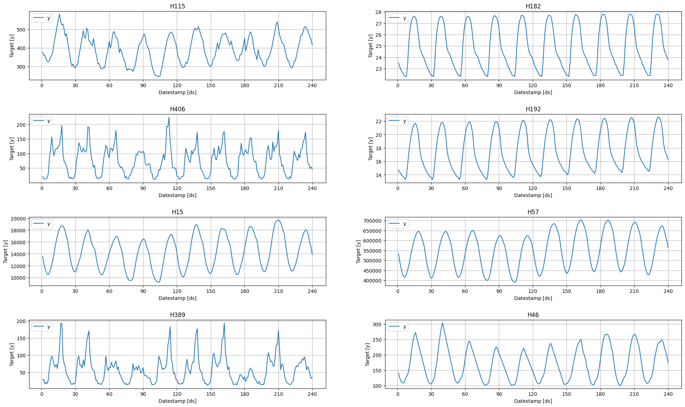
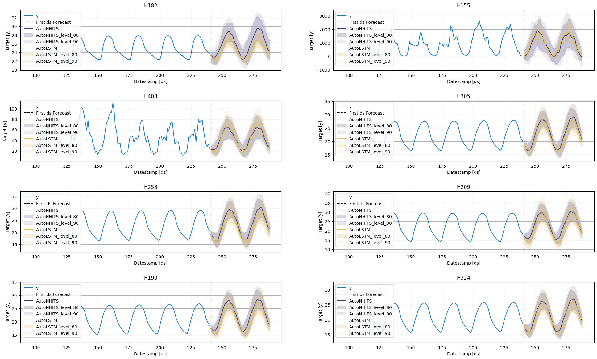
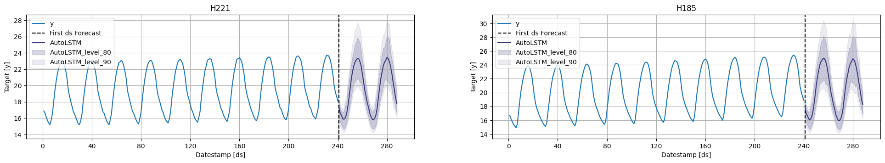
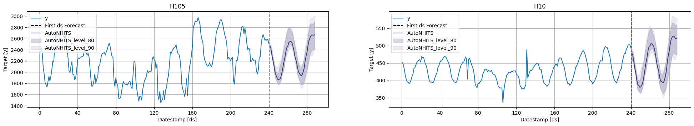
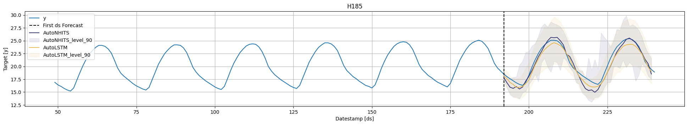
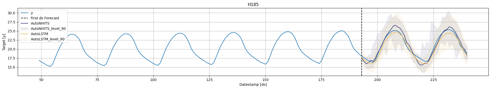
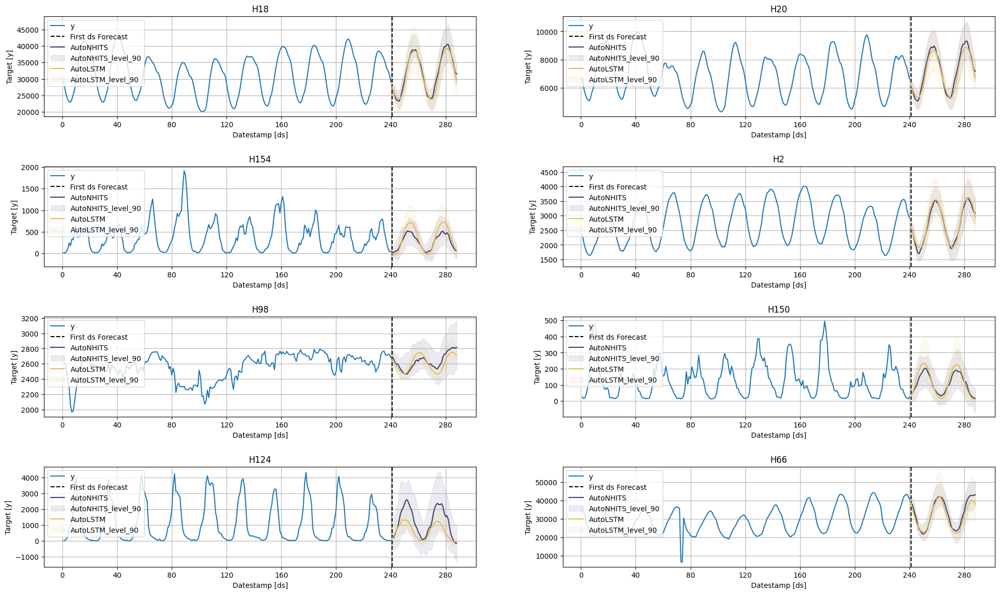
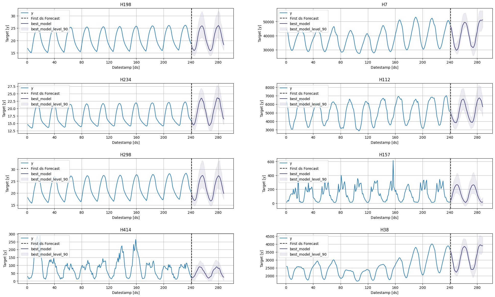

export const quartoRawHtml =
[`
  <div id="df-27ee4964-277b-4324-bbc0-3da8e36e32db">
    <div class="colab-df-container">
      <div>
<style scoped>
    .dataframe tbody tr th:only-of-type {
        vertical-align: middle;
    }
    .dataframe tbody tr th {
        vertical-align: top;
    }
    .dataframe thead th {
        text-align: right;
    }
</style>
`,`
</div>
      <button class="colab-df-convert" onclick="convertToInteractive('df-27ee4964-277b-4324-bbc0-3da8e36e32db')"
              title="Convert this dataframe to an interactive table."
              style="display:none;">
        
  <svg xmlns="http://www.w3.org/2000/svg" height="24px"viewBox="0 0 24 24"
       width="24px">
    <path d="M0 0h24v24H0V0z" fill="none"/>
    <path d="M18.56 5.44l.94 2.06.94-2.06 2.06-.94-2.06-.94-.94-2.06-.94 2.06-2.06.94zm-11 1L8.5 8.5l.94-2.06 2.06-.94-2.06-.94L8.5 2.5l-.94 2.06-2.06.94zm10 10l.94 2.06.94-2.06 2.06-.94-2.06-.94-.94-2.06-.94 2.06-2.06.94z"/><path d="M17.41 7.96l-1.37-1.37c-.4-.4-.92-.59-1.43-.59-.52 0-1.04.2-1.43.59L10.3 9.45l-7.72 7.72c-.78.78-.78 2.05 0 2.83L4 21.41c.39.39.9.59 1.41.59.51 0 1.02-.2 1.41-.59l7.78-7.78 2.81-2.81c.8-.78.8-2.07 0-2.86zM5.41 20L4 18.59l7.72-7.72 1.47 1.35L5.41 20z"/>
  </svg>
      </button>
      
  <style>
    .colab-df-container {
      display:flex;
      flex-wrap:wrap;
      gap: 12px;
    }
    .colab-df-convert {
      background-color: #E8F0FE;
      border: none;
      border-radius: 50%;
      cursor: pointer;
      display: none;
      fill: #1967D2;
      height: 32px;
      padding: 0 0 0 0;
      width: 32px;
    }
    .colab-df-convert:hover {
      background-color: #E2EBFA;
      box-shadow: 0px 1px 2px rgba(60, 64, 67, 0.3), 0px 1px 3px 1px rgba(60, 64, 67, 0.15);
      fill: #174EA6;
    }
    [theme=dark] .colab-df-convert {
      background-color: #3B4455;
      fill: #D2E3FC;
    }
    [theme=dark] .colab-df-convert:hover {
      background-color: #434B5C;
      box-shadow: 0px 1px 3px 1px rgba(0, 0, 0, 0.15);
      filter: drop-shadow(0px 1px 2px rgba(0, 0, 0, 0.3));
      fill: #FFFFFF;
    }
  </style>
      <script>
        const buttonEl =
          document.querySelector('#df-27ee4964-277b-4324-bbc0-3da8e36e32db button.colab-df-convert');
        buttonEl.style.display =
          google.colab.kernel.accessAllowed ? 'block' : 'none';
        async function convertToInteractive(key) {
          const element = document.querySelector('#df-27ee4964-277b-4324-bbc0-3da8e36e32db');
          const dataTable =
            await google.colab.kernel.invokeFunction('convertToInteractive',
                                                     [key], {});
          if (!dataTable) return;
          const docLinkHtml = 'Like what you see? Visit the ' +
            '<a target="_blank" href=https://colab.research.google.com/notebooks/data_table.ipynb>data table notebook</a>'
            + ' to learn more about interactive tables.';
          element.innerHTML = '';
          dataTable['output_type'] = 'display_data';
          await google.colab.output.renderOutput(dataTable, element);
          const docLink = document.createElement('div');
          docLink.innerHTML = docLinkHtml;
          element.appendChild(docLink);
        }
      </script>
    </div>
  </div>
  `,`
  <div id="df-f578acca-896f-4dcd-b1ce-9eb9a29fe5d9">
    <div class="colab-df-container">
      <div>
<style scoped>
    .dataframe tbody tr th:only-of-type {
        vertical-align: middle;
    }
    .dataframe tbody tr th {
        vertical-align: top;
    }
    .dataframe thead th {
        text-align: right;
    }
</style>
`,`
</div>
      <button class="colab-df-convert" onclick="convertToInteractive('df-f578acca-896f-4dcd-b1ce-9eb9a29fe5d9')"
              title="Convert this dataframe to an interactive table."
              style="display:none;">
        
  <svg xmlns="http://www.w3.org/2000/svg" height="24px"viewBox="0 0 24 24"
       width="24px">
    <path d="M0 0h24v24H0V0z" fill="none"/>
    <path d="M18.56 5.44l.94 2.06.94-2.06 2.06-.94-2.06-.94-.94-2.06-.94 2.06-2.06.94zm-11 1L8.5 8.5l.94-2.06 2.06-.94-2.06-.94L8.5 2.5l-.94 2.06-2.06.94zm10 10l.94 2.06.94-2.06 2.06-.94-2.06-.94-.94-2.06-.94 2.06-2.06.94z"/><path d="M17.41 7.96l-1.37-1.37c-.4-.4-.92-.59-1.43-.59-.52 0-1.04.2-1.43.59L10.3 9.45l-7.72 7.72c-.78.78-.78 2.05 0 2.83L4 21.41c.39.39.9.59 1.41.59.51 0 1.02-.2 1.41-.59l7.78-7.78 2.81-2.81c.8-.78.8-2.07 0-2.86zM5.41 20L4 18.59l7.72-7.72 1.47 1.35L5.41 20z"/>
  </svg>
      </button>
      
  <style>
    .colab-df-container {
      display:flex;
      flex-wrap:wrap;
      gap: 12px;
    }
    .colab-df-convert {
      background-color: #E8F0FE;
      border: none;
      border-radius: 50%;
      cursor: pointer;
      display: none;
      fill: #1967D2;
      height: 32px;
      padding: 0 0 0 0;
      width: 32px;
    }
    .colab-df-convert:hover {
      background-color: #E2EBFA;
      box-shadow: 0px 1px 2px rgba(60, 64, 67, 0.3), 0px 1px 3px 1px rgba(60, 64, 67, 0.15);
      fill: #174EA6;
    }
    [theme=dark] .colab-df-convert {
      background-color: #3B4455;
      fill: #D2E3FC;
    }
    [theme=dark] .colab-df-convert:hover {
      background-color: #434B5C;
      box-shadow: 0px 1px 3px 1px rgba(0, 0, 0, 0.15);
      filter: drop-shadow(0px 1px 2px rgba(0, 0, 0, 0.3));
      fill: #FFFFFF;
    }
  </style>
      <script>
        const buttonEl =
          document.querySelector('#df-f578acca-896f-4dcd-b1ce-9eb9a29fe5d9 button.colab-df-convert');
        buttonEl.style.display =
          google.colab.kernel.accessAllowed ? 'block' : 'none';
        async function convertToInteractive(key) {
          const element = document.querySelector('#df-f578acca-896f-4dcd-b1ce-9eb9a29fe5d9');
          const dataTable =
            await google.colab.kernel.invokeFunction('convertToInteractive',
                                                     [key], {});
          if (!dataTable) return;
          const docLinkHtml = 'Like what you see? Visit the ' +
            '<a target="_blank" href=https://colab.research.google.com/notebooks/data_table.ipynb>data table notebook</a>'
            + ' to learn more about interactive tables.';
          element.innerHTML = '';
          dataTable['output_type'] = 'display_data';
          await google.colab.output.renderOutput(dataTable, element);
          const docLink = document.createElement('div');
          docLink.innerHTML = docLinkHtml;
          element.appendChild(docLink);
        }
      </script>
    </div>
  </div>
  `,`
  <div id="df-e344f6c2-64ae-422d-b05f-39720b8f5d81">
    <div class="colab-df-container">
      <div>
<style scoped>
    .dataframe tbody tr th:only-of-type {
        vertical-align: middle;
    }
    .dataframe tbody tr th {
        vertical-align: top;
    }
    .dataframe thead th {
        text-align: right;
    }
</style>
`,`
</div>
      <button class="colab-df-convert" onclick="convertToInteractive('df-e344f6c2-64ae-422d-b05f-39720b8f5d81')"
              title="Convert this dataframe to an interactive table."
              style="display:none;">
        
  <svg xmlns="http://www.w3.org/2000/svg" height="24px"viewBox="0 0 24 24"
       width="24px">
    <path d="M0 0h24v24H0V0z" fill="none"/>
    <path d="M18.56 5.44l.94 2.06.94-2.06 2.06-.94-2.06-.94-.94-2.06-.94 2.06-2.06.94zm-11 1L8.5 8.5l.94-2.06 2.06-.94-2.06-.94L8.5 2.5l-.94 2.06-2.06.94zm10 10l.94 2.06.94-2.06 2.06-.94-2.06-.94-.94-2.06-.94 2.06-2.06.94z"/><path d="M17.41 7.96l-1.37-1.37c-.4-.4-.92-.59-1.43-.59-.52 0-1.04.2-1.43.59L10.3 9.45l-7.72 7.72c-.78.78-.78 2.05 0 2.83L4 21.41c.39.39.9.59 1.41.59.51 0 1.02-.2 1.41-.59l7.78-7.78 2.81-2.81c.8-.78.8-2.07 0-2.86zM5.41 20L4 18.59l7.72-7.72 1.47 1.35L5.41 20z"/>
  </svg>
      </button>
      
  <style>
    .colab-df-container {
      display:flex;
      flex-wrap:wrap;
      gap: 12px;
    }
    .colab-df-convert {
      background-color: #E8F0FE;
      border: none;
      border-radius: 50%;
      cursor: pointer;
      display: none;
      fill: #1967D2;
      height: 32px;
      padding: 0 0 0 0;
      width: 32px;
    }
    .colab-df-convert:hover {
      background-color: #E2EBFA;
      box-shadow: 0px 1px 2px rgba(60, 64, 67, 0.3), 0px 1px 3px 1px rgba(60, 64, 67, 0.15);
      fill: #174EA6;
    }
    [theme=dark] .colab-df-convert {
      background-color: #3B4455;
      fill: #D2E3FC;
    }
    [theme=dark] .colab-df-convert:hover {
      background-color: #434B5C;
      box-shadow: 0px 1px 3px 1px rgba(0, 0, 0, 0.15);
      filter: drop-shadow(0px 1px 2px rgba(0, 0, 0, 0.3));
      fill: #FFFFFF;
    }
  </style>
      <script>
        const buttonEl =
          document.querySelector('#df-e344f6c2-64ae-422d-b05f-39720b8f5d81 button.colab-df-convert');
        buttonEl.style.display =
          google.colab.kernel.accessAllowed ? 'block' : 'none';
        async function convertToInteractive(key) {
          const element = document.querySelector('#df-e344f6c2-64ae-422d-b05f-39720b8f5d81');
          const dataTable =
            await google.colab.kernel.invokeFunction('convertToInteractive',
                                                     [key], {});
          if (!dataTable) return;
          const docLinkHtml = 'Like what you see? Visit the ' +
            '<a target="_blank" href=https://colab.research.google.com/notebooks/data_table.ipynb>data table notebook</a>'
            + ' to learn more about interactive tables.';
          element.innerHTML = '';
          dataTable['output_type'] = 'display_data';
          await google.colab.output.renderOutput(dataTable, element);
          const docLink = document.createElement('div');
          docLink.innerHTML = docLinkHtml;
          element.appendChild(docLink);
        }
      </script>
    </div>
  </div>
  `,`
  <div id="df-39d3b0d3-1f27-4537-8f89-47dc58a7e75f">
    <div class="colab-df-container">
      <div>
<style scoped>
    .dataframe tbody tr th:only-of-type {
        vertical-align: middle;
    }
    .dataframe tbody tr th {
        vertical-align: top;
    }
    .dataframe thead th {
        text-align: right;
    }
</style>
`,`
</div>
      <button class="colab-df-convert" onclick="convertToInteractive('df-39d3b0d3-1f27-4537-8f89-47dc58a7e75f')"
              title="Convert this dataframe to an interactive table."
              style="display:none;">
        
  <svg xmlns="http://www.w3.org/2000/svg" height="24px"viewBox="0 0 24 24"
       width="24px">
    <path d="M0 0h24v24H0V0z" fill="none"/>
    <path d="M18.56 5.44l.94 2.06.94-2.06 2.06-.94-2.06-.94-.94-2.06-.94 2.06-2.06.94zm-11 1L8.5 8.5l.94-2.06 2.06-.94-2.06-.94L8.5 2.5l-.94 2.06-2.06.94zm10 10l.94 2.06.94-2.06 2.06-.94-2.06-.94-.94-2.06-.94 2.06-2.06.94z"/><path d="M17.41 7.96l-1.37-1.37c-.4-.4-.92-.59-1.43-.59-.52 0-1.04.2-1.43.59L10.3 9.45l-7.72 7.72c-.78.78-.78 2.05 0 2.83L4 21.41c.39.39.9.59 1.41.59.51 0 1.02-.2 1.41-.59l7.78-7.78 2.81-2.81c.8-.78.8-2.07 0-2.86zM5.41 20L4 18.59l7.72-7.72 1.47 1.35L5.41 20z"/>
  </svg>
      </button>
      
  <style>
    .colab-df-container {
      display:flex;
      flex-wrap:wrap;
      gap: 12px;
    }
    .colab-df-convert {
      background-color: #E8F0FE;
      border: none;
      border-radius: 50%;
      cursor: pointer;
      display: none;
      fill: #1967D2;
      height: 32px;
      padding: 0 0 0 0;
      width: 32px;
    }
    .colab-df-convert:hover {
      background-color: #E2EBFA;
      box-shadow: 0px 1px 2px rgba(60, 64, 67, 0.3), 0px 1px 3px 1px rgba(60, 64, 67, 0.15);
      fill: #174EA6;
    }
    [theme=dark] .colab-df-convert {
      background-color: #3B4455;
      fill: #D2E3FC;
    }
    [theme=dark] .colab-df-convert:hover {
      background-color: #434B5C;
      box-shadow: 0px 1px 3px 1px rgba(0, 0, 0, 0.15);
      filter: drop-shadow(0px 1px 2px rgba(0, 0, 0, 0.3));
      fill: #FFFFFF;
    }
  </style>
      <script>
        const buttonEl =
          document.querySelector('#df-39d3b0d3-1f27-4537-8f89-47dc58a7e75f button.colab-df-convert');
        buttonEl.style.display =
          google.colab.kernel.accessAllowed ? 'block' : 'none';
        async function convertToInteractive(key) {
          const element = document.querySelector('#df-39d3b0d3-1f27-4537-8f89-47dc58a7e75f');
          const dataTable =
            await google.colab.kernel.invokeFunction('convertToInteractive',
                                                     [key], {});
          if (!dataTable) return;
          const docLinkHtml = 'Like what you see? Visit the ' +
            '<a target="_blank" href=https://colab.research.google.com/notebooks/data_table.ipynb>data table notebook</a>'
            + ' to learn more about interactive tables.';
          element.innerHTML = '';
          dataTable['output_type'] = 'display_data';
          await google.colab.output.renderOutput(dataTable, element);
          const docLink = document.createElement('div');
          docLink.innerHTML = docLinkHtml;
          element.appendChild(docLink);
        }
      </script>
    </div>
  </div>
  `,`
  <div id="df-0af19b5e-46c1-4a9f-9f57-051c4227c03a">
    <div class="colab-df-container">
      <div>
<style scoped>
    .dataframe tbody tr th:only-of-type {
        vertical-align: middle;
    }
    .dataframe tbody tr th {
        vertical-align: top;
    }
    .dataframe thead th {
        text-align: right;
    }
</style>
`,`
</div>
      <button class="colab-df-convert" onclick="convertToInteractive('df-0af19b5e-46c1-4a9f-9f57-051c4227c03a')"
              title="Convert this dataframe to an interactive table."
              style="display:none;">
        
  <svg xmlns="http://www.w3.org/2000/svg" height="24px"viewBox="0 0 24 24"
       width="24px">
    <path d="M0 0h24v24H0V0z" fill="none"/>
    <path d="M18.56 5.44l.94 2.06.94-2.06 2.06-.94-2.06-.94-.94-2.06-.94 2.06-2.06.94zm-11 1L8.5 8.5l.94-2.06 2.06-.94-2.06-.94L8.5 2.5l-.94 2.06-2.06.94zm10 10l.94 2.06.94-2.06 2.06-.94-2.06-.94-.94-2.06-.94 2.06-2.06.94z"/><path d="M17.41 7.96l-1.37-1.37c-.4-.4-.92-.59-1.43-.59-.52 0-1.04.2-1.43.59L10.3 9.45l-7.72 7.72c-.78.78-.78 2.05 0 2.83L4 21.41c.39.39.9.59 1.41.59.51 0 1.02-.2 1.41-.59l7.78-7.78 2.81-2.81c.8-.78.8-2.07 0-2.86zM5.41 20L4 18.59l7.72-7.72 1.47 1.35L5.41 20z"/>
  </svg>
      </button>
      
  <style>
    .colab-df-container {
      display:flex;
      flex-wrap:wrap;
      gap: 12px;
    }
    .colab-df-convert {
      background-color: #E8F0FE;
      border: none;
      border-radius: 50%;
      cursor: pointer;
      display: none;
      fill: #1967D2;
      height: 32px;
      padding: 0 0 0 0;
      width: 32px;
    }
    .colab-df-convert:hover {
      background-color: #E2EBFA;
      box-shadow: 0px 1px 2px rgba(60, 64, 67, 0.3), 0px 1px 3px 1px rgba(60, 64, 67, 0.15);
      fill: #174EA6;
    }
    [theme=dark] .colab-df-convert {
      background-color: #3B4455;
      fill: #D2E3FC;
    }
    [theme=dark] .colab-df-convert:hover {
      background-color: #434B5C;
      box-shadow: 0px 1px 3px 1px rgba(0, 0, 0, 0.15);
      filter: drop-shadow(0px 1px 2px rgba(0, 0, 0, 0.3));
      fill: #FFFFFF;
    }
  </style>
      <script>
        const buttonEl =
          document.querySelector('#df-0af19b5e-46c1-4a9f-9f57-051c4227c03a button.colab-df-convert');
        buttonEl.style.display =
          google.colab.kernel.accessAllowed ? 'block' : 'none';
        async function convertToInteractive(key) {
          const element = document.querySelector('#df-0af19b5e-46c1-4a9f-9f57-051c4227c03a');
          const dataTable =
            await google.colab.kernel.invokeFunction('convertToInteractive',
                                                     [key], {});
          if (!dataTable) return;
          const docLinkHtml = 'Like what you see? Visit the ' +
            '<a target="_blank" href=https://colab.research.google.com/notebooks/data_table.ipynb>data table notebook</a>'
            + ' to learn more about interactive tables.';
          element.innerHTML = '';
          dataTable['output_type'] = 'display_data';
          await google.colab.output.renderOutput(dataTable, element);
          const docLink = document.createElement('div');
          docLink.innerHTML = docLinkHtml;
          element.appendChild(docLink);
        }
      </script>
    </div>
  </div>
  `,`
  <div id="df-cf66c2da-7ef4-4f22-ac48-ba70cb977cc1">
    <div class="colab-df-container">
      <div>
<style scoped>
    .dataframe tbody tr th:only-of-type {
        vertical-align: middle;
    }
    .dataframe tbody tr th {
        vertical-align: top;
    }
    .dataframe thead th {
        text-align: right;
    }
</style>
`,`
</div>
      <button class="colab-df-convert" onclick="convertToInteractive('df-cf66c2da-7ef4-4f22-ac48-ba70cb977cc1')"
              title="Convert this dataframe to an interactive table."
              style="display:none;">
        
  <svg xmlns="http://www.w3.org/2000/svg" height="24px"viewBox="0 0 24 24"
       width="24px">
    <path d="M0 0h24v24H0V0z" fill="none"/>
    <path d="M18.56 5.44l.94 2.06.94-2.06 2.06-.94-2.06-.94-.94-2.06-.94 2.06-2.06.94zm-11 1L8.5 8.5l.94-2.06 2.06-.94-2.06-.94L8.5 2.5l-.94 2.06-2.06.94zm10 10l.94 2.06.94-2.06 2.06-.94-2.06-.94-.94-2.06-.94 2.06-2.06.94z"/><path d="M17.41 7.96l-1.37-1.37c-.4-.4-.92-.59-1.43-.59-.52 0-1.04.2-1.43.59L10.3 9.45l-7.72 7.72c-.78.78-.78 2.05 0 2.83L4 21.41c.39.39.9.59 1.41.59.51 0 1.02-.2 1.41-.59l7.78-7.78 2.81-2.81c.8-.78.8-2.07 0-2.86zM5.41 20L4 18.59l7.72-7.72 1.47 1.35L5.41 20z"/>
  </svg>
      </button>
      
  <style>
    .colab-df-container {
      display:flex;
      flex-wrap:wrap;
      gap: 12px;
    }
    .colab-df-convert {
      background-color: #E8F0FE;
      border: none;
      border-radius: 50%;
      cursor: pointer;
      display: none;
      fill: #1967D2;
      height: 32px;
      padding: 0 0 0 0;
      width: 32px;
    }
    .colab-df-convert:hover {
      background-color: #E2EBFA;
      box-shadow: 0px 1px 2px rgba(60, 64, 67, 0.3), 0px 1px 3px 1px rgba(60, 64, 67, 0.15);
      fill: #174EA6;
    }
    [theme=dark] .colab-df-convert {
      background-color: #3B4455;
      fill: #D2E3FC;
    }
    [theme=dark] .colab-df-convert:hover {
      background-color: #434B5C;
      box-shadow: 0px 1px 3px 1px rgba(0, 0, 0, 0.15);
      filter: drop-shadow(0px 1px 2px rgba(0, 0, 0, 0.3));
      fill: #FFFFFF;
    }
  </style>
      <script>
        const buttonEl =
          document.querySelector('#df-cf66c2da-7ef4-4f22-ac48-ba70cb977cc1 button.colab-df-convert');
        buttonEl.style.display =
          google.colab.kernel.accessAllowed ? 'block' : 'none';
        async function convertToInteractive(key) {
          const element = document.querySelector('#df-cf66c2da-7ef4-4f22-ac48-ba70cb977cc1');
          const dataTable =
            await google.colab.kernel.invokeFunction('convertToInteractive',
                                                     [key], {});
          if (!dataTable) return;
          const docLinkHtml = 'Like what you see? Visit the ' +
            '<a target="_blank" href=https://colab.research.google.com/notebooks/data_table.ipynb>data table notebook</a>'
            + ' to learn more about interactive tables.';
          element.innerHTML = '';
          dataTable['output_type'] = 'display_data';
          await google.colab.output.renderOutput(dataTable, element);
          const docLink = document.createElement('div');
          docLink.innerHTML = docLinkHtml;
          element.appendChild(docLink);
        }
      </script>
    </div>
  </div>
  `,`
  <div id="df-eb84fe3f-ce38-4dbb-a53f-b42427d9056e">
    <div class="colab-df-container">
      <div>
<style scoped>
    .dataframe tbody tr th:only-of-type {
        vertical-align: middle;
    }
    .dataframe tbody tr th {
        vertical-align: top;
    }
    .dataframe thead th {
        text-align: right;
    }
</style>
`,`
</div>
      <button class="colab-df-convert" onclick="convertToInteractive('df-eb84fe3f-ce38-4dbb-a53f-b42427d9056e')"
              title="Convert this dataframe to an interactive table."
              style="display:none;">
        
  <svg xmlns="http://www.w3.org/2000/svg" height="24px"viewBox="0 0 24 24"
       width="24px">
    <path d="M0 0h24v24H0V0z" fill="none"/>
    <path d="M18.56 5.44l.94 2.06.94-2.06 2.06-.94-2.06-.94-.94-2.06-.94 2.06-2.06.94zm-11 1L8.5 8.5l.94-2.06 2.06-.94-2.06-.94L8.5 2.5l-.94 2.06-2.06.94zm10 10l.94 2.06.94-2.06 2.06-.94-2.06-.94-.94-2.06-.94 2.06-2.06.94z"/><path d="M17.41 7.96l-1.37-1.37c-.4-.4-.92-.59-1.43-.59-.52 0-1.04.2-1.43.59L10.3 9.45l-7.72 7.72c-.78.78-.78 2.05 0 2.83L4 21.41c.39.39.9.59 1.41.59.51 0 1.02-.2 1.41-.59l7.78-7.78 2.81-2.81c.8-.78.8-2.07 0-2.86zM5.41 20L4 18.59l7.72-7.72 1.47 1.35L5.41 20z"/>
  </svg>
      </button>
      
  <style>
    .colab-df-container {
      display:flex;
      flex-wrap:wrap;
      gap: 12px;
    }
    .colab-df-convert {
      background-color: #E8F0FE;
      border: none;
      border-radius: 50%;
      cursor: pointer;
      display: none;
      fill: #1967D2;
      height: 32px;
      padding: 0 0 0 0;
      width: 32px;
    }
    .colab-df-convert:hover {
      background-color: #E2EBFA;
      box-shadow: 0px 1px 2px rgba(60, 64, 67, 0.3), 0px 1px 3px 1px rgba(60, 64, 67, 0.15);
      fill: #174EA6;
    }
    [theme=dark] .colab-df-convert {
      background-color: #3B4455;
      fill: #D2E3FC;
    }
    [theme=dark] .colab-df-convert:hover {
      background-color: #434B5C;
      box-shadow: 0px 1px 3px 1px rgba(0, 0, 0, 0.15);
      filter: drop-shadow(0px 1px 2px rgba(0, 0, 0, 0.3));
      fill: #FFFFFF;
    }
  </style>
      <script>
        const buttonEl =
          document.querySelector('#df-eb84fe3f-ce38-4dbb-a53f-b42427d9056e button.colab-df-convert');
        buttonEl.style.display =
          google.colab.kernel.accessAllowed ? 'block' : 'none';
        async function convertToInteractive(key) {
          const element = document.querySelector('#df-eb84fe3f-ce38-4dbb-a53f-b42427d9056e');
          const dataTable =
            await google.colab.kernel.invokeFunction('convertToInteractive',
                                                     [key], {});
          if (!dataTable) return;
          const docLinkHtml = 'Like what you see? Visit the ' +
            '<a target="_blank" href=https://colab.research.google.com/notebooks/data_table.ipynb>data table notebook</a>'
            + ' to learn more about interactive tables.';
          element.innerHTML = '';
          dataTable['output_type'] = 'display_data';
          await google.colab.output.renderOutput(dataTable, element);
          const docLink = document.createElement('div');
          docLink.innerHTML = docLinkHtml;
          element.appendChild(docLink);
        }
      </script>
    </div>
  </div>
  `];

> Model training, evaluation and selection for multiple time series

:::warning

## Prerequesites

This Guide assumes basic familiarity with NeuralForecast. For a minimal
example visit the [Quick Start](./Getting_Started.ipynb)

:::

Follow this article for a step to step guide on building a
production-ready forecasting pipeline for multiple time series.

During this guide you will gain familiary with the core
`NueralForecast`class and some relevant methods like
`NeuralForecast.fit`, `NeuralForecast.predict`, and
`StatsForecast.cross_validation.`

We will use a classical benchmarking dataset from the M4 competition.
The dataset includes time series from different domains like finance,
economy and sales. In this example, we will use a subset of the Hourly
dataset.

We will model each time series globally Therefore, you will train a set
of models for the whole dataset, and then select the best model for each
individual time series. NeuralForecast focuses on speed, simplicity, and
scalability, which makes it ideal for this task.

**Outline:**

1.  Install packages.
2.  Read the data.
3.  Explore the data.
4.  Train many models globally for the entire dataset.
5.  Evaluate the model’s performance using cross-validation.
6.  Select the best model for every unique time series.

:::tip

## Not Covered in this guide

-   Using external regressors or exogenous variables
    -   Follow this tutorial to [include exogenous
        variables](./Exogenous_Variables.ipynb) like weather or holidays
        or static variables like category or family.
-   Probabilistic forecasting
    -   Follow this tutorial to [generate probabilistic
        forecasts](./LongHorizon_Probabilistic.ipynb)
-   Transfer Learning
    -   Train a model and use it to forecast on different data using
        [this tutorial](./Transfer_Learning.ipynb)

:::


:::tip

You can use Colab to run this Notebook interactively
<a href="https://colab.research.google.com/github/Nixtla/neuralforecast/blob/main/nbs/examples/Getting_Started_complete.ipynb" target="_parent"></a>

:::


:::warning

To reduce the computation time, it is recommended to use GPU. Using
Colab, do not forget to activate it. Just go to
`Runtime>Change runtime type` and select GPU as hardware accelerator.

:::

## 1. Install libraries {#install-libraries}

We assume you have `NeuralForecast` already installed. Check this guide
for instructions on [how to install
NeuralForecast](./Installation.ipynb).

Additionally, we will install `s3fs` to read from the S3 Filesystem of
AWS, `statsforecast` for plotting, and `datasetsforecast` for common
error metrics like MAE or MASE.

Install the necessary packages using
`pip install statsforecast s3fs datasetsforecast` \`\`

<details>
<summary>Code</summary>

``` python
%%capture
! pip install statsforecast s3fs datasetsforecast
```

</details>
<details>
<summary>Code</summary>

``` python
%%capture
! pip install git+https://github.com/Nixtla/neuralforecast.git@main
```

</details>

## 2. Read the data {#read-the-data}

We will use pandas to read the M4 Hourly data set stored in a parquet
file for efficiency. You can use ordinary pandas operations to read your
data in other formats likes `.csv`.

The input to `NeuralForecast` is always a data frame in [long
format](https://www.theanalysisfactor.com/wide-and-long-data/) with
three columns: `unique_id`, `ds` and `y`:

-   The `unique_id` (string, int or category) represents an identifier
    for the series.

-   The `ds` (datestamp or int) column should be either an integer
    indexing time or a datestampe ideally like YYYY-MM-DD for a date or
    YYYY-MM-DD HH:MM:SS for a timestamp.

-   The `y` (numeric) represents the measurement we wish to forecast. We
    will rename the

This data set already satisfies the requirement.

Depending on your internet connection, this step should take around 10
seconds.

<details>
<summary>Code</summary>

``` python
import pandas as pd

Y_df = pd.read_parquet('https://datasets-nixtla.s3.amazonaws.com/m4-hourly.parquet')

Y_df.head()
```

</details>
<div dangerouslySetInnerHTML={{ __html: quartoRawHtml[0] }} />

|     | unique_id | ds  | y     |
|-----|-----------|-----|-------|
| 0   | H1        | 1   | 605.0 |
| 1   | H1        | 2   | 586.0 |
| 2   | H1        | 3   | 586.0 |
| 3   | H1        | 4   | 559.0 |
| 4   | H1        | 5   | 511.0 |

<div dangerouslySetInnerHTML={{ __html: quartoRawHtml[1] }} />

This dataset contains 414 unique series with 900 observations on
average. For this example and reproducibility’s sake, we will select
only 10 unique IDs and keep only the last week. Depending on your
processing infrastructure feel free to select more or less series.

:::note

Processing time is dependent on the available computing resources.
Running this example with the complete dataset takes around 10 minutes
in a c5d.24xlarge (96 cores) instance from AWS.

:::

<details>
<summary>Code</summary>

``` python

#uids = Y_df['unique_id'].unique()[:10] # Select 10 ids to make the example faster

#Y_df = Y_df.query('unique_id in @uids') 
max_len = 10 * 24
Y_df = Y_df.groupby('unique_id').tail(10 * 24) #Select last 10 days of data to make example faster
# ensure ds ends at the same point, avoid errors in cv
Y_df['ds'] = Y_df.groupby('unique_id')['ds'].transform(lambda x: range(len(x) - max_len + 1, max_len + 1))
```

</details>

``` text
SettingWithCopyWarning: 
A value is trying to be set on a copy of a slice from a DataFrame.
Try using .loc[row_indexer,col_indexer] = value instead

See the caveats in the documentation: https://pandas.pydata.org/pandas-docs/stable/user_guide/indexing.html#returning-a-view-versus-a-copy
  Y_df['ds'] = Y_df.groupby('unique_id')['ds'].transform(lambda x: range(len(x) - max_len + 1, max_len + 1))
```

## 3. Explore Data with the plot method of StatsForecast {#explore-data-with-the-plot-method-of-statsforecast}

Plot some series using the `plot` method from the `StatsForecast` class.
This method prints 8 random series from the dataset and is useful for
basic EDA.

:::note

The `StatsForecast.plot` method uses Plotly as a defaul engine. You can
change to MatPlotLib by setting `engine="matplotlib"`.

:::

<details>
<summary>Code</summary>

``` python
from statsforecast import StatsForecast

StatsForecast.plot(Y_df, engine='matplotlib') 
```

</details>

``` text
/usr/local/lib/python3.10/dist-packages/statsforecast/core.py:21: TqdmExperimentalWarning: Using `tqdm.autonotebook.tqdm` in notebook mode. Use `tqdm.tqdm` instead to force console mode (e.g. in jupyter console)
  from tqdm.autonotebook import tqdm
```



## 4. Train multiple models for many series {#train-multiple-models-for-many-series}

`NeuralForecast` can train many models on many time series globally and
efficiently.

<details>
<summary>Code</summary>

``` python
from ray import tune

from neuralforecast import NeuralForecast
from neuralforecast.auto import AutoNHITS, AutoLSTM
from neuralforecast.losses.pytorch import MQLoss
```

</details>

Each `Auto` model contains a default search space that was extensively
tested on multiple large-scale datasets. Additionally, users can define
specific search spaces tailored for particular datasets and tasks.

First, we create a custom search space for the `AutoNHITS` and `AutoTFT`
models. Search spaces are specified with dictionaries, where keys
corresponds to the model’s hyperparameter and the value is a `Tune`
function to specify how the hyperparameter will be sampled. For example,
use `randint` to sample integers uniformly, and `choice` to sample
values of a list.

<details>
<summary>Code</summary>

``` python
config_nhits = {
    "input_size": tune.choice([48, 48*2, 48*3, 48*5]),              # Length of input window
    "n_blocks": 5*[1],                                              # Length of input window
    "mlp_units": 5 * [[64, 64]],                                  # Length of input window
    "n_pool_kernel_size": tune.choice([5*[1], 5*[2], 5*[4],         
                                      [8, 4, 2, 1, 1]]),            # MaxPooling Kernel size
    "n_freq_downsample": tune.choice([[8, 4, 2, 1, 1],
                                      [1, 1, 1, 1, 1]]),            # Interpolation expressivity ratios
    "learning_rate": tune.loguniform(1e-4, 1e-2),                   # Initial Learning rate
    "scaler_type": tune.choice([None]),                             # Scaler type
    "max_steps": tune.choice([1000]),                               # Max number of training iterations
    "batch_size": tune.choice([32, 64, 128, 256]),                  # Number of series in batch
    "windows_batch_size": tune.choice([128, 256, 512, 1024]),       # Number of windows in batch
    "random_seed": tune.randint(1, 20),                             # Random seed
}
```

</details>

To instantiate an `Auto` model you need to define:

-   `h`: forecasting horizon.
-   `loss`: training and validation loss from
    `neuralforecast.losses.pytorch`.
-   `config`: hyperparameter search space. If `None`, the `Auto` class
    will use a pre-defined suggested hyperparameter space.
-   `search_alg`: search algorithm (from `tune.search`), default is
    random search. Refer to
    https://docs.ray.io/en/latest/tune/api_docs/suggestion.html for more
    information on the different search algorithm options.
-   `num_samples`: number of configurations explored.

In this example we set horizon `h` as 48, use the `MQLoss` distribution
loss for training and validation, and use the default search algorithm.

<details>
<summary>Code</summary>

``` python
nf = NeuralForecast(
    models=[
        AutoNHITS(h=48, config=config_nhits, loss=MQLoss(), num_samples=5),
        AutoLSTM(h=48, loss=MQLoss(), num_samples=2), 
    ],
    freq='H'
)
```

</details>

:::tip

The number of samples, `num_samples`, is a crucial parameter! Larger
values will usually produce better results as we explore more
configurations in the search space, but it will increase training times.
Larger search spaces will usually require more samples. As a general
rule, we recommend setting `num_samples` higher than 20.

:::

Next, we use the `Neuralforecast` class to train the `Auto` model. In
this step, `Auto` models will automatically perform hyperparameter
tuning training multiple models with different hyperparameters,
producing the forecasts on the validation set, and evaluating them. The
best configuration is selected based on the error on a validation set.
Only the best model is stored and used during inference.

<details>
<summary>Code</summary>

``` python
%%capture
nf.fit(df=Y_df)
```

</details>

``` text
INFO:lightning_fabric.utilities.seed:Global seed set to 9
INFO:lightning_fabric.utilities.seed:Global seed set to 18
```

Next, we use the `predict` method to forecast the next 48 days using the
optimal hyperparameters.

<details>
<summary>Code</summary>

``` python
fcst_df = nf.predict()
```

</details>

``` text
Predicting: 0it [00:00, ?it/s]
```

``` text
Predicting: 0it [00:00, ?it/s]
```

<details>
<summary>Code</summary>

``` python
fcst_df.columns = fcst_df.columns.str.replace('-median', '')
```

</details>
<details>
<summary>Code</summary>

``` python
fcst_df.head()
```

</details>
<div dangerouslySetInnerHTML={{ __html: quartoRawHtml[2] }} />

|           | ds  | AutoNHITS  | AutoNHITS-lo-90 | AutoNHITS-lo-80 | AutoNHITS-hi-80 | AutoNHITS-hi-90 | AutoLSTM   | AutoLSTM-lo-90 | AutoLSTM-lo-80 | AutoLSTM-hi-80 | AutoLSTM-hi-90 |
|-----------|-----|------------|-----------------|-----------------|-----------------|-----------------|------------|----------------|----------------|----------------|----------------|
| unique_id |     |            |                 |                 |                 |                 |            |                |                |                |                |
| H1        | 241 | 587.820190 | 542.097351      | 552.150085      | 620.018005      | 631.079041      | 603.128479 | 507.035126     | 536.971802     | 646.385010     | 678.781555     |
| H1        | 242 | 571.332581 | 528.682434      | 538.039062      | 617.375183      | 626.460571      | 564.502197 | 472.567535     | 503.466705     | 606.046936     | 635.118347     |
| H1        | 243 | 523.562988 | 493.048676      | 499.702515      | 588.163696      | 596.349609      | 532.743286 | 437.584473     | 466.323883     | 569.678955     | 592.725281     |
| H1        | 244 | 481.787628 | 454.148407      | 462.528717      | 553.632874      | 559.919373      | 499.445984 | 405.383636     | 435.486328     | 534.463074     | 550.079712     |
| H1        | 245 | 460.906433 | 416.465790      | 435.640808      | 539.475952      | 534.702026      | 480.292664 | 371.435638     | 402.228943     | 506.168304     | 513.176392     |

<div dangerouslySetInnerHTML={{ __html: quartoRawHtml[3] }} />

<details>
<summary>Code</summary>

``` python
StatsForecast.plot(Y_df, fcst_df, engine='matplotlib', max_insample_length=48 * 3, level=[80, 90])
```

</details>



The `StatsForecast.plot` allows for further customization. For example,
plot the results of the different models and unique ids.

<details>
<summary>Code</summary>

``` python
# Plot to unique_ids and some selected models
StatsForecast.plot(Y_df, fcst_df, models=["AutoLSTM"], unique_ids=["H185", "H221"], level=[80, 90], engine='matplotlib')
```

</details>



<details>
<summary>Code</summary>

``` python
# Explore other models 
StatsForecast.plot(Y_df, fcst_df, models=["AutoNHITS"], unique_ids=["H10", "H105"], level=[80, 90], engine='matplotlib')
```

</details>



## 5. Evaluate the model’s performance {#evaluate-the-models-performance}

In previous steps, we’ve taken our historical data to predict the
future. However, to asses its accuracy we would also like to know how
the model would have performed in the past. To assess the accuracy and
robustness of your models on your data perform Cross-Validation.

With time series data, **Cross Validation** is done by defining a
sliding window across the historical data and predicting the period
following it. This form of cross-validation allows us to arrive at a
better estimation of our model’s predictive abilities across a wider
range of temporal instances while also keeping the data in the training
set contiguous as is required by our models.

The following graph depicts such a Cross Validation Strategy:


:::tip

Setting `n_windows=1` mirrors a traditional train-test split with our
historical data serving as the training set and the last 48 hours
serving as the testing set.

:::

The `cross_validation` method from the `NeuralForecast` class takes the
following arguments.

-   `df`: training data frame

-   `step_size` (int): step size between each window. In other words:
    how often do you want to run the forecasting processes.

-   `n_windows` (int): number of windows used for cross validation. In
    other words: what number of forecasting processes in the past do you
    want to evaluate.

<details>
<summary>Code</summary>

``` python
from neuralforecast.auto import AutoNHITS, AutoLSTM
config_nhits = {
    "input_size": tune.choice([48, 48*2, 48*3, 48*5]),              # Length of input window
    "n_blocks": 5*[1],                                              # Length of input window
    "mlp_units": 5 * [[64, 64]],                                  # Length of input window
    "n_pool_kernel_size": tune.choice([5*[1], 5*[2], 5*[4],         
                                      [8, 4, 2, 1, 1]]),            # MaxPooling Kernel size
    "n_freq_downsample": tune.choice([[8, 4, 2, 1, 1],
                                      [1, 1, 1, 1, 1]]),            # Interpolation expressivity ratios
    "learning_rate": tune.loguniform(1e-4, 1e-2),                   # Initial Learning rate
    "scaler_type": tune.choice([None]),                             # Scaler type
    "max_steps": tune.choice([1000]),                               # Max number of training iterations
    "batch_size": tune.choice([32, 64, 128, 256]),                  # Number of series in batch
    "windows_batch_size": tune.choice([128, 256, 512, 1024]),       # Number of windows in batch
    "random_seed": tune.randint(1, 20),                             # Random seed
}
nf = NeuralForecast(
    models=[
        AutoNHITS(h=48, config=config_nhits, loss=MQLoss(), num_samples=5),
        AutoLSTM(h=48, loss=MQLoss(), num_samples=2), 
    ],
    freq='H'
)
```

</details>
<details>
<summary>Code</summary>

``` python
%%capture
cv_df = nf.cross_validation(Y_df, n_windows=2)
```

</details>

``` text
INFO:lightning_fabric.utilities.seed:Global seed set to 7
INFO:lightning_fabric.utilities.seed:Global seed set to 13
```

The `cv_df` object is a new data frame that includes the following
columns:

-   `unique_id`: identifies each time series
-   `ds`: datestamp or temporal index
-   `cutoff`: the last datestamp or temporal index for the n_windows. If
    n_windows=1, then one unique cuttoff value, if n_windows=2 then two
    unique cutoff values.
-   `y`: true value
-   `"model"`: columns with the model’s name and fitted value.

<details>
<summary>Code</summary>

``` python
cv_df.columns = cv_df.columns.str.replace('-median', '')
```

</details>
<details>
<summary>Code</summary>

``` python
cv_df.head()
```

</details>
<div dangerouslySetInnerHTML={{ __html: quartoRawHtml[4] }} />

|     | unique_id | ds  | cutoff | AutoNHITS  | AutoNHITS-lo-90 | AutoNHITS-lo-80 | AutoNHITS-hi-80 | AutoNHITS-hi-90 | AutoLSTM   | AutoLSTM-lo-90 | AutoLSTM-lo-80 | AutoLSTM-hi-80 | AutoLSTM-hi-90 | y     |
|-----|-----------|-----|--------|------------|-----------------|-----------------|-----------------|-----------------|------------|----------------|----------------|----------------|----------------|-------|
| 0   | H1        | 192 | 191    | 689.456482 | 661.333679      | 664.207092      | 713.278137      | 705.089417      | 672.817932 | 593.866333     | 617.607788     | 718.313660     | 752.765503     | 684.0 |
| 1   | H1        | 193 | 191    | 646.956787 | 597.429810      | 600.562561      | 646.137634      | 664.552490      | 632.263245 | 555.424500     | 571.927124     | 682.986816     | 713.179810     | 619.0 |
| 2   | H1        | 194 | 191    | 585.124756 | 524.910339      | 545.116699      | 595.853882      | 615.338501      | 587.184631 | 500.494324     | 521.843201     | 630.959473     | 658.653992     | 565.0 |
| 3   | H1        | 195 | 191    | 525.819763 | 475.025146      | 488.630646      | 557.534241      | 582.166321      | 560.686584 | 452.066376     | 479.515198     | 592.693298     | 610.881958     | 532.0 |
| 4   | H1        | 196 | 191    | 505.125031 | 458.637360      | 456.386353      | 543.354919      | 545.562256      | 520.947449 | 431.861389     | 449.622498     | 562.443176     | 580.371033     | 495.0 |

<div dangerouslySetInnerHTML={{ __html: quartoRawHtml[5] }} />

<details>
<summary>Code</summary>

``` python
for cutoff in cv_df['cutoff'].unique():
    StatsForecast.plot(
        Y_df, 
        cv_df.query('cutoff == @cutoff').drop(columns=['y', 'cutoff']), 
        max_insample_length=48 * 4, 
        unique_ids=['H185'],
        engine='matplotlib'
    )
```

</details>





Now, let’s evaluate the models’ performance.

<details>
<summary>Code</summary>

``` python
from datasetsforecast.losses import mse, mae, rmse
from datasetsforecast.evaluation import accuracy
```

</details>

:::warning

You can also use Mean Average Percentage Error (MAPE), however for
granular forecasts, MAPE values are extremely [hard to
judge](%22https://blog.blueyonder.com/mean-absolute-percentage-error-mape-has-served-its-duty-and-should-now-retire/%22)
and not useful to assess forecasting quality.

:::

Create the data frame with the results of the evaluation of your
cross-validation data frame using a Mean Squared Error metric.

<details>
<summary>Code</summary>

``` python
evaluation_df = accuracy(cv_df, [mse, mae, rmse], agg_by=['unique_id'])
evaluation_df['best_model'] = evaluation_df.drop(columns=['metric', 'unique_id']).idxmin(axis=1)
evaluation_df.head()
```

</details>
<div dangerouslySetInnerHTML={{ __html: quartoRawHtml[6] }} />

|     | metric | unique_id | AutoNHITS  | AutoLSTM   | best_model |
|-----|--------|-----------|------------|------------|------------|
| 0   | mae    | H1        | 20.844961  | 25.944001  | AutoNHITS  |
| 1   | mae    | H10       | 7.930118   | 15.521939  | AutoNHITS  |
| 2   | mae    | H100      | 222.915510 | 189.690147 | AutoLSTM   |
| 3   | mae    | H101      | 262.914164 | 88.407728  | AutoLSTM   |
| 4   | mae    | H102      | 180.133701 | 344.583420 | AutoNHITS  |

<div dangerouslySetInnerHTML={{ __html: quartoRawHtml[7] }} />

Create a summary table with a model column and the number of series
where that model performs best.

<details>
<summary>Code</summary>

``` python
summary_df = evaluation_df.groupby(['metric', 'best_model']).size().sort_values().to_frame()

summary_df = summary_df.reset_index()
summary_df.columns = ['metric', 'model', 'nr. of unique_ids']
summary_df
```

</details>
<div dangerouslySetInnerHTML={{ __html: quartoRawHtml[8] }} />

|     | metric | model     | nr. of unique_ids |
|-----|--------|-----------|-------------------|
| 0   | mse    | AutoNHITS | 82                |
| 1   | rmse   | AutoNHITS | 82                |
| 2   | mae    | AutoNHITS | 86                |
| 3   | mae    | AutoLSTM  | 328               |
| 4   | mse    | AutoLSTM  | 332               |
| 5   | rmse   | AutoLSTM  | 332               |

<div dangerouslySetInnerHTML={{ __html: quartoRawHtml[9] }} />

<details>
<summary>Code</summary>

``` python
summary_df.query('metric == "mse"')
```

</details>
<div dangerouslySetInnerHTML={{ __html: quartoRawHtml[10] }} />

|     | metric | model     | nr. of unique_ids |
|-----|--------|-----------|-------------------|
| 0   | mse    | AutoNHITS | 82                |
| 4   | mse    | AutoLSTM  | 332               |

<div dangerouslySetInnerHTML={{ __html: quartoRawHtml[11] }} />

You can further explore your results by plotting the unique_ids where a
specific model wins.

<details>
<summary>Code</summary>

``` python
nhits_ids = evaluation_df.query('best_model == "AutoNHITS" and metric == "mse"')['unique_id'].unique()

StatsForecast.plot(Y_df, fcst_df, unique_ids=nhits_ids, engine='matplotlib')
```

</details>



## 6. Select the best model for every unique series {#select-the-best-model-for-every-unique-series}

Define a utility function that takes your forecast’s data frame with the
predictions and the evaluation data frame and returns a data frame with
the best possible forecast for every unique_id.

<details>
<summary>Code</summary>

``` python
def get_best_model_forecast(forecasts_df, evaluation_df, metric):
    df = forecasts_df.set_index('ds', append=True).stack().to_frame().reset_index(level=2) # Wide to long 
    df.columns = ['model', 'best_model_forecast'] 
    df = df.join(evaluation_df.query('metric == @metric').set_index('unique_id')[['best_model']])
    df = df.query('model.str.replace("-lo-90|-hi-90", "", regex=True) == best_model').copy()
    df.loc[:, 'model'] = [model.replace(bm, 'best_model') for model, bm in zip(df['model'], df['best_model'])]
    df = df.drop(columns='best_model').set_index('model', append=True).unstack()
    df.columns = df.columns.droplevel()
    df = df.reset_index(level=1)
    return df
```

</details>

Create your production-ready data frame with the best forecast for every
unique_id.

<details>
<summary>Code</summary>

``` python
prod_forecasts_df = get_best_model_forecast(fcst_df, evaluation_df, metric='mse')

prod_forecasts_df.head()
```

</details>
<div dangerouslySetInnerHTML={{ __html: quartoRawHtml[12] }} />

| model     | ds  | best_model | best_model-hi-90 | best_model-lo-90 |
|-----------|-----|------------|------------------|------------------|
| unique_id |     |            |                  |                  |
| H1        | 241 | 587.820190 | 631.079041       | 542.097351       |
| H1        | 242 | 571.332581 | 626.460571       | 528.682434       |
| H1        | 243 | 523.562988 | 596.349609       | 493.048676       |
| H1        | 244 | 481.787628 | 559.919373       | 454.148407       |
| H1        | 245 | 460.906433 | 534.702026       | 416.465790       |

<div dangerouslySetInnerHTML={{ __html: quartoRawHtml[13] }} />

Plot the results.

<details>
<summary>Code</summary>

``` python
StatsForecast.plot(Y_df, prod_forecasts_df, level=[90], engine='matplotlib')
```

</details>



