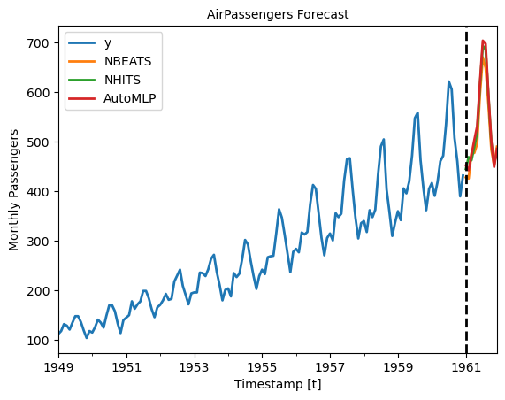

export const quartoRawHtml =
[`<div>
<style scoped>
    .dataframe tbody tr th:only-of-type {
        vertical-align: middle;
    }
    .dataframe tbody tr th {
        vertical-align: top;
    }
    .dataframe thead th {
        text-align: right;
    }
</style>
`,`
</div>`,`<div>
<style scoped>
    .dataframe tbody tr th:only-of-type {
        vertical-align: middle;
    }
    .dataframe tbody tr th {
        vertical-align: top;
    }
    .dataframe thead th {
        text-align: right;
    }
</style>
`,`
</div>`,`<div>
<style scoped>
    .dataframe tbody tr th:only-of-type {
        vertical-align: middle;
    }
    .dataframe tbody tr th {
        vertical-align: top;
    }
    .dataframe thead th {
        text-align: right;
    }
</style>
`,`
</div>`];

Saving and loading trained Deep Learning models has multiple valuable
uses. These models are often costly to train; storing a pre-trained
model can help reduce costs as it can be loaded and reused to forecast
multiple times. Moreover, it enables Transfer learning capabilities,
consisting of pre-training a flexible model on a large dataset and using
it later on other data with little to no training. It is one of the most
outstanding 🚀 achievements in Machine Learning 🧠 and has many
practical applications.

In this notebook we show an example on how to save and load
`NeuralForecast` models.

The two methods to consider are:<br> 1. `NeuralForecast.save`: Saves
models into disk, allows save dataset and config.<br> 2.
`NeuralForecast.load`: Loads models from a given path.<br>

:::important

This Guide assumes basic knowledge on the NeuralForecast library. For a
minimal example visit the [Getting Started](./Getting_Started.ipynb)
guide.

:::

You can run these experiments using GPU with Google Colab.

<a href="https://colab.research.google.com/github/Nixtla/neuralforecast/blob/main/nbs/examples/Save_Load_models.ipynb" target="_parent"></a>

## 1. Installing NeuralForecast {#installing-neuralforecast}

<details>
<summary>Code</summary>

``` python
%%capture
!pip install neuralforecast
```

</details>

## 2. Loading AirPassengers Data {#loading-airpassengers-data}

For this example we will use the classical [AirPassenger Data
set](https://www.kaggle.com/datasets/rakannimer/air-passengers). Import
the pre-processed AirPassenger from `utils`.

<details>
<summary>Code</summary>

``` python
from neuralforecast.utils import AirPassengersDF
```

</details>

``` text
/Users/cchallu/opt/anaconda3/envs/neuralforecast/lib/python3.10/site-packages/tqdm/auto.py:22: TqdmWarning: IProgress not found. Please update jupyter and ipywidgets. See https://ipywidgets.readthedocs.io/en/stable/user_install.html
  from .autonotebook import tqdm as notebook_tqdm
```

<details>
<summary>Code</summary>

``` python
Y_df = AirPassengersDF
Y_df = Y_df.reset_index(drop=True)
Y_df.head()
```

</details>
<div dangerouslySetInnerHTML={{ __html: quartoRawHtml[0] }} />

|     | unique_id | ds         | y     |
|-----|-----------|------------|-------|
| 0   | 1.0       | 1949-01-31 | 112.0 |
| 1   | 1.0       | 1949-02-28 | 118.0 |
| 2   | 1.0       | 1949-03-31 | 132.0 |
| 3   | 1.0       | 1949-04-30 | 129.0 |
| 4   | 1.0       | 1949-05-31 | 121.0 |

<div dangerouslySetInnerHTML={{ __html: quartoRawHtml[1] }} />

## 3. Model Training {#model-training}

Next, we instantiate and train three models: `NBEATS`, `NHITS`, and
`AutoMLP`. The models with their hyperparameters are defined in the
`models` list.

<details>
<summary>Code</summary>

``` python
from ray import tune

from neuralforecast.core import NeuralForecast
from neuralforecast.auto import AutoMLP
from neuralforecast.models import NBEATS, NHITS
```

</details>
<details>
<summary>Code</summary>

``` python
%%capture
horizon = 12
models = [NBEATS(input_size=2 * horizon, h=horizon, max_steps=50),
          NHITS(input_size=2 * horizon, h=horizon, max_steps=50),
          AutoMLP(# Ray tune explore config
                  config=dict(max_steps=100, # Operates with steps not epochs
                              input_size=tune.choice([3*horizon]),
                              learning_rate=tune.choice([1e-3])),
                  h=horizon,
                  num_samples=1, cpus=1)]
```

</details>
<details>
<summary>Code</summary>

``` python
%%capture
nf = NeuralForecast(models=models, freq='M')
nf.fit(df=Y_df)
```

</details>

Produce the forecasts with the `predict` method.

<details>
<summary>Code</summary>

``` python
Y_hat_df = nf.predict().reset_index()
Y_hat_df.head()
```

</details>

``` text
Predicting DataLoader 0: 100%|██████████| 1/1 [00:00<00:00, 98.79it/s] 
Predicting DataLoader 0: 100%|██████████| 1/1 [00:00<00:00, 123.41it/s]
Predicting DataLoader 0: 100%|██████████| 1/1 [00:00<00:00, 161.79it/s]
```

<div dangerouslySetInnerHTML={{ __html: quartoRawHtml[2] }} />

|     | unique_id | ds         | NBEATS     | NHITS      | AutoMLP    |
|-----|-----------|------------|------------|------------|------------|
| 0   | 1.0       | 1961-01-31 | 428.410553 | 445.268158 | 452.550446 |
| 1   | 1.0       | 1961-02-28 | 425.958557 | 469.293945 | 442.683807 |
| 2   | 1.0       | 1961-03-31 | 477.748016 | 462.920807 | 474.043457 |
| 3   | 1.0       | 1961-04-30 | 477.548798 | 489.986633 | 503.836334 |
| 4   | 1.0       | 1961-05-31 | 495.973541 | 518.612610 | 531.347900 |

<div dangerouslySetInnerHTML={{ __html: quartoRawHtml[3] }} />

We plot the forecasts for each model. Note how the two `NBEATS` models
are differentiated with a numerical suffix.

<details>
<summary>Code</summary>

``` python
import pandas as pd
import matplotlib.pyplot as plt
```

</details>
<details>
<summary>Code</summary>

``` python
plot_df = pd.concat([Y_df, Y_hat_df]).set_index('ds') # Concatenate the train and forecast dataframes

plt.figure(figsize = (12, 3))
plot_df[['y', 'NBEATS', 'NHITS', 'AutoMLP']].plot(linewidth=2)

plt.title('AirPassengers Forecast', fontsize=10)
plt.ylabel('Monthly Passengers', fontsize=10)
plt.xlabel('Timestamp [t]', fontsize=10)
plt.axvline(x=plot_df.index[-horizon], color='k', linestyle='--', linewidth=2)
plt.legend(prop={'size': 10})
```

</details>

``` text
<matplotlib.legend.Legend>
```

``` text
<Figure size 1200x300 with 0 Axes>
```



## 4. Save models {#save-models}

To save all the trained models use the `save` method. This method will
save both the hyperparameters and the learnable weights (parameters).

The `save` method has the following inputs:

-   `path`: directory where models will be saved.
-   `model_index`: optional list to specify which models to save. For
    example, to only save the `NHITS` model use `model_index=[2]`.
-   `overwrite`: boolean to overwrite existing files in `path`. When
    True, the method will only overwrite models with conflicting names.
-   `save_dataset`: boolean to save `Dataset` object with the dataset.

<details>
<summary>Code</summary>

``` python
nf.save(path='./checkpoints/test_run/',
        model_index=None, 
        overwrite=True,
        save_dataset=True)
```

</details>

For each model, two files are created and stored:

-   `[model_name]_[suffix].ckpt`: Pytorch Lightning checkpoint file with
    the model parameters and hyperparameters.
-   `[model_name]_[suffix].pkl`: Dictionary with configuration
    attributes.

Where `model_name` corresponds to the name of the model in lowercase
(eg. `nhits`). We use a numerical suffix to distinguish multiple models
of each class. In this example the names will be `automlp_0`,
`nbeats_0`, and `nhits_0`.

:::important

The `Auto` models will be stored as their base model. For example, the
`AutoMLP` trained above is stored as an `MLP` model, with the best
hyparparameters found during tuning.

:::

## 5. Load models {#load-models}

Load the saved models with the `load` method, specifying the `path`, and
use the new `nf2` object to produce forecasts.

<details>
<summary>Code</summary>

``` python
nf2 = NeuralForecast.load(path='./checkpoints/test_run/')
Y_hat_df = nf2.predict().reset_index()
Y_hat_df.head()
```

</details>

``` text
Predicting DataLoader 0: 100%|██████████| 1/1 [00:00<00:00, 153.75it/s]
Predicting DataLoader 0: 100%|██████████| 1/1 [00:00<00:00, 142.04it/s]
Predicting DataLoader 0: 100%|██████████| 1/1 [00:00<00:00, 105.82it/s]
```

<div dangerouslySetInnerHTML={{ __html: quartoRawHtml[4] }} />

|     | unique_id | ds         | MLP        | NHITS      | NBEATS     |
|-----|-----------|------------|------------|------------|------------|
| 0   | 1.0       | 1961-01-31 | 452.550446 | 445.268158 | 428.410553 |
| 1   | 1.0       | 1961-02-28 | 442.683807 | 469.293945 | 425.958557 |
| 2   | 1.0       | 1961-03-31 | 474.043457 | 462.920807 | 477.748016 |
| 3   | 1.0       | 1961-04-30 | 503.836334 | 489.986633 | 477.548798 |
| 4   | 1.0       | 1961-05-31 | 531.347900 | 518.612610 | 495.973541 |

<div dangerouslySetInnerHTML={{ __html: quartoRawHtml[5] }} />

Finally, plot the forecasts to confirm they are identical to the
original forecasts.

<details>
<summary>Code</summary>

``` python
plot_df = pd.concat([Y_df, Y_hat_df]).set_index('ds') # Concatenate the train and forecast dataframes

plt.figure(figsize = (12, 3))
plot_df[['y', 'NBEATS', 'NHITS', 'MLP']].plot(linewidth=2)

plt.title('AirPassengers Forecast', fontsize=10)
plt.ylabel('Monthly Passengers', fontsize=10)
plt.xlabel('Timestamp [t]', fontsize=10)
plt.axvline(x=plot_df.index[-horizon], color='k', linestyle='--', linewidth=2)
plt.legend(prop={'size': 10})
plt.show()
```

</details>

``` text
<Figure size 1200x300 with 0 Axes>
```


## References {#references}

https://pytorch-lightning.readthedocs.io/en/stable/common/checkpointing_basic.html

[Oreshkin, B. N., Carpov, D., Chapados, N., & Bengio, Y. (2019).
N-BEATS: Neural basis expansion analysis for interpretable time series
forecasting. ICLR 2020](https://arxiv.org/abs/1905.10437)

[Cristian Challu, Kin G. Olivares, Boris N. Oreshkin, Federico Garza,
Max Mergenthaler-Canseco, Artur Dubrawski (2021). N-HiTS: Neural
Hierarchical Interpolation for Time Series Forecasting. Accepted at AAAI
2023.](https://arxiv.org/abs/2201.12886)

