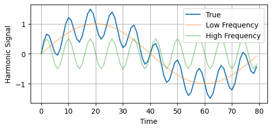
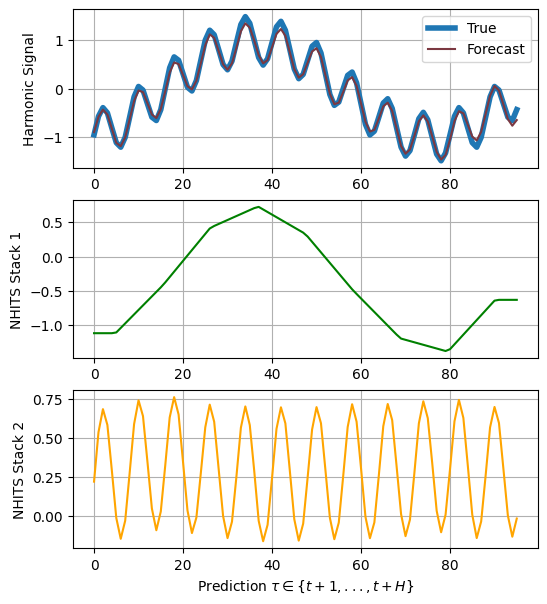

export const quartoRawHtml =
[`
  <div id="df-17f4dcff-5ebf-4609-a39d-18125c1f8372">
    <div class="colab-df-container">
      <div>
<style scoped>
    .dataframe tbody tr th:only-of-type {
        vertical-align: middle;
    }
    .dataframe tbody tr th {
        vertical-align: top;
    }
    .dataframe thead th {
        text-align: right;
    }
</style>
`,`
<p>96 rows × 4 columns</p>
</div>
      <button class="colab-df-convert" onclick="convertToInteractive('df-17f4dcff-5ebf-4609-a39d-18125c1f8372')"
              title="Convert this dataframe to an interactive table."
              style="display:none;">
        
  <svg xmlns="http://www.w3.org/2000/svg" height="24px"viewBox="0 0 24 24"
       width="24px">
    <path d="M0 0h24v24H0V0z" fill="none"/>
    <path d="M18.56 5.44l.94 2.06.94-2.06 2.06-.94-2.06-.94-.94-2.06-.94 2.06-2.06.94zm-11 1L8.5 8.5l.94-2.06 2.06-.94-2.06-.94L8.5 2.5l-.94 2.06-2.06.94zm10 10l.94 2.06.94-2.06 2.06-.94-2.06-.94-.94-2.06-.94 2.06-2.06.94z"/><path d="M17.41 7.96l-1.37-1.37c-.4-.4-.92-.59-1.43-.59-.52 0-1.04.2-1.43.59L10.3 9.45l-7.72 7.72c-.78.78-.78 2.05 0 2.83L4 21.41c.39.39.9.59 1.41.59.51 0 1.02-.2 1.41-.59l7.78-7.78 2.81-2.81c.8-.78.8-2.07 0-2.86zM5.41 20L4 18.59l7.72-7.72 1.47 1.35L5.41 20z"/>
  </svg>
      </button>
      
  <style>
    .colab-df-container {
      display:flex;
      flex-wrap:wrap;
      gap: 12px;
    }
    .colab-df-convert {
      background-color: #E8F0FE;
      border: none;
      border-radius: 50%;
      cursor: pointer;
      display: none;
      fill: #1967D2;
      height: 32px;
      padding: 0 0 0 0;
      width: 32px;
    }
    .colab-df-convert:hover {
      background-color: #E2EBFA;
      box-shadow: 0px 1px 2px rgba(60, 64, 67, 0.3), 0px 1px 3px 1px rgba(60, 64, 67, 0.15);
      fill: #174EA6;
    }
    [theme=dark] .colab-df-convert {
      background-color: #3B4455;
      fill: #D2E3FC;
    }
    [theme=dark] .colab-df-convert:hover {
      background-color: #434B5C;
      box-shadow: 0px 1px 3px 1px rgba(0, 0, 0, 0.15);
      filter: drop-shadow(0px 1px 2px rgba(0, 0, 0, 0.3));
      fill: #FFFFFF;
    }
  </style>
      <script>
        const buttonEl =
          document.querySelector('#df-17f4dcff-5ebf-4609-a39d-18125c1f8372 button.colab-df-convert');
        buttonEl.style.display =
          google.colab.kernel.accessAllowed ? 'block' : 'none';
        async function convertToInteractive(key) {
          const element = document.querySelector('#df-17f4dcff-5ebf-4609-a39d-18125c1f8372');
          const dataTable =
            await google.colab.kernel.invokeFunction('convertToInteractive',
                                                     [key], {});
          if (!dataTable) return;
          const docLinkHtml = 'Like what you see? Visit the ' +
            '<a target="_blank" href=https://colab.research.google.com/notebooks/data_table.ipynb>data table notebook</a>'
            + ' to learn more about interactive tables.';
          element.innerHTML = '';
          dataTable['output_type'] = 'display_data';
          await google.colab.output.renderOutput(dataTable, element);
          const docLink = document.createElement('div');
          docLink.innerHTML = docLinkHtml;
          element.appendChild(docLink);
        }
      </script>
    </div>
  </div>
  `];

[Time series signal
decomposition](https://en.wikipedia.org/wiki/Decomposition_of_time_series)
involves breaking down an original time series into its constituent
components. By decomposing the time series, we can gain insights into
underlying patterns, trends-cycles, and seasonal effects, enabling
improved understanding and forecasting accuracy.

This notebook will show how to use the `NHITS`/`NBEATSx` to extract
these series’ components. We will:<br> - Installing
NeuralForecast.<br> - Simulate a Harmonic Signal.<br> - NHITS’ forecast
decomposition.<br> - NBEATSx’ forecast decomposition.<br>

You can run these experiments using GPU with Google Colab.

<a href="https://colab.research.google.com/github/Nixtla/neuralforecast/blob/main/nbs/examples/Signal_Decomposition.ipynb" target="_parent"></a>

## 1. Installing NeuralForecast. {#installing-neuralforecast.}

<details>
<summary>Code</summary>

``` python
%%capture
!pip install git+https://github.com/Nixtla/neuralforecast.git
```

</details>

## 2. Simulate a Harmonic Signal. {#simulate-a-harmonic-signal.}

In this example, we will consider a Harmonic signal comprising two
frequencies: one low-frequency and one high-frequency.

<details>
<summary>Code</summary>

``` python
import numpy as np
import pandas as pd
```

</details>
<details>
<summary>Code</summary>

``` python
N = 10_000
T = 1.0 / 800.0 # sample spacing
x = np.linspace(0.0, N*T, N, endpoint=False)

y1 = np.sin(10.0 * 2.0*np.pi*x) 
y2 = 0.5 * np.sin(100 * 2.0*np.pi*x)
y = y1 + y2
```

</details>
<details>
<summary>Code</summary>

``` python
import matplotlib.pyplot as plt
plt.rcParams["axes.grid"]=True
```

</details>
<details>
<summary>Code</summary>

``` python
fig, ax = plt.subplots(figsize=(6, 2.5))
plt.plot(y[-80:], label='True')
plt.plot(y1[-80:], label='Low Frequency', alpha=0.4)
plt.plot(y2[-80:], label='High Frequency', alpha=0.4)
plt.ylabel('Harmonic Signal')
plt.xlabel('Time')
plt.legend()
plt.show()
plt.close()
```

</details>



<details>
<summary>Code</summary>

``` python
# Split dataset into train/test
# Last horizon observations for test
horizon = 96
Y_df = pd.DataFrame(dict(unique_id=1, ds=np.arange(len(x)), y=y))
Y_train_df = Y_df.groupby('unique_id').head(len(Y_df)-horizon).reset_index()
Y_test_df = Y_df.groupby('unique_id').tail(horizon).reset_index()
Y_test_df
```

</details>
<div dangerouslySetInnerHTML={{ __html: quartoRawHtml[0] }} />

|     | index | unique_id | ds   | y         |
|-----|-------|-----------|------|-----------|
| 0   | 9904  | 1         | 9904 | -0.951057 |
| 1   | 9905  | 1         | 9905 | -0.570326 |
| 2   | 9906  | 1         | 9906 | -0.391007 |
| 3   | 9907  | 1         | 9907 | -0.499087 |
| 4   | 9908  | 1         | 9908 | -0.809017 |
| ... | ...   | ...       | ...  | ...       |
| 91  | 9995  | 1         | 9995 | -0.029130 |
| 92  | 9996  | 1         | 9996 | -0.309017 |
| 93  | 9997  | 1         | 9997 | -0.586999 |
| 94  | 9998  | 1         | 9998 | -0.656434 |
| 95  | 9999  | 1         | 9999 | -0.432012 |

<div dangerouslySetInnerHTML={{ __html: quartoRawHtml[1] }} />

## 3. NHITS decomposition. {#nhits-decomposition.}

We will employ `NHITS` stack-specialization to recover the latent
harmonic functions.

`NHITS`, a Wavelet-inspired algorithm, allows for breaking down a time
series into various scales or resolutions, aiding in the identification
of localized patterns or features. The expressivity ratios for each
layer enable control over the model’s stack specialization.

<details>
<summary>Code</summary>

``` python
from neuralforecast.models import NHITS, NBEATSx
from neuralforecast import NeuralForecast
from neuralforecast.losses.pytorch import HuberLoss, MQLoss
```

</details>
<details>
<summary>Code</summary>

``` python
%%capture
models = [NHITS(h=horizon,                           # Forecast horizon
                input_size=2 * horizon,              # Length of input sequence
                loss=HuberLoss(),                    # Robust Huber Loss
                max_steps=1000,                      # Number of steps to train
                dropout_prob_theta=0.5,
                interpolation_mode='linear',
                stack_types=['identity']*2,
                n_blocks=[1, 1],
                mlp_units=[[64, 64],[64, 64]],
                n_freq_downsample=[10, 1],           # Inverse expressivity ratios for NHITS' stacks specialization
                val_check_steps=10,                  # Frequency of validation signal (affects early stopping)
              )
          ]
nf = NeuralForecast(models=models, freq='M')
nf.fit(df=Y_train_df)
```

</details>

``` text
INFO:lightning_fabric.utilities.seed:Global seed set to 1
```

<details>
<summary>Code</summary>

``` python
from neuralforecast.tsdataset import TimeSeriesDataset

# NHITS decomposition plot
model = nf.models[0]
dataset, *_ = TimeSeriesDataset.from_df(df = Y_train_df)
y_hat = model.decompose(dataset=dataset)
```

</details>

``` text
Predicting: 0it [00:00, ?it/s]
```

<details>
<summary>Code</summary>

``` python
fig, ax = plt.subplots(3, 1, figsize=(6, 7))

ax[0].plot(Y_test_df['y'].values, label='True', linewidth=4)
ax[0].plot(y_hat.sum(axis=1).flatten(), label='Forecast', color="#7B3841")
ax[0].legend()
ax[0].set_ylabel('Harmonic Signal')

ax[1].plot(y_hat[0,1]+y_hat[0,0], label='stack1', color="green")
ax[1].set_ylabel('NHITS Stack 1')

ax[2].plot(y_hat[0,2], label='stack2', color="orange")
ax[2].set_ylabel('NHITS Stack 2')
ax[2].set_xlabel(r'Prediction $\tau \in \{t+1,..., t+H\}$')
plt.show()
```

</details>



## 4. NBEATSx decomposition. {#nbeatsx-decomposition.}

Here we will employ `NBEATSx` interpretable basis projection to recover
the latent harmonic functions.

`NBEATSx`, this network in its interpretable variant sequentially
projects the signal into polynomials and harmonic basis to learn trend
$T$ and seasonality $S$ components:
$$\hat{y}_{[t+1:t+H]} = \theta_{1} T + \theta_{2} S$$

In contrast to `NHITS`’ wavelet-like projections the basis heavily
determine the behavior of the projections. And the Fourier projections
are not capable of being immediately decomposed into individual
frequencies.

<details>
<summary>Code</summary>

``` python
%%capture
models = [NBEATSx(h=horizon,                           # Forecast horizon
                  input_size=2 * horizon,              # Length of input sequence
                  loss=HuberLoss(),                    # Robust Huber Loss
                  max_steps=1000,                      # Number of steps to train
                  dropout_prob_theta=0.5,
                  stack_types=['trend', 'seasonality'], # Harmonic/Trend projection basis
                  n_polynomials=0,                      # Lower frequencies can be captured by polynomials
                  n_blocks=[1, 1],
                  mlp_units=[[64, 64],[64, 64]],
                  val_check_steps=10,                  # Frequency of validation signal (affects early stopping)
              )
          ]
nf = NeuralForecast(models=models, freq='M')
nf.fit(df=Y_train_df)
```

</details>

``` text
INFO:lightning_fabric.utilities.seed:Global seed set to 1
```

<details>
<summary>Code</summary>

``` python
# NBEATSx decomposition plot
model = nf.models[0]
dataset, *_ = TimeSeriesDataset.from_df(df = Y_train_df)
y_hat = model.decompose(dataset=dataset)
```

</details>

``` text
Predicting: 0it [00:00, ?it/s]
```

<details>
<summary>Code</summary>

``` python
fig, ax = plt.subplots(3, 1, figsize=(6, 7))

ax[0].plot(Y_test_df['y'].values, label='True', linewidth=4)
ax[0].plot(y_hat.sum(axis=1).flatten(), label='Forecast', color="#7B3841")
ax[0].legend()
ax[0].set_ylabel('Harmonic Signal')

ax[1].plot(y_hat[0,1]+y_hat[0,0], label='stack1', color="green")
ax[1].set_ylabel('NBEATSx Trend Stack')

ax[2].plot(y_hat[0,2], label='stack2', color="orange")
ax[2].set_ylabel('NBEATSx Seasonality Stack')
ax[2].set_xlabel(r'Prediction $\tau \in \{t+1,..., t+H\}$')
plt.show()
```

</details>


## References {#references}

-   [Cristian Challu, Kin G. Olivares, Boris N. Oreshkin, Federico
    Garza, Max Mergenthaler-Canseco, Artur Dubrawski (2023). NHITS:
    Neural Hierarchical Interpolation for Time Series
    Forecasting.](https://arxiv.org/abs/2201.12886)<br>
-   [Boris N. Oreshkin, Dmitri Carpov, Nicolas Chapados, Yoshua Bengio
    (2019). “N-BEATS: Neural basis expansion analysis for interpretable
    time series forecasting”.](https://arxiv.org/abs/1905.10437)<br>
-   [Kin G. Olivares, Cristian Challu, Grzegorz Marcjasz, Rafał Weron,
    Artur Dubrawski (2021). “Neural basis expansion analysis with
    exogenous variables: Forecasting electricity prices with
    NBEATSx”.](https://arxiv.org/abs/2104.05522)

