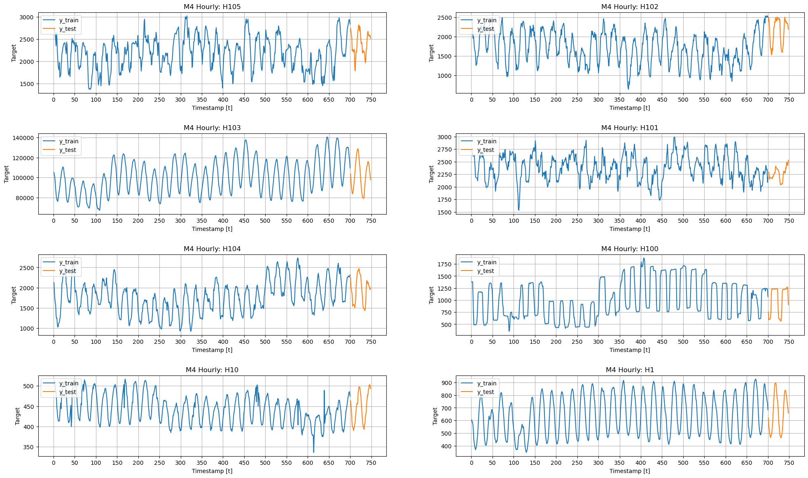
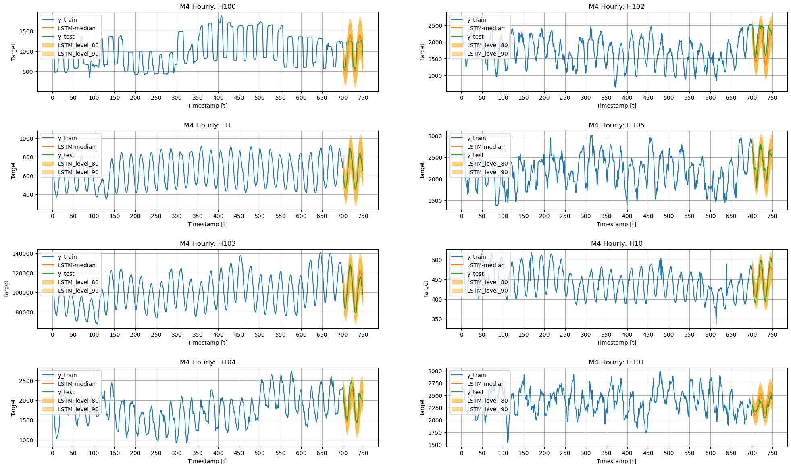
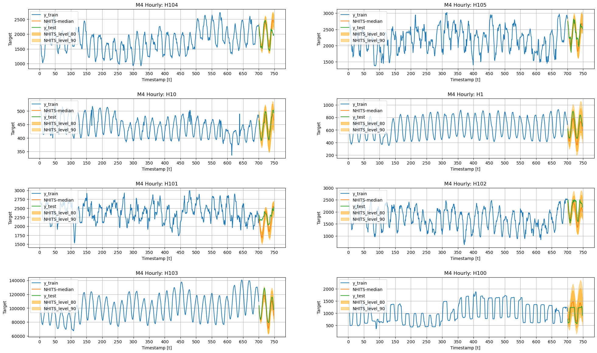

export const quartoRawHtml =
[`<div>
<style scoped>
    .dataframe tbody tr th:only-of-type {
        vertical-align: middle;
    }
    .dataframe tbody tr th {
        vertical-align: top;
    }
    .dataframe thead th {
        text-align: right;
    }
</style>
`,`
</div>`];

> Quantify uncertainty

Probabilistic forecasting is a natural answer to quantify the
uncertainty of target variable’s future. The task requires to model the
following conditional predictive distribution:

$$\mathbb{P}(\mathbf{y}_{t+1:t+H} \;|\; \mathbf{y}_{:t})$$

We will show you how to tackle the task with `NeuralForecast` by
combining a classic Long Short Term Memory Network
[(LSTM)](https://arxiv.org/abs/2201.12886) and the Neural Hierarchical
Interpolation [(NHITS)](https://arxiv.org/abs/2201.12886) with the multi
quantile loss function (MQLoss).

$$ \mathrm{MQLoss}(y_{\tau}, [\hat{y}^{(q1)}_{\tau},\hat{y}^{(q2)}_{\tau},\dots,\hat{y}^{(Q)}_{\tau}]) = \frac{1}{H} \sum_{q} \mathrm{QL}(y_{\tau}, \hat{y}^{(q)}_{\tau}) $$

In this notebook we will:<br> 1. Install NeuralForecast Library<br> 2.
Explore the M4-Hourly data.<br> 3. Train the LSTM and NHITS<br> 4.
Visualize the LSTM/NHITS prediction intervals.

You can run these experiments using GPU with Google Colab.

<a href="https://colab.research.google.com/github/Nixtla/neuralforecast/blob/main/nbs/examples/UncertaintyIntervals.ipynb" target="_parent"></a>

## 1. Installing NeuralForecast {#installing-neuralforecast}

<details>
<summary>Code</summary>

``` python
# %%capture
# !pip install git+https://github.com/Nixtla/neuralforecast.git@main
```

</details>
<details>
<summary>Code</summary>

``` python
import random
import warnings
warnings.filterwarnings("ignore")
from itertools import product

import numpy as np
import pandas as pd
import matplotlib.pyplot as plt

from neuralforecast import NeuralForecast
from neuralforecast.losses.pytorch import MQLoss
from neuralforecast.models import LSTM, DilatedRNN, NHITS
```

</details>

#### Useful functions {#useful-functions}

The `plot_grid` auxiliary function defined below will be useful to plot
different time series, and different models’ forecasts.

<details>
<summary>Code</summary>

``` python
def plot_grid(df_train, df_test=None, plot_random=True, model=None, level=None):
    fig, axes = plt.subplots(4, 2, figsize = (24, 14))

    unique_ids = df_train['unique_id'].unique()

    assert len(unique_ids) >= 8, "Must provide at least 8 ts"
    
    if plot_random:
        unique_ids = random.sample(list(unique_ids), k=8)
    else:
        unique_uids = unique_ids[:8]

    for uid, (idx, idy) in zip(unique_ids, product(range(4), range(2))):
        train_uid = df_train.query('unique_id == @uid')
        axes[idx, idy].plot(train_uid['ds'], train_uid['y'], label = 'y_train')
        if df_test is not None:
            max_ds = train_uid['ds'].max()
            test_uid = df_test.query('unique_id == @uid')
            for col in ['y', f'{model}-median', 'y_test']:
                if col in test_uid:
                    axes[idx, idy].plot(test_uid['ds'], test_uid[col], label=col)
            if level is not None:
                for l, alpha in zip(sorted(level), [0.5, .4, .35, .2]):
                    axes[idx, idy].fill_between(
                        test_uid['ds'], 
                        test_uid[f'{model}-lo-{l}.0'], 
                        test_uid[f'{model}-hi-{l}.0'],
                        alpha=alpha,
                        color='orange',
                        label=f'{model}_level_{l}',
                    )
        axes[idx, idy].set_title(f'M4 Hourly: {uid}')
        axes[idx, idy].set_xlabel('Timestamp [t]')
        axes[idx, idy].set_ylabel('Target')
        axes[idx, idy].legend(loc='upper left')
        axes[idx, idy].xaxis.set_major_locator(plt.MaxNLocator(20))
        axes[idx, idy].grid()
    fig.subplots_adjust(hspace=0.5)
    plt.show()
```

</details>

## 2. Loading M4 Data {#loading-m4-data}

For testing purposes, we will use the Hourly dataset from the [M4
competition](https://www.researchgate.net/publication/325901666_The_M4_Competition_Results_findings_conclusion_and_way_forward).

<details>
<summary>Code</summary>

``` python
%%capture
!wget https://auto-arima-results.s3.amazonaws.com/M4-Hourly.csv
!wget https://auto-arima-results.s3.amazonaws.com/M4-Hourly-test.csv
```

</details>
<details>
<summary>Code</summary>

``` python
Y_train_df = pd.read_csv('M4-Hourly.csv')
Y_test_df = pd.read_csv('M4-Hourly-test.csv').rename(columns={'y': 'y_test'})
```

</details>

In this example we will use a subset of the data to avoid waiting too
long. You can modify the number of series if you want.

<details>
<summary>Code</summary>

``` python
n_series = 8
uids = Y_train_df['unique_id'].unique()[:n_series]
Y_train_df = Y_train_df.query('unique_id in @uids')
Y_test_df = Y_test_df.query('unique_id in @uids')
```

</details>
<details>
<summary>Code</summary>

``` python
plot_grid(Y_train_df, Y_test_df)
```

</details>



## 3. Model Training {#model-training}

The `core.NeuralForecast` provides a high-level interface with our
collection of PyTorch models. `NeuralForecast` is instantiated with a
list of `models=[LSTM(...), NHITS(...)]`, configured for the forecasting
task.

-   The `horizon` parameter controls the number of steps ahead of the
    predictions, in this example 48 hours ahead (2 days).
-   The `MQLoss` with `levels=[80,90]` specializes the network’s output
    into the 80% and 90% prediction intervals.
-   The `max_steps=2000`, controls the duration of the network’s
    training.

For more network’s instantiation details check their
[documentation](https://nixtla.github.io/neuralforecast/models.dilated_rnn.html).

<details>
<summary>Code</summary>

``` python
horizon = 48
levels = [80, 90]
models = [LSTM(input_size=-1, h=horizon,
               loss=MQLoss(level=levels), max_steps=3000),
          NHITS(input_size=7*horizon, h=horizon,
                n_freq_downsample=[24, 12, 1],
                loss=MQLoss(level=levels), max_steps=2000),]
nf = NeuralForecast(models=models, freq='H')
```

</details>

The models are trained using cross-learning, that is a set of correlated
series in `Y_train_df` is used during a shared optimization.

<details>
<summary>Code</summary>

``` python
%%capture
nf.fit(df=Y_train_df)
```

</details>
<details>
<summary>Code</summary>

``` python
Y_hat_df = nf.predict()
Y_hat_df = Y_hat_df.reset_index()
Y_hat_df.head()
```

</details>

``` text
Predicting: 0it [00:00, ?it/s]
```

``` text
Predicting: 0it [00:00, ?it/s]
```

<div dangerouslySetInnerHTML={{ __html: quartoRawHtml[0] }} />

|     | unique_id | ds  | LSTM-median | LSTM-lo-90.0 | LSTM-lo-80.0 | LSTM-hi-80.0 | LSTM-hi-90.0 | NHITS-median | NHITS-lo-90.0 | NHITS-lo-80.0 | NHITS-hi-80.0 | NHITS-hi-90.0 |
|-----|-----------|-----|-------------|--------------|--------------|--------------|--------------|--------------|---------------|---------------|---------------|---------------|
| 0   | H1        | 701 | 661.390320  | 514.213257   | 554.171082   | 772.187317   | 812.635864   | 580.240234   | 457.294403    | 519.597900    | 653.173462    | 709.418884    |
| 1   | H1        | 702 | 608.767395  | 469.444824   | 492.870117   | 723.411987   | 763.704773   | 523.138855   | 417.413483    | 460.784607    | 590.277100    | 656.792969    |
| 2   | H1        | 703 | 553.830139  | 408.536591   | 440.972717   | 675.927063   | 709.604065   | 481.189453   | 377.372284    | 398.614319    | 566.097351    | 602.510559    |
| 3   | H1        | 704 | 509.802368  | 359.942810   | 386.292145   | 633.949219   | 680.044678   | 451.847473   | 353.026123    | 376.023682    | 536.535156    | 573.252197    |
| 4   | H1        | 705 | 479.271240  | 321.798004   | 357.680634   | 608.942566   | 648.161865   | 429.752136   | 316.402679    | 368.250336    | 510.772217    | 576.168213    |

<div dangerouslySetInnerHTML={{ __html: quartoRawHtml[1] }} />

<details>
<summary>Code</summary>

``` python
Y_test_df = Y_test_df.merge(Y_hat_df, how='left', on=['unique_id', 'ds'])
```

</details>

## 4. Plotting Predictions {#plotting-predictions}

Here we finalize our analysis by plotting the prediction intervals and
verifying that both the `LSTM` and `NHITS` are giving reasonable
results.

Consider the output `[NHITS-lo-90.0`, `NHITS-hi-90.0]`, that represents
the 80% prediction interval of the `NHITS` network; its lower limit
gives the 5th percentile (or 0.05 quantile) while its upper limit gives
the 95th percentile (or 0.95 quantile). For well-trained models we
expect that the target values lie within the interval 90% of the time.

### LSTM {#lstm}

<details>
<summary>Code</summary>

``` python
plot_grid(Y_train_df, Y_test_df, level=levels, model='LSTM')
```

</details>



### NHITS {#nhits}

<details>
<summary>Code</summary>

``` python
plot_grid(Y_train_df, Y_test_df, level=levels, model='NHITS')
```

</details>



## References {#references}

-   [Roger Koenker and Gilbert Basset (1978). Regression Quantiles,
    Econometrica.](https://www.jstor.org/stable/1913643)<br>
-   [Jeffrey L. Elman (1990). “Finding Structure in
    Time”.](https://onlinelibrary.wiley.com/doi/abs/10.1207/s15516709cog1402_1)<br>
-   [Cristian Challu, Kin G. Olivares, Boris N. Oreshkin, Federico
    Garza, Max Mergenthaler-Canseco, Artur Dubrawski (2021). NHITS:
    Neural Hierarchical Interpolation for Time Series Forecasting.
    Accepted at AAAI 2023.](https://arxiv.org/abs/2201.12886)<br>

