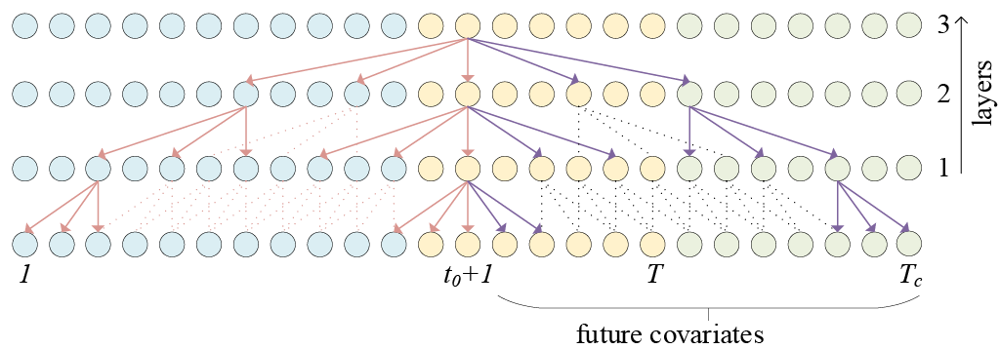

Bidirectional Temporal Convolutional Network (BiTCN) is a forecasting
architecture based on two temporal convolutional networks (TCNs). The
first network (‘forward’) encodes future covariates of the time series,
whereas the second network (‘backward’) encodes past observations and
covariates. This method allows to preserve the temporal information of
sequence data, and is computationally more efficient than common RNN
methods (LSTM, GRU, …). As compared to Transformer-based methods, BiTCN
has a lower space complexity, i.e. it requires orders of magnitude less
parameters.

This model may be a good choice if you seek a small model (small amount
of trainable parameters) with few hyperparameters to tune (only 2).

**References**

- [Olivier Sprangers, Sebastian Schelter, Maarten de
Rijke (2023). Parameter-Efficient Deep Probabilistic Forecasting.
International Journal of Forecasting 39, no. 1 (1 January 2023): 332–45.
URL:
https://doi.org/10.1016/j.ijforecast.2021.11.011.](https://doi.org/10.1016/j.ijforecast.2021.11.011)
- [Shaojie Bai, Zico Kolter, Vladlen Koltun. (2018). An Empirical
Evaluation of Generic Convolutional and Recurrent Networks for Sequence
Modeling. Computing Research Repository, abs/1803.01271. URL:
https://arxiv.org/abs/1803.01271.](https://arxiv.org/abs/1803.01271)
- [van den Oord, A., Dieleman, S., Zen, H., Simonyan, K., Vinyals, O.,
Graves, A., Kalchbrenner, N., Senior, A. W., & Kavukcuoglu, K. (2016).
Wavenet: A generative model for raw audio. Computing Research
Repository, abs/1609.03499. URL: http://arxiv.org/abs/1609.03499.
arXiv:1609.03499.](https://arxiv.org/abs/1609.03499)



*Figure 1. Visualization of a stack of dilated causal convolutional layers.*

## 1. BiTCN

### `BiTCN`

```python
BiTCN(
    h,
    input_size,
    hidden_size=16,
    dropout=0.5,
    futr_exog_list=None,
    hist_exog_list=None,
    stat_exog_list=None,
    exclude_insample_y=False,
    loss=MAE(),
    valid_loss=None,
    max_steps=1000,
    learning_rate=0.001,
    num_lr_decays=-1,
    early_stop_patience_steps=-1,
    val_check_steps=100,
    batch_size=32,
    valid_batch_size=None,
    windows_batch_size=1024,
    inference_windows_batch_size=1024,
    start_padding_enabled=False,
    training_data_availability_threshold=0.0,
    step_size=1,
    scaler_type="identity",
    random_seed=1,
    drop_last_loader=False,
    alias=None,
    optimizer=None,
    optimizer_kwargs=None,
    lr_scheduler=None,
    lr_scheduler_kwargs=None,
    dataloader_kwargs=None,
    **trainer_kwargs
)
```

Bases: <code>[BaseModel](#neuralforecast.common._base_model.BaseModel)</code>

BiTCN

Bidirectional Temporal Convolutional Network (BiTCN) is a forecasting architecture based on two temporal convolutional networks (TCNs). The first network ('forward') encodes future covariates of the time series, whereas the second network ('backward') encodes past observations and covariates. This is a univariate model.

**Parameters:**

Name | Type | Description | Default
---- | ---- | ----------- | -------
`h` | <code>[int](#int)</code> | forecast horizon. | *required*
`input_size` | <code>[int](#int)</code> | considered autorregresive inputs (lags), y=[1,2,3,4] input_size=2 -> lags=[1,2]. | *required*
`hidden_size` | <code>[int](#int)</code> | units for the TCN's hidden state size. Default: 16. | <code>16</code>
`dropout` | <code>[float](#float)</code> | dropout rate used for the dropout layers throughout the architecture. Default: 0.1. | <code>0.5</code>
`futr_exog_list` | <code>[list](#list)</code> | future exogenous columns. | <code>None</code>
`hist_exog_list` | <code>[list](#list)</code> | historic exogenous columns. | <code>None</code>
`stat_exog_list` | <code>[list](#list)</code> | static exogenous columns. | <code>None</code>
`exclude_insample_y` | <code>[bool](#bool)</code> | the model skips the autoregressive features y[t-input_size:t] if True. Default: False. | <code>False</code>
`loss` | <code>[Module](#torch.nn.Module)</code> | PyTorch module, instantiated train loss class from [losses collection](./losses.pytorch). | <code>[MAE](#neuralforecast.losses.pytorch.MAE)()</code>
`valid_loss` | <code>[Module](#torch.nn.Module)</code> | PyTorch module, instantiated valid loss class from [losses collection](./losses.pytorch). | <code>None</code>
`max_steps` | <code>[int](#int)</code> | maximum number of training steps. Default: 1000. | <code>1000</code>
`learning_rate` | <code>[float](#float)</code> | Learning rate between (0, 1). Default: 1e-3. | <code>0.001</code>
`num_lr_decays` | <code>[int](#int)</code> | Number of learning rate decays, evenly distributed across max_steps. Default: -1. | <code>-1</code>
`early_stop_patience_steps` | <code>[int](#int)</code> | Number of validation iterations before early stopping. Default: -1. | <code>-1</code>
`val_check_steps` | <code>[int](#int)</code> | Number of training steps between every validation loss check. Default: 100. | <code>100</code>
`batch_size` | <code>[int](#int)</code> | number of different series in each batch. Default: 32. | <code>32</code>
`valid_batch_size` | <code>[int](#int)</code> | number of different series in each validation and test batch, if None uses batch_size. Default: None. | <code>None</code>
`windows_batch_size` | <code>[int](#int)</code> | number of windows to sample in each training batch, default uses all. Default: 1024. | <code>1024</code>
`inference_windows_batch_size` | <code>[int](#int)</code> | number of windows to sample in each inference batch, -1 uses all. Default: 1024. | <code>1024</code>
`start_padding_enabled` | <code>[bool](#bool)</code> | if True, the model will pad the time series with zeros at the beginning, by input size. Default: False. | <code>False</code>
`training_data_availability_threshold` | <code>[Union](#Union)\[[float](#float), [List](#List)\[[float](#float)\]\]</code> | minimum fraction of valid data points required for training windows. Single float applies to both insample and outsample; list of two floats specifies [insample_fraction, outsample_fraction]. Default 0.0 allows windows with only 1 valid data point (current behavior). Default: 0.0. | <code>0.0</code>
`step_size` | <code>[int](#int)</code> | step size between each window of temporal data. Default: 1. | <code>1</code>
`scaler_type` | <code>[str](#str)</code> | type of scaler for temporal inputs normalization see [temporal scalers](https://github.com/Nixtla/neuralforecast/blob/main/neuralforecast/common/_scalers.py). Default: 'identity'. | <code>'identity'</code>
`random_seed` | <code>[int](#int)</code> | random_seed for pytorch initializer and numpy generators. Default: 1. | <code>1</code>
`drop_last_loader` | <code>[bool](#bool)</code> | if True `TimeSeriesDataLoader` drops last non-full batch. Default: False. | <code>False</code>
`alias` | <code>[str](#str)</code> | optional, Custom name of the model. Default: None. | <code>None</code>
`optimizer` | <code>Subclass of 'torch.optim.Optimizer'</code> | optional, user specified optimizer instead of the default choice (Adam). | <code>None</code>
`optimizer_kwargs` | <code>[dict](#dict)</code> | optional, list of parameters used by the user specified `optimizer`. | <code>None</code>
`lr_scheduler` | <code>Subclass of 'torch.optim.lr_scheduler.LRScheduler'</code> | optional, user specified lr_scheduler instead of the default choice (StepLR). | <code>None</code>
`lr_scheduler_kwargs` | <code>[dict](#dict)</code> | optional, list of parameters used by the user specified `lr_scheduler`. | <code>None</code>
`dataloader_kwargs` | <code>[dict](#dict)</code> | optional, list of parameters passed into the PyTorch Lightning dataloader by the `TimeSeriesDataLoader`. | <code>None</code>
`**trainer_kwargs` | <code>[int](#int)</code> | keyword trainer arguments inherited from [PyTorch Lighning's trainer](https://pytorch-lightning.readthedocs.io/en/stable/api/pytorch_lightning.trainer.trainer.Trainer.html?highlight=trainer). | <code>{}</code>

<details class="references" open markdown="1">
<summary>References</summary>

- [Olivier Sprangers, Sebastian Schelter, Maarten de Rijke (2023). Parameter-Efficient Deep Probabilistic Forecasting. International Journal of Forecasting 39, no. 1 (1 January 2023): 333-345.](https://doi.org/10.1016/j.ijforecast.2021.11.011)

</details>

#### `BiTCN.fit`

```python
fit(
    dataset, val_size=0, test_size=0, random_seed=None, distributed_config=None
)
```

Fit.

The `fit` method, optimizes the neural network's weights using the
initialization parameters (`learning_rate`, `windows_batch_size`, ...)
and the `loss` function as defined during the initialization.
Within `fit` we use a PyTorch Lightning `Trainer` that
inherits the initialization's `self.trainer_kwargs`, to customize
its inputs, see [PL's trainer arguments](https://pytorch-lightning.readthedocs.io/en/stable/api/pytorch_lightning.trainer.trainer.Trainer.html?highlight=trainer).

The method is designed to be compatible with SKLearn-like classes
and in particular to be compatible with the StatsForecast library.

By default the `model` is not saving training checkpoints to protect
disk memory, to get them change `enable_checkpointing=True` in `__init__`.

**Parameters:**

Name | Type | Description | Default
---- | ---- | ----------- | -------
`dataset` | <code>[TimeSeriesDataset](#TimeSeriesDataset)</code> | NeuralForecast's `TimeSeriesDataset`, see [documentation](./tsdataset). | *required*
`val_size` | <code>[int](#int)</code> | Validation size for temporal cross-validation. | <code>0</code>
`random_seed` | <code>[int](#int)</code> | Random seed for pytorch initializer and numpy generators, overwrites model.__init__'s. | <code>None</code>
`test_size` | <code>[int](#int)</code> | Test size for temporal cross-validation. | <code>0</code>

**Returns:**

Type | Description
---- | -----------
| None

#### `BiTCN.predict`

```python
predict(
    dataset,
    test_size=None,
    step_size=1,
    random_seed=None,
    quantiles=None,
    h=None,
    explainer_config=None,
    **data_module_kwargs
)
```

Predict.

Neural network prediction with PL's `Trainer` execution of `predict_step`.

**Parameters:**

Name | Type | Description | Default
---- | ---- | ----------- | -------
`dataset` | <code>[TimeSeriesDataset](#TimeSeriesDataset)</code> | NeuralForecast's `TimeSeriesDataset`, see [documentation](./tsdataset). | *required*
`test_size` | <code>[int](#int)</code> | Test size for temporal cross-validation. | <code>None</code>
`step_size` | <code>[int](#int)</code> | Step size between each window. | <code>1</code>
`random_seed` | <code>[int](#int)</code> | Random seed for pytorch initializer and numpy generators, overwrites model.__init__'s. | <code>None</code>
`quantiles` | <code>[list](#list)</code> | Target quantiles to predict. | <code>None</code>
`h` | <code>[int](#int)</code> | Prediction horizon, if None, uses the model's fitted horizon. Defaults to None. | <code>None</code>
`explainer_config` | <code>[dict](#dict)</code> | configuration for explanations. | <code>None</code>
`**data_module_kwargs` | <code>[dict](#dict)</code> | PL's TimeSeriesDataModule args, see [documentation](https://pytorch-lightning.readthedocs.io/en/1.6.1/extensions/datamodules.html#using-a-datamodule). | <code>{}</code>

**Returns:**

Type | Description
---- | -----------
| None

### Usage Example


```python
import pandas as pd
import matplotlib.pyplot as plt

from neuralforecast import NeuralForecast
from neuralforecast.losses.pytorch import GMM
from neuralforecast.models import BiTCN
from neuralforecast.utils import AirPassengersPanel, AirPassengersStatic

Y_train_df = AirPassengersPanel[AirPassengersPanel.ds<AirPassengersPanel['ds'].values[-12]] # 132 train
Y_test_df = AirPassengersPanel[AirPassengersPanel.ds>=AirPassengersPanel['ds'].values[-12]].reset_index(drop=True) # 12 test

fcst = NeuralForecast(
    models=[
            BiTCN(h=12,
                input_size=24,
                loss=GMM(n_components=7, level=[80,90]),
                max_steps=100,
                scaler_type='standard',
                futr_exog_list=['y_[lag12]'],
                hist_exog_list=None,
                stat_exog_list=['airline1'],
                windows_batch_size=2048,
                val_check_steps=10,
                early_stop_patience_steps=-1,
                ),     
    ],
    freq='ME'
)
fcst.fit(df=Y_train_df, static_df=AirPassengersStatic)
forecasts = fcst.predict(futr_df=Y_test_df)

# Plot quantile predictions
Y_hat_df = forecasts.reset_index(drop=False).drop(columns=['unique_id','ds'])
plot_df = pd.concat([Y_test_df, Y_hat_df], axis=1)
plot_df = pd.concat([Y_train_df, plot_df])

plot_df = plot_df[plot_df.unique_id=='Airline1'].drop('unique_id', axis=1)
plt.plot(plot_df['ds'], plot_df['y'], c='black', label='True')
plt.plot(plot_df['ds'], plot_df['BiTCN-median'], c='blue', label='median')
plt.fill_between(x=plot_df['ds'][-12:], 
                 y1=plot_df['BiTCN-lo-90'][-12:].values,
                 y2=plot_df['BiTCN-hi-90'][-12:].values,
                 alpha=0.4, label='level 90')
plt.legend()
plt.grid()
```

## 2. Auxilary functions

### `TCNCell`

```python
TCNCell(
    in_channels,
    out_channels,
    kernel_size,
    padding,
    dilation,
    mode,
    groups,
    dropout,
)
```

Bases: <code>[Module](#torch.nn.Module)</code>

Temporal Convolutional Network Cell, consisting of CustomConv1D modules.

### `CustomConv1d`

```python
CustomConv1d(
    in_channels,
    out_channels,
    kernel_size,
    padding=0,
    dilation=1,
    mode="backward",
    groups=1,
)
```

Bases: <code>[Module](#torch.nn.Module)</code>

Forward- and backward looking Conv1D
