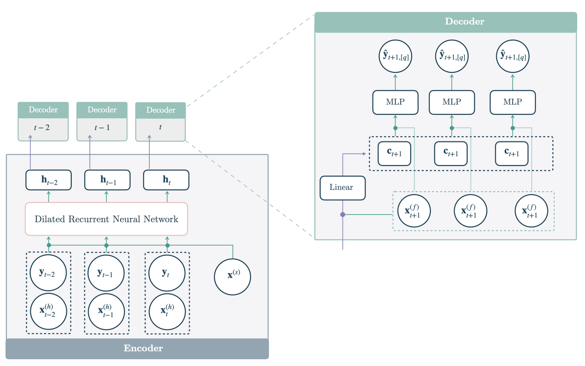

The Dilated Recurrent Neural Network
([`DilatedRNN`](https://nixtlaverse.nixtla.io/neuralforecast/models.dilated_rnn.html#dilatedrnn))
addresses common challenges of modeling long sequences like vanishing
gradients, computational efficiency, and improved model flexibility to
model complex relationships while maintaining its parsimony. The
[`DilatedRNN`](https://nixtlaverse.nixtla.io/neuralforecast/models.dilated_rnn.html#dilatedrnn)
builds a deep stack of RNN layers using skip conditions on the temporal
and the network’s depth dimensions. The temporal dilated recurrent skip
connections offer the capability to focus on multi-resolution inputs.The
predictions are obtained by transforming the hidden states into contexts
$\mathbf{c}_{[t+1:t+H]}$, that are decoded and adapted into
$\mathbf{\hat{y}}_{[t+1:t+H],[q]}$ through MLPs.

where $\mathbf{h}_{t}$, is the hidden state for time $t$,
$\mathbf{y}_{t}$ is the input at time $t$ and $\mathbf{h}_{t-1}$ is the
hidden state of the previous layer at $t-1$, $\mathbf{x}^{(s)}$ are
static exogenous inputs, $\mathbf{x}^{(h)}_{t}$ historic exogenous,
$\mathbf{x}^{(f)}_{[:t+H]}$ are future exogenous available at the time
of the prediction.

**References**
-[Shiyu Chang, et al. “Dilated Recurrent Neural
Networks”.](https://arxiv.org/abs/1710.02224)
-[Yao Qin, et al. “A
Dual-Stage Attention-Based recurrent neural network for time series
prediction”.](https://arxiv.org/abs/1704.02971)
-[Kashif Rasul, et
al. “Zalando Research: PyTorch Dilated Recurrent Neural
Networks”.](https://arxiv.org/abs/1710.02224)



*Figure 1. Three layer DilatedRNN with
dilation 1, 2, 4.*

## Dilated RNN


## Usage Example


```python
import pandas as pd
import matplotlib.pyplot as plt

from neuralforecast import NeuralForecast
from neuralforecast.models import DilatedRNN
from neuralforecast.losses.pytorch import DistributionLoss
from neuralforecast.utils import AirPassengersPanel, AirPassengersStatic

Y_train_df = AirPassengersPanel[AirPassengersPanel.ds<AirPassengersPanel['ds'].values[-12]] # 132 train
Y_test_df = AirPassengersPanel[AirPassengersPanel.ds>=AirPassengersPanel['ds'].values[-12]].reset_index(drop=True) # 12 test

fcst = NeuralForecast(
    models=[DilatedRNN(h=12,
                       input_size=-1,
                       loss=DistributionLoss(distribution='Normal', level=[80, 90]),
                       scaler_type='robust',
                       encoder_hidden_size=100,
                       max_steps=200,
                       futr_exog_list=['y_[lag12]'],
                       hist_exog_list=None,
                       stat_exog_list=['airline1'],
    )
    ],
    freq='ME'
)
fcst.fit(df=Y_train_df, static_df=AirPassengersStatic)
forecasts = fcst.predict(futr_df=Y_test_df)

Y_hat_df = forecasts.reset_index(drop=False).drop(columns=['unique_id','ds'])
plot_df = pd.concat([Y_test_df, Y_hat_df], axis=1)
plot_df = pd.concat([Y_train_df, plot_df])

plot_df = plot_df[plot_df.unique_id=='Airline1'].drop('unique_id', axis=1)
plt.plot(plot_df['ds'], plot_df['y'], c='black', label='True')
plt.plot(plot_df['ds'], plot_df['DilatedRNN-median'], c='blue', label='median')
plt.fill_between(x=plot_df['ds'][-12:], 
                 y1=plot_df['DilatedRNN-lo-90'][-12:].values, 
                 y2=plot_df['DilatedRNN-hi-90'][-12:].values,
                 alpha=0.4, label='level 90')
plt.legend()
plt.grid()
plt.plot()
```
