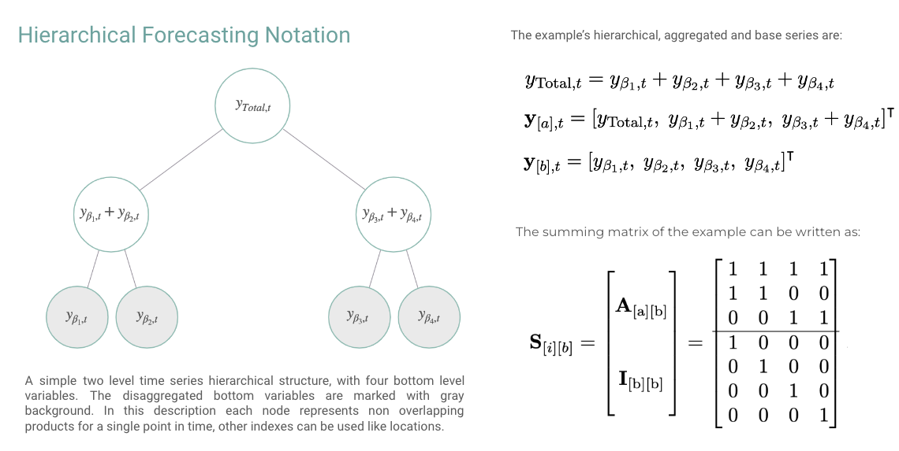

The Hierarchical Mixture Networks (HINT) are a highly modular framework
that combines SoTA neural forecast architectures with task-specialized
mixture probability and advanced hierarchical reconciliation strategies.
This powerful combination allows HINT to produce accurate and coherent
probabilistic forecasts.

HINT’s incorporates a `TemporalNorm` module into any neural forecast
architecture, the module normalizes inputs into the network’s
non-linearities operating range and recomposes its output’s scales
through a global skip connection, improving accuracy and training
robustness. HINT ensures the forecast coherence via bootstrap sample
reconciliation that restores the aggregation constraints into its base
samples.

**References**

- [Kin G. Olivares, David Luo, Cristian Challu,
Stefania La Vattiata, Max Mergenthaler, Artur Dubrawski (2023). “HINT:
Hierarchical Mixture Networks For Coherent Probabilistic Forecasting”.
Neural Information Processing Systems, submitted. Working Paper version
available at arxiv.](https://arxiv.org/abs/2305.07089)
- [Kin G.
Olivares, O. Nganba Meetei, Ruijun Ma, Rohan Reddy, Mengfei Cao, Lee
Dicker (2022).”Probabilistic Hierarchical Forecasting with Deep Poisson
Mixtures”. International Journal Forecasting, accepted paper available
at arxiv.](https://arxiv.org/pdf/2110.13179.pdf)
- [Kin G. Olivares,
Federico Garza, David Luo, Cristian Challu, Max Mergenthaler, Souhaib
Ben Taieb, Shanika Wickramasuriya, and Artur Dubrawski (2022).
“HierarchicalForecast: A reference framework for hierarchical
forecasting in python”. Journal of Machine Learning Research, submitted,
abs/2207.03517, 2022b.](https://arxiv.org/abs/2207.03517)


*Figure 1. Hierarchical Mixture Networks
(HINT).*

## 1. HINT

### `HINT`

```python
HINT(h, S, model, reconciliation, alias=None)
```

HINT

The Hierarchical Mixture Networks (HINT) are a highly modular framework that
combines SoTA neural forecast architectures with a task-specialized mixture
probability and advanced hierarchical reconciliation strategies. This powerful
combination allows HINT to produce accurate and coherent probabilistic forecasts.

HINT's incorporates a `TemporalNorm` module into any neural forecast architecture,
the module normalizes inputs into the network's non-linearities operating range
and recomposes its output's scales through a global skip connection, improving
accuracy and training robustness. HINT ensures the forecast coherence via bootstrap
sample reconciliation that restores the aggregation constraints into its base samples.

<details class="available-reconciliations" open markdown="1">
<summary>Available reconciliations</summary>

- BottomUp
- MinTraceOLS
- MinTraceWLS

</details>

- Identity

**Parameters:**

Name | Type | Description | Default
---- | ---- | ----------- | -------
`h` | <code>[int](#int)</code> | Forecast horizon. | *required*
`model` | <code>NeuralForecast model</code> | Instantiated model class from [architecture collection](./models). | *required*
`S` | <code>[ndarray](#numpy.ndarray)</code> | Dumming matrix of size (`base`, `bottom`) see HierarchicalForecast's [aggregate method](../hierarchicalforecast/utils#function-aggregate). | *required*
`reconciliation` | <code>[str](#str)</code> | HINT's reconciliation method from ['BottomUp', 'MinTraceOLS', 'MinTraceWLS']. | *required*
`alias` | <code>[str](#str)</code> | Custom name of the model. | <code>None</code>

#### `HINT.fit`

```python
fit(
    dataset, val_size=0, test_size=0, random_seed=None, distributed_config=None
)
```

HINT.fit

HINT trains on the entire hierarchical dataset, by minimizing a composite log
likelihood objective. HINT framework integrates `TemporalNorm` into the neural
forecast architecture for a scale-decoupled optimization that robustifies
cross-learning the hierachy's series scales.

**Parameters:**

Name | Type | Description | Default
---- | ---- | ----------- | -------
`dataset` | <code>[TimeSeriesDataset](#TimeSeriesDataset)</code> | NeuralForecast's `TimeSeriesDataset` see details [here](./tsdataset) | *required*
`val_size` | <code>[int](#int)</code> | size of the validation set, (default 0). | <code>0</code>
`test_size` | <code>[int](#int)</code> | size of the test set, (default 0). | <code>0</code>
`random_seed` | <code>[int](#int)</code> | random seed for the prediction. | <code>None</code>

**Returns:**

Name | Type | Description
---- | ---- | -----------
`self` | | A fitted base `NeuralForecast` model.

#### `HINT.predict`

```python
predict(dataset, step_size=1, random_seed=None, **data_module_kwargs)
```

HINT.predict

After fitting a base model on the entire hierarchical dataset.
HINT restores the hierarchical aggregation constraints using
bootstrapped sample reconciliation.

**Parameters:**

Name | Type | Description | Default
---- | ---- | ----------- | -------
`dataset` | <code>[TimeSeriesDataset](#TimeSeriesDataset)</code> | NeuralForecast's `TimeSeriesDataset` see details [here](./tsdataset) | *required*
`step_size` | <code>[int](#int)</code> | steps between sequential predictions, (default 1). | <code>1</code>
`random_seed` | <code>[int](#int)</code> | random seed for the prediction. | <code>None</code>
`**data_kwarg` | | additional parameters for the dataset module. | *required*

**Returns:**

Name | Type | Description
---- | ---- | -----------
`y_hat` | | numpy predictions of the `NeuralForecast` model.

### Usage Example

In this example we will use HINT for the hierarchical forecast task, a
multivariate regression problem with aggregation constraints. The
aggregation constraints can be compactcly represented by the summing
matrix $\mathbf{S}_{[i][b]}$, the Figure belows shows an example.

In this example we will make coherent predictions for the TourismL
dataset.

Outline:

1. Import packages
2. Load hierarchical dataset
3. Fit and Predict HINT
4. Forecast Plot




```python
import matplotlib.pyplot as plt

from neuralforecast.losses.pytorch import GMM, sCRPS
from datasetsforecast.hierarchical import HierarchicalData

# Auxiliary sorting
def sort_df_hier(Y_df, S_df):
    # NeuralForecast core, sorts unique_id lexicographically
    # by default, this class matches S_df and Y_hat_df order.    
    Y_df.unique_id = Y_df.unique_id.astype('category')
    Y_df.unique_id = Y_df.unique_id.cat.set_categories(S_df.index)
    Y_df = Y_df.sort_values(by=['unique_id', 'ds'])
    return Y_df

# Load TourismSmall dataset
horizon = 12
Y_df, S_df, tags = HierarchicalData.load('./data', 'TourismLarge')
Y_df['ds'] = pd.to_datetime(Y_df['ds'])
Y_df = sort_df_hier(Y_df, S_df)
level = [80,90]

# Instantiate HINT
# BaseNetwork + Distribution + Reconciliation
nhits = NHITS(h=horizon,
              input_size=24,
              loss=GMM(n_components=10, level=level),
              max_steps=2000,
              early_stop_patience_steps=10,
              val_check_steps=50,
              scaler_type='robust',
              learning_rate=1e-3,
              valid_loss=sCRPS(level=level))

model = HINT(h=horizon, S=S_df.values,
             model=nhits,  reconciliation='BottomUp')

# Fit and Predict
nf = NeuralForecast(models=[model], freq='MS')
Y_hat_df = nf.cross_validation(df=Y_df, val_size=12, n_windows=1)
Y_hat_df = Y_hat_df.reset_index()
```


```python
# Plot coherent probabilistic forecast
unique_id = 'TotalAll'
Y_plot_df = Y_df[Y_df.unique_id==unique_id]
plot_df = Y_hat_df[Y_hat_df.unique_id==unique_id]
plot_df = Y_plot_df.merge(plot_df, on=['ds', 'unique_id'], how='left')
n_years = 5

plt.plot(plot_df['ds'][-12*n_years:], plot_df['y_x'][-12*n_years:], c='black', label='True')
plt.plot(plot_df['ds'][-12*n_years:], plot_df['HINT'][-12*n_years:], c='purple', label='mean')
plt.plot(plot_df['ds'][-12*n_years:], plot_df['HINT-median'][-12*n_years:], c='blue', label='median')
plt.fill_between(x=plot_df['ds'][-12*n_years:],
                 y1=plot_df['HINT-lo-90'][-12*n_years:].values,
                 y2=plot_df['HINT-hi-90'][-12*n_years:].values,
                 alpha=0.4, label='level 90')
plt.legend()
plt.grid()
plt.plot()
```

## 2. Reconciliation Methods

### `get_identity_P`

```python
get_identity_P(S)
```

### `get_bottomup_P`

```python
get_bottomup_P(S)
```

BottomUp Reconciliation Matrix.

Creates BottomUp hierarchical "projection" matrix is defined as:

```math
\mathbf{P}_{\text{BU}} = [\mathbf{0}_{\mathrm{[b],[a]}}\;|\;\mathbf{I}_{\mathrm{[b][b]}}]
```

**Parameters:**

Name | Type | Description | Default
---- | ---- | ----------- | -------
`S` | <code>[ndarray](#numpy.ndarray)</code> | Summing matrix of size (`base`, `bottom`). | *required*

**Returns:**

Type | Description
---- | -----------
| np.ndarray: Reconciliation matrix of size (`bottom`, `base`).

<details class="references" open markdown="1">
<summary>References</summary>

- [Orcutt, G.H., Watts, H.W., & Edwards, J.B.(1968). "Data aggregation and information loss". The American Economic Review, 58 , 773(787)](http://www.jstor.org/stable/1815532).

</details>

### `get_mintrace_ols_P`

```python
get_mintrace_ols_P(S)
```

MinTraceOLS Reconciliation Matrix.

Creates MinTraceOLS reconciliation matrix as proposed by Wickramasuriya et al.

```math
\mathbf{P}_{\text{MinTraceOLS}}=\left(\mathbf{S}^{\intercal}\mathbf{S}\right)^{-1}\mathbf{S}^{\intercal}
```

**Parameters:**

Name | Type | Description | Default
---- | ---- | ----------- | -------
`S` | <code>[ndarray](#numpy.ndarray)</code> | Summing matrix of size (`base`, `bottom`). | *required*

**Returns:**

Type | Description
---- | -----------
| np.ndarray: Reconciliation matrix of size (`bottom`, `base`).

<details class="references" open markdown="1">
<summary>References</summary>

- [Wickramasuriya, S.L., Turlach, B.A. & Hyndman, R.J. (2020). "Optimal non-negative forecast reconciliation". Stat Comput 30, 1167-1182, https://doi.org/10.1007/s11222-020-09930-0](https://robjhyndman.com/publications/nnmint/).

</details>

### `get_mintrace_wls_P`

```python
get_mintrace_wls_P(S)
```

MinTraceOLS Reconciliation Matrix.

Creates MinTraceOLS reconciliation matrix as proposed by Wickramasuriya et al.
Depending on a weighted GLS estimator and an estimator of the covariance matrix of the coherency errors $\\mathbf{W}\_{h}$.

```math
\mathbf{W}_{h} = \mathrm{Diag}(\mathbf{S} \mathbb{1}_{[b]})
```

```math
\mathbf{P}_{\text{MinTraceWLS}}=\left(\mathbf{S}^{\intercal}\mathbf{W}_{h}\mathbf{S}\right)^{-1}
\mathbf{S}^{\intercal}\mathbf{W}^{-1}_{h}
```

**Parameters:**

Name | Type | Description | Default
---- | ---- | ----------- | -------
`S` | <code>[ndarray](#numpy.ndarray)</code> | Summing matrix of size (`base`, `bottom`). | *required*

**Returns:**

Type | Description
---- | -----------
| np.ndarray: Reconciliation matrix of size (`bottom`, `base`).

<details class="references" open markdown="1">
<summary>References</summary>

- [Wickramasuriya, S.L., Turlach, B.A. & Hyndman, R.J. (2020). "Optimal non-negative forecast reconciliation". Stat Comput 30, 1167-1182, https://doi.org/10.1007/s11222-020-09930-0](https://robjhyndman.com/publications/nnmint/).

</details>
