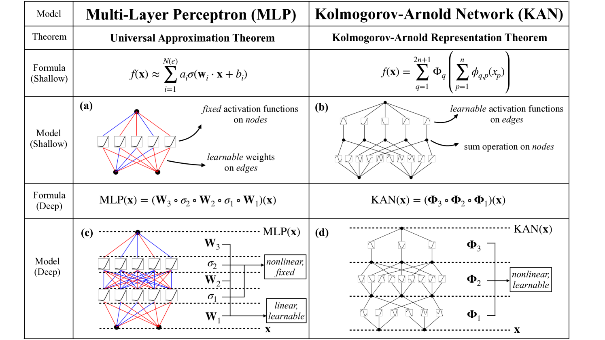

Kolmogorov-Arnold Networks (KANs) are an alternative to Multi-Layer
Perceptrons (MLPs). This model uses KANs similarly as our MLP model.

**References**

- [Ziming Liu, Yixuan Wang, Sachin Vaidya, Fabian Ruehle,
James Halverson, Marin Soljačić, Thomas Y. Hou, Max Tegmark. “KAN:
Kolmogorov–Arnold Networks”](https://arxiv.org/html/2404.19756v1)


*Figure 1. KAN compared to
MLP.*

## 1. KAN

### `KAN`

```python
KAN(
    h,
    input_size,
    grid_size=5,
    spline_order=3,
    scale_noise=0.1,
    scale_base=1.0,
    scale_spline=1.0,
    enable_standalone_scale_spline=True,
    grid_eps=0.02,
    grid_range=[-1, 1],
    n_hidden_layers=1,
    hidden_size=512,
    stat_exog_list=None,
    hist_exog_list=None,
    futr_exog_list=None,
    exclude_insample_y=False,
    loss=MAE(),
    valid_loss=None,
    max_steps=1000,
    learning_rate=0.001,
    num_lr_decays=-1,
    early_stop_patience_steps=-1,
    val_check_steps=100,
    batch_size=32,
    valid_batch_size=None,
    windows_batch_size=1024,
    inference_windows_batch_size=-1,
    start_padding_enabled=False,
    training_data_availability_threshold=0.0,
    step_size=1,
    scaler_type="identity",
    random_seed=1,
    drop_last_loader=False,
    alias=None,
    optimizer=None,
    optimizer_kwargs=None,
    dataloader_kwargs=None,
    **trainer_kwargs
)
```

Bases: <code>[BaseModel](#neuralforecast.common._base_model.BaseModel)</code>

KAN

Simple Kolmogorov-Arnold Network (KAN).
This network uses the Kolmogorov-Arnold approximation theorem, where splines
are learned to approximate more complex functions. Unlike the MLP, the
non-linear function are learned at the edges, and the nodes simply sum
the different learned functions.

**Parameters:**

Name | Type | Description | Default
---- | ---- | ----------- | -------
`h` | <code>[int](#int)</code> | forecast horizon. | *required*
`input_size` | <code>[int](#int)</code> | considered autorregresive inputs (lags), y=[1,2,3,4] input_size=2 -> lags=[1,2]. | *required*
`grid_size` | <code>[int](#int)</code> | number of intervals used by the splines to approximate the function. | <code>5</code>
`spline_order` | <code>[int](#int)</code> | order of the B-splines. | <code>3</code>
`scale_noise` | <code>[float](#float)</code> | regularization coefficient for the splines. | <code>0.1</code>
`scale_base` | <code>[float](#float)</code> | scaling coefficient for the base function. | <code>1.0</code>
`scale_spline` | <code>[float](#float)</code> | scaling coefficient for the splines. | <code>1.0</code>
`enable_standalone_scale_spline` | <code>[bool](#bool)</code> | whether each spline is scaled individually. | <code>True</code>
`grid_eps` | <code>[float](#float)</code> | used for numerical stability. | <code>0.02</code>
`grid_range` | <code>[list](#list)</code> | range of the grid used for spline approximation. | <code>[-1, 1]</code>
`n_hidden_layers` | <code>[int](#int)</code> | number of hidden layers for the KAN. | <code>1</code>
`hidden_size` | <code>[int](#int) or [list](#list)</code> | number of units for each hidden layer of the KAN. If an integer, all hidden layers will have the same size. Use a list to specify the size of each hidden layer. | <code>512</code>
`stat_exog_list` | <code>str list</code> | static exogenous columns. | <code>None</code>
`hist_exog_list` | <code>str list</code> | historic exogenous columns. | <code>None</code>
`futr_exog_list` | <code>str list</code> | future exogenous columns. | <code>None</code>
`exclude_insample_y` | <code>[bool](#bool)</code> | the model skips the autoregressive features y[t-input_size:t] if True. | <code>False</code>
`loss` | <code>PyTorch module</code> | instantiated train loss class from [losses collection](./losses.pytorch). | <code>[MAE](#neuralforecast.losses.pytorch.MAE)()</code>
`valid_loss` | <code>PyTorch module</code> | instantiated valid loss class from [losses collection](./losses.pytorch). | <code>None</code>
`max_steps` | <code>[int](#int)</code> | maximum number of training steps. | <code>1000</code>
`learning_rate` | <code>[float](#float)</code> | Learning rate between (0, 1). | <code>0.001</code>
`num_lr_decays` | <code>[int](#int)</code> | Number of learning rate decays, evenly distributed across max_steps. | <code>-1</code>
`early_stop_patience_steps` | <code>[int](#int)</code> | Number of validation iterations before early stopping. | <code>-1</code>
`val_check_steps` | <code>[int](#int)</code> | Number of training steps between every validation loss check. | <code>100</code>
`batch_size` | <code>[int](#int)</code> | number of different series in each batch. | <code>32</code>
`valid_batch_size` | <code>[int](#int)</code> | number of different series in each validation and test batch, if None uses batch_size. | <code>None</code>
`windows_batch_size` | <code>[int](#int)</code> | number of windows to sample in each training batch, default uses all. | <code>1024</code>
`inference_windows_batch_size` | <code>[int](#int)</code> | number of windows to sample in each inference batch, -1 uses all. | <code>-1</code>
`start_padding_enabled` | <code>[bool](#bool)</code> | if True, the model will pad the time series with zeros at the beginning, by input size. | <code>False</code>
`training_data_availability_threshold` | <code>[Union](#typing.Union)\[[float](#float), [List](#List)\[[float](#float)\]\]</code> | minimum fraction of valid data points required for training windows. Single float applies to both insample and outsample; list of two floats specifies [insample_fraction, outsample_fraction]. Default 0.0 allows windows with only 1 valid data point (current behavior). | <code>0.0</code>
`step_size` | <code>[int](#int)</code> | step size between each window of temporal data. | <code>1</code>
`scaler_type` | <code>[str](#str)</code> | type of scaler for temporal inputs normalization see [temporal scalers](https://github.com/Nixtla/neuralforecast/blob/main/neuralforecast/common/_scalers.py). | <code>'identity'</code>
`random_seed` | <code>[int](#int)</code> | random_seed for pytorch initializer and numpy generators. | <code>1</code>
`drop_last_loader` | <code>[bool](#bool)</code> | if True `TimeSeriesDataLoader` drops last non-full batch. | <code>False</code>
`alias` | <code>[str](#str)</code> | optional, Custom name of the model. | <code>None</code>
`optimizer` | <code>Subclass of 'torch.optim.Optimizer'</code> | optional, user specified optimizer instead of the default choice (Adam). | <code>None</code>
`optimizer_kwargs` | <code>[dict](#dict)</code> | optional, list of parameters used by the user specified `optimizer`. | <code>None</code>
`dataloader_kwargs` | <code>[dict](#dict)</code> | optional, list of parameters passed into the PyTorch Lightning dataloader by the `TimeSeriesDataLoader`. | <code>None</code>
`**trainer_kwargs` | <code>[int](#int)</code> | keyword trainer arguments inherited from [PyTorch Lighning's trainer](https://pytorch-lightning.readthedocs.io/en/stable/api/pytorch_lightning.trainer.trainer.Trainer.html?highlight=trainer). | <code>{}</code>

<details class="references" open markdown="1">
<summary>References</summary>

- [Ziming Liu, Yixuan Wang, Sachin Vaidya, Fabian Ruehle, James Halverson, Marin Soljačić, Thomas Y. Hou, Max Tegmark. "KAN: Kolmogorov-Arnold Networks"](https://arxiv.org/abs/2404.19756)

</details>

#### `KAN.fit`

```python
fit(
    dataset, val_size=0, test_size=0, random_seed=None, distributed_config=None
)
```

Fit.

The `fit` method, optimizes the neural network's weights using the
initialization parameters (`learning_rate`, `windows_batch_size`, ...)
and the `loss` function as defined during the initialization.
Within `fit` we use a PyTorch Lightning `Trainer` that
inherits the initialization's `self.trainer_kwargs`, to customize
its inputs, see [PL's trainer arguments](https://pytorch-lightning.readthedocs.io/en/stable/api/pytorch_lightning.trainer.trainer.Trainer.html?highlight=trainer).

The method is designed to be compatible with SKLearn-like classes
and in particular to be compatible with the StatsForecast library.

By default the `model` is not saving training checkpoints to protect
disk memory, to get them change `enable_checkpointing=True` in `__init__`.

**Parameters:**

Name | Type | Description | Default
---- | ---- | ----------- | -------
`dataset` | <code>[TimeSeriesDataset](#TimeSeriesDataset)</code> | NeuralForecast's `TimeSeriesDataset`, see [documentation](./tsdataset). | *required*
`val_size` | <code>[int](#int)</code> | Validation size for temporal cross-validation. | <code>0</code>
`random_seed` | <code>[int](#int)</code> | Random seed for pytorch initializer and numpy generators, overwrites model.__init__'s. | <code>None</code>
`test_size` | <code>[int](#int)</code> | Test size for temporal cross-validation. | <code>0</code>

**Returns:**

Type | Description
---- | -----------
| None

#### `KAN.predict`

```python
predict(
    dataset,
    test_size=None,
    step_size=1,
    random_seed=None,
    quantiles=None,
    h=None,
    explainer_config=None,
    **data_module_kwargs
)
```

Predict.

Neural network prediction with PL's `Trainer` execution of `predict_step`.

**Parameters:**

Name | Type | Description | Default
---- | ---- | ----------- | -------
`dataset` | <code>[TimeSeriesDataset](#TimeSeriesDataset)</code> | NeuralForecast's `TimeSeriesDataset`, see [documentation](./tsdataset). | *required*
`test_size` | <code>[int](#int)</code> | Test size for temporal cross-validation. | <code>None</code>
`step_size` | <code>[int](#int)</code> | Step size between each window. | <code>1</code>
`random_seed` | <code>[int](#int)</code> | Random seed for pytorch initializer and numpy generators, overwrites model.__init__'s. | <code>None</code>
`quantiles` | <code>[list](#list)</code> | Target quantiles to predict. | <code>None</code>
`h` | <code>[int](#int)</code> | Prediction horizon, if None, uses the model's fitted horizon. Defaults to None. | <code>None</code>
`explainer_config` | <code>[dict](#dict)</code> | configuration for explanations. | <code>None</code>
`**data_module_kwargs` | <code>[dict](#dict)</code> | PL's TimeSeriesDataModule args, see [documentation](https://pytorch-lightning.readthedocs.io/en/1.6.1/extensions/datamodules.html#using-a-datamodule). | <code>{}</code>

**Returns:**

Type | Description
---- | -----------
| None

### Usage Example

```python
import pandas as pd
import matplotlib.pyplot as plt

from neuralforecast import NeuralForecast
from neuralforecast.models import KAN
from neuralforecast.losses.pytorch import DistributionLoss
from neuralforecast.utils import AirPassengersPanel, AirPassengersStatic

Y_train_df = AirPassengersPanel[AirPassengersPanel.ds<AirPassengersPanel['ds'].values[-12]] # 132 train
Y_test_df = AirPassengersPanel[AirPassengersPanel.ds>=AirPassengersPanel['ds'].values[-12]].reset_index(drop=True) # 12 test

fcst = NeuralForecast(
    models=[
            KAN(h=12,
                input_size=24,
                loss = DistributionLoss(distribution="Normal"),
                max_steps=100,
                scaler_type='standard',
                futr_exog_list=['y_[lag12]'],
                hist_exog_list=None,
                stat_exog_list=['airline1'],
                ),     
    ],
    freq='ME'
)
fcst.fit(df=Y_train_df, static_df=AirPassengersStatic)
forecasts = fcst.predict(futr_df=Y_test_df)

# Plot quantile predictions
Y_hat_df = forecasts.reset_index(drop=False).drop(columns=['unique_id','ds'])
plot_df = pd.concat([Y_test_df, Y_hat_df], axis=1)
plot_df = pd.concat([Y_train_df, plot_df])

plot_df = plot_df[plot_df.unique_id=='Airline1'].drop('unique_id', axis=1)
plt.plot(plot_df['ds'], plot_df['y'], c='black', label='True')
plt.plot(plot_df['ds'], plot_df['KAN-median'], c='blue', label='median')
plt.fill_between(x=plot_df['ds'][-12:], 
                 y1=plot_df['KAN-lo-90'][-12:].values,
                 y2=plot_df['KAN-hi-90'][-12:].values,
                 alpha=0.4, label='level 90')
plt.legend()
plt.grid()
```

## 2. Auxiliary functions

### `KANLinear`

```python
KANLinear(
    in_features,
    out_features,
    grid_size=5,
    spline_order=3,
    scale_noise=0.1,
    scale_base=1.0,
    scale_spline=1.0,
    enable_standalone_scale_spline=True,
    base_activation=torch.nn.SiLU,
    grid_eps=0.02,
    grid_range=[-1, 1],
)
```

Bases: <code>[Module](#torch.nn.Module)</code>

KANLinear
