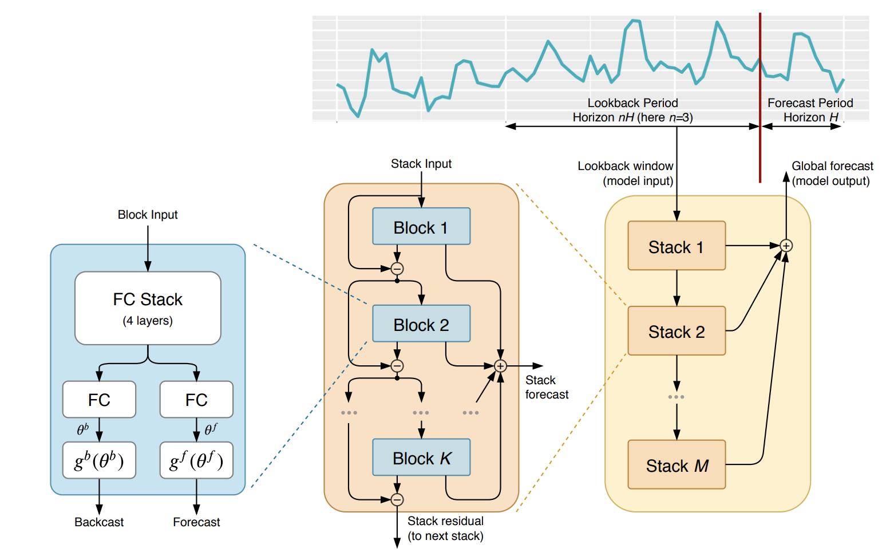

The Neural Basis Expansion Analysis
([`NBEATS`](https://Nixtla.github.io/neuralforecast/models.nbeats.html#nbeats))
is an
[`MLP`](https://Nixtla.github.io/neuralforecast/models.mlp.html#mlp)-based
deep neural architecture with backward and forward residual links. The
network has two variants: (1) in its interpretable configuration,
[`NBEATS`](https://Nixtla.github.io/neuralforecast/models.nbeats.html#nbeats)
sequentially projects the signal into polynomials and harmonic basis to
learn trend and seasonality components; (2) in its generic
configuration, it substitutes the polynomial and harmonic basis for
identity basis and larger network’s depth. The Neural Basis Expansion
Analysis with Exogenous
([`NBEATSx`](https://Nixtla.github.io/neuralforecast/models.nbeatsx.html#nbeatsx)),
incorporates projections to exogenous temporal variables available at
the time of the prediction.

This method proved state-of-the-art performance on the M3, M4, and
Tourism Competition datasets, improving accuracy by 3% over the `ESRNN`
M4 competition winner.

**References**<br/> -[Boris N. Oreshkin, Dmitri Carpov, Nicolas Chapados,
Yoshua Bengio (2019). “N-BEATS: Neural basis expansion analysis for
interpretable time series
forecasting”.](https://arxiv.org/abs/1905.10437)

<figure>

<figcaption aria-hidden="true">Figure 1. Neural Basis Expansion
Analysis.</figcaption>
</figure>

------------------------------------------------------------------------

<a
href="https://github.com/Nixtla/neuralforecast/blob/main/neuralforecast/models/nbeats.py#L192"
target="_blank" style={{ float: "right", fontSize: "smaller" }}>source</a>

### NBEATS

> ``` text
>  NBEATS (h, input_size, n_harmonics:int=2, n_polynomials:int=2,
>          stack_types:list=['identity', 'trend', 'seasonality'],
>          n_blocks:list=[1, 1, 1], mlp_units:list=[[512, 512], [512, 512],
>          [512, 512]], dropout_prob_theta:float=0.0, activation:str='ReLU',
>          shared_weights:bool=False, loss=MAE(), valid_loss=None,
>          max_steps:int=1000, learning_rate:float=0.001,
>          num_lr_decays:int=3, early_stop_patience_steps:int=-1,
>          val_check_steps:int=100, batch_size:int=32,
>          valid_batch_size:Optional[int]=None, windows_batch_size:int=1024,
>          inference_windows_batch_size:int=-1, start_padding_enabled=False,
>          step_size:int=1, scaler_type:str='identity', random_seed:int=1,
>          num_workers_loader:int=0, drop_last_loader:bool=False,
>          **trainer_kwargs)
> ```

NBEATS

The Neural Basis Expansion Analysis for Time Series (NBEATS), is a
simple and yet effective architecture, it is built with a deep stack of
MLPs with the doubly residual connections. It has a generic and
interpretable architecture depending on the blocks it uses. Its
interpretable architecture is recommended for scarce data settings, as
it regularizes its predictions through projections unto harmonic and
trend basis well-suited for most forecasting tasks.

**Parameters:**<br/> `h`: int, forecast horizon.<br/> `input_size`: int,
considered autorregresive inputs (lags), y=\[1,2,3,4\] input_size=2 -\>
lags=\[1,2\].<br/> `n_harmonics`: int, Number of harmonic terms for
seasonality stack type. Note that len(n_harmonics) = len(stack_types).
Note that it will only be used if a seasonality stack is used.<br/>
`n_polynomials`: int, polynomial degree for trend stack. Note that
len(n_polynomials) = len(stack_types). Note that it will only be used if
a trend stack is used.<br/> `stack_types`: List\[str\], List of stack
types. Subset from \[‘seasonality’, ‘trend’, ‘identity’\].<br/>
`n_blocks`: List\[int\], Number of blocks for each stack. Note that
len(n_blocks) = len(stack_types).<br/> `mlp_units`: List\[List\[int\]\],
Structure of hidden layers for each stack type. Each internal list
should contain the number of units of each hidden layer. Note that
len(n_hidden) = len(stack_types).<br/> `dropout_prob_theta`: float, Float
between (0, 1). Dropout for N-BEATS basis.<br/> `shared_weights`: bool,
If True, all blocks within each stack will share parameters. <br/>
`activation`: str, activation from \[‘ReLU’, ‘Softplus’, ‘Tanh’, ‘SELU’,
‘LeakyReLU’, ‘PReLU’, ‘Sigmoid’\].<br/> `loss`: PyTorch module,
instantiated train loss class from [losses
collection](https://nixtla.github.io/neuralforecast/losses.pytorch.html).<br/>
`valid_loss`: PyTorch module=`loss`, instantiated valid loss class from
[losses
collection](https://nixtla.github.io/neuralforecast/losses.pytorch.html).<br/>
`max_steps`: int=1000, maximum number of training steps.<br/>
`learning_rate`: float=1e-3, Learning rate between (0, 1).<br/>
`num_lr_decays`: int=3, Number of learning rate decays, evenly
distributed across max_steps.<br/> `early_stop_patience_steps`: int=-1,
Number of validation iterations before early stopping.<br/>
`val_check_steps`: int=100, Number of training steps between every
validation loss check.<br/> `batch_size`: int=32, number of different
series in each batch.<br/> `valid_batch_size`: int=None, number of
different series in each validation and test batch, if None uses
batch_size.<br/> `windows_batch_size`: int=1024, number of windows to
sample in each training batch, default uses all.<br/>
`inference_windows_batch_size`: int=-1, number of windows to sample in
each inference batch, -1 uses all.<br/> `start_padding_enabled`:
bool=False, if True, the model will pad the time series with zeros at
the beginning, by input size.<br/> `step_size`: int=1, step size between
each window of temporal data.<br/> `scaler_type`: str=‘identity’, type of
scaler for temporal inputs normalization see [temporal
scalers](https://nixtla.github.io/neuralforecast/common.scalers.html).<br/>
`random_seed`: int, random_seed for pytorch initializer and numpy
generators.<br/> `num_workers_loader`: int=os.cpu_count(), workers to be
used by `TimeSeriesDataLoader`.<br/> `drop_last_loader`: bool=False, if
True `TimeSeriesDataLoader` drops last non-full batch.<br/> `alias`: str,
optional, Custom name of the model.<br/> `**trainer_kwargs`: int, keyword
trainer arguments inherited from [PyTorch Lighning’s
trainer](https://pytorch-lightning.readthedocs.io/en/stable/api/pytorch_lightning.trainer.trainer.trainer.html?highlight=trainer).<br/>

**References:**<br/> -[Boris N. Oreshkin, Dmitri Carpov, Nicolas
Chapados, Yoshua Bengio (2019). “N-BEATS: Neural basis expansion
analysis for interpretable time series
forecasting”.](https://arxiv.org/abs/1905.10437)

------------------------------------------------------------------------

### NBEATS.fit

> ``` text
>  NBEATS.fit (dataset, val_size=0, test_size=0, random_seed=None)
> ```

Fit.

The `fit` method, optimizes the neural network’s weights using the
initialization parameters (`learning_rate`, `windows_batch_size`, …) and
the `loss` function as defined during the initialization. Within `fit`
we use a PyTorch Lightning `Trainer` that inherits the initialization’s
`self.trainer_kwargs`, to customize its inputs, see [PL’s trainer
arguments](https://pytorch-lightning.readthedocs.io/en/stable/api/pytorch_lightning.trainer.trainer.trainer.html?highlight=trainer).

The method is designed to be compatible with SKLearn-like classes and in
particular to be compatible with the StatsForecast library.

By default the `model` is not saving training checkpoints to protect
disk memory, to get them change `enable_checkpointing=True` in
`__init__`.

**Parameters:**<br/> `dataset`: NeuralForecast’s
[`TimeSeriesDataset`](https://Nixtla.github.io/neuralforecast/tsdataset.html#timeseriesdataset),
see
[documentation](https://nixtla.github.io/neuralforecast/tsdataset.html).<br/>
`val_size`: int, validation size for temporal cross-validation.<br/>
`random_seed`: int=None, random_seed for pytorch initializer and numpy
generators, overwrites model.\_\_init\_\_’s.<br/> `test_size`: int, test
size for temporal cross-validation.<br/>

------------------------------------------------------------------------

### NBEATS.predict

> ``` text
>  NBEATS.predict (dataset, test_size=None, step_size=1, random_seed=None,
>                  **data_module_kwargs)
> ```

Predict.

Neural network prediction with PL’s `Trainer` execution of
`predict_step`.

**Parameters:**<br/> `dataset`: NeuralForecast’s
[`TimeSeriesDataset`](https://Nixtla.github.io/neuralforecast/tsdataset.html#timeseriesdataset),
see
[documentation](https://nixtla.github.io/neuralforecast/tsdataset.html).<br/>
`test_size`: int=None, test size for temporal cross-validation.<br/>
`step_size`: int=1, Step size between each window.<br/> `random_seed`:
int=None, random_seed for pytorch initializer and numpy generators,
overwrites model.\_\_init\_\_’s.<br/> `**data_module_kwargs`: PL’s
TimeSeriesDataModule args, see
[documentation](https://pytorch-lightning.readthedocs.io/en/1.6.1/extensions/datamodules.html#using-a-datamodule).

## Usage Example

```python
import numpy as np
import pandas as pd
import pytorch_lightning as pl
import matplotlib.pyplot as plt

from neuralforecast import NeuralForecast
from neuralforecast.models import NBEATS
from neuralforecast.losses.pytorch import MQLoss, DistributionLoss
from neuralforecast.tsdataset import TimeSeriesDataset
from neuralforecast.utils import AirPassengers, AirPassengersPanel, AirPassengersStatic

Y_train_df = AirPassengersPanel[AirPassengersPanel.ds<AirPassengersPanel['ds'].values[-12]] # 132 train
Y_test_df = AirPassengersPanel[AirPassengersPanel.ds>=AirPassengersPanel['ds'].values[-12]].reset_index(drop=True) # 12 test

model = NBEATS(h=12, input_size=24,
               loss=DistributionLoss(distribution='Poisson', level=[80, 90]),
               stack_types = ['identity', 'trend', 'seasonality'],
               max_steps=100,
               val_check_steps=10,
               early_stop_patience_steps=2)

fcst = NeuralForecast(
    models=[model],
    freq='M'
)
fcst.fit(df=Y_train_df, static_df=AirPassengersStatic, val_size=12)
forecasts = fcst.predict(futr_df=Y_test_df)

# Plot quantile predictions
Y_hat_df = forecasts.reset_index(drop=False).drop(columns=['unique_id','ds'])
plot_df = pd.concat([Y_test_df, Y_hat_df], axis=1)
plot_df = pd.concat([Y_train_df, plot_df])

plot_df = plot_df[plot_df.unique_id=='Airline1'].drop('unique_id', axis=1)
plt.plot(plot_df['ds'], plot_df['y'], c='black', label='True')
plt.plot(plot_df['ds'], plot_df['NBEATS-median'], c='blue', label='median')
plt.fill_between(x=plot_df['ds'][-12:], 
                 y1=plot_df['NBEATS-lo-90'][-12:].values, 
                 y2=plot_df['NBEATS-hi-90'][-12:].values,
                 alpha=0.4, label='level 90')
plt.grid()
plt.legend()
plt.plot()
```

