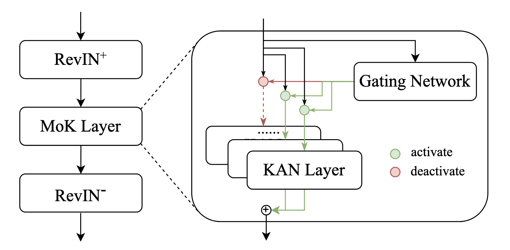

*Figure 1. Architecture of RMoK.*

## 1. Reversible Mixture of KAN - RMoK

### `RMoK`

```python
RMoK(
    h,
    input_size,
    n_series,
    futr_exog_list=None,
    hist_exog_list=None,
    stat_exog_list=None,
    taylor_order=3,
    jacobi_degree=6,
    wavelet_function="mexican_hat",
    dropout=0.1,
    revin_affine=True,
    loss=MAE(),
    valid_loss=None,
    max_steps=1000,
    learning_rate=0.001,
    num_lr_decays=-1,
    early_stop_patience_steps=-1,
    val_check_steps=100,
    batch_size=32,
    valid_batch_size=None,
    windows_batch_size=32,
    inference_windows_batch_size=32,
    start_padding_enabled=False,
    training_data_availability_threshold=0.0,
    step_size=1,
    scaler_type="identity",
    random_seed=1,
    drop_last_loader=False,
    alias=None,
    optimizer=None,
    optimizer_kwargs=None,
    lr_scheduler=None,
    lr_scheduler_kwargs=None,
    dataloader_kwargs=None,
    **trainer_kwargs
)
```

Bases: <code>[BaseModel](#neuralforecast.common._base_model.BaseModel)</code>

Reversible Mixture of KAN

**Parameters:**

Name | Type | Description | Default
---- | ---- | ----------- | -------
`h` | <code>[int](#int)</code> | forecast horizon. | *required*
`input_size` | <code>[int](#int)</code> | autorregresive inputs size, y=[1,2,3,4] input_size=2 -> y\_[t-2:t]=[1,2]. | *required*
`n_series` | <code>[int](#int)</code> | number of time-series. | *required*
`futr_exog_list` | <code>str list</code> | future exogenous columns. | <code>None</code>
`hist_exog_list` | <code>str list</code> | historic exogenous columns. | <code>None</code>
`stat_exog_list` | <code>str list</code> | static exogenous columns. | <code>None</code>
`taylor_order` | <code>[int](#int)</code> | order of the Taylor polynomial. | <code>3</code>
`jacobi_degree` | <code>[int](#int)</code> | degree of the Jacobi polynomial. | <code>6</code>
`wavelet_function` | <code>[str](#str)</code> | wavelet function to use in the WaveKAN. Choose from ["mexican_hat", "morlet", "dog", "meyer", "shannon"] | <code>'mexican_hat'</code>
`dropout` | <code>[float](#float)</code> | dropout rate. | <code>0.1</code>
`revin_affine` | <code>[bool](#bool)</code> | bool to use affine in RevIn. | <code>True</code>
`loss` | <code>PyTorch module</code> | instantiated train loss class from [losses collection](./losses.pytorch). | <code>[MAE](#neuralforecast.losses.pytorch.MAE)()</code>
`valid_loss` | <code>PyTorch module</code> | instantiated valid loss class from [losses collection](./losses.pytorch). | <code>None</code>
`max_steps` | <code>[int](#int)</code> | maximum number of training steps. | <code>1000</code>
`learning_rate` | <code>[float](#float)</code> | learning rate between (0, 1). | <code>0.001</code>
`num_lr_decays` | <code>[int](#int)</code> | number of learning rate decays, evenly distributed across max_steps. | <code>-1</code>
`early_stop_patience_steps` | <code>[int](#int)</code> | number of validation iterations before early stopping. | <code>-1</code>
`val_check_steps` | <code>[int](#int)</code> | number of training steps between every validation loss check. | <code>100</code>
`batch_size` | <code>[int](#int)</code> | number of different series in each batch. | <code>32</code>
`valid_batch_size` | <code>[int](#int)</code> | number of different series in each validation and test batch, if None uses batch_size. | <code>None</code>
`windows_batch_size` | <code>[int](#int)</code> | number of windows to sample in each training batch, default uses all. | <code>32</code>
`inference_windows_batch_size` | <code>[int](#int)</code> | number of windows to sample in each inference batch, -1 uses all. | <code>32</code>
`start_padding_enabled` | <code>[bool](#bool)</code> | if True, the model will pad the time series with zeros at the beginning, by input size. | <code>False</code>
`training_data_availability_threshold` | <code>[Union](#Union)\[[float](#float), [List](#List)\[[float](#float)\]\]</code> | minimum fraction of valid data points required for training windows. Single float applies to both insample and outsample; list of two floats specifies [insample_fraction, outsample_fraction]. Default 0.0 allows windows with only 1 valid data point (current behavior). | <code>0.0</code>
`step_size` | <code>[int](#int)</code> | step size between each window of temporal data. | <code>1</code>
`scaler_type` | <code>[str](#str)</code> | type of scaler for temporal inputs normalization see [temporal scalers](https://github.com/Nixtla/neuralforecast/blob/main/neuralforecast/common/_scalers.py). | <code>'identity'</code>
`random_seed` | <code>[int](#int)</code> | random_seed for pytorch initializer and numpy generators. | <code>1</code>
`drop_last_loader` | <code>[bool](#bool)</code> | if True `TimeSeriesDataLoader` drops last non-full batch. | <code>False</code>
`alias` | <code>[str](#str)</code> | optional, Custom name of the model. | <code>None</code>
`optimizer` | <code>Subclass of 'torch.optim.Optimizer'</code> | optional, user specified optimizer instead of the default choice (Adam). | <code>None</code>
`optimizer_kwargs` | <code>[dict](#dict)</code> | optional, list of parameters used by the user specified `optimizer`. | <code>None</code>
`lr_scheduler` | <code>Subclass of 'torch.optim.lr_scheduler.LRScheduler'</code> | optional, user specified lr_scheduler instead of the default choice (StepLR). | <code>None</code>
`lr_scheduler_kwargs` | <code>[dict](#dict)</code> | optional, list of parameters used by the user specified `lr_scheduler`. | <code>None</code>
`dataloader_kwargs` | <code>[dict](#dict)</code> | optional, list of parameters passed into the PyTorch Lightning dataloader by the `TimeSeriesDataLoader`. | <code>None</code>
`**trainer_kwargs` | <code>[int](#int)</code> | keyword trainer arguments inherited from [PyTorch Lighning's trainer](https://pytorch-lightning.readthedocs.io/en/stable/api/pytorch_lightning.trainer.trainer.Trainer.html?highlight=trainer). | <code>{}</code>

<details class="references" open markdown="1">
<summary>References</summary>

- [Xiao Han, Xinfeng Zhang, Yiling Wu, Zhenduo Zhang, Zhe Wu."KAN4TSF: Are KAN and KAN-based models Effective for Time Series Forecasting?". arXiv.](https://arxiv.org/abs/2408.11306)

</details>

#### `RMoK.fit`

```python
fit(
    dataset, val_size=0, test_size=0, random_seed=None, distributed_config=None
)
```

Fit.

The `fit` method, optimizes the neural network's weights using the
initialization parameters (`learning_rate`, `windows_batch_size`, ...)
and the `loss` function as defined during the initialization.
Within `fit` we use a PyTorch Lightning `Trainer` that
inherits the initialization's `self.trainer_kwargs`, to customize
its inputs, see [PL's trainer arguments](https://pytorch-lightning.readthedocs.io/en/stable/api/pytorch_lightning.trainer.trainer.Trainer.html?highlight=trainer).

The method is designed to be compatible with SKLearn-like classes
and in particular to be compatible with the StatsForecast library.

By default the `model` is not saving training checkpoints to protect
disk memory, to get them change `enable_checkpointing=True` in `__init__`.

**Parameters:**

Name | Type | Description | Default
---- | ---- | ----------- | -------
`dataset` | <code>[TimeSeriesDataset](#TimeSeriesDataset)</code> | NeuralForecast's `TimeSeriesDataset`, see [documentation](./tsdataset). | *required*
`val_size` | <code>[int](#int)</code> | Validation size for temporal cross-validation. | <code>0</code>
`random_seed` | <code>[int](#int)</code> | Random seed for pytorch initializer and numpy generators, overwrites model.__init__'s. | <code>None</code>
`test_size` | <code>[int](#int)</code> | Test size for temporal cross-validation. | <code>0</code>

**Returns:**

Type | Description
---- | -----------
| None

#### `RMoK.predict`

```python
predict(
    dataset,
    test_size=None,
    step_size=1,
    random_seed=None,
    quantiles=None,
    h=None,
    explainer_config=None,
    **data_module_kwargs
)
```

Predict.

Neural network prediction with PL's `Trainer` execution of `predict_step`.

**Parameters:**

Name | Type | Description | Default
---- | ---- | ----------- | -------
`dataset` | <code>[TimeSeriesDataset](#TimeSeriesDataset)</code> | NeuralForecast's `TimeSeriesDataset`, see [documentation](./tsdataset). | *required*
`test_size` | <code>[int](#int)</code> | Test size for temporal cross-validation. | <code>None</code>
`step_size` | <code>[int](#int)</code> | Step size between each window. | <code>1</code>
`random_seed` | <code>[int](#int)</code> | Random seed for pytorch initializer and numpy generators, overwrites model.__init__'s. | <code>None</code>
`quantiles` | <code>[list](#list)</code> | Target quantiles to predict. | <code>None</code>
`h` | <code>[int](#int)</code> | Prediction horizon, if None, uses the model's fitted horizon. Defaults to None. | <code>None</code>
`explainer_config` | <code>[dict](#dict)</code> | configuration for explanations. | <code>None</code>
`**data_module_kwargs` | <code>[dict](#dict)</code> | PL's TimeSeriesDataModule args, see [documentation](https://pytorch-lightning.readthedocs.io/en/1.6.1/extensions/datamodules.html#using-a-datamodule). | <code>{}</code>

**Returns:**

Type | Description
---- | -----------
| None

### Usage example

```python

import pandas as pd
import matplotlib.pyplot as plt

from neuralforecast import NeuralForecast
from neuralforecast.models import RMoK
from neuralforecast.utils import AirPassengersPanel, AirPassengersStatic
from neuralforecast.losses.pytorch import MSE

Y_train_df = AirPassengersPanel[AirPassengersPanel.ds<AirPassengersPanel['ds'].values[-12]].reset_index(drop=True) # 132 train
Y_test_df = AirPassengersPanel[AirPassengersPanel.ds>=AirPassengersPanel['ds'].values[-12]].reset_index(drop=True) # 12 test

model = RMoK(h=12,
             input_size=24,
             n_series=2,
             taylor_order=3,
             jacobi_degree=6,
             wavelet_function='mexican_hat',
             dropout=0.1,
             revin_affine=True,
             loss=MSE(),
             valid_loss=MAE(),
             early_stop_patience_steps=3,
             batch_size=32)

fcst = NeuralForecast(models=[model], freq='ME')
fcst.fit(df=Y_train_df, static_df=AirPassengersStatic, val_size=12)
forecasts = fcst.predict(futr_df=Y_test_df)

# Plot predictions
fig, ax = plt.subplots(1, 1, figsize = (20, 7))
Y_hat_df = forecasts.reset_index(drop=False).drop(columns=['unique_id','ds'])
plot_df = pd.concat([Y_test_df, Y_hat_df], axis=1)
plot_df = pd.concat([Y_train_df, plot_df])

plot_df = plot_df[plot_df.unique_id=='Airline1'].drop('unique_id', axis=1)
plt.plot(plot_df['ds'], plot_df['y'], c='black', label='True')
plt.plot(plot_df['ds'], plot_df['RMoK'], c='blue', label='Forecast')
ax.set_title('AirPassengers Forecast', fontsize=22)
ax.set_ylabel('Monthly Passengers', fontsize=20)
ax.set_xlabel('Year', fontsize=20)
ax.legend(prop={'size': 15})
ax.grid()

```

## 2. Auxiliary functions

### `WaveKANLayer`

```python
WaveKANLayer(
    in_features,
    out_features,
    wavelet_type="mexican_hat",
    with_bn=True,
    device="cpu",
)
```

Bases: <code>[Module](#torch.nn.Module)</code>

This is a sample code for the simulations of the paper:
Bozorgasl, Zavareh and Chen, Hao, Wav-KAN: Wavelet Kolmogorov-Arnold Networks (May, 2024)

https://arxiv.org/abs/2405.12832
and also available at:
https://papers.ssrn.com/sol3/papers.cfm?abstract_id=4835325
We used efficient KAN notation and some part of the code:+

### `TaylorKANLayer`

```python
TaylorKANLayer(input_dim, out_dim, order, addbias=True)
```

Bases: <code>[Module](#torch.nn.Module)</code>

https://github.com/Muyuzhierchengse/TaylorKAN/

### `JacobiKANLayer`

```python
JacobiKANLayer(input_dim, output_dim, degree, a=1.0, b=1.0)
```

Bases: <code>[Module](#torch.nn.Module)</code>

https://github.com/SpaceLearner/JacobiKAN/blob/main/JacobiKANLayer.py
