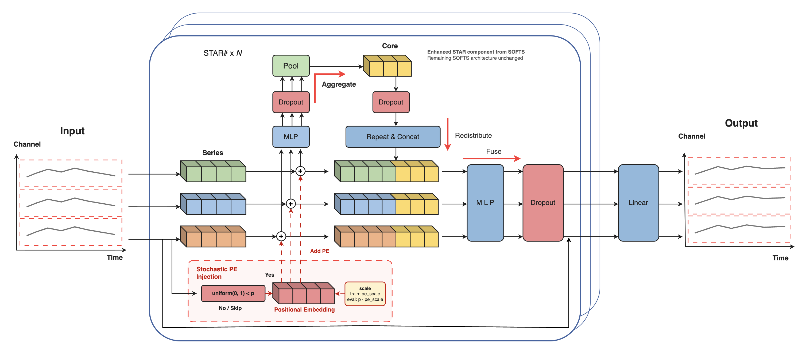

SOFTSSharp extends SOFTS by stochastically adding variable-position embeddings and multiple dropout layers inside the STAD aggregation-redistribution component, aiming to improve forecasting accuracy while preserving linear complexity.



*Figure 1. Architecture of SOFTSSharp*

## 1. SOFTSSharp

### `SOFTSSharp`

```python
SOFTSSharp(
    h,
    input_size,
    n_series,
    futr_exog_list=None,
    hist_exog_list=None,
    stat_exog_list=None,
    exclude_insample_y=False,
    hidden_size=512,
    d_core=512,
    e_layers=2,
    d_ff=2048,
    dropout=0.1,
    pe_keep_prob=0.5,
    use_norm=True,
    loss=MAE(),
    valid_loss=None,
    max_steps=1000,
    learning_rate=0.001,
    num_lr_decays=-1,
    early_stop_patience_steps=-1,
    val_monitor="ptl/val_loss",
    val_check_steps=100,
    batch_size=32,
    valid_batch_size=None,
    windows_batch_size=32,
    inference_windows_batch_size=32,
    start_padding_enabled=False,
    training_data_availability_threshold=0.0,
    step_size=1,
    scaler_type="identity",
    random_seed=1,
    drop_last_loader=False,
    alias=None,
    optimizer=None,
    optimizer_kwargs=None,
    lr_scheduler=None,
    lr_scheduler_kwargs=None,
    dataloader_kwargs=None,
    **trainer_kwargs
)
```

Bases: <code>[BaseModel](#neuralforecast.common._base_model.BaseModel)</code>

SOFTSSharp

SOFTS# (SOFTSSharp) extends SOFTS by stochastically adding
variable-position embeddings and multiple dropout layers inside the STAD
component.

**Parameters:**

Name | Type | Description | Default
---- | ---- | ----------- | -------
`h` | <code>[int](#int)</code> | Forecast horizon. | *required*
`input_size` | <code>[int](#int)</code> | Autoregressive inputs size. | *required*
`n_series` | <code>[int](#int)</code> | Number of time-series. | *required*
`hidden_size` | <code>[int](#int)</code> | Dimension of the model. | <code>512</code>
`d_core` | <code>[int](#int)</code> | Dimension of core in STADSharp. | <code>512</code>
`e_layers` | <code>[int](#int)</code> | Number of encoder layers. | <code>2</code>
`d_ff` | <code>[int](#int)</code> | Dimension of fully-connected layer. | <code>2048</code>
`dropout` | <code>[float](#float)</code> | Dropout rate. | <code>0.1</code>
`pe_keep_prob` | <code>[float](#float)</code> | probability of applying variable-position encoding during training. During inference, the positional encoding is scaled by this value. | <code>0.5</code>
`use_norm` | <code>[bool](#bool)</code> | Whether to normalize or not. | <code>True</code>
`loss` | <code>PyTorch module</code> | Instantiated train loss class from [losses collection](./losses.pytorch.html). | <code>[MAE](#neuralforecast.losses.pytorch.MAE)()</code>
`valid_loss` | <code>PyTorch module</code> | Instantiated valid loss class from [losses collection](./losses.pytorch.html). | <code>None</code>
`max_steps` | <code>[int](#int)</code> | Maximum number of training steps. | <code>1000</code>
`learning_rate` | <code>[float](#float)</code> | Learning rate between (0, 1). | <code>0.001</code>
`num_lr_decays` | <code>[int](#int)</code> | Number of learning rate decays, evenly distributed across max_steps. | <code>-1</code>
`early_stop_patience_steps` | <code>[int](#int)</code> | Number of validation iterations before early stopping. | <code>-1</code>
`val_monitor` | <code>[str](#str)</code> | Metric to monitor for early stopping. | <code>'ptl/val_loss'</code>
`val_check_steps` | <code>[int](#int)</code> | Number of training steps between every validation loss check. | <code>100</code>
`batch_size` | <code>[int](#int)</code> | Number of different series in each batch. | <code>32</code>
`valid_batch_size` | <code>[int](#int)</code> | Number of different series in each validation and test batch, if None uses batch_size. | <code>None</code>
`windows_batch_size` | <code>[int](#int)</code> | Number of windows to sample in each training batch, default uses all. | <code>32</code>
`inference_windows_batch_size` | <code>[int](#int)</code> | Number of windows to sample in each inference batch, -1 uses all. | <code>32</code>
`start_padding_enabled` | <code>[bool](#bool)</code> | If True, the model will pad the time series with zeros at the beginning, by input size. | <code>False</code>
`step_size` | <code>[int](#int)</code> | Step size between each window of temporal data. | <code>1</code>
`scaler_type` | <code>[str](#str)</code> | Type of scaler for temporal inputs normalization. | <code>'identity'</code>
`random_seed` | <code>[int](#int)</code> | Random seed for pytorch initializer and numpy generators. | <code>1</code>
`drop_last_loader` | <code>[bool](#bool)</code> | If True `TimeSeriesDataLoader` drops last non-full batch. | <code>False</code>
`alias` | <code>[str](#str)</code> | Optional custom name of the model. | <code>None</code>

<details class="references" open markdown="1">
<summary>References</summary>

- [Hrvoje Ljubić. "SOFTSSharp: SOFTS extension with stochastic variable-position encoding", reference implementation; manuscript in preparation](https://github.com/hljubic/SOFTSsharp)
- [Hrvoje Ljubić, Goran Martinović, Tomislav Volarić, Robert Rozić. "SOFTS++: Fast and accurate linear model for multivariate long-term time series forecasting", related work](https://doi.org/10.1177/1088467X251380055)
- [Lu Han, Xu-Yang Chen, Han-Jia Ye, De-Chuan Zhan. "SOFTS: Efficient Multivariate Time Series Forecasting with Series-Core Fusion"](https://arxiv.org/pdf/2404.14197)

</details>

#### `SOFTSSharp.fit`

```python
fit(
    dataset, val_size=0, test_size=0, random_seed=None, distributed_config=None
)
```

Fit.

The `fit` method, optimizes the neural network's weights using the
initialization parameters (`learning_rate`, `windows_batch_size`, ...)
and the `loss` function as defined during the initialization.
Within `fit` we use a PyTorch Lightning `Trainer` that
inherits the initialization's `self.trainer_kwargs`, to customize
its inputs, see [PL's trainer arguments](https://pytorch-lightning.readthedocs.io/en/stable/api/pytorch_lightning.trainer.trainer.Trainer.html?highlight=trainer).

The method is designed to be compatible with SKLearn-like classes
and in particular to be compatible with the StatsForecast library.

By default the `model` is not saving training checkpoints to protect
disk memory, to get them change `enable_checkpointing=True` in `__init__`.

**Parameters:**

Name | Type | Description | Default
---- | ---- | ----------- | -------
`dataset` | <code>[TimeSeriesDataset](#TimeSeriesDataset)</code> | NeuralForecast's `TimeSeriesDataset`, see [documentation](./tsdataset.html). | *required*
`val_size` | <code>[int](#int)</code> | Validation size for temporal cross-validation. | <code>0</code>
`random_seed` | <code>[int](#int)</code> | Random seed for pytorch initializer and numpy generators, overwrites model.__init__'s. | <code>None</code>
`test_size` | <code>[int](#int)</code> | Test size for temporal cross-validation. | <code>0</code>

**Returns:**

Type | Description
---- | -----------
| None

#### `SOFTSSharp.predict`

```python
predict(
    dataset,
    test_size=None,
    step_size=1,
    random_seed=None,
    quantiles=None,
    h=None,
    explainer_config=None,
    **data_module_kwargs
)
```

Predict.

Neural network prediction with PL's `Trainer` execution of `predict_step`.

**Parameters:**

Name | Type | Description | Default
---- | ---- | ----------- | -------
`dataset` | <code>[TimeSeriesDataset](#TimeSeriesDataset)</code> | NeuralForecast's `TimeSeriesDataset`, see [documentation](./tsdataset.html). | *required*
`test_size` | <code>[int](#int)</code> | Test size for temporal cross-validation. | <code>None</code>
`step_size` | <code>[int](#int)</code> | Step size between each window. | <code>1</code>
`random_seed` | <code>[int](#int)</code> | Random seed for pytorch initializer and numpy generators, overwrites model.__init__'s. | <code>None</code>
`quantiles` | <code>[list](#list)</code> | Target quantiles to predict. | <code>None</code>
`h` | <code>[int](#int)</code> | Prediction horizon, if None, uses the model's fitted horizon. Defaults to None. | <code>None</code>
`explainer_config` | <code>[dict](#dict)</code> | configuration for explanations. | <code>None</code>
`**data_module_kwargs` | <code>[dict](#dict)</code> | PL's TimeSeriesDataModule args, see [documentation](https://pytorch-lightning.readthedocs.io/en/1.6.1/extensions/datamodules.html#using-a-datamodule). | <code>{}</code>

**Returns:**

Type | Description
---- | -----------
| None

### Usage example

```python
import pandas as pd
import matplotlib.pyplot as plt

from neuralforecast import NeuralForecast
from neuralforecast.models import SOFTSSharp
from neuralforecast.utils import AirPassengersPanel, AirPassengersStatic
from neuralforecast.losses.pytorch import MASE

Y_train_df = AirPassengersPanel[AirPassengersPanel.ds<AirPassengersPanel['ds'].values[-12]].reset_index(drop=True)
Y_test_df = AirPassengersPanel[AirPassengersPanel.ds>=AirPassengersPanel['ds'].values[-12]].reset_index(drop=True)

model = SOFTSSharp(h=12,
                   input_size=24,
                   n_series=2,
                   hidden_size=256,
                   d_core=256,
                   e_layers=2,
                   d_ff=64,
                   dropout=0.1,
                   pe_keep_prob=0.5,
                   use_norm=True,
                   loss=MASE(seasonality=4),
                   early_stop_patience_steps=3,
                   batch_size=32)

fcst = NeuralForecast(models=[model], freq='ME')
fcst.fit(df=Y_train_df, static_df=AirPassengersStatic, val_size=12)
forecasts = fcst.predict(futr_df=Y_test_df)

fig, ax = plt.subplots(1, 1, figsize = (20, 7))
Y_hat_df = forecasts.reset_index(drop=False).drop(columns=['unique_id','ds'])
plot_df = pd.concat([Y_test_df, Y_hat_df], axis=1)
plot_df = pd.concat([Y_train_df, plot_df])

plot_df = plot_df[plot_df.unique_id=='Airline1'].drop('unique_id', axis=1)
plt.plot(plot_df['ds'], plot_df['y'], c='black', label='True')
plt.plot(plot_df['ds'], plot_df['SOFTSSharp'], c='blue', label='Forecast')
ax.set_title('AirPassengers Forecast', fontsize=22)
ax.set_ylabel('Monthly Passengers', fontsize=20)
ax.set_xlabel('Year', fontsize=20)
ax.legend(prop={'size': 15})
ax.grid()
```

## 2. Auxiliary functions

### `PositionalEmbedding`

```python
PositionalEmbedding(d_series, max_len=5000)
```

Bases: <code>[Module](#torch.nn.Module)</code>

### `STADSharp`

```python
STADSharp(d_series, d_core, dropout_rate=0.1, pe_keep_prob=0.5)
```

Bases: <code>[Module](#torch.nn.Module)</code>

STar Aggregate Dispatch Module with stochastic variable-position encoding.
