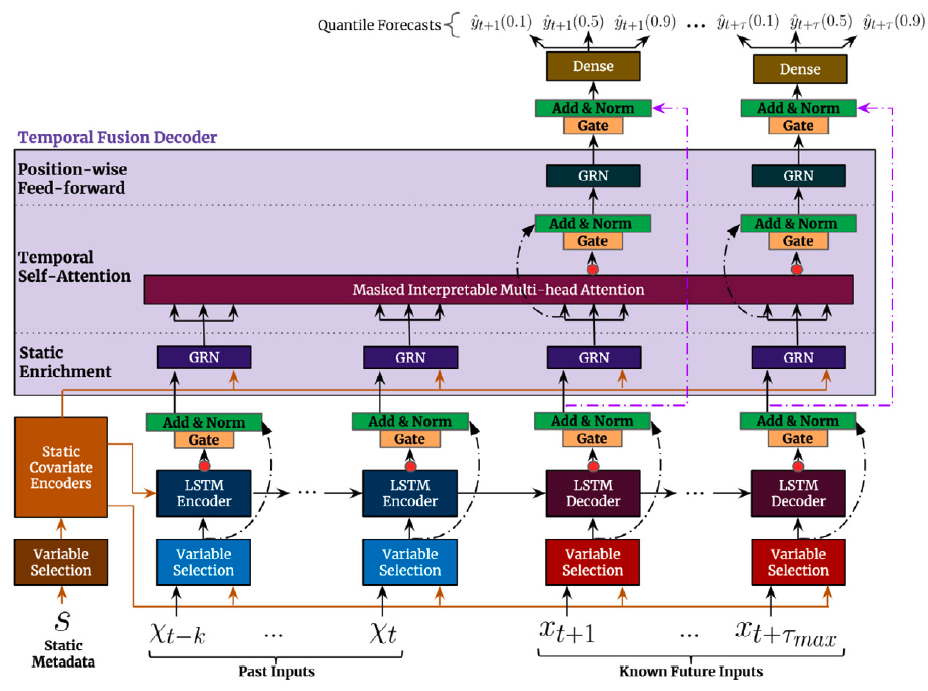

In summary Temporal Fusion Transformer (TFT) combines gating layers, an
LSTM recurrent encoder, with multi-head attention layers for a
multi-step forecasting strategy decoder.<br/>TFT’s inputs are static
exogenous $\mathbf{x}^{(s)}$, historic exogenous
$\mathbf{x}^{(h)}_{[:t]}$, exogenous available at the time of the
prediction $\mathbf{x}^{(f)}_{[:t+H]}$ and autorregresive features
$\mathbf{y}_{[:t]}$, each of these inputs is further decomposed into
categorical and continuous. The network uses a multi-quantile regression
to model the following conditional
probability:$$\mathbb{P}(\mathbf{y}_{[t+1:t+H]}|\;\mathbf{y}_{[:t]},\; \mathbf{x}^{(h)}_{[:t]},\; \mathbf{x}^{(f)}_{[:t+H]},\; \mathbf{x}^{(s)})$$

**References**<br/> - [Jan Golda, Krzysztof Kudrynski. “NVIDIA, Deep
Learning Forecasting
Examples”](https://github.com/NVIDIA/DeepLearningExamples/tree/master/PyTorch/Forecasting/tft)<br/> -
[Bryan Lim, Sercan O. Arik, Nicolas Loeff, Tomas Pfister, “Temporal
Fusion Transformers for interpretable multi-horizon time series
forecasting”](https://www.sciencedirect.com/science/article/pii/s0169207021000637)<br/>

<figure>

<figcaption aria-hidden="true">Figure 1. Temporal Fusion Transformer
Architecture.</figcaption>
</figure>

## 1. Auxiliary Functions

### 1.1 Gating Mechanisms

The Gated Residual Network (GRN) provides adaptive depth and network
complexity capable of accommodating different size datasets. As residual
connections allow for the network to skip the non-linear transformation
of input $\mathbf{a}$ and context $\mathbf{c}$.

The Gated Linear Unit (GLU) provides the flexibility of supressing
unnecesary parts of the GRN. Consider GRN’s output $\gamma$ then GLU
transformation is defined by:

$$\mathrm{GLU}(\gamma) = \sigma(\mathbf{W}_{4}\gamma +b_{4}) \odot (\mathbf{W}_{5}\gamma +b_{5})$$

<figure>

<figcaption aria-hidden="true">Figure 2. Gated Residual
Network.</figcaption>
</figure>

### 1.2 Variable Selection Networks

TFT includes automated variable selection capabilities, through its
variable selection network (VSN) components. The VSN takes the original
input
$\{\mathbf{x}^{(s)}, \mathbf{x}^{(h)}_{[:t]}, \mathbf{x}^{(f)}_{[:t]}\}$
and transforms it through embeddings or linear transformations into a
high dimensional space
$\{\mathbf{E}^{(s)}, \mathbf{E}^{(h)}_{[:t]}, \mathbf{E}^{(f)}_{[:t+H]}\}$.

For the observed historic data, the embedding matrix
$\mathbf{E}^{(h)}_{t}$ at time $t$ is a concatenation of $j$ variable
$e^{(h)}_{t,j}$ embeddings:

The variable selection weights are given by:
$$s^{(h)}_{t}=\mathrm{SoftMax}(\mathrm{GRN}(\mathbf{E}^{(h)}_{t},\mathbf{E}^{(s)}))$$

The VSN processed features are then:
$$\tilde{\mathbf{E}}^{(h)}_{t}= \sum_{j} s^{(h)}_{j} \tilde{e}^{(h)}_{t,j}$$

<figure>

<figcaption aria-hidden="true">Figure 3. Variable Selection
Network.</figcaption>
</figure>

### 1.3. Multi-Head Attention

To avoid information bottlenecks from the classic Seq2Seq architecture,
TFT incorporates a decoder-encoder attention mechanism inherited
transformer architectures ([Li et. al
2019](https://arxiv.org/abs/1907.00235), [Vaswani et. al
2017](https://arxiv.org/abs/1706.03762)). It transform the the outputs
of the LSTM encoded temporal features, and helps the decoder better
capture long-term relationships.

The original multihead attention for each component $H_{m}$ and its
query, key, and value representations are denoted by
$Q_{m}, K_{m}, V_{m}$, its transformation is given by:

TFT modifies the original multihead attention to improve its
interpretability. To do it it uses shared values $\tilde{V}$ across
heads and employs additive aggregation,
$\mathrm{InterpretableMultiHead}(Q,K,V) = \tilde{H} W_{M}$. The
mechanism has a great resemblence to a single attention layer, but it
allows for $M$ multiple attention weights, and can be therefore be
interpreted as the average ensemble of $M$ single attention layers.

## 2. TFT Architecture

The first TFT’s step is embed the original input
$\{\mathbf{x}^{(s)}, \mathbf{x}^{(h)}, \mathbf{x}^{(f)}\}$ into a high
dimensional space
$\{\mathbf{E}^{(s)}, \mathbf{E}^{(h)}, \mathbf{E}^{(f)}\}$, after which
each embedding is gated by a variable selection network (VSN). The
static embedding $\mathbf{E}^{(s)}$ is used as context for variable
selection and as initial condition to the LSTM. Finally the encoded
variables are fed into the multi-head attention decoder.

### 2.1 Static Covariate Encoder

The static embedding $\mathbf{E}^{(s)}$ is transformed by the
StaticCovariateEncoder into contexts $c_{s}, c_{e}, c_{h}, c_{c}$. Where
$c_{s}$ are temporal variable selection contexts, $c_{e}$ are
TemporalFusionDecoder enriching contexts, and $c_{h}, c_{c}$ are LSTM’s
hidden/contexts for the TemporalCovariateEncoder.

### 2.2 Temporal Covariate Encoder

TemporalCovariateEncoder encodes the embeddings
$\mathbf{E}^{(h)}, \mathbf{E}^{(f)}$ and contexts $(c_{h}, c_{c})$ with
an LSTM.

An analogous process is repeated for the future data, with the main
difference that $\mathbf{E}^{(f)}$ contains the future available
information.

### 2.3 Temporal Fusion Decoder

The TemporalFusionDecoder enriches the LSTM’s outputs with $c_{e}$ and
then uses an attention layer, and multi-step adapter.

## 3. TFT methods

------------------------------------------------------------------------

<a
href="https://github.com/Nixtla/neuralforecast/blob/main/neuralforecast/models/tft.py#L382"
target="_blank" style={{ float: "right", fontSize: "smaller" }}>source</a>

### TFT

> ``` text
>  TFT (h, input_size, tgt_size:int=1, stat_exog_list=None,
>       hist_exog_list=None, futr_exog_list=None, hidden_size:int=128,
>       n_head:int=4, attn_dropout:float=0.0, dropout:float=0.1, loss=MAE(),
>       valid_loss=None, max_steps:int=1000, learning_rate:float=0.001,
>       num_lr_decays:int=-1, early_stop_patience_steps:int=-1,
>       val_check_steps:int=100, batch_size:int=32,
>       valid_batch_size:Optional[int]=None, windows_batch_size:int=1024,
>       inference_windows_batch_size:int=1024, start_padding_enabled=False,
>       step_size:int=1, scaler_type:str='robust', num_workers_loader=0,
>       drop_last_loader=False, random_seed:int=1, **trainer_kwargs)
> ```

TFT

The Temporal Fusion Transformer architecture (TFT) is an
Sequence-to-Sequence model that combines static, historic and future
available data to predict an univariate target. The method combines
gating layers, an LSTM recurrent encoder, with and interpretable
multi-head attention layer and a multi-step forecasting strategy
decoder.

**Parameters:**<br/> `h`: int, Forecast horizon. <br/> `input_size`: int,
autorregresive inputs size, y=\[1,2,3,4\] input_size=2 -\>
y\_\[t-2:t\]=\[1,2\].<br/> `stat_exog_list`: str list, static continuous
columns.<br/> `hist_exog_list`: str list, historic continuous
columns.<br/> `futr_exog_list`: str list, future continuous columns.<br/>
`hidden_size`: int, units of embeddings and encoders.<br/> `dropout`:
float (0, 1), dropout of inputs VSNs.<br/> `n_head`: int=4, number of
attention heads in temporal fusion decoder.<br/> `attn_dropout`: float
(0, 1), dropout of fusion decoder’s attention layer.<br/>
`shared_weights`: bool, If True, all blocks within each stack will share
parameters. <br/> `activation`: str, activation from \[‘ReLU’,
‘Softplus’, ‘Tanh’, ‘SELU’, ‘LeakyReLU’, ‘PReLU’, ‘Sigmoid’\].<br/>
`loss`: PyTorch module, instantiated train loss class from [losses
collection](https://nixtla.github.io/neuralforecast/losses.pytorch.html).<br/>
`valid_loss`: PyTorch module=`loss`, instantiated valid loss class from
[losses
collection](https://nixtla.github.io/neuralforecast/losses.pytorch.html).<br/>
`max_steps`: int=1000, maximum number of training steps.<br/>
`learning_rate`: float=1e-3, Learning rate between (0, 1).<br/>
`num_lr_decays`: int=-1, Number of learning rate decays, evenly
distributed across max_steps.<br/> `early_stop_patience_steps`: int=-1,
Number of validation iterations before early stopping.<br/>
`val_check_steps`: int=100, Number of training steps between every
validation loss check.<br/> `batch_size`: int, number of different series
in each batch.<br/> `windows_batch_size`: int=None, windows sampled from
rolled data, default uses all.<br/> `inference_windows_batch_size`:
int=-1, number of windows to sample in each inference batch, -1 uses
all.<br/> `start_padding_enabled`: bool=False, if True, the model will
pad the time series with zeros at the beginning, by input size.<br/>
`valid_batch_size`: int=None, number of different series in each
validation and test batch.<br/> `step_size`: int=1, step size between
each window of temporal data.<br/> `scaler_type`: str=‘robust’, type of
scaler for temporal inputs normalization see [temporal
scalers](https://nixtla.github.io/neuralforecast/common.scalers.html).<br/>
`random_seed`: int, random seed initialization for replicability.<br/>
`num_workers_loader`: int=os.cpu_count(), workers to be used by
`TimeSeriesDataLoader`.<br/> `drop_last_loader`: bool=False, if True
`TimeSeriesDataLoader` drops last non-full batch.<br/> `alias`: str,
optional, Custom name of the model.<br/> `**trainer_kwargs`: int, keyword
trainer arguments inherited from [PyTorch Lighning’s
trainer](https://pytorch-lightning.readthedocs.io/en/stable/api/pytorch_lightning.trainer.trainer.trainer.html?highlight=trainer).<br/>

**References:**<br/> - [Bryan Lim, Sercan O. Arik, Nicolas Loeff, Tomas
Pfister, “Temporal Fusion Transformers for interpretable multi-horizon
time series
forecasting”](https://www.sciencedirect.com/science/article/pii/s0169207021000637)

------------------------------------------------------------------------

### TFT.fit

> ``` text
>  TFT.fit (dataset, val_size=0, test_size=0, random_seed=None)
> ```

Fit.

The `fit` method, optimizes the neural network’s weights using the
initialization parameters (`learning_rate`, `windows_batch_size`, …) and
the `loss` function as defined during the initialization. Within `fit`
we use a PyTorch Lightning `Trainer` that inherits the initialization’s
`self.trainer_kwargs`, to customize its inputs, see [PL’s trainer
arguments](https://pytorch-lightning.readthedocs.io/en/stable/api/pytorch_lightning.trainer.trainer.trainer.html?highlight=trainer).

The method is designed to be compatible with SKLearn-like classes and in
particular to be compatible with the StatsForecast library.

By default the `model` is not saving training checkpoints to protect
disk memory, to get them change `enable_checkpointing=True` in
`__init__`.

**Parameters:**<br/> `dataset`: NeuralForecast’s
[`TimeSeriesDataset`](https://Nixtla.github.io/neuralforecast/tsdataset.html#timeseriesdataset),
see
[documentation](https://nixtla.github.io/neuralforecast/tsdataset.html).<br/>
`val_size`: int, validation size for temporal cross-validation.<br/>
`random_seed`: int=None, random_seed for pytorch initializer and numpy
generators, overwrites model.\_\_init\_\_’s.<br/> `test_size`: int, test
size for temporal cross-validation.<br/>

------------------------------------------------------------------------

### TFT.predict

> ``` text
>  TFT.predict (dataset, test_size=None, step_size=1, random_seed=None,
>               **data_module_kwargs)
> ```

Predict.

Neural network prediction with PL’s `Trainer` execution of
`predict_step`.

**Parameters:**<br/> `dataset`: NeuralForecast’s
[`TimeSeriesDataset`](https://Nixtla.github.io/neuralforecast/tsdataset.html#timeseriesdataset),
see
[documentation](https://nixtla.github.io/neuralforecast/tsdataset.html).<br/>
`test_size`: int=None, test size for temporal cross-validation.<br/>
`step_size`: int=1, Step size between each window.<br/> `random_seed`:
int=None, random_seed for pytorch initializer and numpy generators,
overwrites model.\_\_init\_\_’s.<br/> `**data_module_kwargs`: PL’s
TimeSeriesDataModule args, see
[documentation](https://pytorch-lightning.readthedocs.io/en/1.6.1/extensions/datamodules.html#using-a-datamodule).

## Usage Example

```python
from neuralforecast import NeuralForecast
from neuralforecast.losses.pytorch import MQLoss, DistributionLoss, GMM, PMM
from neuralforecast.tsdataset import TimeSeriesDataset
from neuralforecast.utils import AirPassengers, AirPassengersPanel, AirPassengersStatic
```


```python
import pandas as pd
import pytorch_lightning as pl
import matplotlib.pyplot as plt

from neuralforecast import NeuralForecast
#from neuralforecast.models import TFT
from neuralforecast.losses.pytorch import MQLoss, DistributionLoss, GMM, PMM
from neuralforecast.tsdataset import TimeSeriesDataset
from neuralforecast.utils import AirPassengers, AirPassengersPanel, AirPassengersStatic

#AirPassengersPanel['y'] = AirPassengersPanel['y'] + 10
Y_train_df = AirPassengersPanel[AirPassengersPanel.ds<AirPassengersPanel['ds'].values[-12]] # 132 train
Y_test_df = AirPassengersPanel[AirPassengersPanel.ds>=AirPassengersPanel['ds'].values[-12]].reset_index(drop=True) # 12 test

nf = NeuralForecast(
    models=[TFT(h=12, input_size=48,
                hidden_size=20,
                #loss=DistributionLoss(distribution='Poisson', level=[80, 90]),
                #loss=DistributionLoss(distribution='Normal', level=[80, 90]),
                loss=DistributionLoss(distribution='StudentT', level=[80, 90]),
                learning_rate=0.005,
                stat_exog_list=['airline1'],
                #futr_exog_list=['y_[lag12]'],
                hist_exog_list=['trend'],
                max_steps=500,
                val_check_steps=10,
                early_stop_patience_steps=10,
                scaler_type='robust',
                windows_batch_size=None,
                enable_progress_bar=True),
    ],
    freq='M'
)
nf.fit(df=Y_train_df, static_df=AirPassengersStatic, val_size=12)
Y_hat_df = nf.predict(futr_df=Y_test_df)

# Plot quantile predictions
Y_hat_df = Y_hat_df.reset_index(drop=False).drop(columns=['unique_id','ds'])
plot_df = pd.concat([Y_test_df, Y_hat_df], axis=1)
plot_df = pd.concat([Y_train_df, plot_df])

plot_df = plot_df[plot_df.unique_id=='Airline1'].drop('unique_id', axis=1)
plt.plot(plot_df['ds'], plot_df['y'], c='black', label='True')
plt.plot(plot_df['ds'], plot_df['TFT'], c='purple', label='mean')
plt.plot(plot_df['ds'], plot_df['TFT-median'], c='blue', label='median')
plt.fill_between(x=plot_df['ds'][-12:], 
                 y1=plot_df['TFT-lo-90'][-12:].values, 
                 y2=plot_df['TFT-hi-90'][-12:].values,
                 alpha=0.4, label='level 90')
plt.legend()
plt.grid()
plt.plot()
```

