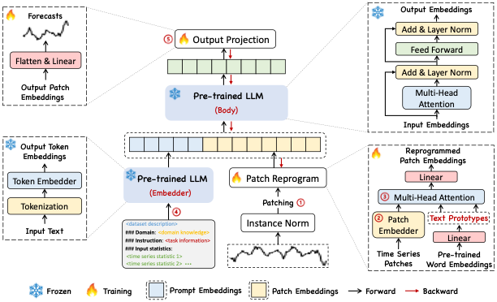

Time-LLM is a reprogramming framework to repurpose LLMs for general time
series forecasting with the backbone language models kept intact. In
other words, it transforms a forecasting task into a “language task”
that can be tackled by an off-the-shelf LLM.

**References**<br/> - [Ming Jin, Shiyu Wang, Lintao Ma, Zhixuan Chu,
James Y. Zhang, Xiaoming Shi, Pin-Yu Chen, Yuxuan Liang, Yuan-Fang Li,
Shirui Pan, Qingsong Wen. “Time-LLM: Time Series Forecasting by
Reprogramming Large Language
Models”](https://arxiv.org/abs/2310.01728)<br/>

<figure>

<figcaption aria-hidden="true">Figure 1. Time-LLM
Architecture.</figcaption>
</figure>

## 1. Auxiliary Functions

------------------------------------------------------------------------

<a
href="https://github.com/Nixtla/neuralforecast/blob/main/neuralforecast/models/timellm.py#L146"
target="_blank" style={{ float: "right", fontSize: "smaller" }}>source</a>

### Normalize

> ``` text
>  Normalize (num_features:int, eps=1e-05, affine=False,
>             subtract_last=False, non_norm=False)
> ```

Base class for all neural network modules.

Your models should also subclass this class.

Modules can also contain other Modules, allowing to nest them in a tree
structure. You can assign the submodules as regular attributes::

``` text
import torch.nn as nn
import torch.nn.functional as F

class Model(nn.Module):
    def __init__(self):
        super().__init__()
        self.conv1 = nn.Conv2d(1, 20, 5)
        self.conv2 = nn.Conv2d(20, 20, 5)

    def forward(self, x):
        x = F.relu(self.conv1(x))
        return F.relu(self.conv2(x))
```

Submodules assigned in this way will be registered, and will have their
parameters converted too when you call :meth:`to`, etc.

.. note:: As per the example above, an `__init__()` call to the parent
class must be made before assignment on the child.

:ivar training: Boolean represents whether this module is in training or
evaluation mode. :vartype training: bool

------------------------------------------------------------------------

<a
href="https://github.com/Nixtla/neuralforecast/blob/main/neuralforecast/models/timellm.py#L103"
target="_blank" style={{ float: "right", fontSize: "smaller" }}>source</a>

### ReprogrammingLayer

> ``` text
>  ReprogrammingLayer (d_model, n_heads, d_keys=None, d_llm=None,
>                      attention_dropout=0.1)
> ```

Base class for all neural network modules.

Your models should also subclass this class.

Modules can also contain other Modules, allowing to nest them in a tree
structure. You can assign the submodules as regular attributes::

``` text
import torch.nn as nn
import torch.nn.functional as F

class Model(nn.Module):
    def __init__(self):
        super().__init__()
        self.conv1 = nn.Conv2d(1, 20, 5)
        self.conv2 = nn.Conv2d(20, 20, 5)

    def forward(self, x):
        x = F.relu(self.conv1(x))
        return F.relu(self.conv2(x))
```

Submodules assigned in this way will be registered, and will have their
parameters converted too when you call :meth:`to`, etc.

.. note:: As per the example above, an `__init__()` call to the parent
class must be made before assignment on the child.

:ivar training: Boolean represents whether this module is in training or
evaluation mode. :vartype training: bool

------------------------------------------------------------------------

<a
href="https://github.com/Nixtla/neuralforecast/blob/main/neuralforecast/models/timellm.py#L88"
target="_blank" style={{ float: "right", fontSize: "smaller" }}>source</a>

### FlattenHead

> ``` text
>  FlattenHead (n_vars, nf, target_window, head_dropout=0)
> ```

Base class for all neural network modules.

Your models should also subclass this class.

Modules can also contain other Modules, allowing to nest them in a tree
structure. You can assign the submodules as regular attributes::

``` text
import torch.nn as nn
import torch.nn.functional as F

class Model(nn.Module):
    def __init__(self):
        super().__init__()
        self.conv1 = nn.Conv2d(1, 20, 5)
        self.conv2 = nn.Conv2d(20, 20, 5)

    def forward(self, x):
        x = F.relu(self.conv1(x))
        return F.relu(self.conv2(x))
```

Submodules assigned in this way will be registered, and will have their
parameters converted too when you call :meth:`to`, etc.

.. note:: As per the example above, an `__init__()` call to the parent
class must be made before assignment on the child.

:ivar training: Boolean represents whether this module is in training or
evaluation mode. :vartype training: bool

------------------------------------------------------------------------

<a
href="https://github.com/Nixtla/neuralforecast/blob/main/neuralforecast/models/timellm.py#L60"
target="_blank" style={{ float: "right", fontSize: "smaller" }}>source</a>

### PatchEmbedding

> ``` text
>  PatchEmbedding (d_model, patch_len, stride, dropout)
> ```

Base class for all neural network modules.

Your models should also subclass this class.

Modules can also contain other Modules, allowing to nest them in a tree
structure. You can assign the submodules as regular attributes::

``` text
import torch.nn as nn
import torch.nn.functional as F

class Model(nn.Module):
    def __init__(self):
        super().__init__()
        self.conv1 = nn.Conv2d(1, 20, 5)
        self.conv2 = nn.Conv2d(20, 20, 5)

    def forward(self, x):
        x = F.relu(self.conv1(x))
        return F.relu(self.conv2(x))
```

Submodules assigned in this way will be registered, and will have their
parameters converted too when you call :meth:`to`, etc.

.. note:: As per the example above, an `__init__()` call to the parent
class must be made before assignment on the child.

:ivar training: Boolean represents whether this module is in training or
evaluation mode. :vartype training: bool

------------------------------------------------------------------------

<a
href="https://github.com/Nixtla/neuralforecast/blob/main/neuralforecast/models/timellm.py#L37"
target="_blank" style={{ float: "right", fontSize: "smaller" }}>source</a>

### TokenEmbedding

> ``` text
>  TokenEmbedding (c_in, d_model)
> ```

Base class for all neural network modules.

Your models should also subclass this class.

Modules can also contain other Modules, allowing to nest them in a tree
structure. You can assign the submodules as regular attributes::

``` text
import torch.nn as nn
import torch.nn.functional as F

class Model(nn.Module):
    def __init__(self):
        super().__init__()
        self.conv1 = nn.Conv2d(1, 20, 5)
        self.conv2 = nn.Conv2d(20, 20, 5)

    def forward(self, x):
        x = F.relu(self.conv1(x))
        return F.relu(self.conv2(x))
```

Submodules assigned in this way will be registered, and will have their
parameters converted too when you call :meth:`to`, etc.

.. note:: As per the example above, an `__init__()` call to the parent
class must be made before assignment on the child.

:ivar training: Boolean represents whether this module is in training or
evaluation mode. :vartype training: bool

------------------------------------------------------------------------

<a
href="https://github.com/Nixtla/neuralforecast/blob/main/neuralforecast/models/timellm.py#L26"
target="_blank" style={{ float: "right", fontSize: "smaller" }}>source</a>

### ReplicationPad1d

> ``` text
>  ReplicationPad1d (padding)
> ```

Base class for all neural network modules.

Your models should also subclass this class.

Modules can also contain other Modules, allowing to nest them in a tree
structure. You can assign the submodules as regular attributes::

``` text
import torch.nn as nn
import torch.nn.functional as F

class Model(nn.Module):
    def __init__(self):
        super().__init__()
        self.conv1 = nn.Conv2d(1, 20, 5)
        self.conv2 = nn.Conv2d(20, 20, 5)

    def forward(self, x):
        x = F.relu(self.conv1(x))
        return F.relu(self.conv2(x))
```

Submodules assigned in this way will be registered, and will have their
parameters converted too when you call :meth:`to`, etc.

.. note:: As per the example above, an `__init__()` call to the parent
class must be made before assignment on the child.

:ivar training: Boolean represents whether this module is in training or
evaluation mode. :vartype training: bool

## 2. Model

------------------------------------------------------------------------

<a
href="https://github.com/Nixtla/neuralforecast/blob/main/neuralforecast/models/timellm.py#L221"
target="_blank" style={{ float: "right", fontSize: "smaller" }}>source</a>

### TimeLLM

> ``` text
>  TimeLLM (h, input_size, patch_len:int=16, stride:int=8, d_ff:int=128,
>           top_k:int=5, d_llm:int=768, d_model:int=32, n_heads:int=8,
>           enc_in:int=7, dec_in:int=7, llm=None, llm_config=None,
>           llm_tokenizer=None, llm_num_hidden_layers=32,
>           llm_output_attention:bool=True,
>           llm_output_hidden_states:bool=True,
>           prompt_prefix:Optional[str]=None, dropout:float=0.1,
>           stat_exog_list=None, hist_exog_list=None, futr_exog_list=None,
>           loss=MAE(), valid_loss=None, learning_rate:float=0.0001,
>           max_steps:int=5, val_check_steps:int=100, batch_size:int=32,
>           valid_batch_size:Optional[int]=None,
>           windows_batch_size:int=1024,
>           inference_windows_batch_size:int=1024,
>           start_padding_enabled:bool=False, step_size:int=1,
>           num_lr_decays:int=0, early_stop_patience_steps:int=-1,
>           scaler_type:str='identity', num_workers_loader:int=0,
>           drop_last_loader:bool=False, random_seed:int=1,
>           **trainer_kwargs)
> ```

TimeLLM

Time-LLM is a reprogramming framework to repurpose an off-the-shelf LLM
for time series forecasting.

It trains a reprogramming layer that translates the observed series into
a language task. This is fed to the LLM and an output projection layer
translates the output back to numerical predictions.

**Parameters:**<br/> `h`: int, Forecast horizon. <br/> `input_size`: int,
autorregresive inputs size, y=\[1,2,3,4\] input_size=2 -\>
y\_\[t-2:t\]=\[1,2\].<br/> `patch_len`: int=16, length of patch.<br/>
`stride`: int=8, stride of patch.<br/> `d_ff`: int=128, dimension of
fcn.<br/> `top_k`: int=5, top tokens to consider.<br/> `d_llm`: int=768,
hidden dimension of LLM.<br/> `d_model`: int=32, dimension of model.<br/>
`n_heads`: int=8, number of heads in attention layer.<br/> `enc_in`:
int=7, encoder input size.<br/> `dec_in`: int=7, decoder input size.<br/>
`llm` = None, LLM model to use. If not specified, it will use GPT-2 from
https://huggingface.co/openai-community/gpt2”<br/> `llm_config` = None,
configuration of LLM. If not specified, it will use the configuration of
GPT-2 from https://huggingface.co/openai-community/gpt2”<br/>
`llm_tokenizer` = None, tokenizer of LLM. If not specified, it will use
the GPT-2 tokenizer from
https://huggingface.co/openai-community/gpt2”<br/>
`llm_num_hidden_layers` = 32, hidden layers in LLM
`llm_output_attention`: bool = True, whether to output attention in
encoder.<br/> `llm_output_hidden_states`: bool = True, whether to output
hidden states.<br/> `prompt_prefix`: str=None, prompt to inform the LLM
about the dataset.<br/> `dropout`: float=0.1, dropout rate.<br/>
`stat_exog_list`: str list, static exogenous columns.<br/>
`hist_exog_list`: str list, historic exogenous columns.<br/>
`futr_exog_list`: str list, future exogenous columns.<br/> `loss`:
PyTorch module, instantiated train loss class from [losses
collection](https://nixtla.github.io/neuralforecast/losses.pytorch.html).<br/>
`valid_loss`: PyTorch module=`loss`, instantiated valid loss class from
[losses
collection](https://nixtla.github.io/neuralforecast/losses.pytorch.html).<br/>
`learning_rate`: float=1e-3, Learning rate between (0, 1).<br/>
`max_steps`: int=1000, maximum number of training steps.<br/>
`num_lr_decays`: int=-1, Number of learning rate decays, evenly
distributed across max_steps.<br/> `early_stop_patience_steps`: int=-1,
Number of validation iterations before early stopping.<br/>
`val_check_steps`: int=100, Number of training steps between every
validation loss check.<br/> `batch_size`: int=32, number of different
series in each batch.<br/> `valid_batch_size`: int=None, number of
different series in each validation and test batch, if None uses
batch_size.<br/> `windows_batch_size`: int=1024, number of windows to
sample in each training batch, default uses all.<br/>
`inference_windows_batch_size`: int=1024, number of windows to sample in
each inference batch.<br/> `start_padding_enabled`: bool=False, if True,
the model will pad the time series with zeros at the beginning, by input
size.<br/> `step_size`: int=1, step size between each window of temporal
data.<br/> `scaler_type`: str=‘identity’, type of scaler for temporal
inputs normalization see [temporal
scalers](https://nixtla.github.io/neuralforecast/common.scalers.html).<br/>
`random_seed`: int, random_seed for pytorch initializer and numpy
generators.<br/> `num_workers_loader`: int=os.cpu_count(), workers to be
used by `TimeSeriesDataLoader`.<br/> `drop_last_loader`: bool=False, if
True `TimeSeriesDataLoader` drops last non-full batch.<br/> `alias`: str,
optional, Custom name of the model.<br/> `**trainer_kwargs`: int, keyword
trainer arguments inherited from [PyTorch Lighning’s
trainer](https://pytorch-lightning.readthedocs.io/en/stable/api/pytorch_lightning.trainer.trainer.trainer.html?highlight=trainer).<br/>

**References:**<br/> -[Ming Jin, Shiyu Wang, Lintao Ma, Zhixuan Chu,
James Y. Zhang, Xiaoming Shi, Pin-Yu Chen, Yuxuan Liang, Yuan-Fang Li,
Shirui Pan, Qingsong Wen. “Time-LLM: Time Series Forecasting by
Reprogramming Large Language Models”](https://arxiv.org/abs/2310.01728)

------------------------------------------------------------------------

### TimeLLM.fit

> ``` text
>  TimeLLM.fit (dataset, val_size=0, test_size=0, random_seed=None)
> ```

Fit.

The `fit` method, optimizes the neural network’s weights using the
initialization parameters (`learning_rate`, `windows_batch_size`, …) and
the `loss` function as defined during the initialization. Within `fit`
we use a PyTorch Lightning `Trainer` that inherits the initialization’s
`self.trainer_kwargs`, to customize its inputs, see [PL’s trainer
arguments](https://pytorch-lightning.readthedocs.io/en/stable/api/pytorch_lightning.trainer.trainer.trainer.html?highlight=trainer).

The method is designed to be compatible with SKLearn-like classes and in
particular to be compatible with the StatsForecast library.

By default the `model` is not saving training checkpoints to protect
disk memory, to get them change `enable_checkpointing=True` in
`__init__`.

**Parameters:**<br/> `dataset`: NeuralForecast’s
[`TimeSeriesDataset`](https://Nixtla.github.io/neuralforecast/tsdataset.html#timeseriesdataset),
see
[documentation](https://nixtla.github.io/neuralforecast/tsdataset.html).<br/>
`val_size`: int, validation size for temporal cross-validation.<br/>
`random_seed`: int=None, random_seed for pytorch initializer and numpy
generators, overwrites model.\_\_init\_\_’s.<br/> `test_size`: int, test
size for temporal cross-validation.<br/>

------------------------------------------------------------------------

### TimeLLM.predict

> ``` text
>  TimeLLM.predict (dataset, test_size=None, step_size=1, random_seed=None,
>                   **data_module_kwargs)
> ```

Predict.

Neural network prediction with PL’s `Trainer` execution of
`predict_step`.

**Parameters:**<br/> `dataset`: NeuralForecast’s
[`TimeSeriesDataset`](https://Nixtla.github.io/neuralforecast/tsdataset.html#timeseriesdataset),
see
[documentation](https://nixtla.github.io/neuralforecast/tsdataset.html).<br/>
`test_size`: int=None, test size for temporal cross-validation.<br/>
`step_size`: int=1, Step size between each window.<br/> `random_seed`:
int=None, random_seed for pytorch initializer and numpy generators,
overwrites model.\_\_init\_\_’s.<br/> `**data_module_kwargs`: PL’s
TimeSeriesDataModule args, see
[documentation](https://pytorch-lightning.readthedocs.io/en/1.6.1/extensions/datamodules.html#using-a-datamodule).

## Usage example

```python
from neuralforecast import NeuralForecast
from neuralforecast.models import TimeLLM
from neuralforecast.utils import AirPassengersPanel, augment_calendar_df

from transformers import GPT2Config, GPT2Model, GPT2Tokenizer

AirPassengersPanel, calendar_cols = augment_calendar_df(df=AirPassengersPanel, freq='M')

Y_train_df = AirPassengersPanel[AirPassengersPanel.ds<AirPassengersPanel['ds'].values[-12]] # 132 train
Y_test_df = AirPassengersPanel[AirPassengersPanel.ds>=AirPassengersPanel['ds'].values[-12]].reset_index(drop=True) # 12 test

gpt2_config = GPT2Config.from_pretrained('openai-community/gpt2')
gpt2 = GPT2Model.from_pretrained('openai-community/gpt2', config=gpt2_config)
gpt2_tokenizer = GPT2Tokenizer.from_pretrained('openai-community/gpt2')

prompt_prefix = "The dataset contains data on monthly air passengers. There is a yearly seasonality"

timellm = TimeLLM(h=12,
                 input_size=36,
                 llm=gpt2,
                 llm_config=gpt2_config,
                 llm_tokenizer=gpt2_tokenizer,
                 prompt_prefix=prompt_prefix,
                 batch_size=24,
                 windows_batch_size=24)

nf = NeuralForecast(
    models=[timellm],
    freq='M'
)

nf.fit(df=Y_train_df, val_size=12)
forecasts = nf.predict(futr_df=Y_test_df)
```

## Tests

```python
try:
    from transformers import GPT2Config, GPT2Model, GPT2Tokenizer
except ImportError:
    raise ImportError('The transformers library is required for Time-LLM to work')

from neuralforecast import NeuralForecast
from neuralforecast.models import TimeLLM

from neuralforecast.utils import AirPassengersPanel, augment_calendar_df

AirPassengersPanel, calendar_cols = augment_calendar_df(df=AirPassengersPanel, freq='M')

Y_train_df = AirPassengersPanel[AirPassengersPanel.ds<AirPassengersPanel['ds'].values[-12]] # 132 train
Y_test_df = AirPassengersPanel[AirPassengersPanel.ds>=AirPassengersPanel['ds'].values[-12]].reset_index(drop=True) # 12 test

gpt2_config = GPT2Config.from_pretrained('openai-community/gpt2')
gpt2 = GPT2Model.from_pretrained('openai-community/gpt2', config=gpt2_config)
gpt2_tokenizer = GPT2Tokenizer.from_pretrained('openai-community/gpt2')

prompt_prefix = "The dataset contains data on monthly air passengers. There is a yearly seasonality"

timellm = TimeLLM(h=12,
                 input_size=36,
                 llm=gpt2,
                 llm_config=gpt2_config,
                 llm_tokenizer=gpt2_tokenizer,
                 prompt_prefix=prompt_prefix,
                 batch_size=24,
                 windows_batch_size=24)

nf = NeuralForecast(
    models=[timellm],
    freq='M'
)

nf.fit(df=Y_train_df, val_size=12)
forecasts = nf.predict(futr_df=Y_test_df)

# Asserts
assert 'TimeLLM' in forecasts.columns, "The column TimeLLM does not exist. Something went wrong with the model"
assert not forecasts['TimeLLM'].isnull().any(), "Predictions contain NaN values."
```

