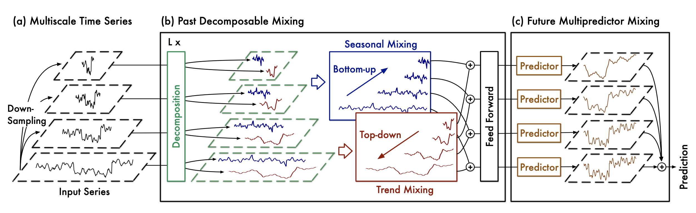

*Figure 1. Architecture of SOFTS.*

## 1. TimeMixer

### `TimeMixer`

```python
TimeMixer(
    h,
    input_size,
    n_series,
    stat_exog_list=None,
    hist_exog_list=None,
    futr_exog_list=None,
    d_model=32,
    d_ff=32,
    dropout=0.1,
    e_layers=4,
    top_k=5,
    decomp_method="moving_avg",
    moving_avg=25,
    channel_independence=0,
    down_sampling_layers=1,
    down_sampling_window=2,
    down_sampling_method="avg",
    use_norm=True,
    decoder_input_size_multiplier=0.5,
    loss=MAE(),
    valid_loss=None,
    max_steps=1000,
    learning_rate=0.001,
    num_lr_decays=-1,
    early_stop_patience_steps=-1,
    val_check_steps=100,
    batch_size=32,
    valid_batch_size=None,
    windows_batch_size=32,
    inference_windows_batch_size=32,
    start_padding_enabled=False,
    training_data_availability_threshold=0.0,
    step_size=1,
    scaler_type="identity",
    random_seed=1,
    drop_last_loader=False,
    alias=None,
    optimizer=None,
    optimizer_kwargs=None,
    lr_scheduler=None,
    lr_scheduler_kwargs=None,
    dataloader_kwargs=None,
    **trainer_kwargs
)
```

Bases: <code>[BaseModel](#neuralforecast.common._base_model.BaseModel)</code>

TimeMixer
Args:
h (int): Forecast horizon.
input_size (int): autorregresive inputs size, y=[1,2,3,4] input_size=2 -> y\_[t-2:t]=[1,2].
n_series (int): number of time-series.
stat_exog_list (list): static exogenous columns.
hist_exog_list (list): historic exogenous columns.
futr_exog_list (list): future exogenous columns.
d_model (int): dimension of the model.
d_ff (int): dimension of the fully-connected network.
dropout (float): dropout rate.
e_layers (int): number of encoder layers.
top_k (int): number of selected frequencies.
decomp_method (str): method of series decomposition [moving_avg, dft_decomp].
moving_avg (int): window size of moving average.
channel_independence (int): 0: channel dependence, 1: channel independence.
down_sampling_layers (int): number of downsampling layers.
down_sampling_window (int): size of downsampling window.
down_sampling_method (str): down sampling method [avg, max, conv].
use_norm (bool): whether to normalize or not.
decoder_input_size_multiplier (float): 0.5.
loss (PyTorch module): instantiated train loss class from [losses collection](./losses.pytorch).
valid_loss (PyTorch module): instantiated valid loss class from [losses collection](./losses.pytorch).
max_steps (int): maximum number of training steps.
learning_rate (float): Learning rate between (0, 1).
num_lr_decays (int): Number of learning rate decays, evenly distributed across max_steps.
early_stop_patience_steps (int): Number of validation iterations before early stopping.
val_check_steps (int): Number of training steps between every validation loss check.
batch_size (int): number of different series in each batch.
valid_batch_size (int): number of different series in each validation and test batch, if None uses batch_size.
windows_batch_size (int): number of windows to sample in each training batch, default uses all.
inference_windows_batch_size (int): number of windows to sample in each inference batch, -1 uses all.
start_padding_enabled (bool): if True, the model will pad the time series with zeros at the beginning, by input size.
training_data_availability_threshold (Union\[float, List[float]\]): minimum fraction of valid data points required for training windows. Single float applies to both insample and outsample; list of two floats specifies [insample_fraction, outsample_fraction]. Default 0.0 allows windows with only 1 valid data point (current behavior).
step_size (int): step size between each window of temporal data.
scaler_type (str): type of scaler for temporal inputs normalization see [temporal scalers](https://github.com/Nixtla/neuralforecast/blob/main/neuralforecast/common/_scalers.py).
random_seed (int): random_seed for pytorch initializer and numpy generators.
drop_last_loader (bool): if True `TimeSeriesDataLoader` drops last non-full batch.
alias (str): optional, Custom name of the model.
optimizer (Subclass of 'torch.optim.Optimizer'): optional, user specified optimizer instead of the default choice (Adam).
optimizer_kwargs (dict): optional, list of parameters used by the user specified `optimizer`.
lr_scheduler (Subclass of 'torch.optim.lr_scheduler.LRScheduler'): optional, user specified lr_scheduler instead of the default choice (StepLR).
lr_scheduler_kwargs (dict): optional, list of parameters used by the user specified `lr_scheduler`.
dataloader_kwargs (dict): optional, list of parameters passed into the PyTorch Lightning dataloader by the `TimeSeriesDataLoader`.
\*\*trainer_kwargs (keyword): trainer arguments inherited from [PyTorch Lighning's trainer](https://pytorch-lightning.readthedocs.io/en/stable/api/pytorch_lightning.trainer.trainer.Trainer.html?highlight=trainer).

<details class="references" open markdown="1">
<summary>References</summary>

- [Shiyu Wang, Haixu Wu, Xiaoming Shi, Tengge Hu, Huakun Luo, Lintao Ma, James Y. Zhang, Jun Zhou."TimeMixer: Decomposable Multiscale Mixing For Time Series Forecasting"](https://openreview.net/pdf?id=7oLshfEIC2)

</details>

#### `TimeMixer.fit`

```python
fit(
    dataset, val_size=0, test_size=0, random_seed=None, distributed_config=None
)
```

Fit.

The `fit` method, optimizes the neural network's weights using the
initialization parameters (`learning_rate`, `windows_batch_size`, ...)
and the `loss` function as defined during the initialization.
Within `fit` we use a PyTorch Lightning `Trainer` that
inherits the initialization's `self.trainer_kwargs`, to customize
its inputs, see [PL's trainer arguments](https://pytorch-lightning.readthedocs.io/en/stable/api/pytorch_lightning.trainer.trainer.Trainer.html?highlight=trainer).

The method is designed to be compatible with SKLearn-like classes
and in particular to be compatible with the StatsForecast library.

By default the `model` is not saving training checkpoints to protect
disk memory, to get them change `enable_checkpointing=True` in `__init__`.

**Parameters:**

Name | Type | Description | Default
---- | ---- | ----------- | -------
`dataset` | <code>[TimeSeriesDataset](#TimeSeriesDataset)</code> | NeuralForecast's `TimeSeriesDataset`, see [documentation](./tsdataset). | *required*
`val_size` | <code>[int](#int)</code> | Validation size for temporal cross-validation. | <code>0</code>
`random_seed` | <code>[int](#int)</code> | Random seed for pytorch initializer and numpy generators, overwrites model.__init__'s. | <code>None</code>
`test_size` | <code>[int](#int)</code> | Test size for temporal cross-validation. | <code>0</code>

**Returns:**

Type | Description
---- | -----------
| None

#### `TimeMixer.predict`

```python
predict(
    dataset,
    test_size=None,
    step_size=1,
    random_seed=None,
    quantiles=None,
    h=None,
    explainer_config=None,
    **data_module_kwargs
)
```

Predict.

Neural network prediction with PL's `Trainer` execution of `predict_step`.

**Parameters:**

Name | Type | Description | Default
---- | ---- | ----------- | -------
`dataset` | <code>[TimeSeriesDataset](#TimeSeriesDataset)</code> | NeuralForecast's `TimeSeriesDataset`, see [documentation](./tsdataset). | *required*
`test_size` | <code>[int](#int)</code> | Test size for temporal cross-validation. | <code>None</code>
`step_size` | <code>[int](#int)</code> | Step size between each window. | <code>1</code>
`random_seed` | <code>[int](#int)</code> | Random seed for pytorch initializer and numpy generators, overwrites model.__init__'s. | <code>None</code>
`quantiles` | <code>[list](#list)</code> | Target quantiles to predict. | <code>None</code>
`h` | <code>[int](#int)</code> | Prediction horizon, if None, uses the model's fitted horizon. Defaults to None. | <code>None</code>
`explainer_config` | <code>[dict](#dict)</code> | configuration for explanations. | <code>None</code>
`**data_module_kwargs` | <code>[dict](#dict)</code> | PL's TimeSeriesDataModule args, see [documentation](https://pytorch-lightning.readthedocs.io/en/1.6.1/extensions/datamodules.html#using-a-datamodule). | <code>{}</code>

**Returns:**

Type | Description
---- | -----------
| None


### Usage example

```python 
import pandas as pd
import matplotlib.pyplot as plt

from neuralforecast import NeuralForecast
from neuralforecast.models import TimeMixer
from neuralforecast.utils import AirPassengersPanel, AirPassengersStatic
from neuralforecast.losses.pytorch import MAE

Y_train_df = AirPassengersPanel[AirPassengersPanel.ds<AirPassengersPanel['ds'].values[-12]].reset_index(drop=True) # 132 train
Y_test_df = AirPassengersPanel[AirPassengersPanel.ds>=AirPassengersPanel['ds'].values[-12]].reset_index(drop=True) # 12 test

model = TimeMixer(h=12,
                input_size=24,
                n_series=2,
                scaler_type='standard',
                max_steps=500,
                early_stop_patience_steps=-1,
                val_check_steps=5,
                learning_rate=1e-3,
                loss = MAE(),
                valid_loss=MAE(),
                batch_size=32
                )

fcst = NeuralForecast(models=[model], freq='ME')
fcst.fit(df=Y_train_df, static_df=AirPassengersStatic, val_size=12)
forecasts = fcst.predict(futr_df=Y_test_df)

# Plot predictions
fig, ax = plt.subplots(1, 1, figsize = (20, 7))
Y_hat_df = forecasts.reset_index(drop=False).drop(columns=['unique_id','ds'])
plot_df = pd.concat([Y_test_df, Y_hat_df], axis=1)
plot_df = pd.concat([Y_train_df, plot_df])

plot_df = plot_df[plot_df.unique_id=='Airline1'].drop('unique_id', axis=1)
plt.plot(plot_df['ds'], plot_df['y'], c='black', label='True')
plt.plot(plot_df['ds'], plot_df['TimeMixer'], c='blue', label='median')
ax.set_title('AirPassengers Forecast', fontsize=22)
ax.set_ylabel('Monthly Passengers', fontsize=20)
ax.set_xlabel('Year', fontsize=20)
ax.legend(prop={'size': 15})
ax.grid()
```

Using `cross_validation` to forecast multiple historic values.

```python 
fcst = NeuralForecast(models=[model], freq='M')
forecasts = fcst.cross_validation(df=AirPassengersPanel, static_df=AirPassengersStatic, n_windows=2, step_size=12)

# Plot predictions
fig, ax = plt.subplots(1, 1, figsize = (20, 7))
Y_hat_df = forecasts.loc['Airline1']
Y_df = AirPassengersPanel[AirPassengersPanel['unique_id']=='Airline1']

plt.plot(Y_df['ds'], Y_df['y'], c='black', label='True')
plt.plot(Y_hat_df['ds'], Y_hat_df['TimeMixer'], c='blue', label='Forecast')
ax.set_title('AirPassengers Forecast', fontsize=22)
ax.set_ylabel('Monthly Passengers', fontsize=20)
ax.set_xlabel('Year', fontsize=20)
ax.legend(prop={'size': 15})
ax.grid()
```

## 2. Auxiliary Functions

### 2.1 Embedding

### `DataEmbedding_wo_pos`

```python
DataEmbedding_wo_pos(c_in, d_model, dropout=0.1, embed_type='fixed', freq='h')
```

Bases: <code>[Module](#torch.nn.Module)</code>

DataEmbedding_wo_pos

### `DFT_series_decomp`

```python
DFT_series_decomp(top_k)
```

Bases: <code>[Module](#torch.nn.Module)</code>

Series decomposition block

### 2.2 Mixing

### `PastDecomposableMixing`

```python
PastDecomposableMixing(
    seq_len,
    pred_len,
    down_sampling_window,
    down_sampling_layers,
    d_model,
    dropout,
    channel_independence,
    decomp_method,
    d_ff,
    moving_avg,
    top_k,
)
```

Bases: <code>[Module](#torch.nn.Module)</code>

PastDecomposableMixing

### `MultiScaleTrendMixing`

```python
MultiScaleTrendMixing(seq_len, down_sampling_window, down_sampling_layers)
```

Bases: <code>[Module](#torch.nn.Module)</code>

Top-down mixing trend pattern

### `MultiScaleSeasonMixing`

```python
MultiScaleSeasonMixing(seq_len, down_sampling_window, down_sampling_layers)
```

Bases: <code>[Module](#torch.nn.Module)</code>

Bottom-up mixing season pattern
