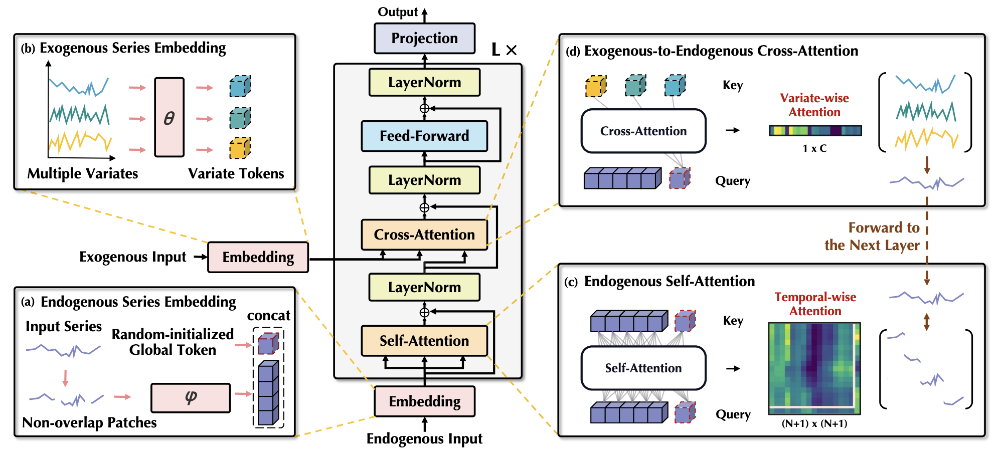

<figure>

<figcaption aria-hidden="true">Figure 1. Architecture of
TimeXer.</figcaption>
</figure>

# 1. Auxiliary functions

------------------------------------------------------------------------

<a
href="https://github.com/Nixtla/neuralforecast/blob/main/neuralforecast/models/timexer.py#L22"
target="_blank" style={{ float: "right", fontSize: "smaller" }}>source</a>

### FlattenHead

> ``` text
>  FlattenHead (n_vars, nf, target_window, head_dropout=0)
> ```

\*Base class for all neural network modules.

Your models should also subclass this class.

Modules can also contain other Modules, allowing them to be nested in a
tree structure. You can assign the submodules as regular attributes::

``` text
import torch.nn as nn
import torch.nn.functional as F

class Model(nn.Module):
    def __init__(self) -> None:
        super().__init__()
        self.conv1 = nn.Conv2d(1, 20, 5)
        self.conv2 = nn.Conv2d(20, 20, 5)

    def forward(self, x):
        x = F.relu(self.conv1(x))
        return F.relu(self.conv2(x))
```

Submodules assigned in this way will be registered, and will also have
their parameters converted when you call :meth:`to`, etc.

.. note:: As per the example above, an `__init__()` call to the parent
class must be made before assignment on the child.

:ivar training: Boolean represents whether this module is in training or
evaluation mode. :vartype training: bool\*

------------------------------------------------------------------------

<a
href="https://github.com/Nixtla/neuralforecast/blob/main/neuralforecast/models/timexer.py#L37"
target="_blank" style={{ float: "right", fontSize: "smaller" }}>source</a>

### Encoder

> ``` text
>  Encoder (layers, norm_layer=None, projection=None)
> ```

\*Base class for all neural network modules.

Your models should also subclass this class.

Modules can also contain other Modules, allowing them to be nested in a
tree structure. You can assign the submodules as regular attributes::

``` text
import torch.nn as nn
import torch.nn.functional as F

class Model(nn.Module):
    def __init__(self) -> None:
        super().__init__()
        self.conv1 = nn.Conv2d(1, 20, 5)
        self.conv2 = nn.Conv2d(20, 20, 5)

    def forward(self, x):
        x = F.relu(self.conv1(x))
        return F.relu(self.conv2(x))
```

Submodules assigned in this way will be registered, and will also have
their parameters converted when you call :meth:`to`, etc.

.. note:: As per the example above, an `__init__()` call to the parent
class must be made before assignment on the child.

:ivar training: Boolean represents whether this module is in training or
evaluation mode. :vartype training: bool\*

------------------------------------------------------------------------

<a
href="https://github.com/Nixtla/neuralforecast/blob/main/neuralforecast/models/timexer.py#L58"
target="_blank" style={{ float: "right", fontSize: "smaller" }}>source</a>

### EncoderLayer

> ``` text
>  EncoderLayer (self_attention, cross_attention, d_model, d_ff=None,
>                dropout=0.1, activation='relu')
> ```

\*Base class for all neural network modules.

Your models should also subclass this class.

Modules can also contain other Modules, allowing them to be nested in a
tree structure. You can assign the submodules as regular attributes::

``` text
import torch.nn as nn
import torch.nn.functional as F

class Model(nn.Module):
    def __init__(self) -> None:
        super().__init__()
        self.conv1 = nn.Conv2d(1, 20, 5)
        self.conv2 = nn.Conv2d(20, 20, 5)

    def forward(self, x):
        x = F.relu(self.conv1(x))
        return F.relu(self.conv2(x))
```

Submodules assigned in this way will be registered, and will also have
their parameters converted when you call :meth:`to`, etc.

.. note:: As per the example above, an `__init__()` call to the parent
class must be made before assignment on the child.

:ivar training: Boolean represents whether this module is in training or
evaluation mode. :vartype training: bool\*

------------------------------------------------------------------------

<a
href="https://github.com/Nixtla/neuralforecast/blob/main/neuralforecast/models/timexer.py#L108"
target="_blank" style={{ float: "right", fontSize: "smaller" }}>source</a>

### EnEmbedding

> ``` text
>  EnEmbedding (n_vars, d_model, patch_len, dropout)
> ```

\*Base class for all neural network modules.

Your models should also subclass this class.

Modules can also contain other Modules, allowing them to be nested in a
tree structure. You can assign the submodules as regular attributes::

``` text
import torch.nn as nn
import torch.nn.functional as F

class Model(nn.Module):
    def __init__(self) -> None:
        super().__init__()
        self.conv1 = nn.Conv2d(1, 20, 5)
        self.conv2 = nn.Conv2d(20, 20, 5)

    def forward(self, x):
        x = F.relu(self.conv1(x))
        return F.relu(self.conv2(x))
```

Submodules assigned in this way will be registered, and will also have
their parameters converted when you call :meth:`to`, etc.

.. note:: As per the example above, an `__init__()` call to the parent
class must be made before assignment on the child.

:ivar training: Boolean represents whether this module is in training or
evaluation mode. :vartype training: bool\*

# 2. Model

------------------------------------------------------------------------

<a
href="https://github.com/Nixtla/neuralforecast/blob/main/neuralforecast/models/timexer.py#L135"
target="_blank" style={{ float: "right", fontSize: "smaller" }}>source</a>

### TimeXer

> ``` text
>  TimeXer (h, input_size, n_series, futr_exog_list=None,
>           hist_exog_list=None, stat_exog_list=None, patch_len:int=16,
>           hidden_size:int=512, n_heads:int=8, e_layers:int=2,
>           d_ff:int=2048, factor:int=1, dropout:float=0.1,
>           use_norm:bool=True, loss=MAE(), valid_loss=None,
>           max_steps:int=1000, learning_rate:float=0.001,
>           num_lr_decays:int=-1, early_stop_patience_steps:int=-1,
>           val_check_steps:int=100, batch_size:int=32,
>           valid_batch_size:Optional[int]=None, windows_batch_size=32,
>           inference_windows_batch_size=32, start_padding_enabled=False,
>           step_size:int=1, scaler_type:str='identity', random_seed:int=1,
>           drop_last_loader:bool=False, alias:Optional[str]=None,
>           optimizer=None, optimizer_kwargs=None, lr_scheduler=None,
>           lr_scheduler_kwargs=None, dataloader_kwargs=None,
>           **trainer_kwargs)
> ```

\*TimeXer

**Parameters:**<br/> `h`: int, Forecast horizon. <br/> `input_size`: int,
autorregresive inputs size, y=\[1,2,3,4\] input_size=2 -\>
y\_\[t-2:t\]=\[1,2\].<br/> `n_series`: int, number of time-series.<br/>
`futr_exog_list`: str list, future exogenous columns.<br/>
`hist_exog_list`: str list, historic exogenous columns.<br/>
`stat_exog_list`: str list, static exogenous columns.<br/> `patch_len`:
int, length of patches.<br/> `hidden_size`: int, dimension of the
model.<br/> `n_heads`: int, number of heads.<br/> `e_layers`: int, number
of encoder layers.<br/> `d_ff`: int, dimension of fully-connected
layer.<br/> `factor`: int, attention factor.<br/> `dropout`: float,
dropout rate.<br/> `use_norm`: bool, whether to normalize or not.<br/>
`loss`: PyTorch module, instantiated train loss class from [losses
collection](https://nixtla.github.io/neuralforecast/losses.pytorch.html).<br/>
`valid_loss`: PyTorch module=`loss`, instantiated valid loss class from
[losses
collection](https://nixtla.github.io/neuralforecast/losses.pytorch.html).<br/>
`max_steps`: int=1000, maximum number of training steps.<br/>
`learning_rate`: float=1e-3, Learning rate between (0, 1).<br/>
`num_lr_decays`: int=-1, Number of learning rate decays, evenly
distributed across max_steps.<br/> `early_stop_patience_steps`: int=-1,
Number of validation iterations before early stopping.<br/>
`val_check_steps`: int=100, Number of training steps between every
validation loss check.<br/> `batch_size`: int=32, number of different
series in each batch.<br/> `valid_batch_size`: int=None, number of
different series in each validation and test batch, if None uses
batch_size.<br/> `windows_batch_size`: int=32, number of windows in each
batch.<br/>  
`inference_windows_batch_size`: int=32, number of windows to sample in
each inference batch, -1 uses all.<br/> `start_padding_enabled`:
bool=False, if True, the model will pad the time series with zeros at
the beginning, by input size.<br/> `step_size`: int=1, step size between
each window of temporal data.<br/> `scaler_type`: str=‘identity’, type of
scaler for temporal inputs normalization see [temporal
scalers](https://nixtla.github.io/neuralforecast/common.scalers.html).<br/>
`random_seed`: int=1, random_seed for pytorch initializer and numpy
generators.<br/> `drop_last_loader`: bool=False, if True
`TimeSeriesDataLoader` drops last non-full batch.<br/> `alias`: str,
optional, Custom name of the model.<br/> `optimizer`: Subclass of
‘torch.optim.Optimizer’, optional, user specified optimizer instead of
the default choice (Adam).<br/> `optimizer_kwargs`: dict, optional, list
of parameters used by the user specified `optimizer`.<br/>
`lr_scheduler`: Subclass of ‘torch.optim.lr_scheduler.LRScheduler’,
optional, user specified lr_scheduler instead of the default choice
(StepLR).<br/> `lr_scheduler_kwargs`: dict, optional, list of parameters
used by the user specified `lr_scheduler`.<br/> `dataloader_kwargs`:
dict, optional, list of parameters passed into the PyTorch Lightning
dataloader by the `TimeSeriesDataLoader`. <br/> `**trainer_kwargs`: int,
keyword trainer arguments inherited from [PyTorch Lighning’s
trainer](https://pytorch-lightning.readthedocs.io/en/stable/api/pytorch_lightning.trainer.trainer.Trainer.html?highlight=trainer).<br/>

**Parameters:**<br/>

**References** - [Yuxuan Wang, Haixu Wu, Jiaxiang Dong, Guo Qin, Haoran
Zhang, Yong Liu, Yunzhong Qiu, Jianmin Wang, Mingsheng Long. “TimeXer:
Empowering Transformers for Time Series Forecasting with Exogenous
Variables”](https://arxiv.org/abs/2402.19072)\*

------------------------------------------------------------------------

### TimeXer.fit

> ``` text
>  TimeXer.fit (dataset, val_size=0, test_size=0, random_seed=None,
>               distributed_config=None)
> ```

\*Fit.

The `fit` method, optimizes the neural network’s weights using the
initialization parameters (`learning_rate`, `windows_batch_size`, …) and
the `loss` function as defined during the initialization. Within `fit`
we use a PyTorch Lightning `Trainer` that inherits the initialization’s
`self.trainer_kwargs`, to customize its inputs, see [PL’s trainer
arguments](https://pytorch-lightning.readthedocs.io/en/stable/api/pytorch_lightning.trainer.trainer.Trainer.html?highlight=trainer).

The method is designed to be compatible with SKLearn-like classes and in
particular to be compatible with the StatsForecast library.

By default the `model` is not saving training checkpoints to protect
disk memory, to get them change `enable_checkpointing=True` in
`__init__`.

**Parameters:**<br/> `dataset`: NeuralForecast’s
[`TimeSeriesDataset`](https://nixtlaverse.nixtla.io/neuralforecast/tsdataset.html#timeseriesdataset),
see
[documentation](https://nixtla.github.io/neuralforecast/tsdataset.html).<br/>
`val_size`: int, validation size for temporal cross-validation.<br/>
`random_seed`: int=None, random_seed for pytorch initializer and numpy
generators, overwrites model.\_\_init\_\_’s.<br/> `test_size`: int, test
size for temporal cross-validation.<br/>\*

------------------------------------------------------------------------

### TimeXer.predict

> ``` text
>  TimeXer.predict (dataset, test_size=None, step_size=1, random_seed=None,
>                   quantiles=None, **data_module_kwargs)
> ```

\*Predict.

Neural network prediction with PL’s `Trainer` execution of
`predict_step`.

**Parameters:**<br/> `dataset`: NeuralForecast’s
[`TimeSeriesDataset`](https://nixtlaverse.nixtla.io/neuralforecast/tsdataset.html#timeseriesdataset),
see
[documentation](https://nixtla.github.io/neuralforecast/tsdataset.html).<br/>
`test_size`: int=None, test size for temporal cross-validation.<br/>
`step_size`: int=1, Step size between each window.<br/> `random_seed`:
int=None, random_seed for pytorch initializer and numpy generators,
overwrites model.\_\_init\_\_’s.<br/> `quantiles`: list of floats,
optional (default=None), target quantiles to predict. <br/>
`**data_module_kwargs`: PL’s TimeSeriesDataModule args, see
[documentation](https://pytorch-lightning.readthedocs.io/en/1.6.1/extensions/datamodules.html#using-a-datamodule).\*

```python
# Unit tests for models
logging.getLogger("pytorch_lightning").setLevel(logging.ERROR)
logging.getLogger("lightning_fabric").setLevel(logging.ERROR)
with warnings.catch_warnings():
    warnings.simplefilter("ignore")
    check_model(TimeXer, ["airpassengers"])
```

# 3. Usage example

```python
import pandas as pd
import matplotlib.pyplot as plt

from neuralforecast import NeuralForecast
from neuralforecast.models import TimeXer
from neuralforecast.losses.pytorch import MSE
from neuralforecast.utils import AirPassengersPanel, AirPassengersStatic, augment_calendar_df

AirPassengersPanel, calendar_cols = augment_calendar_df(df=AirPassengersPanel, freq='M')

Y_train_df = AirPassengersPanel[AirPassengersPanel.ds<AirPassengersPanel['ds'].values[-12]] # 132 train
Y_test_df = AirPassengersPanel[AirPassengersPanel.ds>=AirPassengersPanel['ds'].values[-12]].reset_index(drop=True) # 12 test

model = TimeXer(h=12,
                input_size=24,
                n_series=2,
                futr_exog_list=["trend", "month"],
                patch_len=12,
                hidden_size=128,
                n_heads=16,
                e_layers=2,
                d_ff=256,
                factor=1,
                dropout=0.1,
                use_norm=True,
                loss=MSE(),
                valid_loss=MAE(),
                early_stop_patience_steps=3,
                batch_size=32)

fcst = NeuralForecast(models=[model], freq='ME')
fcst.fit(df=Y_train_df, static_df=AirPassengersStatic, val_size=12)
forecasts = fcst.predict(futr_df=Y_test_df)

# Plot predictions
fig, ax = plt.subplots(1, 1, figsize = (20, 7))
Y_hat_df = forecasts.reset_index(drop=False).drop(columns=['unique_id','ds'])
plot_df = pd.concat([Y_test_df, Y_hat_df], axis=1)
plot_df = pd.concat([Y_train_df, plot_df])

plot_df = plot_df[plot_df.unique_id=='Airline1'].drop('unique_id', axis=1)
plt.plot(plot_df['ds'], plot_df['y'], c='black', label='True')
plt.plot(plot_df['ds'], plot_df['TimeXer'], c='blue', label='Forecast')
ax.set_title('AirPassengers Forecast', fontsize=22)
ax.set_ylabel('Monthly Passengers', fontsize=20)
ax.set_xlabel('Year', fontsize=20)
ax.legend(prop={'size': 15})
ax.grid()
```

