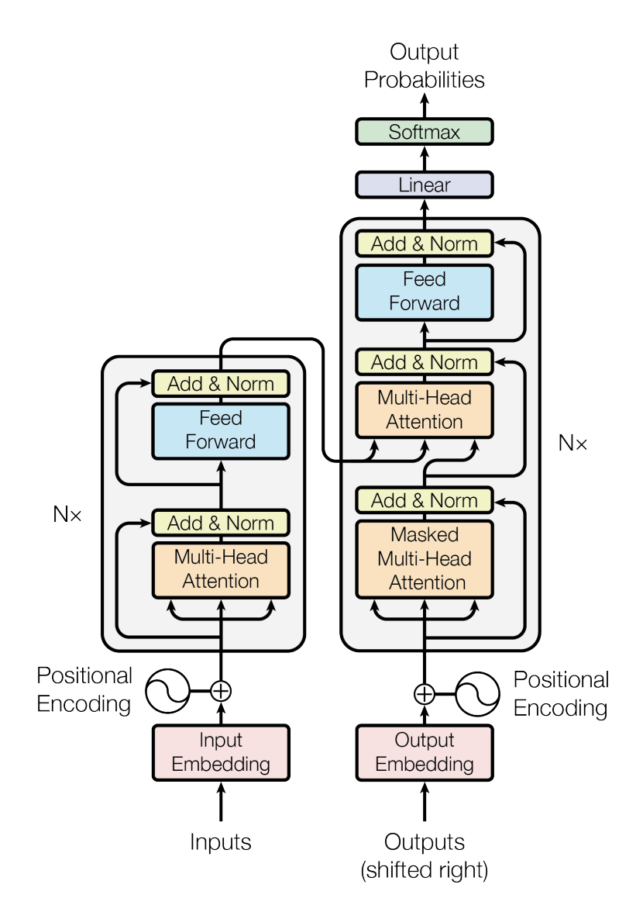

Vanilla Transformer, following implementation of the Informer paper,
used as baseline.

The architecture has three distinctive features: - Full-attention
mechanism with O(L^2) time and memory complexity. - Classic
encoder-decoder proposed by Vaswani et al. (2017) with a multi-head
attention mechanism. - An MLP multi-step decoder that predicts long
time-series sequences in a single forward operation rather than
step-by-step.

The Vanilla Transformer model utilizes a three-component approach to
define its embedding: - It employs encoded autoregressive features
obtained from a convolution network. - It uses window-relative
positional embeddings derived from harmonic functions. - Absolute
positional embeddings obtained from calendar features are utilized.

**References**<br/> - [Haoyi Zhou, Shanghang Zhang, Jieqi Peng, Shuai
Zhang, Jianxin Li, Hui Xiong, Wancai Zhang. “Informer: Beyond Efficient
Transformer for Long Sequence Time-Series
Forecasting”](https://arxiv.org/abs/2012.07436)<br/>

<figure>

<figcaption aria-hidden="true">Figure 1. Transformer
Architecture.</figcaption>
</figure>

## 1. Auxiliary Functions

------------------------------------------------------------------------

<a
href="https://github.com/Nixtla/neuralforecast/blob/main/neuralforecast/models/vanillatransformer.py#L40"
target="_blank" style={{ float: "right", fontSize: "smaller" }}>source</a>

### FullAttention

> ``` text
>  FullAttention (mask_flag=True, scale=None, attention_dropout=0.1,
>                 output_attention=False)
> ```

Base class for all neural network modules.

Your models should also subclass this class.

Modules can also contain other Modules, allowing to nest them in a tree
structure. You can assign the submodules as regular attributes::

``` text
import torch.nn as nn
import torch.nn.functional as F

class Model(nn.Module):
    def __init__(self):
        super().__init__()
        self.conv1 = nn.Conv2d(1, 20, 5)
        self.conv2 = nn.Conv2d(20, 20, 5)

    def forward(self, x):
        x = F.relu(self.conv1(x))
        return F.relu(self.conv2(x))
```

Submodules assigned in this way will be registered, and will have their
parameters converted too when you call :meth:`to`, etc.

.. note:: As per the example above, an `__init__()` call to the parent
class must be made before assignment on the child.

:ivar training: Boolean represents whether this module is in training or
evaluation mode. :vartype training: bool

------------------------------------------------------------------------

<a
href="https://github.com/Nixtla/neuralforecast/blob/main/neuralforecast/models/vanillatransformer.py#L27"
target="_blank" style={{ float: "right", fontSize: "smaller" }}>source</a>

### TriangularCausalMask

> ``` text
>  TriangularCausalMask (B, L, device='cpu')
> ```

Initialize self. See help(type(self)) for accurate signature.

## 2. VanillaTransformer

------------------------------------------------------------------------

<a
href="https://github.com/Nixtla/neuralforecast/blob/main/neuralforecast/models/vanillatransformer.py#L72"
target="_blank" style={{ float: "right", fontSize: "smaller" }}>source</a>

### VanillaTransformer

> ``` text
>  VanillaTransformer (h:int, input_size:int, stat_exog_list=None,
>                      hist_exog_list=None, futr_exog_list=None,
>                      decoder_input_size_multiplier:float=0.5,
>                      hidden_size:int=128, dropout:float=0.05,
>                      n_head:int=4, conv_hidden_size:int=32,
>                      activation:str='gelu', encoder_layers:int=2,
>                      decoder_layers:int=1, loss=MAE(), valid_loss=None,
>                      max_steps:int=5000, learning_rate:float=0.0001,
>                      num_lr_decays:int=-1,
>                      early_stop_patience_steps:int=-1,
>                      val_check_steps:int=100, batch_size:int=32,
>                      valid_batch_size:Optional[int]=None,
>                      windows_batch_size=1024,
>                      inference_windows_batch_size:int=1024,
>                      start_padding_enabled=False, step_size:int=1,
>                      scaler_type:str='identity', random_seed:int=1,
>                      num_workers_loader:int=0,
>                      drop_last_loader:bool=False, optimizer=None,
>                      optimizer_kwargs=None, **trainer_kwargs)
> ```

VanillaTransformer

Vanilla Transformer, following implementation of the Informer paper,
used as baseline.

The architecture has three distinctive features: - Full-attention
mechanism with O(L^2) time and memory complexity. - An MLP multi-step
decoder that predicts long time-series sequences in a single forward
operation rather than step-by-step.

The Vanilla Transformer model utilizes a three-component approach to
define its embedding: - It employs encoded autoregressive features
obtained from a convolution network. - It uses window-relative
positional embeddings derived from harmonic functions. - Absolute
positional embeddings obtained from calendar features are utilized.

*Parameters:*<br/> `h`: int, forecast horizon.<br/> `input_size`: int,
maximum sequence length for truncated train backpropagation. Default -1
uses all history.<br/> `futr_exog_list`: str list, future exogenous
columns.<br/> `hist_exog_list`: str list, historic exogenous columns.<br/>
`stat_exog_list`: str list, static exogenous columns.<br/>
`decoder_input_size_multiplier`: float = 0.5, .<br/> `hidden_size`:
int=128, units of embeddings and encoders.<br/> `n_head`: int=4, controls
number of multi-head’s attention.<br/> `dropout`: float (0, 1), dropout
throughout Informer architecture.<br/> `conv_hidden_size`: int=32,
channels of the convolutional encoder.<br/> `activation`: str=`GELU`,
activation from \[‘ReLU’, ‘Softplus’, ‘Tanh’, ‘SELU’, ‘LeakyReLU’,
‘PReLU’, ‘Sigmoid’, ‘GELU’\].<br/> `encoder_layers`: int=2, number of
layers for the TCN encoder.<br/> `decoder_layers`: int=1, number of
layers for the MLP decoder.<br/> `loss`: PyTorch module, instantiated
train loss class from [losses
collection](https://nixtla.github.io/neuralforecast/losses.pytorch.html).<br/>
`max_steps`: int=1000, maximum number of training steps.<br/>
`learning_rate`: float=1e-3, Learning rate between (0, 1).<br/>
`num_lr_decays`: int=-1, Number of learning rate decays, evenly
distributed across max_steps.<br/> `early_stop_patience_steps`: int=-1,
Number of validation iterations before early stopping.<br/>
`val_check_steps`: int=100, Number of training steps between every
validation loss check.<br/> `batch_size`: int=32, number of different
series in each batch.<br/> `valid_batch_size`: int=None, number of
different series in each validation and test batch, if None uses
batch_size.<br/> `windows_batch_size`: int=1024, number of windows to
sample in each training batch, default uses all.<br/>
`inference_windows_batch_size`: int=1024, number of windows to sample in
each inference batch.<br/> `start_padding_enabled`: bool=False, if True,
the model will pad the time series with zeros at the beginning, by input
size.<br/> `scaler_type`: str=‘robust’, type of scaler for temporal
inputs normalization see [temporal
scalers](https://nixtla.github.io/neuralforecast/common.scalers.html).<br/>
`random_seed`: int=1, random_seed for pytorch initializer and numpy
generators.<br/> `num_workers_loader`: int=os.cpu_count(), workers to be
used by `TimeSeriesDataLoader`.<br/> `drop_last_loader`: bool=False, if
True `TimeSeriesDataLoader` drops last non-full batch.<br/> `alias`: str,
optional, Custom name of the model.<br/> `optimizer`: Subclass of
‘torch.optim.Optimizer’, optional, user specified optimizer instead of
the default choice (Adam).<br/> `optimizer_kwargs`: dict, optional, list
of parameters used by the user specified `optimizer`.<br/>
`**trainer_kwargs`: int, keyword trainer arguments inherited from
[PyTorch Lighning’s
trainer](https://pytorch-lightning.readthedocs.io/en/stable/api/pytorch_lightning.trainer.trainer.trainer.html?highlight=trainer).<br/>

``` text
*References*<br/>
- [Haoyi Zhou, Shanghang Zhang, Jieqi Peng, Shuai Zhang, Jianxin Li, Hui Xiong, Wancai Zhang. "Informer: Beyond Efficient Transformer for Long Sequence Time-Series Forecasting"](https://arxiv.org/abs/2012.07436)<br/>
```

------------------------------------------------------------------------

### VanillaTransformer.fit

> ``` text
>  VanillaTransformer.fit (dataset, val_size=0, test_size=0,
>                          random_seed=None)
> ```

Fit.

The `fit` method, optimizes the neural network’s weights using the
initialization parameters (`learning_rate`, `windows_batch_size`, …) and
the `loss` function as defined during the initialization. Within `fit`
we use a PyTorch Lightning `Trainer` that inherits the initialization’s
`self.trainer_kwargs`, to customize its inputs, see [PL’s trainer
arguments](https://pytorch-lightning.readthedocs.io/en/stable/api/pytorch_lightning.trainer.trainer.trainer.html?highlight=trainer).

The method is designed to be compatible with SKLearn-like classes and in
particular to be compatible with the StatsForecast library.

By default the `model` is not saving training checkpoints to protect
disk memory, to get them change `enable_checkpointing=True` in
`__init__`.

**Parameters:**<br/> `dataset`: NeuralForecast’s
[`TimeSeriesDataset`](https://Nixtla.github.io/neuralforecast/tsdataset.html#timeseriesdataset),
see
[documentation](https://nixtla.github.io/neuralforecast/tsdataset.html).<br/>
`val_size`: int, validation size for temporal cross-validation.<br/>
`random_seed`: int=None, random_seed for pytorch initializer and numpy
generators, overwrites model.\_\_init\_\_’s.<br/> `test_size`: int, test
size for temporal cross-validation.<br/>

------------------------------------------------------------------------

### VanillaTransformer.predict

> ``` text
>  VanillaTransformer.predict (dataset, test_size=None, step_size=1,
>                              random_seed=None, **data_module_kwargs)
> ```

Predict.

Neural network prediction with PL’s `Trainer` execution of
`predict_step`.

**Parameters:**<br/> `dataset`: NeuralForecast’s
[`TimeSeriesDataset`](https://Nixtla.github.io/neuralforecast/tsdataset.html#timeseriesdataset),
see
[documentation](https://nixtla.github.io/neuralforecast/tsdataset.html).<br/>
`test_size`: int=None, test size for temporal cross-validation.<br/>
`step_size`: int=1, Step size between each window.<br/> `random_seed`:
int=None, random_seed for pytorch initializer and numpy generators,
overwrites model.\_\_init\_\_’s.<br/> `**data_module_kwargs`: PL’s
TimeSeriesDataModule args, see
[documentation](https://pytorch-lightning.readthedocs.io/en/1.6.1/extensions/datamodules.html#using-a-datamodule).

## Usage Example

```python
import numpy as np
import pandas as pd
import pytorch_lightning as pl
import matplotlib.pyplot as plt

from neuralforecast import NeuralForecast
from neuralforecast.models import MLP
from neuralforecast.losses.pytorch import MQLoss, DistributionLoss
from neuralforecast.tsdataset import TimeSeriesDataset
from neuralforecast.utils import AirPassengers, AirPassengersPanel, AirPassengersStatic, augment_calendar_df

AirPassengersPanel, calendar_cols = augment_calendar_df(df=AirPassengersPanel, freq='M')

Y_train_df = AirPassengersPanel[AirPassengersPanel.ds<AirPassengersPanel['ds'].values[-12]] # 132 train
Y_test_df = AirPassengersPanel[AirPassengersPanel.ds>=AirPassengersPanel['ds'].values[-12]].reset_index(drop=True) # 12 test

model = VanillaTransformer(h=12,
                 input_size=24,
                 hidden_size=16,
                 conv_hidden_size=32,
                 n_head=2,
                 loss=MAE(),
                 futr_exog_list=calendar_cols,
                 scaler_type='robust',
                 learning_rate=1e-3,
                 max_steps=500,
                 val_check_steps=50,
                 early_stop_patience_steps=2)

nf = NeuralForecast(
    models=[model],
    freq='M'
)
nf.fit(df=Y_train_df, static_df=AirPassengersStatic, val_size=12)
forecasts = nf.predict(futr_df=Y_test_df)

Y_hat_df = forecasts.reset_index(drop=False).drop(columns=['unique_id','ds'])
plot_df = pd.concat([Y_test_df, Y_hat_df], axis=1)
plot_df = pd.concat([Y_train_df, plot_df])

if model.loss.is_distribution_output:
    plot_df = plot_df[plot_df.unique_id=='Airline1'].drop('unique_id', axis=1)
    plt.plot(plot_df['ds'], plot_df['y'], c='black', label='True')
    plt.plot(plot_df['ds'], plot_df['VanillaTransformer-median'], c='blue', label='median')
    plt.fill_between(x=plot_df['ds'][-12:], 
                    y1=plot_df['VanillaTransformer-lo-90'][-12:].values, 
                    y2=plot_df['VanillaTransformer-hi-90'][-12:].values,
                    alpha=0.4, label='level 90')
    plt.grid()
    plt.legend()
    plt.plot()
else:
    plot_df = plot_df[plot_df.unique_id=='Airline1'].drop('unique_id', axis=1)
    plt.plot(plot_df['ds'], plot_df['y'], c='black', label='True')
    plt.plot(plot_df['ds'], plot_df['VanillaTransformer'], c='blue', label='Forecast')
    plt.legend()
    plt.grid()
```

