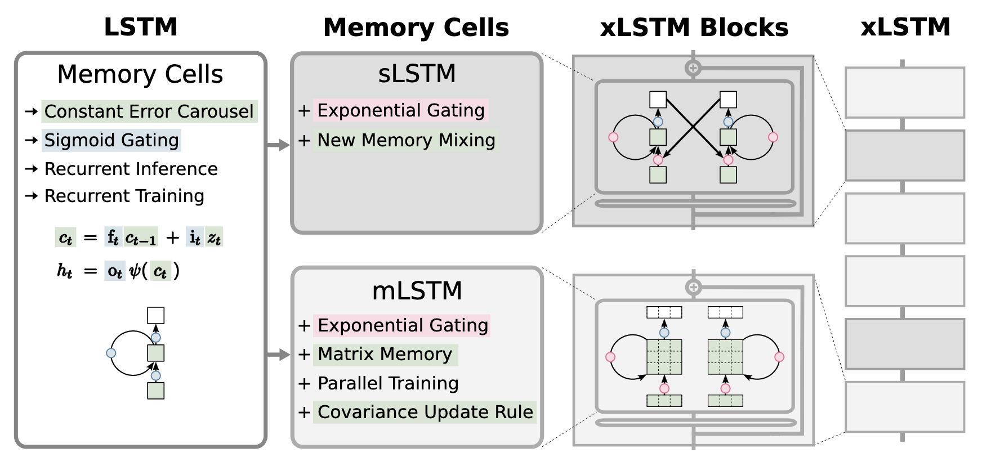

xLSTM is an RNN-based model for sequence modeling that extends the classical Long Short-Term Memory architecture with exponential gating and novel memory structures. The architecture introduces two new memory cell variants: sLSTM, which uses a scalar memory with a scalar update rule and a new cross-cell memory mixing mechanism, and mLSTM, which replaces the scalar cell state with a matrix memory updated via a covariance (outer product) rule, enabling full parallelizability. These cell variants are integrated into residual blocks to form xLSTM blocks, which are then stacked into full xLSTM architectures.

**References**

- [Maximilian, B., et al. "xLSTM: Extended Long Short-Term Memory"](https://arxiv.org/abs/2405.04517)


*Figure 1. Architecture of xLSTM*

## xLSTM

### `xLSTM`

```python
xLSTM(
    h,
    input_size=-1,
    inference_input_size=None,
    h_train=1,
    encoder_n_blocks=2,
    encoder_hidden_size=128,
    encoder_bias=True,
    encoder_dropout=0.1,
    decoder_hidden_size=128,
    decoder_layers=2,
    decoder_dropout=0.0,
    decoder_activation="GELU",
    backbone="mLSTM",
    futr_exog_list=None,
    hist_exog_list=None,
    stat_exog_list=None,
    cat_exog_list=None,
    categorical_cardinalities=None,
    cat_emb_dim="fastai",
    exclude_insample_y=False,
    recurrent=False,
    loss=MAE(),
    valid_loss=None,
    max_steps=1000,
    learning_rate=0.001,
    num_lr_decays=-1,
    early_stop_patience_steps=-1,
    val_monitor="ptl/val_loss",
    val_check_steps=100,
    batch_size=32,
    valid_batch_size=None,
    windows_batch_size=128,
    inference_windows_batch_size=1024,
    start_padding_enabled=False,
    training_data_availability_threshold=0.0,
    step_size=1,
    scaler_type="robust",
    random_seed=1,
    drop_last_loader=False,
    alias=None,
    optimizer=None,
    optimizer_kwargs=None,
    lr_scheduler=None,
    lr_scheduler_kwargs=None,
    dataloader_kwargs=None,
    **trainer_kwargs
)
```

Bases: <code>[BaseModel](#neuralforecast.common._base_model.BaseModel)</code>

xLSTM

xLSTM encoder, with MLP decoder.

**Parameters:**

Name | Type | Description | Default
---- | ---- | ----------- | -------
`h` | <code>[int](#int)</code> | forecast horizon. | *required*
`input_size` | <code>[int](#int)</code> | considered autorregresive inputs (lags), y=[1,2,3,4] input_size=2 -> lags=[1,2]. | <code>-1</code>
`encoder_n_blocks` | <code>[int](#int)</code> | number of blocks for the xLSTM. | <code>2</code>
`encoder_hidden_size` | <code>[int](#int)</code> | units for the xLSTM's hidden state size. | <code>128</code>
`encoder_bias` | <code>[bool](#bool)</code> | whether or not to use biases within xLSTM blocks. | <code>True</code>
`encoder_dropout` | <code>[float](#float)</code> | dropout regularization applied within xLSTM blocks. | <code>0.1</code>
`decoder_hidden_size` | <code>[int](#int)</code> | size of hidden layer for the MLP decoder. | <code>128</code>
`decoder_layers` | <code>[int](#int)</code> | number of layers for the MLP decoder. | <code>2</code>
`decoder_dropout` | <code>[float](#float)</code> | dropout regularization applied within the MLP decoder. | <code>0.0</code>
`decoder_activation` | <code>[str](#str)</code> | activation function for the MLP decoder, see [activations collection](https://docs.pytorch.org/docs/stable/nn.html#non-linear-activations-weighted-sum-nonlinearity). | <code>'GELU'</code>
`backbone` | <code>[str](#str)</code> | backbone for the xLSTM, either 'sLSTM' or 'mLSTM'. | <code>'mLSTM'</code>
`futr_exog_list` | <code>[List](#List)\[[str](#str)\]</code> | future exogenous columns. | <code>None</code>
`hist_exog_list` | <code>[list](#list)</code> | historic exogenous columns. | <code>None</code>
`stat_exog_list` | <code>[list](#list)</code> | static exogenous columns. | <code>None</code>
`cat_exog_list` | <code>str list</code> | exogenous columns (from `hist_exog_list` / `futr_exog_list` / `stat_exog_list`) to embed instead of scale. | <code>None</code>
`categorical_cardinalities` | <code>[dict](#dict)</code> | mapping from each categorical column to its number of distinct categories. | <code>None</code>
`cat_emb_dim` | <code>[str](#str) or [int](#int)</code> | categorical embedding size strategy ('fastai', 'sqrt', 'half') or an explicit integer. | <code>'fastai'</code>
`exclude_insample_y` | <code>[bool](#bool)</code> | whether to exclude the target variable from the input. | <code>False</code>
`recurrent` | <code>[bool](#bool)</code> | whether to produce forecasts recursively (True) or direct (False). | <code>False</code>
`loss` | <code>[Module](#torch.nn.Module)</code> | instantiated train loss class from [losses collection](./losses.pytorch.html). | <code>[MAE](#neuralforecast.losses.pytorch.MAE)()</code>
`valid_loss` | <code>[Module](#torch.nn.Module)</code> | instantiated valid loss class from [losses collection](./losses.pytorch.html). | <code>None</code>
`max_steps` | <code>[int](#int)</code> | maximum number of training steps. | <code>1000</code>
`learning_rate` | <code>[float](#float)</code> | Learning rate between (0, 1). | <code>0.001</code>
`num_lr_decays` | <code>[int](#int)</code> | Number of learning rate decays, evenly distributed across max_steps. | <code>-1</code>
`early_stop_patience_steps` | <code>[int](#int)</code> | Number of validation iterations before early stopping. | <code>-1</code>
`val_monitor` | <code>[str](#str)</code> | metric to monitor for early stopping. Valid options: "ptl/val_loss", "valid_loss", "train_loss". Default: "ptl/val_loss". | <code>'ptl/val_loss'</code>
`val_check_steps` | <code>[int](#int)</code> | Number of training steps between every validation loss check. | <code>100</code>
`batch_size` | <code>[int](#int)</code> | number of differentseries in each batch. | <code>32</code>
`valid_batch_size` | <code>[int](#int)</code> | number of different series in each validation and test batch. | <code>None</code>
`windows_batch_size` | <code>[int](#int)</code> | number of windows to sample in each training batch, default uses all. | <code>128</code>
`inference_windows_batch_size` | <code>[int](#int)</code> | number of windows to sample in each inference batch, -1 uses all. | <code>1024</code>
`start_padding_enabled` | <code>[bool](#bool)</code> | if True, the model will pad the time series with zeros at the beginning, by input size. | <code>False</code>
`training_data_availability_threshold` | <code>[Union](#Union)\[[float](#float), [List](#List)\[[float](#float)\]\]</code> | minimum fraction of valid data points required for training windows. Single float applies to both insample and outsample; list of two floats specifies [insample_fraction, outsample_fraction]. Default 0.0 allows windows with only 1 valid data point (current behavior). | <code>0.0</code>
`step_size` | <code>[int](#int)</code> | step size between each window of temporal data. | <code>1</code>
`scaler_type` | <code>[str](#str)</code> | type of scaler for temporal inputs normalization see [temporal scalers](https://github.com/Nixtla/neuralforecast/blob/main/neuralforecast/common/_scalers.py). | <code>'robust'</code>
`random_seed` | <code>[int](#int)</code> | random_seed for pytorch initializer and numpy generators. | <code>1</code>
`drop_last_loader` | <code>[bool](#bool)</code> | if True `TimeSeriesDataLoader` drops last non-full batch. | <code>False</code>
`alias` | <code>[str](#str)</code> | optional, Custom name of the model. | <code>None</code>
`optimizer` | <code>Subclass of 'torch.optim.Optimizer'</code> | optional, user specified optimizer instead of the default choice (Adam). | <code>None</code>
`optimizer_kwargs` | <code>[dict](#dict)</code> | optional, list of parameters used by the user specified `optimizer`. | <code>None</code>
`lr_scheduler` | <code>Subclass of 'torch.optim.lr_scheduler.LRScheduler'</code> | optional, user specified lr_scheduler instead of the default choice (StepLR). | <code>None</code>
`lr_scheduler_kwargs` | <code>[dict](#dict)</code> | optional, list of parameters used by the user specified `lr_scheduler`. | <code>None</code>
`dataloader_kwargs` | <code>[dict](#dict)</code> | optional, list of parameters passed into the PyTorch Lightning dataloader by the `TimeSeriesDataLoader`. | <code>None</code>
`**trainer_kwargs` | <code>[int](#int)</code> | keyword trainer arguments inherited from [PyTorch Lighning's trainer](https://pytorch-lightning.readthedocs.io/en/stable/api/pytorch_lightning.trainer.trainer.Trainer.html?highlight=trainer). | <code>{}</code>

<details class="references" open markdown="1">
<summary>References</summary>

- [Maximilian Beck, Korbinian Pöppel, Markus Spanring, Andreas Auer, Oleksandra Prudnikova, Michael Kopp, Günter Klambauer, Johannes Brandstetter, Sepp Hochreiter (2024). "xLSTM: Extended Long Short-Term Memory"](https://arxiv.org/abs/2405.04517)

</details>

#### `xLSTM.fit`

```python
fit(
    dataset, val_size=0, test_size=0, random_seed=None, distributed_config=None
)
```

Fit.

The `fit` method, optimizes the neural network's weights using the
initialization parameters (`learning_rate`, `windows_batch_size`, ...)
and the `loss` function as defined during the initialization.
Within `fit` we use a PyTorch Lightning `Trainer` that
inherits the initialization's `self.trainer_kwargs`, to customize
its inputs, see [PL's trainer arguments](https://pytorch-lightning.readthedocs.io/en/stable/api/pytorch_lightning.trainer.trainer.Trainer.html?highlight=trainer).

The method is designed to be compatible with SKLearn-like classes
and in particular to be compatible with the StatsForecast library.

By default the `model` is not saving training checkpoints to protect
disk memory, to get them change `enable_checkpointing=True` in `__init__`.

**Parameters:**

Name | Type | Description | Default
---- | ---- | ----------- | -------
`dataset` | <code>[TimeSeriesDataset](#TimeSeriesDataset)</code> | NeuralForecast's `TimeSeriesDataset`, see [documentation](./tsdataset.html). | *required*
`val_size` | <code>[int](#int)</code> | Validation size for temporal cross-validation. | <code>0</code>
`random_seed` | <code>[int](#int)</code> | Random seed for pytorch initializer and numpy generators, overwrites model.__init__'s. | <code>None</code>
`test_size` | <code>[int](#int)</code> | Test size for temporal cross-validation. | <code>0</code>

**Returns:**

Type | Description
---- | -----------
| None

#### `xLSTM.predict`

```python
predict(
    dataset,
    test_size=None,
    step_size=1,
    random_seed=None,
    quantiles=None,
    h=None,
    explainer_config=None,
    **data_module_kwargs
)
```

Predict.

Neural network prediction with PL's `Trainer` execution of `predict_step`.

**Parameters:**

Name | Type | Description | Default
---- | ---- | ----------- | -------
`dataset` | <code>[TimeSeriesDataset](#TimeSeriesDataset)</code> | NeuralForecast's `TimeSeriesDataset`, see [documentation](./tsdataset.html). | *required*
`test_size` | <code>[int](#int)</code> | Test size for temporal cross-validation. | <code>None</code>
`step_size` | <code>[int](#int)</code> | Step size between each window. | <code>1</code>
`random_seed` | <code>[int](#int)</code> | Random seed for pytorch initializer and numpy generators, overwrites model.__init__'s. | <code>None</code>
`quantiles` | <code>[list](#list)</code> | Target quantiles to predict. | <code>None</code>
`h` | <code>[int](#int)</code> | Prediction horizon, if None, uses the model's fitted horizon. Defaults to None. | <code>None</code>
`explainer_config` | <code>[dict](#dict)</code> | configuration for explanations. | <code>None</code>
`**data_module_kwargs` | <code>[dict](#dict)</code> | PL's TimeSeriesDataModule args, see [documentation](https://pytorch-lightning.readthedocs.io/en/1.6.1/extensions/datamodules.html#using-a-datamodule). | <code>{}</code>

**Returns:**

Type | Description
---- | -----------
| None

### Usage Example


```python
import pandas as pd
import matplotlib.pyplot as plt

from neuralforecast import NeuralForecast
from neuralforecast.models import xLSTM
from neuralforecast.losses.pytorch import MAE
from neuralforecast.utils import AirPassengersPanel, AirPassengersStatic

Y_train_df = AirPassengersPanel[AirPassengersPanel.ds<AirPassengersPanel['ds'].values[-12]] # 132 train
Y_test_df = AirPassengersPanel[AirPassengersPanel.ds>=AirPassengersPanel['ds'].values[-12]].reset_index(drop=True) # 12 test

model = xLSTM(h=12, 
            input_size=24,
            stat_exog_list=['airline1'],
            hist_exog_list=["y_[lag12]"],
            futr_exog_list=['trend'],            
            loss = MAE(),
            scaler_type='robust',
            learning_rate=1e-3,
            max_steps=200,
            val_check_steps=10,
            early_stop_patience_steps=2)

fcst = NeuralForecast(
    models=[model],
    freq='ME'
)
fcst.fit(df=Y_train_df, static_df=AirPassengersStatic, val_size=12)
forecasts = fcst.predict(futr_df=Y_test_df)

# Plot predictions
Y_hat_df = forecasts.reset_index(drop=False).drop(columns=['unique_id','ds'])
plot_df = pd.concat([Y_test_df, Y_hat_df], axis=1)
plot_df = pd.concat([Y_train_df, plot_df])

plot_df = plot_df[plot_df.unique_id=='Airline1'].drop('unique_id', axis=1)
plt.plot(plot_df['ds'], plot_df['y'], c='black', label='True')
plt.plot(plot_df['ds'], plot_df['xLSTM'], c='blue', label='median')
plt.grid()
plt.legend()
plt.plot()
```