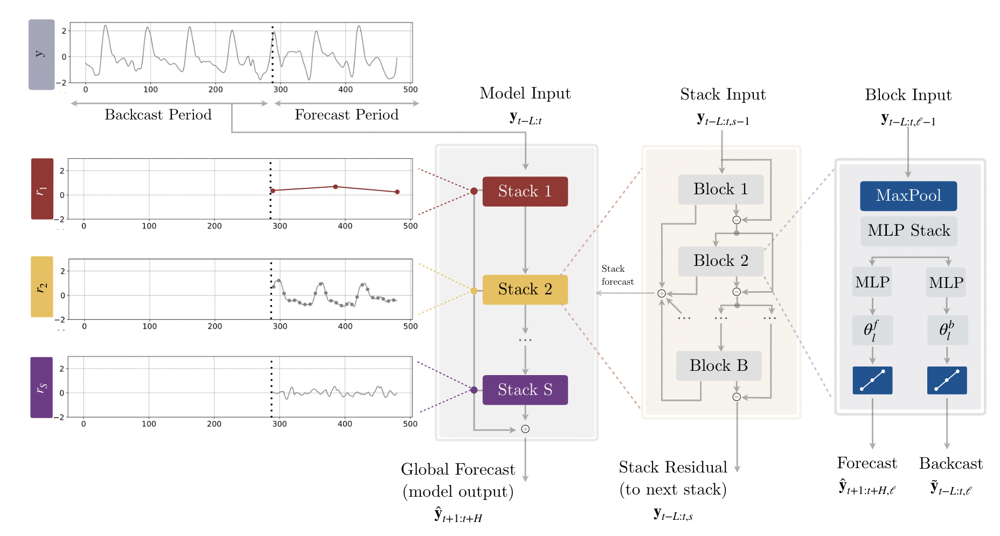
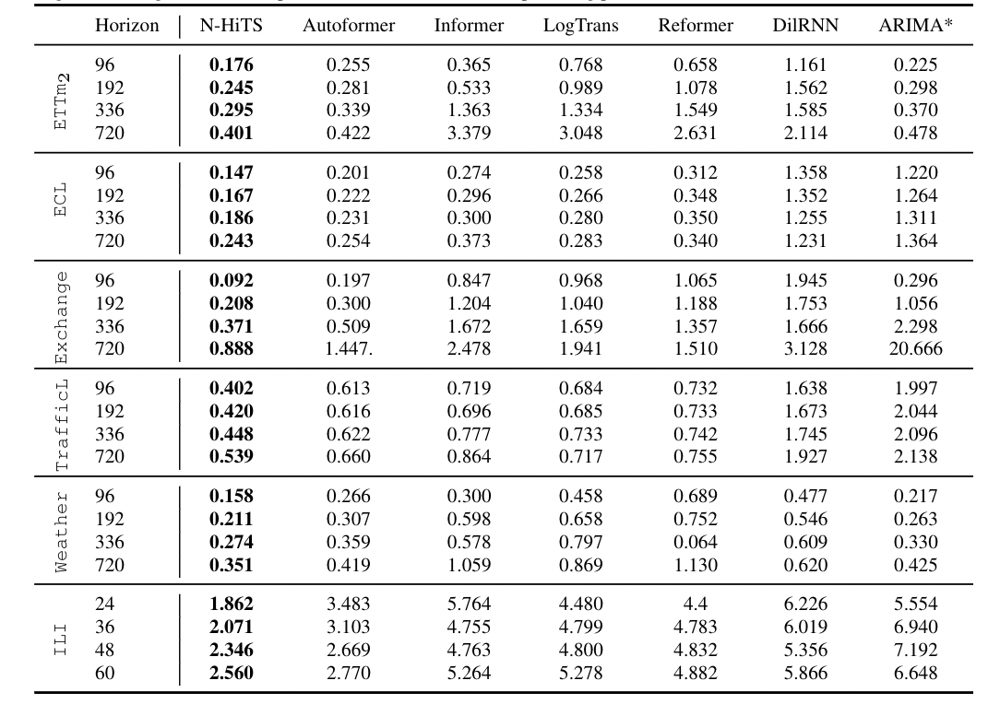

# N-HiTS: Neural Hierarchical Interpolation for Time Series Forecasting

Recent progress in neural forecasting instigated significant improvements in the accuracy of large-scale forecasting systems. Yet, extremely long horizon forecasting remains a very difficult task. Two common challenges afflicting the long horizon forecasting are the volatility of the predictions and their computational complexity. In this paper we introduce `N-HiTS`, which addresses both challenges by incorporating novel hierarchical interpolation and multi-rate data sampling techniques. These techniques enable our method to assemble its predictions sequentially, selectively emphasizing components with different frequencies and scales while decomposing the input signal and synthesizing the forecast. We conduct an extensive empirical evaluation demonstrating the advantages of `N-HiTS` over the state-of-the-art long-horizon forecasting methods. On an array of multivariate forecasting tasks, our method provides an average accuracy improvement of 25% over the latest Transformer architectures while reducing the computational time by orders of magnitude.

`N-HiTS`  architecture. The model is composed of several `MLPs` with `ReLU` nonlinearities. Blocks are connected via doubly residual stacking principle with the backcast `y[t-L:t, l]` and forecast `y[t+1:t+H, l]` outputs of the `l`-th block.
Multi-rate input pooling, hierarchical interpolation and backcast residual connections together induce the specialization of the additive predictions in different signal bands, reducing memory footprint and compute time, improving architecture parsimony and accuracy.

## Long Horizon Datasets Results

## Replication of results

The experiments and instructions to replicate the results of the paper are available at https://github.com/cchallu/n-hits.

## General use

The implementation of `N-HiTS` is designed to work on any given data. For detailed instructions and examples on how to use `N-HiTS` and NeuralForecast visit our [documentation](https://nixtla.github.io/neuralforecast/models_nhits__nhits.html).